# 🏦 Bond Workflows & User Stories

## Executive Summary

The Bond Workflows & User Stories documentation provides comprehensive coverage of bond tokenization processes within the Asset Tokenization Kit, detailing complete user journeys from bond creation through maturity and redemption. Bond tokens represent fixed-term debt instruments with sophisticated yield distribution mechanisms, maturity management, and redemption processes that enable traditional debt securities to operate efficiently on blockchain infrastructure.

The bond system supports complex financial workflows including corporate bond issuance, government securities, asset-backed securities, and structured products with full regulatory compliance, investor protection, and automated yield distribution. Each workflow is designed to accommodate both institutional and retail investors while maintaining the security, transparency, and efficiency benefits of blockchain technology.

## Table of Contents

- [Executive Summary](#executive-summary)
- [Bond Asset Overview](#bond-asset-overview)
- [Bond Creation Workflow](#bond-creation-workflow)
- [Investor Onboarding Journey](#investor-onboarding-journey)
- [Yield Distribution Workflows](#yield-distribution-workflows)
- [Maturity Management Process](#maturity-management-process)
- [Redemption Workflows](#redemption-workflows)
- [Compliance and Regulatory Workflows](#compliance-and-regulatory-workflows)
- [Administrative User Stories](#administrative-user-stories)
- [Investor User Stories](#investor-user-stories)
- [Regulatory Officer User Stories](#regulatory-officer-user-stories)
- [Emergency and Recovery Workflows](#emergency-and-recovery-workflows)
- [Performance and Analytics](#performance-and-analytics)
- [Related Resources](#related-resources)

## Bond Asset Overview

Bond tokens within the Asset Tokenization Kit represent sophisticated debt instruments with comprehensive lifecycle management:

```mermaid
graph TB
    subgraph "Bond Asset Ecosystem"
        subgraph "Bond Characteristics"
            FixedTerm[Fixed-Term Structure<br/>Maturity-Based Design<br/>• Defined maturity date<br/>• Face value specification<br/>• Yield distribution<br/>• Redemption mechanics]
            
            CollateralBacking[Collateral Backing<br/>Asset Security<br/>• Denomination asset<br/>• Collateral verification<br/>• Reserve requirements<br/>• Backing validation]
            
            YieldMechanism[Yield Mechanism<br/>Interest Distribution<br/>• Yield calculation<br/>• Distribution scheduling<br/>• Payment automation<br/>• Performance tracking]
        end
        
        subgraph "Stakeholder Ecosystem"
            BondIssuers[Bond Issuers<br/>Debt Issuance<br/>• Corporate entities<br/>• Government bodies<br/>• Financial institutions<br/>• Project financing]
            
            Investors[Bond Investors<br/>Debt Investment<br/>• Institutional investors<br/>• Retail investors<br/>• Accredited investors<br/>• Professional investors]
            
            ServiceProviders[Service Providers<br/>Support Services<br/>• Custodians<br/>• Transfer agents<br/>• Compliance officers<br/>• Auditors]
        end
        
        subgraph "Regulatory Framework"
            ComplianceRules[Compliance Rules<br/>Regulatory Requirements<br/>• Securities regulations<br/>• Investor protection<br/>• Disclosure requirements<br/>• Reporting obligations]
            
            JurisdictionRules[Jurisdiction Rules<br/>Geographic Compliance<br/>• Country-specific rules<br/>• Cross-border regulations<br/>• Tax implications<br/>• Legal frameworks]
            
            AuditRequirements[Audit Requirements<br/>Audit Compliance<br/>• Audit trails<br/>• Financial reporting<br/>• Compliance monitoring<br/>• Regulatory reporting]
        end
        
        subgraph "Technology Integration"
            SmartContracts[Smart Contracts<br/>Blockchain Implementation<br/>• Bond contract logic<br/>• Yield distribution<br/>• Compliance enforcement<br/>• Redemption mechanics]
            
            UserInterface[User Interface<br/>Application Frontend<br/>• Bond creation wizard<br/>• Investor dashboard<br/>• Admin interfaces<br/>• Reporting tools]
            
            BackendServices[Backend Services<br/>Supporting Infrastructure<br/>• API services<br/>• Database management<br/>• External integrations<br/>• Monitoring systems]
        end
    end
    
    %% Bond characteristics flow
    FixedTerm --> CollateralBacking
    CollateralBacking --> YieldMechanism
    
    %% Stakeholder ecosystem
    BondIssuers --> Investors
    Investors --> ServiceProviders
    
    %% Regulatory framework
    ComplianceRules --> JurisdictionRules
    JurisdictionRules --> AuditRequirements
    
    %% Technology integration
    SmartContracts --> UserInterface
    UserInterface --> BackendServices
    
    %% Cross-system relationships
    YieldMechanism -.-> BondIssuers
    ServiceProviders -.-> ComplianceRules
    AuditRequirements -.-> SmartContracts
    BackendServices -.-> FixedTerm
    
    %% Styling
    style FixedTerm fill:#e1f5fe,stroke:#01579b,color:#000000,stroke-width:3px
    style BondIssuers fill:#f3e5f5,stroke:#4a148c,color:#000000,stroke-width:3px
    style ComplianceRules fill:#e8f5e8,stroke:#1b5e20,color:#000000,stroke-width:3px
    style SmartContracts fill:#fff3e0,stroke:#e65100,color:#000000,stroke-width:3px
```

### Bond Token Features

| Feature Category | Capabilities | Implementation | User Benefit | Regulatory Compliance |
|-----------------|--------------|----------------|--------------|----------------------|
| **Maturity Management** | Fixed maturity dates, face value tracking | Time-based validation | Predictable returns | Securities regulations |
| **Yield Distribution** | Automated interest payments | Scheduled distributions | Passive income | Financial regulations |
| **Collateral Backing** | Asset-backed security | Collateral verification | Investment security | Asset backing requirements |
| **Redemption Rights** | Maturity-based redemption | User-initiated burning | Capital recovery | Investor protection |
| **Transfer Controls** | Compliance-based transfers | ERC-3643 implementation | Regulatory compliance | Securities transfer rules |

### Bond Asset Types

| Bond Type | Characteristics | Use Cases | Regulatory Framework | Implementation Complexity |
|-----------|----------------|-----------|---------------------|--------------------------|
| **Corporate Bonds** | Corporate debt, credit risk | Corporate financing | Securities regulations | Medium |
| **Government Bonds** | Sovereign debt, low risk | Government financing | Government securities rules | Low |
| **Asset-Backed Securities** | Collateralized debt | Asset monetization | Structured product regulations | High |
| **Municipal Bonds** | Local government debt | Infrastructure financing | Municipal securities rules | Medium |
| **Convertible Bonds** | Equity conversion option | Hybrid financing | Complex securities regulations | Very High |

### Bond Lifecycle Phases

| Phase | Duration | Key Activities | Stakeholders | Success Criteria |
|-------|----------|----------------|--------------|------------------|
| **Pre-Issuance** | 2-12 weeks | Structure design, regulatory approval | Issuer, regulators, advisors | Regulatory approval |
| **Issuance** | 1-4 weeks | Token deployment, investor onboarding | Issuer, investors, platform | Successful token launch |
| **Active Period** | Until maturity | Yield payments, compliance monitoring | All stakeholders | Operational compliance |
| **Maturity** | Event-triggered | Maturity validation, redemption enabling | Issuer, bondholders | Maturity confirmation |
| **Redemption** | 30-90 days | Token redemption, asset distribution | Bondholders, issuer | Complete redemption |

## Bond Creation Workflow

The bond creation workflow guides issuers through comprehensive bond configuration and deployment:

```mermaid
graph TB
    subgraph "Bond Creation Workflow"
        subgraph "Initial Setup"
            IssuerOnboarding[Issuer Onboarding<br/>Entity Verification<br/>• Corporate verification<br/>• KYC/AML compliance<br/>• Legal documentation<br/>• Regulatory approval]
            
            BondStructuring[Bond Structuring<br/>Financial Design<br/>• Bond terms definition<br/>• Yield structure<br/>• Collateral arrangement<br/>• Risk assessment]
            
            RegulatoryApproval[Regulatory Approval<br/>Compliance Validation<br/>• Regulatory filing<br/>• Approval process<br/>• Documentation review<br/>• Compliance confirmation]
        end
        
        subgraph "Asset Designer Process"
            AssetClassSelection[Asset Class Selection<br/>Bond Type Selection<br/>• Corporate bond<br/>• Government bond<br/>• Asset-backed security<br/>• Municipal bond]
            
            BondConfiguration[Bond Configuration<br/>Parameter Setup<br/>• Maturity date<br/>• Face value<br/>• Yield rate<br/>• Denomination asset]
            
            ComplianceSetup[Compliance Setup<br/>Regulatory Configuration<br/>• Jurisdiction selection<br/>• Compliance modules<br/>• Transfer restrictions<br/>• Investor requirements]
        end
        
        subgraph "Technical Deployment"
            ContractDeployment[Contract Deployment<br/>Blockchain Deployment<br/>• Smart contract deployment<br/>• Parameter validation<br/>• Extension configuration<br/>• Registry registration]
            
            InitialConfiguration[Initial Configuration<br/>System Setup<br/>• Yield schedule setup<br/>• Compliance activation<br/>• Permission configuration<br/>• Monitoring setup]
            
            LaunchValidation[Launch Validation<br/>System Validation<br/>• Functionality testing<br/>• Compliance validation<br/>• Performance testing<br/>• Security validation]
        end
        
        subgraph "Market Preparation"
            InvestorDocumentation[Investor Documentation<br/>Information Preparation<br/>• Prospectus creation<br/>• Risk disclosures<br/>• Terms documentation<br/>• Legal documentation]
            
            MarketingMaterials[Marketing Materials<br/>Promotion Preparation<br/>• Marketing documentation<br/>• Presentation materials<br/>• Distribution strategy<br/>• Investor outreach]
            
            LaunchCoordination[Launch Coordination<br/>Market Launch<br/>• Launch scheduling<br/>• Stakeholder coordination<br/>• Market preparation<br/>• Launch execution]
        end
    end
    
    %% Initial setup flow
    IssuerOnboarding --> BondStructuring
    BondStructuring --> RegulatoryApproval
    
    %% Asset designer flow
    AssetClassSelection --> BondConfiguration
    BondConfiguration --> ComplianceSetup
    
    %% Technical deployment flow
    ContractDeployment --> InitialConfiguration
    InitialConfiguration --> LaunchValidation
    
    %% Market preparation flow
    InvestorDocumentation --> MarketingMaterials
    MarketingMaterials --> LaunchCoordination
    
    %% Cross-workflow integration
    RegulatoryApproval -.-> AssetClassSelection
    ComplianceSetup -.-> ContractDeployment
    LaunchValidation -.-> InvestorDocumentation
    LaunchCoordination -.-> IssuerOnboarding
    
    %% Styling
    style IssuerOnboarding fill:#e1f5fe,stroke:#01579b,color:#000000,stroke-width:3px
    style AssetClassSelection fill:#f3e5f5,stroke:#4a148c,color:#000000,stroke-width:3px
    style ContractDeployment fill:#e8f5e8,stroke:#1b5e20,color:#000000,stroke-width:3px
    style InvestorDocumentation fill:#fff3e0,stroke:#e65100,color:#000000,stroke-width:3px
```

### Bond Creation User Stories

| User Role | User Story | Acceptance Criteria | Implementation | Priority |
|-----------|------------|-------------------|----------------|----------|
| **Bond Issuer** | As a bond issuer, I want to create a corporate bond so that I can raise capital for business operations | Bond successfully deployed with correct parameters | Asset Designer wizard | High |
| **Compliance Officer** | As a compliance officer, I want to configure compliance rules so that the bond meets regulatory requirements | Compliance modules active and validated | Compliance configuration interface | High |
| **System Administrator** | As a system admin, I want to validate bond deployment so that the system operates correctly | All system validations pass | Admin validation dashboard | Medium |
| **Legal Counsel** | As legal counsel, I want to review bond terms so that they comply with applicable laws | Legal documentation complete and accurate | Document management system | High |

### Bond Configuration Parameters

| Parameter Category | Required Fields | Validation Rules | Default Values | User Guidance |
|-------------------|-----------------|------------------|----------------|---------------|
| **Basic Information** | Name, symbol, description | Format validation | N/A | Naming conventions |
| **Financial Terms** | Face value, maturity date, yield rate | Business rule validation | Market standards | Financial guidance |
| **Collateral Details** | Denomination asset, backing ratio | Asset verification | 100% backing | Collateral explanation |
| **Compliance Settings** | Jurisdiction, investor types | Regulatory validation | Conservative settings | Regulatory guidance |

### Bond Creation Performance

| Workflow Step | Target Duration | Current Performance | User Experience | Optimization |
|---------------|-----------------|-------------------|-----------------|--------------|
| **Asset Designer Completion** | 15-30 minutes | ~20 minutes | Guided process | Form optimization |
| **Contract Deployment** | 2-5 minutes | ~3 minutes | Progress indication | Gas optimization |
| **Compliance Setup** | 10-20 minutes | ~15 minutes | Rule explanation | Compliance optimization |
| **Launch Preparation** | 1-2 hours | ~90 minutes | Documentation assistance | Process automation |

## Investor Onboarding Journey

The investor onboarding process ensures regulatory compliance while providing seamless access to bond investments:

### Investor Onboarding Workflow

| Onboarding Stage | Duration | Process | Validation | User Experience |
|------------------|----------|---------|------------|-----------------|
| **Initial Registration** | 5-10 minutes | Account creation, basic information | Email verification | Simple registration form |
| **Identity Verification** | 1-5 days | KYC/AML process | Document verification | Step-by-step guidance |
| **Accreditation Verification** | 1-3 days | Investor qualification | Financial verification | Clear requirements |
| **Compliance Approval** | 1-2 days | Regulatory compliance | Compliance validation | Status updates |
| **Investment Authorization** | Immediate | Final approval | System validation | Investment access |

### Investor Types and Requirements

```mermaid
graph TB
    subgraph "Investor Onboarding Journey"
        subgraph "Investor Classification"
            RetailInvestors[Retail Investors<br/>Individual Investors<br/>• Basic KYC<br/>• Investment limits<br/>• Simplified process<br/>• Consumer protection]
            
            AccreditedInvestors[Accredited Investors<br/>Qualified Individuals<br/>• Enhanced KYC<br/>• Wealth verification<br/>• Expanded access<br/>• Higher limits]
            
            InstitutionalInvestors[Institutional Investors<br/>Professional Entities<br/>• Corporate KYC<br/>• Due diligence<br/>• Bulk operations<br/>• Institutional features]
            
            ProfessionalInvestors[Professional Investors<br/>Investment Professionals<br/>• Professional verification<br/>• Advanced features<br/>• Regulatory exemptions<br/>• Enhanced access]
        end
        
        subgraph "Verification Process"
            DocumentCollection[Document Collection<br/>Information Gathering<br/>• Identity documents<br/>• Financial statements<br/>• Proof of address<br/>• Additional documentation]
            
            VerificationProcessing[Verification Processing<br/>Validation Process<br/>• Document verification<br/>• Background checks<br/>• Risk assessment<br/>• Compliance validation]
            
            ApprovalDecision[Approval Decision<br/>Final Determination<br/>• Approval/rejection<br/>• Risk classification<br/>• Investment limits<br/>• Access permissions]
        end
        
        subgraph "Investment Access"
            InvestmentLimits[Investment Limits<br/>Risk Management<br/>• Maximum investment<br/>• Portfolio limits<br/>• Concentration limits<br/>• Risk-based limits]
            
            AccessPermissions[Access Permissions<br/>Feature Access<br/>• Bond access<br/>• Operation permissions<br/>• Information access<br/>• Reporting access]
            
            OngoingMonitoring[Ongoing Monitoring<br/>Continuous Oversight<br/>• Transaction monitoring<br/>• Compliance monitoring<br/>• Risk monitoring<br/>• Performance tracking]
        end
        
        subgraph "User Experience"
            ProgressTracking[Progress Tracking<br/>Status Visibility<br/>• Onboarding progress<br/>• Verification status<br/>• Approval timeline<br/>• Next steps]
            
            CommunicationManagement[Communication Management<br/>Stakeholder Updates<br/>• Status notifications<br/>• Requirement communication<br/>• Update delivery<br/>• Support access]
            
            ErrorRecovery[Error Recovery<br/>Issue Resolution<br/>• Error identification<br/>• Recovery guidance<br/>• Support escalation<br/>• Process restart]
        end
    end
    
    %% Investor classification flow
    RetailInvestors --> DocumentCollection
    AccreditedInvestors --> DocumentCollection
    InstitutionalInvestors --> DocumentCollection
    ProfessionalInvestors --> DocumentCollection
    
    %% Verification process flow
    DocumentCollection --> VerificationProcessing
    VerificationProcessing --> ApprovalDecision
    
    %% Investment access flow
    ApprovalDecision --> InvestmentLimits
    InvestmentLimits --> AccessPermissions
    AccessPermissions --> OngoingMonitoring
    
    %% User experience flow
    ProgressTracking --> CommunicationManagement
    CommunicationManagement --> ErrorRecovery
    
    %% Cross-flow integration
    ApprovalDecision -.-> ProgressTracking
    OngoingMonitoring -.-> CommunicationManagement
    ErrorRecovery -.-> DocumentCollection
    
    %% Styling
    style RetailInvestors fill:#e1f5fe,stroke:#01579b,color:#000000,stroke-width:3px
    style DocumentCollection fill:#f3e5f5,stroke:#4a148c,color:#000000,stroke-width:3px
    style InvestmentLimits fill:#e8f5e8,stroke:#1b5e20,color:#000000,stroke-width:3px
    style ProgressTracking fill:#fff3e0,stroke:#e65100,color:#000000,stroke-width:3px
```

### Investor Onboarding User Stories

| User Role | User Story | Acceptance Criteria | Business Value | Implementation |
|-----------|------------|-------------------|----------------|----------------|
| **Retail Investor** | As a retail investor, I want to complete KYC quickly so that I can invest in bonds | KYC completed within 24 hours | Increased investor access | Streamlined KYC process |
| **Institutional Investor** | As an institutional investor, I want bulk onboarding so that I can onboard multiple entities | Bulk onboarding for 10+ entities | Operational efficiency | Bulk processing interface |
| **Compliance Officer** | As a compliance officer, I want to monitor onboarding so that compliance is maintained | Real-time onboarding monitoring | Risk management | Compliance dashboard |
| **Customer Support** | As support staff, I want to assist with onboarding issues so that investors can complete the process | Issue resolution within 4 hours | Customer satisfaction | Support ticket system |

### Investor Verification Requirements

| Investor Type | KYC Requirements | Documentation | Verification Time | Investment Limits |
|---------------|------------------|---------------|-------------------|-------------------|
| **Retail** | Basic identity verification | Government ID, proof of address | 1-2 days | $50K maximum |
| **Accredited** | Wealth verification | Financial statements, tax returns | 2-3 days | $1M maximum |
| **Institutional** | Corporate verification | Corporate documents, due diligence | 3-5 days | Unlimited |
| **Professional** | Professional certification | Certification documents | 1-2 days | $5M maximum |

### Onboarding Performance Metrics

| Performance Metric | Target | Current Performance | Optimization Strategy | User Impact |
|-------------------|--------|-------------------|----------------------|-------------|
| **Onboarding Completion Rate** | >90% | 87% | Process simplification | Higher investor access |
| **Verification Time** | <3 days | 2.5 days | Process automation | Faster market access |
| **Error Rate** | <5% | 7% | Validation improvement | Reduced frustration |
| **Support Requests** | <10% | 12% | Better guidance | Self-service improvement |

## Yield Distribution Workflows

The yield distribution system provides automated, transparent yield payments to bondholders:

### Yield Distribution Architecture

| Distribution Component | Purpose | Implementation | Automation Level | Performance |
|----------------------|---------|----------------|------------------|-------------|
| **Yield Calculation** | Payment amount calculation | Pro-rata calculation | Fully automated | <1 second |
| **Distribution Scheduling** | Payment timing | Time-based triggers | Fully automated | Real-time |
| **Payment Processing** | Actual payment delivery | Blockchain transactions | Fully automated | <2 minutes |
| **Distribution Tracking** | Payment monitoring | Event-based tracking | Fully automated | Real-time |

### Yield Distribution Process

```mermaid
graph TB
    subgraph "Yield Distribution Process"
        subgraph "Distribution Preparation"
            YieldCalculation[Yield Calculation<br/>Payment Computation<br/>• Yield rate application<br/>• Pro-rata calculation<br/>• Accrual computation<br/>• Tax considerations]
            
            EligibilityValidation[Eligibility Validation<br/>Holder Verification<br/>• Holder identification<br/>• Compliance validation<br/>• Restriction checking<br/>• Eligibility confirmation]
            
            PaymentPreparation[Payment Preparation<br/>Distribution Setup<br/>• Payment scheduling<br/>• Asset preparation<br/>• Gas estimation<br/>• Execution planning]
        end
        
        subgraph "Distribution Execution"
            DistributionExecution[Distribution Execution<br/>Payment Processing<br/>• Batch processing<br/>• Transaction execution<br/>• Status monitoring<br/>• Error handling]
            
            PaymentValidation[Payment Validation<br/>Execution Verification<br/>• Payment confirmation<br/>• Amount verification<br/>• Recipient validation<br/>• Success confirmation]
            
            RecordKeeping[Record Keeping<br/>Audit Trail<br/>• Payment records<br/>• Audit logging<br/>• Compliance documentation<br/>• Tax reporting]
        end
        
        subgraph "Post-Distribution"
            NotificationDelivery[Notification Delivery<br/>Stakeholder Communication<br/>• Investor notifications<br/>• Issuer updates<br/>• Regulatory reporting<br/>• Status communication]
            
            PerformanceTracking[Performance Tracking<br/>Distribution Analytics<br/>• Distribution success rate<br/>• Performance metrics<br/>• Cost analysis<br/>• Efficiency tracking]
            
            ReconcialiationProcess[Reconciliation Process<br/>Accuracy Verification<br/>• Payment reconciliation<br/>• Balance verification<br/>• Discrepancy resolution<br/>• Audit preparation]
        end
        
        subgraph "Exception Handling"
            FailedPayments[Failed Payments<br/>Payment Failures<br/>• Failure detection<br/>• Cause analysis<br/>• Recovery procedures<br/>• Retry mechanisms]
            
            DisputeResolution[Dispute Resolution<br/>Issue Management<br/>• Dispute handling<br/>• Investigation process<br/>• Resolution procedures<br/>• Documentation]
            
            RegulatoryReporting[Regulatory Reporting<br/>Compliance Reporting<br/>• Distribution reports<br/>• Compliance documentation<br/>• Regulatory filing<br/>• Audit trail]
        end
    end
    
    %% Distribution preparation flow
    YieldCalculation --> EligibilityValidation
    EligibilityValidation --> PaymentPreparation
    
    %% Distribution execution flow
    PaymentPreparation --> DistributionExecution
    DistributionExecution --> PaymentValidation
    PaymentValidation --> RecordKeeping
    
    %% Post-distribution flow
    RecordKeeping --> NotificationDelivery
    NotificationDelivery --> PerformanceTracking
    PerformanceTracking --> ReconcialiationProcess
    
    %% Exception handling flow
    FailedPayments --> DisputeResolution
    DisputeResolution --> RegulatoryReporting
    
    %% Cross-flow integration
    DistributionExecution -.-> FailedPayments
    PaymentValidation -.-> DisputeResolution
    ReconcialiationProcess -.-> RegulatoryReporting
    
    %% Styling
    style YieldCalculation fill:#e1f5fe,stroke:#01579b,color:#000000,stroke-width:3px
    style DistributionExecution fill:#f3e5f5,stroke:#4a148c,color:#000000,stroke-width:3px
    style NotificationDelivery fill:#e8f5e8,stroke:#1b5e20,color:#000000,stroke-width:3px
    style FailedPayments fill:#fff3e0,stroke:#e65100,color:#000000,stroke-width:3px
```

### Yield Distribution User Stories

| User Role | User Story | Acceptance Criteria | Business Value | Implementation Priority |
|-----------|------------|-------------------|----------------|----------------------|
| **Bondholder** | As a bondholder, I want to receive yield payments automatically so that I earn passive income | Payments received on schedule without manual action | Passive income generation | High |
| **Bond Issuer** | As a bond issuer, I want to automate yield payments so that I reduce operational overhead | Automated payments with audit trail | Operational efficiency | High |
| **Compliance Officer** | As a compliance officer, I want to monitor yield distributions so that compliance is maintained | Real-time distribution monitoring | Regulatory compliance | Medium |
| **Auditor** | As an auditor, I want complete payment records so that I can verify distribution accuracy | Complete audit trail available | Audit compliance | Medium |

### Yield Payment Specifications

| Payment Specification | Configuration | Validation | Performance | Compliance |
|----------------------|---------------|------------|-------------|------------|
| **Payment Frequency** | Monthly, quarterly, semi-annual, annual | Schedule validation | Automated execution | Regulatory compliance |
| **Payment Calculation** | Face value × yield rate × time period | Mathematical validation | <1 second calculation | Accurate calculations |
| **Payment Distribution** | Pro-rata based on holdings | Balance validation | <2 minutes execution | Fair distribution |
| **Payment Confirmation** | Blockchain transaction receipt | Transaction validation | Real-time confirmation | Audit trail |

### Distribution Performance Metrics

| Performance Metric | Target | Current Performance | Optimization | Monitoring |
|-------------------|--------|-------------------|--------------|------------|
| **Distribution Success Rate** | >99% | 98.5% | Error handling improvement | Distribution monitoring |
| **Payment Processing Time** | <5 minutes | ~3 minutes | Batch optimization | Processing monitoring |
| **Notification Delivery** | <1 minute | ~45 seconds | Notification optimization | Delivery monitoring |
| **Reconciliation Accuracy** | 100% | 99.9% | Reconciliation improvement | Accuracy monitoring |

## Maturity Management Process

The maturity management process handles bond lifecycle completion and redemption preparation:

### Maturity Workflow

| Maturity Stage | Timing | Process | Automation | Stakeholders |
|----------------|--------|---------|------------|--------------|
| **Pre-Maturity Notification** | 30 days before | Maturity alerts | Automated | All stakeholders |
| **Maturity Validation** | At maturity date | Date verification | Automated | System |
| **Redemption Enabling** | At maturity | Contract activation | Automated | System |
| **Redemption Processing** | Post-maturity | User-initiated | Semi-automated | Bondholders |
| **Final Settlement** | After redemption period | Final cleanup | Manual | Issuer |

### Maturity Management User Stories

| User Role | User Story | Acceptance Criteria | Business Value | Implementation |
|-----------|------------|-------------------|----------------|----------------|
| **Bondholder** | As a bondholder, I want to be notified of approaching maturity so that I can plan for redemption | Notification 30 days before maturity | Investment planning | Notification system |
| **Bond Issuer** | As a bond issuer, I want automatic maturity processing so that redemption is enabled on time | Redemption automatically enabled at maturity | Operational efficiency | Automated maturity |
| **System Administrator** | As a system admin, I want to monitor maturity events so that the system operates correctly | Real-time maturity monitoring | System reliability | Admin dashboard |
| **Compliance Officer** | As a compliance officer, I want maturity compliance so that regulatory requirements are met | Compliance maintained through maturity | Regulatory compliance | Compliance monitoring |

### Maturity Event Processing

| Event Type | Trigger | Processing | Validation | Communication |
|------------|---------|------------|------------|---------------|
| **Maturity Approaching** | 30 days before | Notification generation | Date validation | Stakeholder alerts |
| **Maturity Reached** | At maturity date | Contract state update | Time validation | System notification |
| **Redemption Enabled** | Post-maturity validation | Redemption activation | Contract validation | User notification |
| **Redemption Completed** | All tokens redeemed | Final settlement | Balance validation | Completion notification |

## Redemption Workflows

The redemption system enables bondholders to recover their principal investment at maturity:

### Redemption Process Architecture

```mermaid
graph TB
    subgraph "Bond Redemption Workflows"
        subgraph "Redemption Initiation"
            MaturityValidation[Maturity Validation<br/>Redemption Eligibility<br/>• Maturity date verification<br/>• Contract state validation<br/>• Redemption authorization<br/>• Eligibility confirmation]
            
            RedemptionRequest[Redemption Request<br/>User Initiation<br/>• Redemption amount selection<br/>• Transaction preparation<br/>• Gas estimation<br/>• Confirmation request]
            
            ComplianceValidation[Compliance Validation<br/>Regulatory Checks<br/>• Transfer compliance<br/>• Regulatory approval<br/>• Tax implications<br/>• Legal requirements]
        end
        
        subgraph "Redemption Execution"
            TokenBurning[Token Burning<br/>Token Destruction<br/>• Token validation<br/>• Burn execution<br/>• Supply reduction<br/>• Event emission]
            
            AssetDistribution[Asset Distribution<br/>Principal Recovery<br/>• Asset calculation<br/>• Distribution execution<br/>• Transfer validation<br/>• Receipt generation]
            
            TransactionConfirmation[Transaction Confirmation<br/>Execution Verification<br/>• Transaction validation<br/>• Balance verification<br/>• Event confirmation<br/>• Status update]
        end
        
        subgraph "Post-Redemption"
            RecordUpdate[Record Update<br/>System Updates<br/>• Balance updates<br/>• Ownership updates<br/>• Status updates<br/>• Audit logging]
            
            NotificationDelivery[Notification Delivery<br/>Stakeholder Communication<br/>• Completion notification<br/>• Receipt delivery<br/>• Status updates<br/>• Tax documentation]
            
            AuditTrail[Audit Trail<br/>Compliance Documentation<br/>• Transaction records<br/>• Compliance documentation<br/>• Audit preparation<br/>• Regulatory reporting]
        end
        
        subgraph "Exception Handling"
            PartialRedemption[Partial Redemption<br/>Incomplete Redemption<br/>• Partial amount handling<br/>• Remaining balance<br/>• Continued yield<br/>• Future redemption]
            
            RedemptionFailure[Redemption Failure<br/>Failure Recovery<br/>• Failure analysis<br/>• Recovery procedures<br/>• User communication<br/>• Support escalation]
            
            DisputeHandling[Dispute Handling<br/>Issue Resolution<br/>• Dispute identification<br/>• Investigation process<br/>• Resolution procedures<br/>• Documentation]
        end
    end
    
    %% Redemption initiation flow
    MaturityValidation --> RedemptionRequest
    RedemptionRequest --> ComplianceValidation
    
    %% Redemption execution flow
    ComplianceValidation --> TokenBurning
    TokenBurning --> AssetDistribution
    AssetDistribution --> TransactionConfirmation
    
    %% Post-redemption flow
    TransactionConfirmation --> RecordUpdate
    RecordUpdate --> NotificationDelivery
    NotificationDelivery --> AuditTrail
    
    %% Exception handling flow
    PartialRedemption --> RedemptionFailure
    RedemptionFailure --> DisputeHandling
    
    %% Cross-flow integration
    TokenBurning -.-> PartialRedemption
    AssetDistribution -.-> RedemptionFailure
    AuditTrail -.-> DisputeHandling
    
    %% Styling
    style MaturityValidation fill:#e1f5fe,stroke:#01579b,color:#000000,stroke-width:3px
    style TokenBurning fill:#f3e5f5,stroke:#4a148c,color:#000000,stroke-width:3px
    style RecordUpdate fill:#e8f5e8,stroke:#1b5e20,color:#000000,stroke-width:3px
    style PartialRedemption fill:#fff3e0,stroke:#e65100,color:#000000,stroke-width:3px
```

### Redemption User Stories

| User Role | User Story | Acceptance Criteria | Business Value | Implementation |
|-----------|------------|-------------------|----------------|----------------|
| **Bondholder** | As a bondholder, I want to redeem my bonds at maturity so that I can recover my principal | Successful redemption with full principal recovery | Capital recovery | Redemption interface |
| **Bond Issuer** | As a bond issuer, I want automated redemption processing so that I fulfill my obligations efficiently | Automated processing with complete audit trail | Operational efficiency | Automated redemption |
| **Compliance Officer** | As a compliance officer, I want redemption compliance so that regulatory requirements are met | All redemptions comply with regulations | Regulatory compliance | Compliance validation |
| **Auditor** | As an auditor, I want complete redemption records so that I can verify payment accuracy | Complete audit trail for all redemptions | Audit compliance | Audit documentation |

### Redemption Specifications

| Redemption Aspect | Configuration | Validation | Performance | User Experience |
|------------------|---------------|------------|-------------|-----------------|
| **Redemption Ratio** | 1:1 token to face value | Ratio validation | Instant calculation | Clear ratio display |
| **Minimum Redemption** | Configurable minimum | Amount validation | Efficient processing | Clear minimums |
| **Redemption Fee** | Configurable fee structure | Fee validation | Automated calculation | Transparent fees |
| **Redemption Window** | Post-maturity period | Time validation | Automated enforcement | Clear deadlines |

### Redemption Performance

| Performance Metric | Target | Current Performance | Optimization | Monitoring |
|-------------------|--------|-------------------|--------------|------------|
| **Redemption Processing Time** | <5 minutes | ~3 minutes | Transaction optimization | Processing monitoring |
| **Asset Distribution Time** | <2 minutes | ~90 seconds | Distribution optimization | Distribution monitoring |
| **Confirmation Time** | <30 seconds | ~20 seconds | Confirmation optimization | Confirmation monitoring |
| **Success Rate** | >99% | 98.8% | Error handling improvement | Success monitoring |

## Compliance and Regulatory Workflows

Bond compliance workflows ensure adherence to securities regulations and investor protection requirements:

### Regulatory Compliance Framework

| Compliance Area | Requirements | Implementation | Validation | Monitoring |
|-----------------|--------------|----------------|------------|------------|
| **Securities Regulations** | Registration, disclosure | Automated compliance | Regulatory validation | Compliance monitoring |
| **Investor Protection** | Suitability, limits | Rule enforcement | Investor validation | Protection monitoring |
| **Anti-Money Laundering** | AML screening | Automated screening | Screening validation | AML monitoring |
| **Tax Compliance** | Tax reporting | Automated reporting | Tax validation | Tax monitoring |

### Compliance Workflow Implementation

| Compliance Process | Automation Level | Validation Method | Reporting | Audit Trail |
|-------------------|------------------|------------------|-----------|-------------|
| **Transfer Compliance** | Fully automated | Real-time validation | Automated reports | Complete logging |
| **Investor Suitability** | Semi-automated | Manual + automated | Periodic reports | Detailed records |
| **Regulatory Reporting** | Automated | Automated validation | Scheduled reports | Comprehensive trail |
| **Audit Preparation** | Semi-automated | Manual validation | On-demand reports | Complete documentation |

### Compliance User Stories

| User Role | User Story | Acceptance Criteria | Regulatory Requirement | Implementation |
|-----------|------------|-------------------|----------------------|----------------|
| **Compliance Officer** | As a compliance officer, I want automated compliance monitoring so that violations are detected immediately | Real-time violation detection and alerting | Regulatory oversight | Real-time monitoring |
| **Regulatory Authority** | As a regulator, I want access to compliance reports so that I can verify regulatory adherence | Complete, accurate reports available on demand | Regulatory reporting | Reporting interface |
| **Bond Issuer** | As a bond issuer, I want compliance assurance so that I avoid regulatory penalties | 100% compliance maintained with documentation | Legal protection | Compliance automation |
| **Auditor** | As an auditor, I want complete audit trails so that I can verify compliance | Complete, immutable audit records | Audit requirements | Audit system |

## Administrative User Stories

Administrative workflows support bond management, system oversight, and operational efficiency:

### Bond Administrator Workflows

| Administrative Function | Purpose | User Interface | Automation | Performance |
|------------------------|---------|----------------|------------|-------------|
| **Bond Monitoring** | Operational oversight | Admin dashboard | Automated alerts | Real-time monitoring |
| **Emergency Controls** | Crisis management | Emergency interface | Manual activation | Immediate response |
| **Performance Analytics** | Performance tracking | Analytics dashboard | Automated calculation | Real-time analytics |
| **Compliance Oversight** | Regulatory management | Compliance dashboard | Automated monitoring | Continuous oversight |

### Administrative User Stories

| User Role | User Story | Acceptance Criteria | Business Value | Implementation |
|-----------|------------|-------------------|----------------|----------------|
| **Bond Administrator** | As a bond admin, I want to monitor all bond operations so that I can ensure smooth operation | Real-time monitoring with alert system | Operational efficiency | Admin dashboard |
| **System Administrator** | As a system admin, I want emergency controls so that I can respond to critical issues | Immediate emergency response capability | Risk management | Emergency interface |
| **Risk Manager** | As a risk manager, I want risk analytics so that I can assess and manage bond risks | Comprehensive risk metrics and alerts | Risk mitigation | Risk dashboard |
| **Operations Manager** | As an operations manager, I want operational metrics so that I can optimize performance | Detailed operational analytics | Performance optimization | Operations dashboard |

### Administrative Performance

| Administrative Function | Response Time | Automation Level | User Experience | System Impact |
|------------------------|---------------|------------------|-----------------|---------------|
| **Bond Monitoring** | Real-time | Fully automated | Dashboard interface | Minimal |
| **Emergency Response** | <1 minute | Manual trigger | Emergency interface | Variable |
| **Analytics Generation** | <30 seconds | Automated | Interactive charts | Low |
| **Compliance Reporting** | <5 minutes | Automated | Report interface | Medium |

## Investor User Stories

Investor workflows focus on bond investment, portfolio management, and yield collection:

### Investor Journey Workflows

| Investor Workflow | Purpose | User Interface | Automation | Performance |
|------------------|---------|----------------|------------|-------------|
| **Bond Discovery** | Investment research | Search and filter interface | Automated data | Fast search |
| **Investment Process** | Bond purchase | Investment interface | Automated compliance | Streamlined process |
| **Portfolio Management** | Investment tracking | Portfolio dashboard | Real-time updates | Live data |
| **Yield Collection** | Income management | Yield interface | Automated distribution | Passive collection |

### Investor User Stories

| User Role | User Story | Acceptance Criteria | Business Value | Implementation |
|-----------|------------|-------------------|----------------|----------------|
| **Retail Investor** | As a retail investor, I want to easily find suitable bonds so that I can make informed investment decisions | Bond search with suitability filtering | Investment accessibility | Search interface |
| **Institutional Investor** | As an institutional investor, I want bulk investment capabilities so that I can efficiently manage large investments | Bulk investment processing | Operational efficiency | Bulk interface |
| **Portfolio Manager** | As a portfolio manager, I want comprehensive analytics so that I can optimize portfolio performance | Real-time analytics and reporting | Performance optimization | Analytics dashboard |
| **Income Investor** | As an income investor, I want predictable yield payments so that I can plan my income | Reliable, automated yield distribution | Income predictability | Yield automation |

### Investment Process Performance

| Process Step | Target Duration | Current Performance | User Experience | Optimization |
|--------------|-----------------|-------------------|-----------------|--------------|
| **Bond Discovery** | <2 minutes | ~90 seconds | Intuitive search | Search optimization |
| **Investment Decision** | 5-30 minutes | ~15 minutes | Clear information | Information optimization |
| **Investment Execution** | <5 minutes | ~3 minutes | Streamlined process | Process optimization |
| **Confirmation** | <30 seconds | ~20 seconds | Immediate feedback | Confirmation optimization |

## Emergency and Recovery Workflows

Emergency workflows provide crisis management and recovery procedures for bond operations:

### Emergency Response Framework

| Emergency Type | Response Time | Response Procedure | Authorization | Recovery Process |
|----------------|---------------|-------------------|---------------|------------------|
| **Security Breach** | <15 minutes | Immediate pause | Emergency admin | Security assessment + recovery |
| **Compliance Violation** | <1 hour | Violation containment | Compliance officer | Compliance restoration |
| **Technical Failure** | <30 minutes | System recovery | Technical admin | System restoration |
| **Market Crisis** | <2 hours | Crisis management | Senior management | Market recovery |

### Emergency User Stories

| User Role | User Story | Acceptance Criteria | Business Value | Implementation |
|-----------|------------|-------------------|----------------|----------------|
| **Emergency Administrator** | As an emergency admin, I want immediate pause capability so that I can stop operations during crises | System pause within 1 minute | Risk mitigation | Emergency controls |
| **Compliance Officer** | As a compliance officer, I want violation response so that I can address compliance issues quickly | Violation containment within 1 hour | Regulatory protection | Compliance response |
| **Technical Administrator** | As a technical admin, I want system recovery so that I can restore operations quickly | System recovery within 30 minutes | Business continuity | Recovery procedures |
| **Risk Manager** | As a risk manager, I want crisis procedures so that I can manage market risks | Crisis response within 2 hours | Risk management | Crisis management |

### Recovery Performance

| Recovery Type | Target Recovery Time | Current Performance | Success Rate | Validation |
|---------------|---------------------|-------------------|--------------|------------|
| **System Recovery** | <30 minutes | ~22 minutes | 98% | System validation |
| **Data Recovery** | <1 hour | ~45 minutes | 99% | Data validation |
| **Compliance Recovery** | <2 hours | ~90 minutes | 95% | Compliance validation |
| **Market Recovery** | <4 hours | ~3 hours | 90% | Market validation |

## Performance and Analytics

Bond performance analytics provide comprehensive insights into bond performance, risk metrics, and operational efficiency:

### Analytics Framework

| Analytics Category | Metrics | Calculation Method | Update Frequency | User Access |
|-------------------|---------|-------------------|------------------|-------------|
| **Financial Performance** | Yield, duration, convexity | Mathematical models | Real-time | All stakeholders |
| **Operational Performance** | Processing times, success rates | System monitoring | Real-time | Administrators |
| **Compliance Performance** | Compliance rates, violations | Compliance tracking | Real-time | Compliance officers |
| **User Performance** | User engagement, satisfaction | User analytics | Daily | Product team |

### Performance Metrics

| Performance Metric | Target | Current Performance | Benchmark | Improvement Strategy |
|-------------------|--------|-------------------|-----------|---------------------|
| **Bond Creation Success Rate** | >95% | 92% | Industry standard | Process improvement |
| **Yield Distribution Accuracy** | 100% | 99.9% | Regulatory requirement | Calculation enhancement |
| **Redemption Success Rate** | >99% | 98.5% | Operational excellence | Error reduction |
| **Compliance Rate** | 100% | 99.8% | Regulatory requirement | Compliance automation |

### Analytics User Stories

| User Role | User Story | Acceptance Criteria | Business Value | Implementation |
|-----------|------------|-------------------|----------------|----------------|
| **Portfolio Manager** | As a portfolio manager, I want bond performance analytics so that I can optimize investment decisions | Comprehensive performance dashboard | Investment optimization | Analytics dashboard |
| **Risk Analyst** | As a risk analyst, I want risk metrics so that I can assess and manage bond risks | Real-time risk analytics | Risk management | Risk analytics |
| **Compliance Analyst** | As a compliance analyst, I want compliance metrics so that I can ensure regulatory adherence | Complete compliance reporting | Regulatory compliance | Compliance analytics |
| **Executive** | As an executive, I want business metrics so that I can make strategic decisions | Executive-level analytics | Strategic planning | Executive dashboard |

## Related Resources

### Core Implementation Files

- **Bond Contracts**: [`kit/contracts/contracts/assets/bond/`](../../contracts/contracts/assets/bond/) - Bond smart contract implementation
- **Bond Factory**: [`kit/contracts/contracts/assets/bond/ATKBondFactoryImplementation.sol`](../../contracts/contracts/assets/bond/ATKBondFactoryImplementation.sol) - Bond deployment factory
- **Bond Interface**: [`kit/contracts/contracts/assets/bond/IATKBond.sol`](../../contracts/contracts/assets/bond/IATKBond.sol) - Bond contract interface

### Frontend Implementation

- **Asset Designer**: [`kit/dapp/src/components/asset-designer/`](../../dapp/src/components/asset-designer/) - Bond creation wizard
- **Bond Components**: [`kit/dapp/src/components/assets/bond/`](../../dapp/src/components/assets/bond/) - Bond-specific UI components
- **Portfolio Views**: [`kit/dapp/src/routes/_private/_onboarded/_sidebar/my-assets.tsx`](../../dapp/src/routes/_private/_onboarded/_sidebar/my-assets.tsx) - Bond portfolio management

### Backend Integration

- **Bond APIs**: [`kit/dapp/src/orpc/routes/token/`](../../dapp/src/orpc/routes/token/) - Bond operation APIs
- **Compliance APIs**: [`kit/dapp/src/orpc/routes/compliance/`](../../dapp/src/orpc/routes/compliance/) - Bond compliance APIs
- **Analytics APIs**: [`kit/dapp/src/orpc/routes/stats/`](../../dapp/src/orpc/routes/stats/) - Bond analytics APIs

### Testing Framework

- **Bond Tests**: [`kit/contracts/test/assets/bond/`](../../contracts/test/assets/bond/) - Bond contract testing
- **E2E Bond Tests**: [`kit/e2e/ui-tests/bond/`](../../e2e/ui-tests/bond/) - Bond workflow testing
- **API Tests**: [`kit/e2e/api-tests/bond.spec.ts`](../../e2e/api-tests/bond.spec.ts) - Bond API testing

### Documentation Navigation

- **Previous**: [20 - Testing Quality Assurance](./20-testing-quality-assurance.md) - Testing strategies
- **Next**: [22 - Equity Workflows User Stories](./22-equity-workflows-user-stories.md) - Equity workflows
- **Related**: [06 - Asset Token Contracts](./06-asset-token-contracts.md) - Asset implementations
- **Related**: [13 - Asset Management Interface](./13-asset-management-interface.md) - Asset management

### External Bond Resources

- **Securities Regulations**: [https://www.sec.gov](https://www.sec.gov) - US securities regulations
- **Bond Market Association**: [https://www.icmagroup.org](https://www.icmagroup.org) - International bond market standards
- **Fixed Income Analytics**: [https://www.investopedia.com/terms/f/fixedincome.asp](https://www.investopedia.com/terms/f/fixedincome.asp) - Bond investment concepts
- **Regulatory Compliance**: [https://www.finra.org](https://www.finra.org) - Financial industry regulations
