# 📈 Equity Workflows & User Stories

## Executive Summary

The Equity Workflows & User Stories documentation provides comprehensive coverage of equity tokenization processes within the Asset Tokenization Kit, detailing complete user journeys from equity token creation through governance participation and dividend distribution. Equity tokens represent ownership stakes with sophisticated voting mechanisms, governance participation capabilities, and shareholder rights management that enable traditional equity securities to operate efficiently on blockchain infrastructure.

The equity system supports complex corporate governance workflows including shareholder voting, dividend distribution, governance proposal creation and execution, and comprehensive shareholder management with full regulatory compliance and investor protection. Each workflow accommodates both individual shareholders and institutional investors while maintaining transparency, security, and efficiency through blockchain technology.

## Table of Contents

- [Executive Summary](#executive-summary)
- [Equity Asset Overview](#equity-asset-overview)
- [Equity Creation Workflow](#equity-creation-workflow)
- [Shareholder Onboarding Journey](#shareholder-onboarding-journey)
- [Governance Participation Workflows](#governance-participation-workflows)
- [Voting Mechanism Implementation](#voting-mechanism-implementation)
- [Dividend Distribution Workflows](#dividend-distribution-workflows)
- [Shareholder Rights Management](#shareholder-rights-management)
- [Corporate Actions Workflows](#corporate-actions-workflows)
- [Administrative User Stories](#administrative-user-stories)
- [Shareholder User Stories](#shareholder-user-stories)
- [Governance User Stories](#governance-user-stories)
- [Compliance and Regulatory Workflows](#compliance-and-regulatory-workflows)
- [Related Resources](#related-resources)

## Equity Asset Overview

Equity tokens within the Asset Tokenization Kit represent sophisticated ownership instruments with comprehensive governance and shareholder management capabilities:

```mermaid
graph TB
    subgraph "Equity Asset Ecosystem"
        subgraph "Equity Characteristics"
            OwnershipRights[Ownership Rights<br/>Shareholder Equity<br/>• Proportional ownership<br/>• Voting rights<br/>• Dividend rights<br/>• Information rights]
            
            GovernanceRights[Governance Rights<br/>Decision Participation<br/>• Proposal voting<br/>• Board elections<br/>• Major decisions<br/>• Strategic direction]
            
            EconomicRights[Economic Rights<br/>Financial Benefits<br/>• Dividend distribution<br/>• Capital appreciation<br/>• Liquidation preferences<br/>• Preemption rights]
        end
        
        subgraph "Stakeholder Ecosystem"
            Companies[Issuing Companies<br/>Equity Issuers<br/>• Public companies<br/>• Private companies<br/>• Startups<br/>• Investment vehicles]
            
            Shareholders[Shareholders<br/>Equity Holders<br/>• Institutional investors<br/>• Retail investors<br/>• Employee shareholders<br/>• Strategic investors]
            
            GovernanceParticipants[Governance Participants<br/>Decision Makers<br/>• Board members<br/>• Executive management<br/>• Institutional voters<br/>• Proxy advisors]
        end
        
        subgraph "Regulatory Framework"
            SecuritiesLaws[Securities Laws<br/>Equity Regulations<br/>• Securities registration<br/>• Disclosure requirements<br/>• Insider trading rules<br/>• Market regulations]
            
            CorporateGovernance[Corporate Governance<br/>Governance Standards<br/>• Board governance<br/>• Shareholder rights<br/>• Proxy voting<br/>• Fiduciary duties]
            
            InvestorProtection[Investor Protection<br/>Shareholder Protection<br/>• Minority rights<br/>• Information access<br/>• Fair treatment<br/>• Dispute resolution]
        end
        
        subgraph "Technology Integration"
            VotingContracts[Voting Contracts<br/>Governance Implementation<br/>• ERC20Votes integration<br/>• Proposal mechanisms<br/>• Vote delegation<br/>• Execution logic]
            
            GovernanceInterface[Governance Interface<br/>User Experience<br/>• Voting interface<br/>• Proposal creation<br/>• Delegation management<br/>• Results display]
            
            AnalyticsSystem[Analytics System<br/>Performance Tracking<br/>• Voting analytics<br/>• Performance metrics<br/>• Governance insights<br/>• Shareholder analytics]
        end
    end
    
    %% Equity characteristics flow
    OwnershipRights --> GovernanceRights
    GovernanceRights --> EconomicRights
    
    %% Stakeholder ecosystem
    Companies --> Shareholders
    Shareholders --> GovernanceParticipants
    
    %% Regulatory framework
    SecuritiesLaws --> CorporateGovernance
    CorporateGovernance --> InvestorProtection
    
    %% Technology integration
    VotingContracts --> GovernanceInterface
    GovernanceInterface --> AnalyticsSystem
    
    %% Cross-system relationships
    EconomicRights -.-> Companies
    GovernanceParticipants -.-> SecuritiesLaws
    InvestorProtection -.-> VotingContracts
    AnalyticsSystem -.-> OwnershipRights
    
    %% Styling
    style OwnershipRights fill:#e1f5fe,stroke:#01579b,color:#000000,stroke-width:3px
    style Companies fill:#f3e5f5,stroke:#4a148c,color:#000000,stroke-width:3px
    style SecuritiesLaws fill:#e8f5e8,stroke:#1b5e20,color:#000000,stroke-width:3px
    style VotingContracts fill:#fff3e0,stroke:#e65100,color:#000000,stroke-width:3px
```

### Equity Token Features

| Feature Category | Capabilities | Implementation | Regulatory Compliance | User Benefit |
|-----------------|--------------|----------------|----------------------|--------------|
| **Voting Rights** | ERC20Votes implementation | On-chain voting | Corporate governance laws | Democratic participation |
| **Governance Participation** | Proposal creation and voting | Governance framework | Securities regulations | Strategic influence |
| **Dividend Distribution** | Automated dividend payments | Smart contract automation | Financial regulations | Passive income |
| **Transfer Controls** | Compliance-based transfers | ERC-3643 implementation | Securities transfer rules | Regulatory compliance |
| **Information Rights** | Transparent information access | Blockchain transparency | Disclosure requirements | Informed decisions |

### Equity Asset Types

| Equity Type | Characteristics | Use Cases | Governance Model | Implementation Complexity |
|-------------|----------------|-----------|------------------|--------------------------|
| **Common Stock** | Standard voting rights | Public companies | One share, one vote | Medium |
| **Preferred Stock** | Preference rights | Investment structures | Limited voting | High |
| **Voting Shares** | Enhanced voting rights | Control structures | Multiple voting classes | High |
| **Non-Voting Shares** | Economic rights only | Employee compensation | No voting rights | Low |
| **Convertible Shares** | Conversion options | Flexible structures | Conditional voting | Very High |

### Shareholder Rights Matrix

| Right Type | Implementation | Trigger Conditions | Enforcement Method | Regulatory Basis |
|------------|----------------|-------------------|------------------|------------------|
| **Voting Rights** | ERC20Votes | Token ownership | Smart contract | Corporate law |
| **Dividend Rights** | Proportional distribution | Record date | Automated distribution | Securities law |
| **Information Rights** | Transparent access | Shareholder status | Blockchain transparency | Disclosure laws |
| **Preemption Rights** | First refusal | New issuance | Smart contract logic | Shareholder protection |
| **Liquidation Rights** | Preference order | Liquidation event | Waterfall distribution | Corporate law |

## Equity Creation Workflow

The equity creation workflow guides companies through comprehensive equity token configuration and deployment:

```mermaid
graph TB
    subgraph "Equity Creation Workflow"
        subgraph "Company Onboarding"
            CorporateVerification[Corporate Verification<br/>Entity Validation<br/>• Corporate registration<br/>• Legal standing<br/>• Beneficial ownership<br/>• Regulatory compliance]
            
            EquityStructuring[Equity Structuring<br/>Share Structure Design<br/>• Share classes<br/>• Voting rights<br/>• Economic rights<br/>• Governance structure]
            
            RegulatoryCompliance[Regulatory Compliance<br/>Securities Compliance<br/>• Securities registration<br/>• Disclosure preparation<br/>• Regulatory filing<br/>• Approval process]
        end
        
        subgraph "Asset Designer Process"
            AssetClassSelection[Asset Class Selection<br/>Equity Type Selection<br/>• Common stock<br/>• Preferred stock<br/>• Voting shares<br/>• Non-voting shares]
            
            EquityConfiguration[Equity Configuration<br/>Parameter Setup<br/>• Total supply<br/>• Voting parameters<br/>• Dividend policy<br/>• Transfer restrictions]
            
            GovernanceSetup[Governance Setup<br/>Governance Configuration<br/>• Voting mechanisms<br/>• Proposal thresholds<br/>• Execution parameters<br/>• Delegation settings]
        end
        
        subgraph "Technical Implementation"
            ContractDeployment[Contract Deployment<br/>Blockchain Deployment<br/>• Smart contract deployment<br/>• Voting system setup<br/>• Governance integration<br/>• Registry registration]
            
            GovernanceIntegration[Governance Integration<br/>System Integration<br/>• Governance framework<br/>• Voting infrastructure<br/>• Proposal system<br/>• Execution mechanisms]
            
            ComplianceActivation[Compliance Activation<br/>Regulatory Enforcement<br/>• Compliance rules<br/>• Transfer restrictions<br/>• Investor verification<br/>• Monitoring setup]
        end
        
        subgraph "Launch Preparation"
            ShareholderDocumentation[Shareholder Documentation<br/>Information Preparation<br/>• Shareholder agreements<br/>• Voting procedures<br/>• Rights documentation<br/>• Governance guidelines]
            
            GovernanceFramework[Governance Framework<br/>Governance Setup<br/>• Board structure<br/>• Committee formation<br/>• Decision processes<br/>• Reporting procedures]
            
            MarketLaunch[Market Launch<br/>Public Availability<br/>• Trading enablement<br/>• Market making<br/>• Liquidity provision<br/>• Price discovery]
        end
    end
    
    %% Company onboarding flow
    CorporateVerification --> EquityStructuring
    EquityStructuring --> RegulatoryCompliance
    
    %% Asset designer flow
    AssetClassSelection --> EquityConfiguration
    EquityConfiguration --> GovernanceSetup
    
    %% Technical implementation flow
    ContractDeployment --> GovernanceIntegration
    GovernanceIntegration --> ComplianceActivation
    
    %% Launch preparation flow
    ShareholderDocumentation --> GovernanceFramework
    GovernanceFramework --> MarketLaunch
    
    %% Cross-workflow integration
    RegulatoryCompliance -.-> AssetClassSelection
    GovernanceSetup -.-> ContractDeployment
    ComplianceActivation -.-> ShareholderDocumentation
    MarketLaunch -.-> CorporateVerification
    
    %% Styling
    style CorporateVerification fill:#e1f5fe,stroke:#01579b,color:#000000,stroke-width:3px
    style AssetClassSelection fill:#f3e5f5,stroke:#4a148c,color:#000000,stroke-width:3px
    style ContractDeployment fill:#e8f5e8,stroke:#1b5e20,color:#000000,stroke-width:3px
    style ShareholderDocumentation fill:#fff3e0,stroke:#e65100,color:#000000,stroke-width:3px
```

### Equity Creation User Stories

| User Role | User Story | Acceptance Criteria | Business Value | Implementation Priority |
|-----------|------------|-------------------|----------------|----------------------|
| **Company CEO** | As a CEO, I want to tokenize company equity so that I can access global capital markets | Successful equity token deployment with governance | Capital access expansion | High |
| **Corporate Secretary** | As a corporate secretary, I want governance integration so that shareholder voting is automated | Automated voting with audit trail | Governance efficiency | High |
| **Legal Counsel** | As legal counsel, I want regulatory compliance so that the equity issuance meets all requirements | Complete regulatory compliance validation | Legal protection | High |
| **CFO** | As a CFO, I want cost-efficient equity management so that operational costs are minimized | Automated equity operations with cost tracking | Operational efficiency | Medium |

### Equity Configuration Parameters

| Parameter Category | Required Fields | Validation Rules | Default Values | Business Logic |
|-------------------|-----------------|------------------|----------------|----------------|
| **Basic Information** | Name, symbol, total supply | Format and range validation | N/A | Corporate identity |
| **Voting Parameters** | Voting delay, voting period, quorum | Governance validation | Standard governance | Democratic participation |
| **Economic Terms** | Dividend policy, liquidation preference | Financial validation | Market standards | Economic rights |
| **Transfer Restrictions** | Investor types, geographic limits | Compliance validation | Conservative restrictions | Regulatory compliance |

### Equity Creation Performance

| Workflow Step | Target Duration | Current Performance | Complexity | User Experience |
|---------------|-----------------|-------------------|------------|-----------------|
| **Corporate Verification** | 3-7 days | ~5 days | High | Document-heavy process |
| **Asset Designer Completion** | 20-45 minutes | ~30 minutes | Medium | Guided configuration |
| **Contract Deployment** | 3-8 minutes | ~5 minutes | Medium | Progress indication |
| **Governance Setup** | 15-30 minutes | ~20 minutes | High | Governance guidance |

## Shareholder Onboarding Journey

The shareholder onboarding process ensures regulatory compliance while providing access to equity ownership and governance participation:

### Shareholder Onboarding Architecture

| Onboarding Component | Purpose | Implementation | Compliance | User Experience |
|---------------------|---------|----------------|------------|-----------------|
| **Identity Verification** | Shareholder identification | KYC/AML process | Regulatory compliance | Streamlined process |
| **Accreditation Validation** | Investment qualification | Financial verification | Securities regulations | Clear requirements |
| **Governance Education** | Voting education | Educational materials | Best practices | Informed participation |
| **Rights Assignment** | Shareholder rights | Automated assignment | Legal compliance | Transparent rights |

### Shareholder Types and Access

```mermaid
graph TB
    subgraph "Shareholder Onboarding Journey"
        subgraph "Shareholder Classification"
            RetailShareholders[Retail Shareholders<br/>Individual Investors<br/>• Basic verification<br/>• Investment limits<br/>• Simplified governance<br/>• Consumer protection]
            
            AccreditedShareholders[Accredited Shareholders<br/>Qualified Individuals<br/>• Enhanced verification<br/>• Higher limits<br/>• Full governance access<br/>• Advanced features]
            
            InstitutionalShareholders[Institutional Shareholders<br/>Professional Entities<br/>• Corporate verification<br/>• Bulk operations<br/>• Institutional governance<br/>• Enhanced analytics]
            
            EmployeeShareholders[Employee Shareholders<br/>Company Employees<br/>• Employee verification<br/>• Vesting schedules<br/>• Restricted trading<br/>• Employee benefits]
        end
        
        subgraph "Verification Process"
            DocumentSubmission[Document Submission<br/>Information Collection<br/>• Identity documents<br/>• Financial statements<br/>• Employment verification<br/>• Additional documentation]
            
            VerificationValidation[Verification Validation<br/>Document Processing<br/>• Document verification<br/>• Background checks<br/>• Accreditation validation<br/>• Risk assessment]
            
            ComplianceApproval[Compliance Approval<br/>Final Approval<br/>• Regulatory compliance<br/>• Risk classification<br/>• Access permissions<br/>• Investment limits]
        end
        
        subgraph "Governance Access"
            VotingRights[Voting Rights<br/>Governance Participation<br/>• Voting power assignment<br/>• Delegation options<br/>• Proposal access<br/>• Execution rights]
            
            InformationAccess[Information Access<br/>Shareholder Information<br/>• Financial reports<br/>• Governance documents<br/>• Meeting materials<br/>• Corporate communications]
            
            ParticipationTools[Participation Tools<br/>Governance Tools<br/>• Voting interface<br/>• Proposal tools<br/>• Communication platforms<br/>• Analytics dashboards]
        end
        
        subgraph "Ongoing Management"
            ShareholderServices[Shareholder Services<br/>Ongoing Support<br/>• Account management<br/>• Transaction support<br/>• Governance assistance<br/>• Information services]
            
            ComplianceMonitoring[Compliance Monitoring<br/>Ongoing Compliance<br/>• Transaction monitoring<br/>• Compliance validation<br/>• Violation detection<br/>• Remediation procedures]
            
            RelationshipManagement[Relationship Management<br/>Stakeholder Relations<br/>• Communication management<br/>• Engagement tracking<br/>• Satisfaction monitoring<br/>• Feedback collection]
        end
    end
    
    %% Shareholder classification flow
    RetailShareholders --> DocumentSubmission
    AccreditedShareholders --> DocumentSubmission
    InstitutionalShareholders --> DocumentSubmission
    EmployeeShareholders --> DocumentSubmission
    
    %% Verification process flow
    DocumentSubmission --> VerificationValidation
    VerificationValidation --> ComplianceApproval
    
    %% Governance access flow
    ComplianceApproval --> VotingRights
    VotingRights --> InformationAccess
    InformationAccess --> ParticipationTools
    
    %% Ongoing management flow
    ShareholderServices --> ComplianceMonitoring
    ComplianceMonitoring --> RelationshipManagement
    
    %% Cross-flow integration
    ParticipationTools -.-> ShareholderServices
    RelationshipManagement -.-> RetailShareholders
    
    %% Styling
    style RetailShareholders fill:#e1f5fe,stroke:#01579b,color:#000000,stroke-width:3px
    style DocumentSubmission fill:#f3e5f5,stroke:#4a148c,color:#000000,stroke-width:3px
    style VotingRights fill:#e8f5e8,stroke:#1b5e20,color:#000000,stroke-width:3px
    style ShareholderServices fill:#fff3e0,stroke:#e65100,color:#000000,stroke-width:3px
```

### Shareholder Onboarding User Stories

| User Role | User Story | Acceptance Criteria | Business Value | Implementation |
|-----------|------------|-------------------|----------------|----------------|
| **Retail Investor** | As a retail investor, I want simple equity investment so that I can participate in company ownership | Streamlined onboarding with clear guidance | Democratized equity access | Simplified interface |
| **Institutional Investor** | As an institutional investor, I want bulk shareholder onboarding so that I can efficiently manage multiple accounts | Bulk onboarding for institutional clients | Operational efficiency | Bulk processing |
| **Employee** | As an employee, I want equity participation so that I can benefit from company growth | Employee equity program with vesting | Employee alignment | Employee portal |
| **Compliance Officer** | As a compliance officer, I want shareholder compliance so that regulatory requirements are met | Complete compliance validation | Regulatory protection | Compliance automation |

### Shareholder Verification Requirements

| Shareholder Type | Verification Level | Documentation Required | Verification Time | Investment Access |
|------------------|-------------------|----------------------|-------------------|-------------------|
| **Retail** | Standard KYC | Government ID, address verification | 1-2 days | Limited access |
| **Accredited** | Enhanced verification | Financial statements, accreditation proof | 2-3 days | Full access |
| **Institutional** | Corporate due diligence | Corporate documents, beneficial ownership | 3-5 days | Institutional access |
| **Employee** | Employment verification | Employment confirmation, vesting agreement | 1 day | Employee access |

### Onboarding Performance Metrics

| Performance Metric | Target | Current Performance | Optimization Strategy | Impact |
|-------------------|--------|-------------------|----------------------|--------|
| **Onboarding Completion Rate** | >85% | 82% | Process simplification | Higher participation |
| **Verification Time** | <3 days | 2.8 days | Process automation | Faster access |
| **Error Rate** | <8% | 10% | Validation improvement | Better experience |
| **Support Requests** | <15% | 18% | Better guidance | Self-service improvement |

## Governance Participation Workflows

The governance system enables democratic decision-making through sophisticated voting mechanisms and proposal management:

### Governance Architecture

| Governance Component | Purpose | Implementation | Automation | Transparency |
|---------------------|---------|----------------|------------|--------------|
| **Proposal System** | Decision initiation | On-chain proposals | Semi-automated | Full transparency |
| **Voting Mechanism** | Democratic participation | ERC20Votes | Automated | Public voting |
| **Execution System** | Decision implementation | Timelock execution | Automated | Transparent execution |
| **Delegation System** | Vote delegation | Delegation contracts | Automated | Transparent delegation |

### Governance Workflow Process

```mermaid
graph TB
    subgraph "Governance Participation Workflows"
        subgraph "Proposal Creation"
            ProposalInitiation[Proposal Initiation<br/>Proposal Submission<br/>• Proposal creation<br/>• Threshold validation<br/>• Documentation submission<br/>• Stakeholder notification]
            
            ProposalValidation[Proposal Validation<br/>Proposal Review<br/>• Legal review<br/>• Technical validation<br/>• Compliance checking<br/>• Feasibility assessment]
            
            ProposalPublication[Proposal Publication<br/>Public Disclosure<br/>• Proposal publication<br/>• Voting period setup<br/>• Stakeholder notification<br/>• Discussion facilitation]
        end
        
        subgraph "Voting Process"
            VotingPeriod[Voting Period<br/>Democratic Participation<br/>• Vote casting<br/>• Vote delegation<br/>• Vote tracking<br/>• Participation monitoring]
            
            VoteValidation[Vote Validation<br/>Vote Verification<br/>• Voter eligibility<br/>• Vote authenticity<br/>• Double voting prevention<br/>• Compliance validation]
            
            VoteCounting[Vote Counting<br/>Result Calculation<br/>• Vote aggregation<br/>• Result calculation<br/>• Quorum validation<br/>• Outcome determination]
        end
        
        subgraph "Execution Phase"
            ResultValidation[Result Validation<br/>Outcome Verification<br/>• Result verification<br/>• Quorum confirmation<br/>• Execution authorization<br/>• Legal validation]
            
            ProposalExecution[Proposal Execution<br/>Decision Implementation<br/>• Execution preparation<br/>• Implementation execution<br/>• Status monitoring<br/>• Completion verification]
            
            PostExecution[Post-Execution<br/>Completion Activities<br/>• Result publication<br/>• Stakeholder notification<br/>• Audit documentation<br/>• Performance tracking]
        end
        
        subgraph "Governance Analytics"
            ParticipationTracking[Participation Tracking<br/>Engagement Metrics<br/>• Voting participation<br/>• Delegation patterns<br/>• Engagement trends<br/>• Stakeholder analysis]
            
            DecisionAnalytics[Decision Analytics<br/>Governance Insights<br/>• Decision patterns<br/>• Outcome analysis<br/>• Performance metrics<br/>• Improvement insights]
            
            StakeholderAnalytics[Stakeholder Analytics<br/>Stakeholder Insights<br/>• Shareholder behavior<br/>• Influence patterns<br/>• Engagement analysis<br/>• Relationship mapping]
        end
    end
    
    %% Proposal creation flow
    ProposalInitiation --> ProposalValidation
    ProposalValidation --> ProposalPublication
    
    %% Voting process flow
    ProposalPublication --> VotingPeriod
    VotingPeriod --> VoteValidation
    VoteValidation --> VoteCounting
    
    %% Execution phase flow
    VoteCounting --> ResultValidation
    ResultValidation --> ProposalExecution
    ProposalExecution --> PostExecution
    
    %% Analytics flow
    ParticipationTracking --> DecisionAnalytics
    DecisionAnalytics --> StakeholderAnalytics
    
    %% Cross-flow integration
    PostExecution -.-> ParticipationTracking
    StakeholderAnalytics -.-> ProposalInitiation
    
    %% Styling
    style ProposalInitiation fill:#e1f5fe,stroke:#01579b,color:#000000,stroke-width:3px
    style VotingPeriod fill:#f3e5f5,stroke:#4a148c,color:#000000,stroke-width:3px
    style ResultValidation fill:#e8f5e8,stroke:#1b5e20,color:#000000,stroke-width:3px
    style ParticipationTracking fill:#fff3e0,stroke:#e65100,color:#000000,stroke-width:3px
```

### Governance User Stories

| User Role | User Story | Acceptance Criteria | Business Value | Implementation |
|-----------|------------|-------------------|----------------|----------------|
| **Shareholder** | As a shareholder, I want to vote on proposals so that I can influence company decisions | Successful vote casting with confirmation | Democratic participation | Voting interface |
| **Board Member** | As a board member, I want to create proposals so that I can initiate governance decisions | Proposal creation with stakeholder notification | Governance leadership | Proposal interface |
| **Proxy Advisor** | As a proxy advisor, I want voting recommendations so that I can guide institutional voting | Recommendation system with analysis | Informed voting | Advisory interface |
| **Corporate Secretary** | As a corporate secretary, I want governance administration so that meetings are managed efficiently | Automated governance with audit trail | Administrative efficiency | Admin interface |

### Governance Configuration

| Governance Parameter | Configuration Options | Validation Rules | Default Values | Regulatory Compliance |
|---------------------|----------------------|------------------|----------------|----------------------|
| **Voting Delay** | 1-14 days | Time validation | 2 days | Advance notice requirements |
| **Voting Period** | 3-30 days | Duration validation | 7 days | Adequate voting time |
| **Proposal Threshold** | 1-10% of supply | Percentage validation | 1% | Minority protection |
| **Quorum Requirement** | 10-75% of supply | Participation validation | 25% | Democratic legitimacy |
| **Execution Delay** | 0-7 days | Time validation | 2 days | Implementation notice |

### Governance Performance

| Governance Metric | Target | Current Performance | Optimization | Monitoring |
|------------------|--------|-------------------|--------------|------------|
| **Participation Rate** | >30% | 28% | Engagement improvement | Participation monitoring |
| **Proposal Success Rate** | 60-80% | 72% | Proposal quality | Success monitoring |
| **Execution Efficiency** | >95% | 93% | Execution optimization | Execution monitoring |
| **Dispute Rate** | <5% | 3% | Process improvement | Dispute monitoring |

## Voting Mechanism Implementation

The voting system implements sophisticated democratic mechanisms with delegation support and transparent execution:

### Voting System Architecture

| Voting Component | Implementation | Features | Performance | Security |
|------------------|----------------|----------|-------------|----------|
| **Vote Casting** | ERC20Votes integration | Direct voting, delegation | <30 seconds | Cryptographic security |
| **Vote Delegation** | Delegation contracts | Flexible delegation | <1 minute | Delegation security |
| **Vote Counting** | Automated counting | Real-time tallying | Real-time | Tamper-proof |
| **Result Execution** | Timelock execution | Automated execution | Variable | Multi-signature |

### Voting Process Flow

| Voting Stage | Duration | Process | Automation | Transparency |
|--------------|----------|---------|------------|--------------|
| **Proposal Review** | 1-7 days | Stakeholder review | Manual | Full disclosure |
| **Voting Period** | 3-14 days | Vote casting | Automated | Real-time results |
| **Vote Validation** | Immediate | Vote verification | Automated | Transparent validation |
| **Result Calculation** | Immediate | Automated counting | Automated | Public results |
| **Execution** | 1-7 days | Implementation | Automated | Transparent execution |

### Voting User Stories

| User Role | User Story | Acceptance Criteria | Business Value | Implementation |
|-----------|------------|-------------------|----------------|----------------|
| **Shareholder** | As a shareholder, I want easy voting so that I can participate in governance without complexity | One-click voting with clear information | Democratic engagement | Voting interface |
| **Institutional Investor** | As an institutional investor, I want bulk voting so that I can vote across multiple proposals efficiently | Bulk voting interface with audit trail | Operational efficiency | Bulk voting |
| **Proxy Holder** | As a proxy holder, I want delegation management so that I can vote on behalf of others | Delegation interface with clear authority | Representation efficiency | Delegation interface |
| **Corporate Secretary** | As a corporate secretary, I want vote administration so that governance is managed properly | Complete vote administration with reporting | Governance compliance | Admin interface |

### Vote Delegation Features

| Delegation Feature | Implementation | User Benefit | Security | Performance |
|-------------------|----------------|--------------|----------|-------------|
| **Flexible Delegation** | Partial delegation support | Granular control | Delegation validation | Efficient delegation |
| **Delegation Revocation** | Instant revocation | Control retention | Secure revocation | Real-time updates |
| **Delegation Transparency** | Public delegation records | Transparency | Public verification | Efficient queries |
| **Delegation Analytics** | Delegation tracking | Informed decisions | Privacy protection | Real-time analytics |

## Dividend Distribution Workflows

The dividend distribution system provides automated, transparent dividend payments to equity holders:

### Dividend Distribution Architecture

| Distribution Component | Purpose | Implementation | Automation | Compliance |
|----------------------|---------|----------------|------------|-------------|
| **Dividend Declaration** | Payment announcement | Board resolution | Manual | Regulatory disclosure |
| **Record Date Setting** | Shareholder determination | Snapshot mechanism | Automated | Legal compliance |
| **Payment Calculation** | Distribution computation | Pro-rata calculation | Automated | Accurate calculation |
| **Payment Execution** | Dividend delivery | Automated distribution | Automated | Regulatory compliance |

### Dividend Process Implementation

```mermaid
graph TB
    subgraph "Dividend Distribution Workflows"
        subgraph "Dividend Declaration"
            BoardResolution[Board Resolution<br/>Dividend Authorization<br/>• Board meeting<br/>• Dividend approval<br/>• Amount determination<br/>• Schedule setting]
            
            RegulatoryFiling[Regulatory Filing<br/>Disclosure Requirements<br/>• Regulatory notification<br/>• Public disclosure<br/>• Filing requirements<br/>• Compliance validation]
            
            ShareholderNotification[Shareholder Notification<br/>Stakeholder Communication<br/>• Dividend announcement<br/>• Record date notification<br/>• Payment schedule<br/>• Information distribution]
        end
        
        subgraph "Record Date Process"
            SnapshotCreation[Snapshot Creation<br/>Shareholder Record<br/>• Balance snapshot<br/>• Holder identification<br/>• Eligibility determination<br/>• Record validation]
            
            EligibilityValidation[Eligibility Validation<br/>Payment Qualification<br/>• Shareholder verification<br/>• Compliance checking<br/>• Restriction validation<br/>• Qualification confirmation]
            
            PaymentCalculation[Payment Calculation<br/>Distribution Computation<br/>• Pro-rata calculation<br/>• Tax calculations<br/>• Fee deductions<br/>• Net payment determination]
        end
        
        subgraph "Payment Execution"
            PaymentPreparation[Payment Preparation<br/>Distribution Setup<br/>• Payment scheduling<br/>• Asset preparation<br/>• Transaction preparation<br/>• Execution planning]
            
            DistributionExecution[Distribution Execution<br/>Payment Processing<br/>• Batch processing<br/>• Transaction execution<br/>• Status monitoring<br/>• Error handling]
            
            PaymentConfirmation[Payment Confirmation<br/>Execution Verification<br/>• Payment verification<br/>• Receipt generation<br/>• Audit documentation<br/>• Stakeholder notification]
        end
        
        subgraph "Post-Payment Activities"
            ReconciliationProcess[Reconciliation Process<br/>Accuracy Verification<br/>• Payment reconciliation<br/>• Balance verification<br/>• Discrepancy resolution<br/>• Audit preparation]
            
            TaxReporting[Tax Reporting<br/>Tax Compliance<br/>• Tax documentation<br/>• Reporting preparation<br/>• Regulatory filing<br/>• Stakeholder distribution]
            
            PerformanceAnalysis[Performance Analysis<br/>Distribution Analytics<br/>• Distribution efficiency<br/>• Cost analysis<br/>• Performance metrics<br/>• Improvement identification]
        end
    end
    
    %% Dividend declaration flow
    BoardResolution --> RegulatoryFiling
    RegulatoryFiling --> ShareholderNotification
    
    %% Record date process flow
    ShareholderNotification --> SnapshotCreation
    SnapshotCreation --> EligibilityValidation
    EligibilityValidation --> PaymentCalculation
    
    %% Payment execution flow
    PaymentCalculation --> PaymentPreparation
    PaymentPreparation --> DistributionExecution
    DistributionExecution --> PaymentConfirmation
    
    %% Post-payment activities flow
    PaymentConfirmation --> ReconciliationProcess
    ReconciliationProcess --> TaxReporting
    TaxReporting --> PerformanceAnalysis
    
    %% Cross-flow integration
    PerformanceAnalysis -.-> BoardResolution
    
    %% Styling
    style BoardResolution fill:#e1f5fe,stroke:#01579b,color:#000000,stroke-width:3px
    style SnapshotCreation fill:#f3e5f5,stroke:#4a148c,color:#000000,stroke-width:3px
    style PaymentPreparation fill:#e8f5e8,stroke:#1b5e20,color:#000000,stroke-width:3px
    style ReconciliationProcess fill:#fff3e0,stroke:#e65100,color:#000000,stroke-width:3px
```

### Dividend User Stories

| User Role | User Story | Acceptance Criteria | Business Value | Implementation |
|-----------|------------|-------------------|----------------|----------------|
| **Shareholder** | As a shareholder, I want dividend payments so that I can receive returns on my investment | Automatic dividend payments with documentation | Investment returns | Automated distribution |
| **CFO** | As a CFO, I want efficient dividend distribution so that shareholder obligations are met cost-effectively | Automated distribution with audit trail | Cost efficiency | Distribution automation |
| **Tax Advisor** | As a tax advisor, I want tax documentation so that shareholders can meet tax obligations | Complete tax documentation for all payments | Tax compliance | Tax reporting |
| **Auditor** | As an auditor, I want dividend audit trails so that I can verify distribution accuracy | Complete audit trail for all distributions | Audit compliance | Audit documentation |

### Dividend Configuration

| Dividend Parameter | Configuration Options | Validation Rules | Tax Implications | Regulatory Requirements |
|-------------------|----------------------|------------------|------------------|----------------------|
| **Dividend Rate** | Fixed or variable | Rate validation | Tax calculation | Disclosure requirements |
| **Payment Frequency** | Quarterly, semi-annual, annual | Schedule validation | Tax timing | Regulatory timing |
| **Record Date** | Shareholder determination | Date validation | Tax implications | Legal requirements |
| **Payment Date** | Distribution timing | Date validation | Tax obligations | Regulatory compliance |

### Dividend Performance

| Performance Metric | Target | Current Performance | Optimization | Monitoring |
|-------------------|--------|-------------------|--------------|------------|
| **Distribution Accuracy** | 100% | 99.95% | Calculation improvement | Accuracy monitoring |
| **Processing Time** | <10 minutes | ~7 minutes | Process optimization | Processing monitoring |
| **Tax Compliance** | 100% | 99.8% | Tax automation | Compliance monitoring |
| **Shareholder Satisfaction** | >90% | 87% | Experience improvement | Satisfaction monitoring |

## Shareholder Rights Management

The shareholder rights system ensures comprehensive protection and enforcement of shareholder rights:

### Rights Management Framework

| Rights Category | Implementation | Enforcement | Monitoring | Compliance |
|-----------------|----------------|-------------|------------|-------------|
| **Voting Rights** | ERC20Votes | Smart contract | Real-time | Corporate governance |
| **Information Rights** | Transparent access | Blockchain + API | Continuous | Disclosure laws |
| **Economic Rights** | Automated distribution | Smart contract | Real-time | Securities laws |
| **Preemption Rights** | First refusal system | Smart contract | Event-driven | Shareholder protection |

### Rights Enforcement Mechanisms

| Enforcement Type | Mechanism | Automation | Effectiveness | User Experience |
|------------------|-----------|------------|---------------|-----------------|
| **Automatic Enforcement** | Smart contract logic | Fully automated | 100% | Transparent |
| **Governance Enforcement** | Voting mechanisms | Semi-automated | 95% | Democratic |
| **Legal Enforcement** | Legal procedures | Manual | Variable | Traditional |
| **Regulatory Enforcement** | Compliance systems | Automated | 98% | Compliant |

### Rights User Stories

| User Role | User Story | Acceptance Criteria | Business Value | Implementation |
|-----------|------------|-------------------|----------------|----------------|
| **Minority Shareholder** | As a minority shareholder, I want protected rights so that my interests are safeguarded | Rights automatically enforced by smart contracts | Minority protection | Rights automation |
| **Majority Shareholder** | As a majority shareholder, I want governance control so that I can direct company strategy | Proportional voting power with transparency | Strategic control | Governance interface |
| **Institutional Investor** | As an institutional investor, I want comprehensive rights so that my investment is protected | Full rights implementation with monitoring | Investment protection | Rights dashboard |
| **Employee Shareholder** | As an employee shareholder, I want clear rights so that I understand my equity benefits | Clear rights documentation with enforcement | Employee engagement | Rights education |

## Corporate Actions Workflows

Corporate actions workflows handle complex corporate events that affect equity holders:

### Corporate Action Types

| Action Type | Complexity | Automation Level | Stakeholder Impact | Implementation |
|-------------|------------|------------------|-------------------|----------------|
| **Stock Splits** | Medium | Semi-automated | All shareholders | Proportional adjustment |
| **Stock Dividends** | Medium | Automated | All shareholders | Additional issuance |
| **Spin-offs** | High | Manual | All shareholders | New token creation |
| **Mergers** | Very High | Manual | All shareholders | Token conversion |
| **Rights Offerings** | High | Semi-automated | Existing shareholders | Subscription rights |

### Corporate Action User Stories

| User Role | User Story | Acceptance Criteria | Business Value | Implementation |
|-----------|------------|-------------------|----------------|----------------|
| **Corporate Secretary** | As a corporate secretary, I want automated corporate actions so that shareholder events are processed efficiently | Automated processing with stakeholder notification | Administrative efficiency | Action automation |
| **Shareholder** | As a shareholder, I want transparent corporate actions so that I understand the impact on my holdings | Clear communication and automatic adjustments | Informed participation | Communication system |
| **Compliance Officer** | As a compliance officer, I want compliant corporate actions so that regulatory requirements are met | Complete compliance with audit trail | Regulatory protection | Compliance automation |
| **Auditor** | As an auditor, I want corporate action audit trails so that I can verify action accuracy | Complete documentation for all actions | Audit compliance | Audit system |

## Administrative User Stories

Administrative workflows support equity management, governance oversight, and operational efficiency:

### Administrative Functions

| Administrative Function | Purpose | User Interface | Automation | Performance |
|------------------------|---------|----------------|------------|-------------|
| **Equity Monitoring** | Operational oversight | Admin dashboard | Automated alerts | Real-time |
| **Governance Administration** | Governance management | Governance interface | Semi-automated | Efficient |
| **Shareholder Management** | Shareholder oversight | Shareholder interface | Automated | Streamlined |
| **Compliance Management** | Regulatory oversight | Compliance interface | Automated | Continuous |

### Administrative User Stories

| User Role | User Story | Acceptance Criteria | Business Value | Implementation |
|-----------|------------|-------------------|----------------|----------------|
| **Equity Administrator** | As an equity admin, I want comprehensive monitoring so that I can oversee all equity operations | Real-time monitoring with alert system | Operational oversight | Admin dashboard |
| **Governance Administrator** | As a governance admin, I want governance tools so that I can manage democratic processes efficiently | Complete governance administration tools | Governance efficiency | Governance tools |
| **Shareholder Services** | As shareholder services, I want shareholder tools so that I can provide excellent shareholder support | Comprehensive shareholder management tools | Shareholder satisfaction | Service tools |
| **Compliance Administrator** | As a compliance admin, I want compliance oversight so that regulatory requirements are continuously met | Real-time compliance monitoring and reporting | Regulatory protection | Compliance tools |

## Related Resources

### Core Implementation Files

- **Equity Contracts**: [`kit/contracts/contracts/assets/equity/`](../../contracts/contracts/assets/equity/) - Equity smart contract implementation
- **Equity Factory**: [`kit/contracts/contracts/assets/equity/ATKEquityFactoryImplementation.sol`](../../contracts/contracts/assets/equity/ATKEquityFactoryImplementation.sol) - Equity deployment factory
- **Equity Interface**: [`kit/contracts/contracts/assets/equity/IATKEquity.sol`](../../contracts/contracts/assets/equity/IATKEquity.sol) - Equity contract interface

### Governance Implementation

- **Voting Extensions**: [`kit/contracts/contracts/smart/extensions/voting/`](../../contracts/contracts/smart/extensions/voting/) - Voting mechanism implementation
- **Governance Framework**: External governance contracts - Governance infrastructure
- **Delegation System**: ERC20Votes delegation - Vote delegation implementation

### Frontend Implementation

- **Asset Designer**: [`kit/dapp/src/components/asset-designer/`](../../dapp/src/components/asset-designer/) - Equity creation wizard
- **Governance Interface**: [`kit/dapp/src/components/governance/`](../../dapp/src/components/governance/) - Governance UI components
- **Shareholder Dashboard**: [`kit/dapp/src/components/shareholder/`](../../dapp/src/components/shareholder/) - Shareholder interface

### Backend Integration

- **Equity APIs**: [`kit/dapp/src/orpc/routes/token/`](../../dapp/src/orpc/routes/token/) - Equity operation APIs
- **Governance APIs**: [`kit/dapp/src/orpc/routes/governance/`](../../dapp/src/orpc/routes/governance/) - Governance APIs
- **Shareholder APIs**: [`kit/dapp/src/orpc/routes/user/`](../../dapp/src/orpc/routes/user/) - Shareholder management APIs

### Testing Framework

- **Equity Tests**: [`kit/contracts/test/assets/equity/`](../../contracts/test/assets/equity/) - Equity contract testing
- **Governance Tests**: [`kit/contracts/test/governance/`](../../contracts/test/governance/) - Governance testing
- **E2E Equity Tests**: [`kit/e2e/ui-tests/equity/`](../../e2e/ui-tests/equity/) - Equity workflow testing

### Documentation Navigation

- **Previous**: [21 - Bond Workflows User Stories](./21-bond-workflows-user-stories.md) - Bond workflows
- **Next**: [23 - Fund Workflows User Stories](./23-fund-workflows-user-stories.md) - Fund workflows
- **Related**: [06 - Asset Token Contracts](./06-asset-token-contracts.md) - Asset implementations
- **Related**: [13 - Asset Management Interface](./13-asset-management-interface.md) - Asset management

### External Equity Resources

- **Corporate Governance**: [https://www.oecd.org/corporate/](https://www.oecd.org/corporate/) - Corporate governance principles
- **Shareholder Rights**: [https://www.sec.gov/investor](https://www.sec.gov/investor) - Investor protection
- **Proxy Voting**: [https://www.proxyinsight.com](https://www.proxyinsight.com) - Proxy voting insights
- **ERC20Votes**: [https://docs.openzeppelin.com/contracts/api/token/erc20#ERC20Votes](https://docs.openzeppelin.com/contracts/api/token/erc20#ERC20Votes) - Voting implementation
