# 💰 Fund Workflows & User Stories

## Executive Summary

The Fund Workflows & User Stories documentation provides comprehensive coverage of investment fund tokenization processes within the Asset Tokenization Kit, detailing complete user journeys from fund creation through investor management, fee collection, and performance tracking. Fund tokens represent shares in collective investment schemes with sophisticated management fee structures, Net Asset Value (NAV) calculation, and governance participation that enable traditional investment funds to operate efficiently on blockchain infrastructure.

The fund system supports complex investment workflows including mutual funds, hedge funds, index funds, and investment trusts with automated management fee collection, real-time NAV calculation, comprehensive investor onboarding, and detailed performance tracking. Each workflow accommodates both individual and institutional investors while maintaining regulatory compliance, operational efficiency, and transparent fund management.

## Table of Contents

- [Executive Summary](#executive-summary)
- [Fund Asset Overview](#fund-asset-overview)
- [Fund Creation Workflow](#fund-creation-workflow)
- [Investor Onboarding and Subscription](#investor-onboarding-and-subscription)
- [Management Fee Collection Workflows](#management-fee-collection-workflows)
- [NAV Calculation and Pricing](#nav-calculation-and-pricing)
- [Performance Tracking and Reporting](#performance-tracking-and-reporting)
- [Fund Governance Workflows](#fund-governance-workflows)
- [Redemption and Withdrawal Processes](#redemption-and-withdrawal-processes)
- [Regulatory Compliance Workflows](#regulatory-compliance-workflows)
- [Fund Manager User Stories](#fund-manager-user-stories)
- [Investor User Stories](#investor-user-stories)
- [Administrative User Stories](#administrative-user-stories)
- [Related Resources](#related-resources)

## Fund Asset Overview

Fund tokens within the Asset Tokenization Kit represent sophisticated investment vehicles with comprehensive management and governance capabilities:

```mermaid
graph TB
    subgraph "Fund Asset Ecosystem"
        subgraph "Fund Characteristics"
            CollectiveInvestment[Collective Investment<br/>Pooled Resources<br/>• Investor capital pooling<br/>• Professional management<br/>• Diversified investments<br/>• Shared returns]
            
            ManagementStructure[Management Structure<br/>Professional Management<br/>• Fund manager<br/>• Investment committee<br/>• Service providers<br/>• Governance structure]
            
            FeeStructure[Fee Structure<br/>Cost Framework<br/>• Management fees<br/>• Performance fees<br/>• Administrative fees<br/>• Expense allocation]
        end
        
        subgraph "Stakeholder Ecosystem"
            FundManagers[Fund Managers<br/>Investment Management<br/>• Portfolio management<br/>• Investment decisions<br/>• Risk management<br/>• Performance optimization]
            
            Investors[Fund Investors<br/>Capital Providers<br/>• Institutional investors<br/>• Retail investors<br/>• High net worth individuals<br/>• Pension funds]
            
            ServiceProviders[Service Providers<br/>Support Services<br/>• Custodians<br/>• Administrators<br/>• Auditors<br/>• Compliance officers]
        end
        
        subgraph "Investment Framework"
            InvestmentStrategy[Investment Strategy<br/>Investment Approach<br/>• Asset allocation<br/>• Investment objectives<br/>• Risk parameters<br/>• Performance benchmarks]
            
            RiskManagement[Risk Management<br/>Risk Framework<br/>• Risk assessment<br/>• Risk monitoring<br/>• Risk mitigation<br/>• Risk reporting]
            
            PerformanceTracking[Performance Tracking<br/>Performance Measurement<br/>• Return calculation<br/>• Benchmark comparison<br/>• Risk-adjusted returns<br/>• Attribution analysis]
        end
        
        subgraph "Technology Integration"
            FundContracts[Fund Contracts<br/>Blockchain Implementation<br/>• Fund token logic<br/>• Fee collection<br/>• NAV calculation<br/>• Governance integration]
            
            ManagementInterface[Management Interface<br/>Fund Management Tools<br/>• Portfolio management<br/>• Fee administration<br/>• Reporting tools<br/>• Analytics dashboard]
            
            InvestorPortal[Investor Portal<br/>Investor Experience<br/>• Investment interface<br/>• Performance tracking<br/>• Reporting access<br/>• Communication tools]
        end
    end
    
    %% Fund characteristics flow
    CollectiveInvestment --> ManagementStructure
    ManagementStructure --> FeeStructure
    
    %% Stakeholder ecosystem
    FundManagers --> Investors
    Investors --> ServiceProviders
    
    %% Investment framework
    InvestmentStrategy --> RiskManagement
    RiskManagement --> PerformanceTracking
    
    %% Technology integration
    FundContracts --> ManagementInterface
    ManagementInterface --> InvestorPortal
    
    %% Cross-system relationships
    FeeStructure -.-> FundManagers
    ServiceProviders -.-> InvestmentStrategy
    PerformanceTracking -.-> FundContracts
    InvestorPortal -.-> CollectiveInvestment
    
    %% Styling
    style CollectiveInvestment fill:#e1f5fe,stroke:#01579b,color:#000000,stroke-width:3px
    style FundManagers fill:#f3e5f5,stroke:#4a148c,color:#000000,stroke-width:3px
    style InvestmentStrategy fill:#e8f5e8,stroke:#1b5e20,color:#000000,stroke-width:3px
    style FundContracts fill:#fff3e0,stroke:#e65100,color:#000000,stroke-width:3px
```

### Fund Token Features

| Feature Category | Capabilities | Implementation | Regulatory Compliance | User Benefit |
|-----------------|--------------|----------------|----------------------|--------------|
| **Management Fee Collection** | Time-based fee accrual | Automated calculation | Investment Company Act | Transparent costs |
| **Performance Fee Tracking** | High-water mark system | Performance-based fees | Regulatory limits | Aligned incentives |
| **NAV Calculation** | Real-time valuation | Automated calculation | Valuation standards | Accurate pricing |
| **Governance Rights** | Fund decision voting | ERC20Votes | Governance regulations | Investor voice |
| **Share Class Management** | Multiple share types | Class-specific features | Securities regulations | Flexible structures |

### Fund Types and Structures

| Fund Type | Investment Focus | Fee Structure | Governance Model | Regulatory Framework |
|-----------|------------------|---------------|------------------|-------------------|
| **Mutual Funds** | Diversified portfolios | Management fees only | Board governance | Investment Company Act |
| **Hedge Funds** | Alternative strategies | Management + performance fees | Limited governance | Private fund regulations |
| **Index Funds** | Passive indexing | Low management fees | Minimal governance | Index fund regulations |
| **Private Equity** | Private investments | Carried interest model | GP/LP structure | Private fund regulations |
| **Real Estate Funds** | Real estate investments | Property-based fees | REIT governance | REIT regulations |

### Fund Lifecycle Phases

| Phase | Duration | Key Activities | Stakeholders | Success Criteria |
|-------|----------|----------------|--------------|------------------|
| **Fund Formation** | 3-6 months | Structure design, regulatory approval | Manager, regulators | Regulatory approval |
| **Initial Offering** | 1-3 months | Capital raising, investor onboarding | Manager, investors | Target capital raised |
| **Active Management** | Fund lifetime | Investment management, operations | All stakeholders | Performance targets |
| **Performance Monitoring** | Continuous | Performance tracking, reporting | Investors, regulators | Benchmark achievement |
| **Fund Closure** | 3-12 months | Liquidation, distribution | All stakeholders | Complete liquidation |

## Fund Creation Workflow

The fund creation workflow guides fund managers through comprehensive fund structure design and deployment:

```mermaid
graph TB
    subgraph "Fund Creation Workflow"
        subgraph "Fund Structure Design"
            FundConceptualization[Fund Conceptualization<br/>Investment Strategy<br/>• Investment objectives<br/>• Target markets<br/>• Risk parameters<br/>• Performance targets]
            
            StructuralDesign[Structural Design<br/>Fund Architecture<br/>• Legal structure<br/>• Share classes<br/>• Fee structure<br/>• Governance framework]
            
            RegulatoryStrategy[Regulatory Strategy<br/>Compliance Framework<br/>• Jurisdiction selection<br/>• Regulatory requirements<br/>• Compliance strategy<br/>• Filing preparation]
        end
        
        subgraph "Asset Designer Process"
            AssetClassSelection[Asset Class Selection<br/>Fund Type Selection<br/>• Mutual fund<br/>• Hedge fund<br/>• Index fund<br/>• Private equity]
            
            FundConfiguration[Fund Configuration<br/>Parameter Setup<br/>• Management fee rate<br/>• Performance fee rate<br/>• High water mark<br/>• Benchmark selection]
            
            GovernanceConfiguration[Governance Configuration<br/>Governance Setup<br/>• Voting parameters<br/>• Proposal thresholds<br/>• Decision processes<br/>• Delegation settings]
        end
        
        subgraph "Technical Implementation"
            ContractDeployment[Contract Deployment<br/>Blockchain Deployment<br/>• Fund contract deployment<br/>• Fee mechanism setup<br/>• Governance integration<br/>• Registry registration]
            
            FeeSystemSetup[Fee System Setup<br/>Fee Infrastructure<br/>• Fee calculation setup<br/>• Collection automation<br/>• Distribution mechanisms<br/>• Performance tracking]
            
            NAVSystemSetup[NAV System Setup<br/>Valuation Infrastructure<br/>• NAV calculation<br/>• Pricing mechanisms<br/>• Valuation sources<br/>• Update automation]
        end
        
        subgraph "Operational Setup"
            InvestorDocumentation[Investor Documentation<br/>Information Materials<br/>• Prospectus creation<br/>• Risk disclosures<br/>• Fee disclosures<br/>• Governance documents]
            
            OperationalProcedures[Operational Procedures<br/>Process Documentation<br/>• Investment procedures<br/>• Risk management<br/>• Compliance procedures<br/>• Reporting processes]
            
            LaunchPreparation[Launch Preparation<br/>Market Readiness<br/>• System testing<br/>• Compliance validation<br/>• Operational readiness<br/>• Launch coordination]
        end
    end
    
    %% Fund structure design flow
    FundConceptualization --> StructuralDesign
    StructuralDesign --> RegulatoryStrategy
    
    %% Asset designer flow
    AssetClassSelection --> FundConfiguration
    FundConfiguration --> GovernanceConfiguration
    
    %% Technical implementation flow
    ContractDeployment --> FeeSystemSetup
    FeeSystemSetup --> NAVSystemSetup
    
    %% Operational setup flow
    InvestorDocumentation --> OperationalProcedures
    OperationalProcedures --> LaunchPreparation
    
    %% Cross-workflow integration
    RegulatoryStrategy -.-> AssetClassSelection
    GovernanceConfiguration -.-> ContractDeployment
    NAVSystemSetup -.-> InvestorDocumentation
    LaunchPreparation -.-> FundConceptualization
    
    %% Styling
    style FundConceptualization fill:#e1f5fe,stroke:#01579b,color:#000000,stroke-width:3px
    style AssetClassSelection fill:#f3e5f5,stroke:#4a148c,color:#000000,stroke-width:3px
    style ContractDeployment fill:#e8f5e8,stroke:#1b5e20,color:#000000,stroke-width:3px
    style InvestorDocumentation fill:#fff3e0,stroke:#e65100,color:#000000,stroke-width:3px
```

### Fund Creation User Stories

| User Role | User Story | Acceptance Criteria | Business Value | Implementation Priority |
|-----------|------------|-------------------|----------------|----------------------|
| **Fund Manager** | As a fund manager, I want to create an investment fund so that I can offer professional investment services | Successful fund deployment with fee structure | Business expansion | High |
| **Investment Committee** | As an investment committee, I want governance configuration so that fund decisions are managed democratically | Governance system with voting capabilities | Democratic management | High |
| **Compliance Officer** | As a compliance officer, I want regulatory compliance so that the fund meets all requirements | Complete compliance validation | Regulatory protection | High |
| **Operations Manager** | As an operations manager, I want automated operations so that fund management is efficient | Automated fee collection and NAV calculation | Operational efficiency | Medium |

### Fund Configuration Parameters

| Parameter Category | Required Fields | Validation Rules | Default Values | Regulatory Limits |
|-------------------|-----------------|------------------|----------------|-------------------|
| **Basic Information** | Fund name, symbol, investment objective | Format validation | N/A | Regulatory naming |
| **Fee Structure** | Management fee, performance fee, high water mark | Fee validation | Market standards | Regulatory limits |
| **Investment Parameters** | Minimum investment, maximum fund size | Range validation | Market standards | Regulatory requirements |
| **Governance Settings** | Voting thresholds, proposal requirements | Governance validation | Best practices | Governance standards |

### Fund Creation Performance

| Workflow Step | Target Duration | Current Performance | Complexity | User Experience |
|---------------|-----------------|-------------------|------------|-----------------|
| **Fund Structuring** | 2-4 weeks | ~3 weeks | High | Expert guidance |
| **Asset Designer Completion** | 30-60 minutes | ~45 minutes | High | Comprehensive guidance |
| **Technical Deployment** | 5-15 minutes | ~10 minutes | Medium | Progress indication |
| **Operational Setup** | 1-2 weeks | ~10 days | High | Setup assistance |

## Investor Onboarding and Subscription

The investor onboarding and subscription process ensures regulatory compliance while providing efficient access to fund investments:

### Investor Subscription Architecture

| Subscription Component | Purpose | Implementation | Automation | Performance |
|----------------------|---------|----------------|------------|-------------|
| **Investor Qualification** | Eligibility verification | Automated screening | Semi-automated | Fast qualification |
| **Subscription Processing** | Investment execution | Smart contract automation | Fully automated | Efficient processing |
| **Share Allocation** | Ownership calculation | NAV-based pricing | Automated | Real-time allocation |
| **Confirmation System** | Investment confirmation | Automated confirmation | Fully automated | Immediate confirmation |

### Subscription Workflow Process

```mermaid
graph TB
    subgraph "Investor Subscription Workflow"
        subgraph "Pre-Subscription"
            InvestorQualification[Investor Qualification<br/>Eligibility Assessment<br/>• Accreditation verification<br/>• Suitability assessment<br/>• Risk tolerance<br/>• Investment capacity]
            
            FundEducation[Fund Education<br/>Information Provision<br/>• Investment strategy<br/>• Risk disclosures<br/>• Fee structure<br/>• Performance history]
            
            DocumentationReview[Documentation Review<br/>Legal Documentation<br/>• Prospectus review<br/>• Subscription agreement<br/>• Risk acknowledgment<br/>• Regulatory disclosures]
        end
        
        subgraph "Subscription Process"
            SubscriptionSubmission[Subscription Submission<br/>Investment Request<br/>• Investment amount<br/>• Payment method<br/>• Settlement instructions<br/>• Confirmation preferences]
            
            SubscriptionValidation[Subscription Validation<br/>Request Verification<br/>• Amount validation<br/>• Compliance checking<br/>• Fund capacity<br/>• Settlement verification]
            
            NAVPricing[NAV Pricing<br/>Share Price Calculation<br/>• Current NAV<br/>• Subscription price<br/>• Share calculation<br/>• Fee calculation]
        end
        
        subgraph "Settlement and Allocation"
            PaymentProcessing[Payment Processing<br/>Capital Receipt<br/>• Payment validation<br/>• Settlement processing<br/>• Fund receipt<br/>• Payment confirmation]
            
            ShareAllocation[Share Allocation<br/>Ownership Assignment<br/>• Share calculation<br/>• Token minting<br/>• Ownership recording<br/>• Registry updates]
            
            ConfirmationDelivery[Confirmation Delivery<br/>Investment Confirmation<br/>• Confirmation generation<br/>• Document delivery<br/>• Record keeping<br/>• Stakeholder notification]
        end
        
        subgraph "Post-Subscription"
            InvestorOnboarding[Investor Onboarding<br/>Access Provision<br/>• Portal access<br/>• Reporting setup<br/>• Communication preferences<br/>• Service activation]
            
            PerformanceTracking[Performance Tracking<br/>Investment Monitoring<br/>• Performance monitoring<br/>• Reporting setup<br/>• Alert configuration<br/>• Analytics access]
            
            OngoingServices[Ongoing Services<br/>Investor Services<br/>• Customer service<br/>• Reporting services<br/>• Communication services<br/>• Support services]
        end
    end
    
    %% Pre-subscription flow
    InvestorQualification --> FundEducation
    FundEducation --> DocumentationReview
    
    %% Subscription process flow
    DocumentationReview --> SubscriptionSubmission
    SubscriptionSubmission --> SubscriptionValidation
    SubscriptionValidation --> NAVPricing
    
    %% Settlement and allocation flow
    NAVPricing --> PaymentProcessing
    PaymentProcessing --> ShareAllocation
    ShareAllocation --> ConfirmationDelivery
    
    %% Post-subscription flow
    ConfirmationDelivery --> InvestorOnboarding
    InvestorOnboarding --> PerformanceTracking
    PerformanceTracking --> OngoingServices
    
    %% Cross-flow integration
    OngoingServices -.-> InvestorQualification
    
    %% Styling
    style InvestorQualification fill:#e1f5fe,stroke:#01579b,color:#000000,stroke-width:3px
    style SubscriptionSubmission fill:#f3e5f5,stroke:#4a148c,color:#000000,stroke-width:3px
    style PaymentProcessing fill:#e8f5e8,stroke:#1b5e20,color:#000000,stroke-width:3px
    style InvestorOnboarding fill:#fff3e0,stroke:#e65100,color:#000000,stroke-width:3px
```

### Subscription User Stories

| User Role | User Story | Acceptance Criteria | Business Value | Implementation |
|-----------|------------|-------------------|----------------|----------------|
| **Retail Investor** | As a retail investor, I want simple fund investment so that I can access professional management | Streamlined subscription with clear documentation | Investment access | Simplified interface |
| **Institutional Investor** | As an institutional investor, I want bulk subscription so that I can efficiently invest large amounts | Bulk subscription processing with institutional features | Operational efficiency | Institutional interface |
| **Fund Manager** | As a fund manager, I want automated subscriptions so that capital raising is efficient | Automated processing with real-time reporting | Capital efficiency | Automation system |
| **Compliance Officer** | As a compliance officer, I want subscription compliance so that regulatory requirements are met | Complete compliance validation for all subscriptions | Regulatory protection | Compliance automation |

### Subscription Configuration

| Configuration Parameter | Options | Validation | Performance Impact | Regulatory Requirement |
|------------------------|---------|------------|-------------------|----------------------|
| **Minimum Investment** | $1K - $1M | Amount validation | Efficient processing | Investor protection |
| **Subscription Frequency** | Daily, weekly, monthly | Schedule validation | Automated processing | Operational efficiency |
| **Settlement Period** | T+0 to T+3 | Time validation | Settlement optimization | Market standards |
| **Fee Calculation** | Entry fees, ongoing fees | Fee validation | Automated calculation | Fee disclosure |

### Subscription Performance

| Performance Metric | Target | Current Performance | Optimization | Monitoring |
|-------------------|--------|-------------------|--------------|------------|
| **Subscription Processing Time** | <24 hours | ~18 hours | Process automation | Processing monitoring |
| **NAV Calculation Time** | <1 hour | ~45 minutes | Calculation optimization | NAV monitoring |
| **Share Allocation Time** | <30 minutes | ~20 minutes | Allocation optimization | Allocation monitoring |
| **Confirmation Delivery** | <1 hour | ~40 minutes | Delivery optimization | Delivery monitoring |

## Management Fee Collection Workflows

The management fee system provides automated, transparent fee collection with comprehensive tracking and reporting:

### Fee Collection Architecture

| Fee Component | Calculation Method | Collection Frequency | Automation Level | Transparency |
|---------------|-------------------|---------------------|------------------|--------------|
| **Management Fees** | Time-based accrual | Continuous accrual | Fully automated | Real-time tracking |
| **Performance Fees** | High-water mark system | Performance milestones | Automated | Performance-based |
| **Administrative Fees** | Expense allocation | Monthly collection | Semi-automated | Expense tracking |
| **Transaction Fees** | Per-transaction basis | Transaction-based | Automated | Transaction tracking |

### Fee Collection Process

```mermaid
graph TB
    subgraph "Management Fee Collection Workflows"
        subgraph "Fee Accrual"
            ContinuousAccrual[Continuous Accrual<br/>Time-Based Calculation<br/>• Daily accrual<br/>• Pro-rata calculation<br/>• Asset-based fees<br/>• Time tracking]
            
            PerformanceCalculation[Performance Calculation<br/>Performance-Based Fees<br/>• High water mark<br/>• Performance measurement<br/>• Benchmark comparison<br/>• Fee calculation]
            
            FeeValidation[Fee Validation<br/>Calculation Verification<br/>• Calculation accuracy<br/>• Rate validation<br/>• Compliance checking<br/>• Audit preparation]
        end
        
        subgraph "Fee Collection"
            AutomatedCollection[Automated Collection<br/>Fee Processing<br/>• Scheduled collection<br/>• Automated execution<br/>• Balance validation<br/>• Transaction processing]
            
            CollectionValidation[Collection Validation<br/>Processing Verification<br/>• Collection verification<br/>• Amount validation<br/>• Recipient confirmation<br/>• Audit logging]
            
            DistributionTracking[Distribution Tracking<br/>Payment Monitoring<br/>• Distribution monitoring<br/>• Status tracking<br/>• Performance analysis<br/>• Efficiency metrics]
        end
        
        subgraph "Fee Reporting"
            FeeReporting[Fee Reporting<br/>Stakeholder Communication<br/>• Fee statements<br/>• Performance reports<br/>• Compliance reports<br/>• Tax documentation]
            
            TransparencyReporting[Transparency Reporting<br/>Public Disclosure<br/>• Fee disclosure<br/>• Performance disclosure<br/>• Cost analysis<br/>• Comparative analysis]
            
            RegulatoryReporting[Regulatory Reporting<br/>Compliance Documentation<br/>• Regulatory filings<br/>• Compliance reports<br/>• Audit documentation<br/>• Examination preparation]
        end
        
        subgraph "Performance Analysis"
            CostAnalysis[Cost Analysis<br/>Fee Analysis<br/>• Cost efficiency<br/>• Fee comparison<br/>• Value analysis<br/>• Optimization opportunities]
            
            PerformanceAttribution[Performance Attribution<br/>Value Analysis<br/>• Manager contribution<br/>• Fee impact<br/>• Net performance<br/>• Value creation]
            
            BenchmarkComparison[Benchmark Comparison<br/>Competitive Analysis<br/>• Industry comparison<br/>• Peer analysis<br/>• Market positioning<br/>• Competitive advantage]
        end
    end
    
    %% Fee accrual flow
    ContinuousAccrual --> PerformanceCalculation
    PerformanceCalculation --> FeeValidation
    
    %% Fee collection flow
    FeeValidation --> AutomatedCollection
    AutomatedCollection --> CollectionValidation
    CollectionValidation --> DistributionTracking
    
    %% Fee reporting flow
    DistributionTracking --> FeeReporting
    FeeReporting --> TransparencyReporting
    TransparencyReporting --> RegulatoryReporting
    
    %% Performance analysis flow
    CostAnalysis --> PerformanceAttribution
    PerformanceAttribution --> BenchmarkComparison
    
    %% Cross-flow integration
    RegulatoryReporting -.-> CostAnalysis
    BenchmarkComparison -.-> ContinuousAccrual
    
    %% Styling
    style ContinuousAccrual fill:#e1f5fe,stroke:#01579b,color:#000000,stroke-width:3px
    style AutomatedCollection fill:#f3e5f5,stroke:#4a148c,color:#000000,stroke-width:3px
    style FeeReporting fill:#e8f5e8,stroke:#1b5e20,color:#000000,stroke-width:3px
    style CostAnalysis fill:#fff3e0,stroke:#e65100,color:#000000,stroke-width:3px
```

### Fee Collection User Stories

| User Role | User Story | Acceptance Criteria | Business Value | Implementation |
|-----------|------------|-------------------|----------------|----------------|
| **Fund Manager** | As a fund manager, I want automated fee collection so that management fees are collected efficiently | Automated fee collection with transparent reporting | Revenue automation | Fee automation |
| **Investor** | As an investor, I want transparent fees so that I understand the cost of investment | Clear fee disclosure with real-time tracking | Cost transparency | Fee transparency |
| **Operations Manager** | As an operations manager, I want fee administration so that fee operations are managed efficiently | Comprehensive fee administration tools | Operational efficiency | Fee administration |
| **Auditor** | As an auditor, I want fee audit trails so that I can verify fee accuracy | Complete audit trail for all fee collections | Audit compliance | Audit documentation |

### Fee Structure Configuration

| Fee Type | Calculation Basis | Collection Method | Regulatory Limits | Industry Standards |
|----------|-------------------|-------------------|-------------------|-------------------|
| **Management Fee** | Annual percentage of AUM | Daily accrual | 0-3% annually | 1-2% typical |
| **Performance Fee** | Percentage of outperformance | High water mark | 0-20% of gains | 15-20% typical |
| **Entry Fee** | Percentage of investment | At subscription | 0-5% | 0-3% typical |
| **Exit Fee** | Percentage of redemption | At redemption | 0-2% | 0-1% typical |

### Fee Collection Performance

| Performance Metric | Target | Current Performance | Optimization | Monitoring |
|-------------------|--------|-------------------|--------------|------------|
| **Fee Calculation Accuracy** | 100% | 99.98% | Calculation improvement | Accuracy monitoring |
| **Collection Efficiency** | >99% | 98.5% | Collection optimization | Efficiency monitoring |
| **Reporting Timeliness** | <24 hours | ~18 hours | Reporting automation | Timeliness monitoring |
| **Audit Compliance** | 100% | 99.9% | Audit improvement | Compliance monitoring |

## NAV Calculation and Pricing

The NAV calculation system provides real-time fund valuation with accurate pricing and transparent methodologies:

### NAV Calculation Framework

| NAV Component | Calculation Method | Update Frequency | Data Sources | Accuracy Target |
|---------------|-------------------|------------------|--------------|-----------------|
| **Asset Valuation** | Market-based pricing | Real-time | Market data providers | 99.9% |
| **Liability Calculation** | Accrued expenses | Daily | Internal systems | 100% |
| **Share Count** | Outstanding shares | Real-time | Blockchain data | 100% |
| **NAV Computation** | (Assets - Liabilities) / Shares | Real-time | Combined sources | 99.95% |

### NAV Calculation Process

```mermaid
graph TB
    subgraph "NAV Calculation and Pricing"
        subgraph "Asset Valuation"
            MarketDataCollection[Market Data Collection<br/>Price Information<br/>• Real-time prices<br/>• Market data feeds<br/>• Exchange rates<br/>• Benchmark data]
            
            AssetPricing[Asset Pricing<br/>Valuation Process<br/>• Market pricing<br/>• Fair value pricing<br/>• Model pricing<br/>• Pricing validation]
            
            PortfolioValuation[Portfolio Valuation<br/>Total Asset Value<br/>• Asset aggregation<br/>• Currency conversion<br/>• Accrued income<br/>• Total calculation]
        end
        
        subgraph "Liability Calculation"
            ExpenseAccrual[Expense Accrual<br/>Cost Calculation<br/>• Management fees<br/>• Administrative expenses<br/>• Accrued costs<br/>• Liability tracking]
            
            LiabilityValidation[Liability Validation<br/>Cost Verification<br/>• Expense validation<br/>• Accrual accuracy<br/>• Cost allocation<br/>• Audit preparation]
            
            NetAssetCalculation[Net Asset Calculation<br/>NAV Computation<br/>• Asset-liability calculation<br/>• Per-share NAV<br/>• Precision validation<br/>• Result verification]
        end
        
        subgraph "NAV Publication"
            NAVValidation[NAV Validation<br/>Quality Assurance<br/>• Calculation verification<br/>• Reasonableness checks<br/>• Variance analysis<br/>• Approval process]
            
            NAVPublication[NAV Publication<br/>Price Distribution<br/>• NAV announcement<br/>• Price dissemination<br/>• Stakeholder notification<br/>• Market publication]
            
            HistoricalTracking[Historical Tracking<br/>Performance History<br/>• NAV history<br/>• Performance tracking<br/>• Trend analysis<br/>• Benchmark comparison]
        end
        
        subgraph "Quality Control"
            AccuracyValidation[Accuracy Validation<br/>Precision Verification<br/>• Calculation accuracy<br/>• Data quality<br/>• Process validation<br/>• Error detection]
            
            ReconcialiationProcess[Reconciliation Process<br/>Data Reconciliation<br/>• Data reconciliation<br/>• Variance investigation<br/>• Error correction<br/>• Process improvement]
            
            AuditPreparation[Audit Preparation<br/>Audit Readiness<br/>• Documentation preparation<br/>• Process documentation<br/>• Control validation<br/>• Compliance verification]
        end
    end
    
    %% Asset valuation flow
    MarketDataCollection --> AssetPricing
    AssetPricing --> PortfolioValuation
    
    %% Liability calculation flow
    ExpenseAccrual --> LiabilityValidation
    LiabilityValidation --> NetAssetCalculation
    
    %% NAV publication flow
    NetAssetCalculation --> NAVValidation
    NAVValidation --> NAVPublication
    NAVPublication --> HistoricalTracking
    
    %% Quality control flow
    AccuracyValidation --> ReconcialiationProcess
    ReconcialiationProcess --> AuditPreparation
    
    %% Cross-flow integration
    PortfolioValuation -.-> NetAssetCalculation
    HistoricalTracking -.-> AccuracyValidation
    AuditPreparation -.-> MarketDataCollection
    
    %% Styling
    style MarketDataCollection fill:#e1f5fe,stroke:#01579b,color:#000000,stroke-width:3px
    style ExpenseAccrual fill:#f3e5f5,stroke:#4a148c,color:#000000,stroke-width:3px
    style NAVValidation fill:#e8f5e8,stroke:#1b5e20,color:#000000,stroke-width:3px
    style AccuracyValidation fill:#fff3e0,stroke:#e65100,color:#000000,stroke-width:3px
```

### NAV Calculation User Stories

| User Role | User Story | Acceptance Criteria | Business Value | Implementation |
|-----------|------------|-------------------|----------------|----------------|
| **Fund Manager** | As a fund manager, I want accurate NAV calculation so that fund pricing is correct | Daily NAV with 99.9% accuracy | Pricing integrity | NAV automation |
| **Investor** | As an investor, I want real-time NAV so that I can make informed investment decisions | Real-time NAV updates with historical data | Investment transparency | Real-time NAV |
| **Fund Administrator** | As a fund administrator, I want NAV administration so that pricing operations are efficient | Automated NAV with administrative oversight | Operational efficiency | NAV administration |
| **Auditor** | As an auditor, I want NAV audit trails so that I can verify valuation accuracy | Complete audit trail for NAV calculations | Audit compliance | Audit documentation |

### NAV Calculation Specifications

| NAV Component | Calculation Frequency | Data Sources | Accuracy Requirement | Performance Target |
|---------------|----------------------|--------------|---------------------|-------------------|
| **Daily NAV** | End of trading day | Market closes | 99.9% | <1 hour |
| **Intraday NAV** | Every 15 minutes | Real-time data | 99.5% | <5 minutes |
| **Estimated NAV** | Real-time | Live market data | 99% | <30 seconds |
| **Official NAV** | Daily | Verified data | 99.99% | <2 hours |

### Pricing Performance

| Pricing Metric | Target | Current Performance | Optimization | Monitoring |
|----------------|--------|-------------------|--------------|------------|
| **Calculation Speed** | <5 minutes | ~3 minutes | Algorithm optimization | Calculation monitoring |
| **Data Accuracy** | 99.9% | 99.95% | Data validation | Accuracy monitoring |
| **Publication Speed** | <30 minutes | ~20 minutes | Publication optimization | Publication monitoring |
| **Historical Accuracy** | 100% | 99.98% | Historical validation | Historical monitoring |

## Performance Tracking and Reporting

The performance tracking system provides comprehensive analytics and reporting for fund performance and investor communication:

### Performance Analytics Framework

| Analytics Category | Metrics | Calculation Method | Reporting Frequency | Stakeholder Access |
|-------------------|---------|-------------------|-------------------|-------------------|
| **Return Analytics** | Total return, annualized return | Time-weighted returns | Daily | All stakeholders |
| **Risk Analytics** | Volatility, VaR, beta | Statistical analysis | Daily | Risk-focused stakeholders |
| **Attribution Analytics** | Performance attribution | Factor analysis | Monthly | Professional investors |
| **Benchmark Analytics** | Relative performance | Benchmark comparison | Daily | Performance-focused |

### Performance Reporting

| Report Type | Frequency | Recipients | Content | Delivery Method |
|-------------|-----------|------------|---------|-----------------|
| **Daily Performance** | Daily | Fund manager, key investors | NAV, returns, key metrics | Automated dashboard |
| **Monthly Reports** | Monthly | All investors | Comprehensive performance | PDF + portal |
| **Quarterly Reports** | Quarterly | Regulators, investors | Detailed analysis | Formal reports |
| **Annual Reports** | Annually | All stakeholders | Complete fund review | Comprehensive documentation |

### Performance User Stories

| User Role | User Story | Acceptance Criteria | Business Value | Implementation |
|-----------|------------|-------------------|----------------|----------------|
| **Investor** | As an investor, I want performance tracking so that I can monitor my investment | Real-time performance dashboard with historical data | Investment monitoring | Performance dashboard |
| **Fund Manager** | As a fund manager, I want performance analytics so that I can optimize investment strategy | Comprehensive analytics with attribution analysis | Strategy optimization | Analytics platform |
| **Risk Manager** | As a risk manager, I want risk metrics so that I can monitor and manage fund risks | Real-time risk dashboard with alerts | Risk management | Risk dashboard |
| **Compliance Officer** | As a compliance officer, I want performance compliance so that reporting requirements are met | Automated compliance reporting | Regulatory compliance | Compliance reporting |

## Fund Governance Workflows

Fund governance workflows enable democratic decision-making for fund operations and strategy:

### Governance Structure

| Governance Level | Decision Scope | Voting Rights | Implementation | Transparency |
|------------------|----------------|---------------|----------------|--------------|
| **Board Governance** | Strategic decisions | Board voting | Traditional + blockchain | Full transparency |
| **Shareholder Governance** | Major decisions | Shareholder voting | ERC20Votes | Public voting |
| **Advisory Governance** | Recommendations | Advisory voting | Consultation system | Advisory transparency |
| **Operational Governance** | Daily operations | Management authority | Automated systems | Operational transparency |

### Governance User Stories

| User Role | User Story | Acceptance Criteria | Business Value | Implementation |
|-----------|------------|-------------------|----------------|----------------|
| **Fund Investor** | As a fund investor, I want governance participation so that I can influence fund decisions | Voting capability on fund matters | Democratic participation | Governance interface |
| **Fund Manager** | As a fund manager, I want governance efficiency so that decisions are made effectively | Efficient governance with clear outcomes | Decision efficiency | Governance automation |
| **Board Member** | As a board member, I want governance oversight so that fund governance is properly managed | Comprehensive governance oversight tools | Governance quality | Oversight tools |
| **Regulatory Authority** | As a regulator, I want governance transparency so that fund governance is compliant | Transparent governance with audit trail | Regulatory compliance | Governance transparency |

## Redemption and Withdrawal Processes

The redemption system enables investors to exit fund investments with fair pricing and efficient processing:

### Redemption Architecture

| Redemption Component | Purpose | Implementation | Performance | Compliance |
|---------------------|---------|----------------|-------------|------------|
| **Redemption Requests** | Exit initiation | Request processing | <24 hours | Regulatory compliance |
| **NAV-based Pricing** | Fair exit pricing | Real-time NAV | Accurate pricing | Valuation standards |
| **Liquidity Management** | Cash management | Liquidity optimization | Efficient processing | Liquidity requirements |
| **Settlement Processing** | Payment execution | Automated settlement | <T+3 | Settlement standards |

### Redemption User Stories

| User Role | User Story | Acceptance Criteria | Business Value | Implementation |
|-----------|------------|-------------------|----------------|----------------|
| **Investor** | As an investor, I want easy redemption so that I can exit my investment when needed | Simple redemption with fair pricing | Investment liquidity | Redemption interface |
| **Fund Manager** | As a fund manager, I want redemption management so that fund liquidity is maintained | Efficient redemption with liquidity management | Operational efficiency | Redemption management |
| **Operations Team** | As operations, I want redemption processing so that exits are processed efficiently | Automated processing with exception handling | Operational efficiency | Process automation |
| **Compliance Officer** | As a compliance officer, I want redemption compliance so that regulatory requirements are met | Complete compliance for all redemptions | Regulatory protection | Compliance automation |

## Fund Manager User Stories

Fund manager workflows focus on investment management, operational efficiency, and regulatory compliance:

### Fund Manager Priorities

| Priority Area | User Stories | Success Metrics | Implementation | Business Value |
|---------------|--------------|-----------------|----------------|----------------|
| **Investment Management** | Portfolio optimization, risk management | Investment performance | Investment tools | Alpha generation |
| **Operational Efficiency** | Automated operations, cost management | Operational metrics | Automation systems | Cost reduction |
| **Regulatory Compliance** | Compliance management, reporting | Compliance metrics | Compliance automation | Risk mitigation |
| **Investor Relations** | Communication, satisfaction | Investor metrics | Communication tools | Asset retention |

### Fund Manager User Stories

| User Role | User Story | Acceptance Criteria | Business Value | Implementation |
|-----------|------------|-------------------|----------------|----------------|
| **Portfolio Manager** | As a portfolio manager, I want investment analytics so that I can optimize portfolio performance | Real-time analytics with performance attribution | Performance optimization | Investment analytics |
| **Risk Manager** | As a risk manager, I want risk monitoring so that fund risks are managed effectively | Comprehensive risk dashboard with alerts | Risk management | Risk monitoring |
| **Operations Manager** | As an operations manager, I want operational efficiency so that fund operations are cost-effective | Automated operations with performance metrics | Cost efficiency | Operations automation |
| **Compliance Manager** | As a compliance manager, I want compliance automation so that regulatory requirements are met efficiently | Automated compliance with audit trail | Regulatory efficiency | Compliance automation |

## Investor User Stories

Investor workflows focus on investment access, performance monitoring, and governance participation:

### Investor Priorities

| Priority Area | User Stories | Success Metrics | Implementation | User Value |
|---------------|--------------|-----------------|----------------|-------------|
| **Investment Access** | Easy investment, transparent pricing | Access metrics | Investment interface | Investment convenience |
| **Performance Monitoring** | Real-time tracking, reporting | Performance metrics | Performance dashboard | Investment insight |
| **Governance Participation** | Voting, proposals | Participation metrics | Governance interface | Democratic participation |
| **Service Quality** | Support, communication | Satisfaction metrics | Service platform | Service excellence |

### Investor User Stories

| User Role | User Story | Acceptance Criteria | Business Value | Implementation |
|-----------|------------|-------------------|----------------|----------------|
| **Retail Investor** | As a retail investor, I want simple fund access so that I can invest in professional management | Streamlined investment with clear documentation | Investment democratization | Retail interface |
| **Institutional Investor** | As an institutional investor, I want institutional features so that I can manage large investments efficiently | Institutional tools with bulk capabilities | Operational efficiency | Institutional platform |
| **Performance-Focused Investor** | As a performance investor, I want detailed analytics so that I can evaluate investment performance | Comprehensive performance analytics | Investment optimization | Analytics platform |
| **Governance-Focused Investor** | As a governance investor, I want voting capabilities so that I can influence fund decisions | Full voting capabilities with transparency | Governance participation | Governance platform |

## Administrative User Stories

Administrative workflows support fund oversight, operational management, and regulatory compliance:

### Administrative Functions

| Administrative Function | Purpose | User Interface | Automation | Performance |
|------------------------|---------|----------------|------------|-------------|
| **Fund Oversight** | Operational monitoring | Admin dashboard | Automated monitoring | Real-time oversight |
| **Investor Management** | Investor services | Investor interface | Semi-automated | Efficient service |
| **Compliance Management** | Regulatory oversight | Compliance interface | Automated monitoring | Continuous compliance |
| **Performance Management** | Performance oversight | Performance interface | Automated analytics | Real-time analytics |

### Administrative User Stories

| User Role | User Story | Acceptance Criteria | Business Value | Implementation |
|-----------|------------|-------------------|----------------|----------------|
| **Fund Administrator** | As a fund administrator, I want comprehensive oversight so that fund operations are managed effectively | Complete fund administration tools | Operational excellence | Admin platform |
| **Investor Relations** | As investor relations, I want communication tools so that investor relationships are managed effectively | Comprehensive communication platform | Investor satisfaction | Communication platform |
| **Compliance Administrator** | As a compliance admin, I want compliance tools so that regulatory requirements are met efficiently | Complete compliance administration | Regulatory efficiency | Compliance platform |
| **Performance Analyst** | As a performance analyst, I want analytics tools so that fund performance is analyzed comprehensively | Advanced analytics with reporting | Performance insight | Analytics platform |

## Related Resources

### Core Implementation Files

- **Fund Contracts**: [`kit/contracts/contracts/assets/fund/`](../../contracts/contracts/assets/fund/) - Fund smart contract implementation
- **Fund Factory**: [`kit/contracts/contracts/assets/fund/ATKFundFactoryImplementation.sol`](../../contracts/contracts/assets/fund/ATKFundFactoryImplementation.sol) - Fund deployment factory
- **Fund Interface**: [`kit/contracts/contracts/assets/fund/IATKFund.sol`](../../contracts/contracts/assets/fund/IATKFund.sol) - Fund contract interface

### Frontend Implementation

- **Asset Designer**: [`kit/dapp/src/components/asset-designer/`](../../dapp/src/components/asset-designer/) - Fund creation wizard
- **Fund Components**: [`kit/dapp/src/components/assets/fund/`](../../dapp/src/components/assets/fund/) - Fund-specific UI components
- **Performance Dashboard**: [`kit/dapp/src/components/performance/`](../../dapp/src/components/performance/) - Performance tracking interface

### Backend Integration

- **Fund APIs**: [`kit/dapp/src/orpc/routes/token/`](../../dapp/src/orpc/routes/token/) - Fund operation APIs
- **Performance APIs**: [`kit/dapp/src/orpc/routes/analytics/`](../../dapp/src/orpc/routes/analytics/) - Fund performance APIs
- **Investor APIs**: [`kit/dapp/src/orpc/routes/user/`](../../dapp/src/orpc/routes/user/) - Investor management APIs

### Testing Framework

- **Fund Tests**: [`kit/contracts/test/assets/fund/`](../../contracts/test/assets/fund/) - Fund contract testing
- **E2E Fund Tests**: [`kit/e2e/ui-tests/fund/`](../../e2e/ui-tests/fund/) - Fund workflow testing
- **Performance Tests**: Fund performance testing - Analytics and reporting testing

### Documentation Navigation

- **Previous**: [22 - Equity Workflows User Stories](./22-equity-workflows-user-stories.md) - Equity workflows
- **Next**: [24 - StableCoin Workflows User Stories](./24-stablecoin-workflows-user-stories.md) - StableCoin workflows
- **Related**: [06 - Asset Token Contracts](./06-asset-token-contracts.md) - Asset implementations
- **Related**: [13 - Asset Management Interface](./13-asset-management-interface.md) - Asset management

### External Fund Resources

- **Investment Company Institute**: [https://www.ici.org](https://www.ici.org) - Fund industry standards
- **Fund Management**: [https://www.cfainstitute.org](https://www.cfainstitute.org) - Investment management principles
- **Regulatory Guidance**: [https://www.sec.gov/investment](https://www.sec.gov/investment) - Investment fund regulations
- **Performance Standards**: [https://www.gipsstandards.org](https://www.gipsstandards.org) - Performance presentation standards
