# 🪙 StableCoin Workflows & User Stories

## Executive Summary

The StableCoin Workflows & User Stories documentation provides comprehensive coverage of stablecoin tokenization processes within the Asset Tokenization Kit, detailing complete user journeys from stablecoin creation through collateral management, peg maintenance, and reserve operations. StableCoin tokens represent fiat-pegged stable value tokens with sophisticated collateral backing systems, price stability mechanisms, and comprehensive reserve management that enable stable digital currencies to operate efficiently on blockchain infrastructure.

The stablecoin system supports complex monetary workflows including fiat currency tokenization, collateral management, automated peg maintenance, minting and burning operations, and comprehensive reserve management with full regulatory compliance and monetary policy integration. Each workflow accommodates both individual users and institutional clients while maintaining price stability, regulatory compliance, and operational transparency.

## Table of Contents

- [Executive Summary](#executive-summary)
- [StableCoin Asset Overview](#stablecoin-asset-overview)
- [StableCoin Creation Workflow](#stablecoin-creation-workflow)
- [Collateral Management System](#collateral-management-system)
- [Peg Maintenance Mechanisms](#peg-maintenance-mechanisms)
- [Minting and Burning Workflows](#minting-and-burning-workflows)
- [Reserve Management Operations](#reserve-management-operations)
- [Price Stability Monitoring](#price-stability-monitoring)
- [Regulatory Compliance Workflows](#regulatory-compliance-workflows)
- [Issuer User Stories](#issuer-user-stories)
- [User User Stories](#user-user-stories)
- [Reserve Manager User Stories](#reserve-manager-user-stories)
- [Regulatory User Stories](#regulatory-user-stories)
- [Related Resources](#related-resources)

## StableCoin Asset Overview

StableCoin tokens within the Asset Tokenization Kit represent sophisticated stable value instruments with comprehensive price stability and collateral management:

```mermaid
graph TB
    subgraph "StableCoin Asset Ecosystem"
        subgraph "Stability Mechanisms"
            CollateralBacking[Collateral Backing<br/>Asset Security<br/>• Collateral verification<br/>• Backing ratios<br/>• Reserve management<br/>• Risk assessment]
            
            PegMaintenance[Peg Maintenance<br/>Price Stability<br/>• Price monitoring<br/>• Deviation detection<br/>• Correction mechanisms<br/>• Market making]
            
            ReserveManagement[Reserve Management<br/>Treasury Operations<br/>• Reserve allocation<br/>• Liquidity management<br/>• Risk diversification<br/>• Performance optimization]
        end
        
        subgraph "Stakeholder Ecosystem"
            StableCoinIssuers[StableCoin Issuers<br/>Currency Issuers<br/>• Central banks<br/>• Financial institutions<br/>• Technology companies<br/>• Regulated entities]
            
            StableCoinUsers[StableCoin Users<br/>Currency Users<br/>• Individual users<br/>• Businesses<br/>• DeFi protocols<br/>• Payment systems]
            
            ReserveManagers[Reserve Managers<br/>Treasury Management<br/>• Asset managers<br/>• Custodians<br/>• Risk managers<br/>• Compliance officers]
        end
        
        subgraph "Regulatory Framework"
            MonetaryRegulation[Monetary Regulation<br/>Currency Regulations<br/>• Central bank oversight<br/>• Monetary policy<br/>• Currency controls<br/>• Financial stability]
            
            PaymentRegulation[Payment Regulation<br/>Payment System Rules<br/>• Payment system oversight<br/>• AML/KYC requirements<br/>• Consumer protection<br/>• Systemic risk]
            
            StableCoinRegulation[StableCoin Regulation<br/>Digital Currency Rules<br/>• Stablecoin regulations<br/>• Reserve requirements<br/>• Operational standards<br/>• Risk management]
        end
        
        subgraph "Technology Integration"
            StabilityContracts[Stability Contracts<br/>Price Stability Logic<br/>• Collateral verification<br/>• Peg maintenance<br/>• Reserve tracking<br/>• Emergency controls]
            
            OracleIntegration[Oracle Integration<br/>Price Data<br/>• Price feeds<br/>• Market data<br/>• Exchange rates<br/>• Validation systems]
            
            LiquiditySystems[Liquidity Systems<br/>Market Making<br/>• Automated market making<br/>• Liquidity provision<br/>• Arbitrage mechanisms<br/>• Market efficiency]
        end
    end
    
    %% Stability mechanisms flow
    CollateralBacking --> PegMaintenance
    PegMaintenance --> ReserveManagement
    
    %% Stakeholder ecosystem
    StableCoinIssuers --> StableCoinUsers
    StableCoinUsers --> ReserveManagers
    
    %% Regulatory framework
    MonetaryRegulation --> PaymentRegulation
    PaymentRegulation --> StableCoinRegulation
    
    %% Technology integration
    StabilityContracts --> OracleIntegration
    OracleIntegration --> LiquiditySystems
    
    %% Cross-system relationships
    ReserveManagement -.-> StableCoinIssuers
    ReserveManagers -.-> MonetaryRegulation
    StableCoinRegulation -.-> StabilityContracts
    LiquiditySystems -.-> CollateralBacking
    
    %% Styling
    style CollateralBacking fill:#e1f5fe,stroke:#01579b,color:#000000,stroke-width:3px
    style StableCoinIssuers fill:#f3e5f5,stroke:#4a148c,color:#000000,stroke-width:3px
    style MonetaryRegulation fill:#e8f5e8,stroke:#1b5e20,color:#000000,stroke-width:3px
    style StabilityContracts fill:#fff3e0,stroke:#e65100,color:#000000,stroke-width:3px
```

### StableCoin Token Features

| Feature Category | Capabilities | Implementation | Regulatory Compliance | User Benefit |
|-----------------|--------------|----------------|----------------------|--------------|
| **Price Stability** | Peg maintenance mechanisms | Oracle-based monitoring | Monetary regulations | Stable value |
| **Collateral Backing** | Asset-backed security | Claim-based verification | Reserve requirements | Security assurance |
| **Instant Redemption** | Real-time conversion | Automated redemption | Liquidity requirements | Immediate liquidity |
| **Reserve Transparency** | Public reserve data | Blockchain transparency | Disclosure requirements | Trust building |
| **Regulatory Compliance** | Multi-jurisdiction support | Automated compliance | Various regulations | Global accessibility |

### StableCoin Types and Models

| StableCoin Type | Backing Model | Stability Mechanism | Regulatory Approach | Implementation Complexity |
|-----------------|---------------|-------------------|-------------------|--------------------------|
| **Fiat-Collateralized** | 1:1 fiat backing | Reserve management | Traditional banking | Medium |
| **Crypto-Collateralized** | Over-collateralized crypto | Liquidation mechanisms | DeFi regulations | High |
| **Algorithmic** | Algorithm-based | Supply adjustment | Experimental regulations | Very High |
| **Commodity-Backed** | Physical asset backing | Asset verification | Commodity regulations | High |
| **Central Bank Digital Currency** | Government backing | Monetary policy | Central bank regulations | Very High |

### StableCoin Use Cases

| Use Case | Implementation | Benefits | Challenges | Regulatory Considerations |
|----------|----------------|----------|------------|--------------------------|
| **Digital Payments** | Payment integration | Fast, cheap payments | Adoption, volatility | Payment regulations |
| **Cross-Border Transfers** | International transfers | Reduced costs, speed | Regulatory compliance | Cross-border regulations |
| **DeFi Integration** | Protocol integration | Yield generation | Smart contract risk | DeFi regulations |
| **Store of Value** | Value preservation | Stability, accessibility | Peg maintenance | Monetary regulations |
| **Unit of Account** | Pricing denomination | Price stability | Market acceptance | Accounting standards |

## StableCoin Creation Workflow

The stablecoin creation workflow guides issuers through comprehensive stablecoin design, regulatory compliance, and technical implementation:

```mermaid
graph TB
    subgraph "StableCoin Creation Workflow"
        subgraph "Issuer Preparation"
            IssuerQualification[Issuer Qualification<br/>Entity Verification<br/>• Regulatory licensing<br/>• Financial capability<br/>• Technical expertise<br/>• Operational readiness]
            
            RegulatoryStrategy[Regulatory Strategy<br/>Compliance Planning<br/>• Jurisdiction selection<br/>• Regulatory framework<br/>• Compliance strategy<br/>• Approval process]
            
            ReserveStrategy[Reserve Strategy<br/>Backing Design<br/>• Collateral selection<br/>• Reserve allocation<br/>• Risk management<br/>• Liquidity planning]
        end
        
        subgraph "Asset Designer Process"
            AssetClassSelection[Asset Class Selection<br/>StableCoin Type<br/>• Fiat-backed<br/>• Crypto-backed<br/>• Algorithmic<br/>• Commodity-backed]
            
            StableCoinConfiguration[StableCoin Configuration<br/>Parameter Setup<br/>• Target peg<br/>• Collateral ratio<br/>• Stability mechanisms<br/>• Reserve requirements]
            
            StabilityConfiguration[Stability Configuration<br/>Peg Maintenance<br/>• Price oracles<br/>• Deviation thresholds<br/>• Correction mechanisms<br/>• Emergency controls]
        end
        
        subgraph "Technical Implementation"
            ContractDeployment[Contract Deployment<br/>Blockchain Deployment<br/>• StableCoin contract<br/>• Collateral system<br/>• Oracle integration<br/>• Registry registration]
            
            ReserveSystemSetup[Reserve System Setup<br/>Reserve Infrastructure<br/>• Collateral management<br/>• Reserve tracking<br/>• Audit systems<br/>• Reporting mechanisms]
            
            StabilitySystemSetup[Stability System Setup<br/>Peg Infrastructure<br/>• Price monitoring<br/>• Stability mechanisms<br/>• Market making<br/>• Liquidity provision]
        end
        
        subgraph "Operational Launch"
            ReserveInitialization[Reserve Initialization<br/>Initial Backing<br/>• Initial reserves<br/>• Collateral deposit<br/>• Verification process<br/>• Audit validation]
            
            SystemTesting[System Testing<br/>Operational Validation<br/>• Functionality testing<br/>• Stress testing<br/>• Security validation<br/>• Performance testing]
            
            PublicLaunch[Public Launch<br/>Market Introduction<br/>• Public availability<br/>• Market making<br/>• Liquidity provision<br/>• Adoption strategy]
        end
    end
    
    %% Issuer preparation flow
    IssuerQualification --> RegulatoryStrategy
    RegulatoryStrategy --> ReserveStrategy
    
    %% Asset designer flow
    AssetClassSelection --> StableCoinConfiguration
    StableCoinConfiguration --> StabilityConfiguration
    
    %% Technical implementation flow
    ContractDeployment --> ReserveSystemSetup
    ReserveSystemSetup --> StabilitySystemSetup
    
    %% Operational launch flow
    ReserveInitialization --> SystemTesting
    SystemTesting --> PublicLaunch
    
    %% Cross-workflow integration
    ReserveStrategy -.-> AssetClassSelection
    StabilityConfiguration -.-> ContractDeployment
    StabilitySystemSetup -.-> ReserveInitialization
    PublicLaunch -.-> IssuerQualification
    
    %% Styling
    style IssuerQualification fill:#e1f5fe,stroke:#01579b,color:#000000,stroke-width:3px
    style AssetClassSelection fill:#f3e5f5,stroke:#4a148c,color:#000000,stroke-width:3px
    style ContractDeployment fill:#e8f5e8,stroke:#1b5e20,color:#000000,stroke-width:3px
    style ReserveInitialization fill:#fff3e0,stroke:#e65100,color:#000000,stroke-width:3px
```

### StableCoin Creation User Stories

| User Role | User Story | Acceptance Criteria | Business Value | Implementation Priority |
|-----------|------------|-------------------|----------------|----------------------|
| **Central Bank** | As a central bank, I want to issue a CBDC so that I can provide digital currency for the economy | Successful CBDC deployment with monetary controls | Monetary sovereignty | High |
| **Financial Institution** | As a financial institution, I want to issue a stablecoin so that I can offer digital currency services | Compliant stablecoin with banking integration | Service expansion | High |
| **Fintech Company** | As a fintech company, I want to create a payment stablecoin so that I can facilitate digital payments | Payment-optimized stablecoin with stability | Payment innovation | Medium |
| **Reserve Manager** | As a reserve manager, I want reserve management so that stablecoin backing is maintained | Automated reserve management with transparency | Risk management | High |

### StableCoin Configuration Parameters

| Parameter Category | Required Fields | Validation Rules | Default Values | Regulatory Requirements |
|-------------------|-----------------|------------------|----------------|----------------------|
| **Basic Information** | Name, symbol, peg currency | Format validation | N/A | Regulatory naming |
| **Stability Parameters** | Target peg, deviation thresholds | Range validation | Market standards | Stability requirements |
| **Collateral Settings** | Collateral assets, backing ratio | Asset validation | 100% backing | Reserve requirements |
| **Oracle Configuration** | Price feeds, update frequency | Oracle validation | Reliable oracles | Price accuracy |

### Creation Performance Metrics

| Workflow Step | Target Duration | Current Performance | Complexity | User Experience |
|---------------|-----------------|-------------------|------------|-----------------|
| **Regulatory Approval** | 3-6 months | ~4 months | Very High | Regulatory guidance |
| **Asset Designer Completion** | 45-90 minutes | ~60 minutes | High | Expert guidance |
| **Technical Deployment** | 10-20 minutes | ~15 minutes | High | Progress indication |
| **Reserve Setup** | 1-3 days | ~2 days | High | Setup assistance |

## Collateral Management System

The collateral management system ensures adequate backing and risk management for stablecoin stability:

### Collateral Framework

| Collateral Component | Purpose | Implementation | Automation | Transparency |
|---------------------|---------|----------------|------------|--------------|
| **Collateral Verification** | Backing validation | Claim-based verification | Automated | Full transparency |
| **Reserve Monitoring** | Ongoing oversight | Real-time monitoring | Automated | Public reporting |
| **Risk Assessment** | Risk evaluation | Continuous assessment | Automated | Risk reporting |
| **Liquidation Management** | Risk mitigation | Automated liquidation | Automated | Process transparency |

### Collateral Management Process

```mermaid
graph TB
    subgraph "Collateral Management System"
        subgraph "Collateral Onboarding"
            AssetEvaluation[Asset Evaluation<br/>Collateral Assessment<br/>• Asset verification<br/>• Quality assessment<br/>• Risk evaluation<br/>• Valuation analysis]
            
            CollateralAcceptance[Collateral Acceptance<br/>Acceptance Decision<br/>• Acceptance criteria<br/>• Risk parameters<br/>• Concentration limits<br/>• Approval process]
            
            CollateralDeposit[Collateral Deposit<br/>Asset Custody<br/>• Custody arrangement<br/>• Deposit verification<br/>• Ownership transfer<br/>• Record keeping]
        end
        
        subgraph "Ongoing Management"
            ContinuousMonitoring[Continuous Monitoring<br/>Real-time Oversight<br/>• Value monitoring<br/>• Risk assessment<br/>• Performance tracking<br/>• Alert generation]
            
            RebalancingOperations[Rebalancing Operations<br/>Portfolio Management<br/>• Asset rebalancing<br/>• Risk optimization<br/>• Performance enhancement<br/>• Cost management]
            
            ComplianceValidation[Compliance Validation<br/>Regulatory Compliance<br/>• Reserve requirements<br/>• Regulatory ratios<br/>• Compliance monitoring<br/>• Reporting preparation]
        end
        
        subgraph "Risk Management"
            RiskAssessment[Risk Assessment<br/>Risk Analysis<br/>• Credit risk<br/>• Market risk<br/>• Liquidity risk<br/>• Operational risk]
            
            RiskMitigation[Risk Mitigation<br/>Risk Control<br/>• Diversification<br/>• Hedging strategies<br/>• Limit management<br/>• Emergency procedures]
            
            LiquidationProcedures[Liquidation Procedures<br/>Asset Liquidation<br/>• Liquidation triggers<br/>• Liquidation process<br/>• Price protection<br/>• Recovery procedures]
        end
        
        subgraph "Reporting and Transparency"
            ReserveReporting[Reserve Reporting<br/>Transparency Reporting<br/>• Reserve composition<br/>• Asset valuations<br/>• Performance metrics<br/>• Risk metrics]
            
            AuditPreparation[Audit Preparation<br/>Audit Readiness<br/>• Audit documentation<br/>• Process validation<br/>• Control testing<br/>• Compliance verification]
            
            PublicDisclosure[Public Disclosure<br/>Stakeholder Communication<br/>• Public reporting<br/>• Stakeholder updates<br/>• Market communication<br/>• Transparency initiatives]
        end
    end
    
    %% Collateral onboarding flow
    AssetEvaluation --> CollateralAcceptance
    CollateralAcceptance --> CollateralDeposit
    
    %% Ongoing management flow
    CollateralDeposit --> ContinuousMonitoring
    ContinuousMonitoring --> RebalancingOperations
    RebalancingOperations --> ComplianceValidation
    
    %% Risk management flow
    RiskAssessment --> RiskMitigation
    RiskMitigation --> LiquidationProcedures
    
    %% Reporting flow
    ReserveReporting --> AuditPreparation
    AuditPreparation --> PublicDisclosure
    
    %% Cross-flow integration
    ComplianceValidation -.-> RiskAssessment
    LiquidationProcedures -.-> ReserveReporting
    PublicDisclosure -.-> AssetEvaluation
    
    %% Styling
    style AssetEvaluation fill:#e1f5fe,stroke:#01579b,color:#000000,stroke-width:3px
    style ContinuousMonitoring fill:#f3e5f5,stroke:#4a148c,color:#000000,stroke-width:3px
    style RiskAssessment fill:#e8f5e8,stroke:#1b5e20,color:#000000,stroke-width:3px
    style ReserveReporting fill:#fff3e0,stroke:#e65100,color:#000000,stroke-width:3px
```

### Collateral Management User Stories

| User Role | User Story | Acceptance Criteria | Business Value | Implementation |
|-----------|------------|-------------------|----------------|----------------|
| **Reserve Manager** | As a reserve manager, I want collateral monitoring so that backing is maintained | Real-time collateral monitoring with alerts | Risk management | Monitoring dashboard |
| **Risk Officer** | As a risk officer, I want risk assessment so that collateral risks are managed | Comprehensive risk analytics with reporting | Risk mitigation | Risk analytics |
| **Compliance Officer** | As a compliance officer, I want reserve compliance so that regulatory requirements are met | Automated compliance with audit trail | Regulatory protection | Compliance automation |
| **Auditor** | As an auditor, I want collateral audit trails so that I can verify reserve adequacy | Complete audit documentation | Audit compliance | Audit system |

### Collateral Asset Categories

| Asset Category | Risk Profile | Liquidity | Yield | Regulatory Treatment |
|----------------|--------------|-----------|-------|-------------------|
| **Cash Equivalents** | Very Low | Very High | Low | Preferred assets |
| **Government Securities** | Low | High | Low-Medium | High quality assets |
| **Corporate Bonds** | Medium | Medium | Medium | Diversification assets |
| **Bank Deposits** | Low | High | Low | Traditional backing |
| **Precious Metals** | Medium | Medium | None | Alternative assets |

### Collateral Performance Metrics

| Performance Metric | Target | Current Performance | Optimization | Monitoring |
|-------------------|--------|-------------------|--------------|------------|
| **Backing Ratio** | >100% | 102% | Reserve optimization | Ratio monitoring |
| **Asset Quality Score** | >AA | AA+ | Quality improvement | Quality monitoring |
| **Liquidity Ratio** | >20% | 25% | Liquidity optimization | Liquidity monitoring |
| **Diversification Index** | <50% concentration | 45% | Diversification improvement | Concentration monitoring |

## Peg Maintenance Mechanisms

The peg maintenance system ensures price stability through automated monitoring and correction mechanisms:

### Peg Maintenance Architecture

| Maintenance Component | Purpose | Implementation | Automation | Effectiveness |
|----------------------|---------|----------------|------------|---------------|
| **Price Monitoring** | Deviation detection | Oracle integration | Fully automated | 99.9% uptime |
| **Arbitrage Mechanisms** | Price correction | Market making | Automated | 95% effectiveness |
| **Liquidity Provision** | Market depth | Liquidity pools | Automated | Sufficient depth |
| **Emergency Controls** | Crisis management | Circuit breakers | Manual trigger | Immediate response |

### Peg Maintenance Process

```mermaid
graph TB
    subgraph "Peg Maintenance Mechanisms"
        subgraph "Price Monitoring"
            OraclePriceFeeds[Oracle Price Feeds<br/>Real-time Pricing<br/>• Multiple oracles<br/>• Price aggregation<br/>• Validation logic<br/>• Redundancy systems]
            
            DeviationDetection[Deviation Detection<br/>Peg Monitoring<br/>• Threshold monitoring<br/>• Trend analysis<br/>• Alert generation<br/>• Risk assessment]
            
            MarketAnalysis[Market Analysis<br/>Market Conditions<br/>• Market sentiment<br/>• Liquidity analysis<br/>• Volume analysis<br/>• Trend identification]
        end
        
        subgraph "Correction Mechanisms"
            AutomatedArbitrage[Automated Arbitrage<br/>Price Correction<br/>• Arbitrage detection<br/>• Automated trading<br/>• Profit capture<br/>• Price stabilization]
            
            LiquidityProvision[Liquidity Provision<br/>Market Making<br/>• Bid/ask provision<br/>• Spread management<br/>• Volume support<br/>• Market efficiency]
            
            SupplyAdjustment[Supply Adjustment<br/>Supply Management<br/>• Minting triggers<br/>• Burning triggers<br/>• Supply optimization<br/>• Demand balancing]
        end
        
        subgraph "Emergency Response"
            CircuitBreakers[Circuit Breakers<br/>Emergency Controls<br/>• Deviation limits<br/>• Trading halts<br/>• Emergency pause<br/>• Crisis management]
            
            EmergencyLiquidity[Emergency Liquidity<br/>Crisis Liquidity<br/>• Emergency reserves<br/>• Liquidity injection<br/>• Market support<br/>• Stability restoration]
            
            RecoveryProcedures[Recovery Procedures<br/>System Recovery<br/>• Recovery planning<br/>• Restoration process<br/>• Stakeholder communication<br/>• Normal operations]
        end
        
        subgraph "Performance Optimization"
            EfficiencyAnalysis[Efficiency Analysis<br/>Mechanism Analysis<br/>• Mechanism effectiveness<br/>• Cost analysis<br/>• Performance optimization<br/>• Strategy refinement]
            
            ParameterOptimization[Parameter Optimization<br/>Configuration Tuning<br/>• Threshold optimization<br/>• Response optimization<br/>• Efficiency improvement<br/>• Performance enhancement]
            
            StrategyEvolution[Strategy Evolution<br/>Adaptive Management<br/>• Strategy adaptation<br/>• Market evolution<br/>• Technology advancement<br/>• Continuous improvement]
        end
    end
    
    %% Price monitoring flow
    OraclePriceFeeds --> DeviationDetection
    DeviationDetection --> MarketAnalysis
    
    %% Correction mechanisms flow
    MarketAnalysis --> AutomatedArbitrage
    AutomatedArbitrage --> LiquidityProvision
    LiquidityProvision --> SupplyAdjustment
    
    %% Emergency response flow
    CircuitBreakers --> EmergencyLiquidity
    EmergencyLiquidity --> RecoveryProcedures
    
    %% Performance optimization flow
    EfficiencyAnalysis --> ParameterOptimization
    ParameterOptimization --> StrategyEvolution
    
    %% Cross-flow integration
    SupplyAdjustment -.-> CircuitBreakers
    RecoveryProcedures -.-> EfficiencyAnalysis
    StrategyEvolution -.-> OraclePriceFeeds
    
    %% Styling
    style OraclePriceFeeds fill:#e1f5fe,stroke:#01579b,color:#000000,stroke-width:3px
    style AutomatedArbitrage fill:#f3e5f5,stroke:#4a148c,color:#000000,stroke-width:3px
    style CircuitBreakers fill:#e8f5e8,stroke:#1b5e20,color:#000000,stroke-width:3px
    style EfficiencyAnalysis fill:#fff3e0,stroke:#e65100,color:#000000,stroke-width:3px
```

### Peg Maintenance User Stories

| User Role | User Story | Acceptance Criteria | Business Value | Implementation |
|-----------|------------|-------------------|----------------|----------------|
| **StableCoin Issuer** | As a stablecoin issuer, I want automated peg maintenance so that price stability is maintained | Automated peg maintenance with <1% deviation | Price stability | Stability automation |
| **Market Maker** | As a market maker, I want arbitrage opportunities so that I can profit while stabilizing price | Arbitrage detection with automated execution | Market efficiency | Arbitrage system |
| **Risk Manager** | As a risk manager, I want stability monitoring so that risks to the peg are managed | Real-time monitoring with risk alerts | Risk management | Monitoring system |
| **Regulator** | As a regulator, I want peg transparency so that monetary stability is ensured | Complete transparency with public reporting | Monetary stability | Transparency system |

### Stability Mechanism Configuration

| Mechanism | Trigger Conditions | Response Actions | Effectiveness | Regulatory Approval |
|-----------|-------------------|------------------|---------------|-------------------|
| **Arbitrage Trading** | >0.5% price deviation | Automated trading | 85% correction | Market making approval |
| **Supply Adjustment** | >1% sustained deviation | Mint/burn operations | 90% correction | Monetary policy approval |
| **Liquidity Injection** | >2% deviation | Emergency liquidity | 95% correction | Emergency approval |
| **Trading Halt** | >5% deviation | Market suspension | 100% protection | Crisis management |

### Peg Performance Metrics

| Performance Metric | Target | Current Performance | Optimization | Monitoring |
|-------------------|--------|-------------------|--------------|------------|
| **Price Deviation** | <1% from peg | 0.3% average | Mechanism optimization | Real-time monitoring |
| **Correction Speed** | <1 hour | ~35 minutes | Response optimization | Speed monitoring |
| **Stability Duration** | >99% of time | 99.2% | Stability improvement | Stability monitoring |
| **Mechanism Efficiency** | >90% | 88% | Efficiency optimization | Efficiency monitoring |

## Minting and Burning Workflows

The minting and burning system provides controlled supply management with collateral backing and redemption capabilities:

### Minting and Burning Architecture

| Operation Type | Trigger | Process | Validation | Performance |
|----------------|---------|---------|------------|-------------|
| **Collateral-Backed Minting** | User deposit | Automated minting | Collateral verification | <5 minutes |
| **Redemption Burning** | User redemption | Automated burning | Balance validation | <3 minutes |
| **Stability Minting** | Peg deviation | Automated supply adjustment | Price validation | <2 minutes |
| **Emergency Burning** | Crisis management | Manual trigger | Emergency validation | <1 minute |

### Minting Process Flow

```mermaid
graph TB
    subgraph "Minting and Burning Workflows"
        subgraph "Minting Process"
            MintingRequest[Minting Request<br/>User Initiation<br/>• Collateral deposit<br/>• Minting amount<br/>• Validation request<br/>• Fee calculation]
            
            CollateralValidation[Collateral Validation<br/>Backing Verification<br/>• Asset verification<br/>• Value validation<br/>• Ratio checking<br/>• Quality assessment]
            
            MintingExecution[Minting Execution<br/>Token Creation<br/>• Token minting<br/>• Supply increase<br/>• Balance update<br/>• Event emission]
        end
        
        subgraph "Burning Process"
            BurningRequest[Burning Request<br/>User Redemption<br/>• Redemption amount<br/>• Token validation<br/>• Collateral calculation<br/>• Fee calculation]
            
            RedemptionValidation[Redemption Validation<br/>Redemption Verification<br/>• Balance verification<br/>• Compliance checking<br/>• Liquidity validation<br/>• Process authorization]
            
            BurningExecution[Burning Execution<br/>Token Destruction<br/>• Token burning<br/>• Supply reduction<br/>• Collateral release<br/>• Settlement completion]
        end
        
        subgraph "Supply Management"
            SupplyMonitoring[Supply Monitoring<br/>Supply Oversight<br/>• Supply tracking<br/>• Demand analysis<br/>• Market conditions<br/>• Adjustment triggers]
            
            AutomatedAdjustment[Automated Adjustment<br/>Supply Optimization<br/>• Automatic minting<br/>• Automatic burning<br/>• Market balancing<br/>• Stability maintenance]
            
            ManualIntervention[Manual Intervention<br/>Manual Control<br/>• Manual adjustments<br/>• Emergency controls<br/>• Strategic decisions<br/>• Market intervention]
        end
        
        subgraph "Quality Assurance"
            OperationValidation[Operation Validation<br/>Process Verification<br/>• Operation verification<br/>• Accuracy validation<br/>• Compliance checking<br/>• Audit preparation]
            
            PerformanceTracking[Performance Tracking<br/>Efficiency Monitoring<br/>• Processing efficiency<br/>• Cost analysis<br/>• Performance optimization<br/>• Continuous improvement]
            
            AuditDocumentation[Audit Documentation<br/>Record Keeping<br/>• Operation records<br/>• Audit trails<br/>• Compliance documentation<br/>• Regulatory reporting]
        end
    end
    
    %% Minting process flow
    MintingRequest --> CollateralValidation
    CollateralValidation --> MintingExecution
    
    %% Burning process flow
    BurningRequest --> RedemptionValidation
    RedemptionValidation --> BurningExecution
    
    %% Supply management flow
    SupplyMonitoring --> AutomatedAdjustment
    AutomatedAdjustment --> ManualIntervention
    
    %% Quality assurance flow
    OperationValidation --> PerformanceTracking
    PerformanceTracking --> AuditDocumentation
    
    %% Cross-flow integration
    MintingExecution -.-> SupplyMonitoring
    BurningExecution -.-> SupplyMonitoring
    ManualIntervention -.-> OperationValidation
    AuditDocumentation -.-> MintingRequest
    
    %% Styling
    style MintingRequest fill:#e1f5fe,stroke:#01579b,color:#000000,stroke-width:3px
    style BurningRequest fill:#f3e5f5,stroke:#4a148c,color:#000000,stroke-width:3px
    style SupplyMonitoring fill:#e8f5e8,stroke:#1b5e20,color:#000000,stroke-width:3px
    style OperationValidation fill:#fff3e0,stroke:#e65100,color:#000000,stroke-width:3px
```

### Minting and Burning User Stories

| User Role | User Story | Acceptance Criteria | Business Value | Implementation |
|-----------|------------|-------------------|----------------|----------------|
| **StableCoin User** | As a user, I want to mint stablecoins so that I can convert fiat to digital currency | Successful minting with collateral deposit | Currency digitization | Minting interface |
| **StableCoin User** | As a user, I want to redeem stablecoins so that I can convert back to fiat | Successful redemption with collateral recovery | Currency flexibility | Redemption interface |
| **Reserve Manager** | As a reserve manager, I want supply control so that supply is optimized for stability | Automated supply management with manual override | Supply optimization | Supply management |
| **Compliance Officer** | As a compliance officer, I want operation compliance so that all operations meet regulations | Complete compliance for all mint/burn operations | Regulatory protection | Compliance validation |

### Operation Specifications

| Operation | Minimum Amount | Maximum Amount | Processing Time | Fee Structure |
|-----------|----------------|----------------|-----------------|---------------|
| **Minting** | $100 equivalent | $10M equivalent | <5 minutes | 0.1% fee |
| **Burning** | $100 equivalent | Available balance | <3 minutes | 0.1% fee |
| **Bulk Minting** | $10K equivalent | $100M equivalent | <30 minutes | 0.05% fee |
| **Emergency Burning** | Any amount | Available supply | <1 minute | No fee |

### Operation Performance

| Performance Metric | Target | Current Performance | Optimization | Monitoring |
|-------------------|--------|-------------------|--------------|------------|
| **Minting Success Rate** | >99% | 98.8% | Process improvement | Success monitoring |
| **Burning Success Rate** | >99% | 99.2% | Process improvement | Success monitoring |
| **Processing Speed** | <5 minutes | ~3.5 minutes | Process optimization | Speed monitoring |
| **Cost Efficiency** | <0.1% | 0.08% | Cost optimization | Cost monitoring |

## Reserve Management Operations

The reserve management system provides comprehensive treasury operations for stablecoin backing:

### Reserve Management Framework

| Management Component | Purpose | Implementation | Automation | Transparency |
|---------------------|---------|----------------|------------|--------------|
| **Asset Allocation** | Portfolio management | Strategic allocation | Semi-automated | Full transparency |
| **Liquidity Management** | Liquidity optimization | Dynamic management | Automated | Liquidity reporting |
| **Risk Management** | Risk control | Comprehensive framework | Automated monitoring | Risk reporting |
| **Performance Optimization** | Return enhancement | Active management | Semi-automated | Performance reporting |

### Reserve Operations User Stories

| User Role | User Story | Acceptance Criteria | Business Value | Implementation |
|-----------|------------|-------------------|----------------|----------------|
| **Treasury Manager** | As a treasury manager, I want reserve optimization so that returns are maximized while maintaining stability | Optimized reserve allocation with stability maintenance | Return enhancement | Treasury management |
| **Risk Manager** | As a risk manager, I want risk control so that reserve risks are managed effectively | Comprehensive risk management with monitoring | Risk mitigation | Risk management |
| **Compliance Officer** | As a compliance officer, I want reserve compliance so that regulatory requirements are met | Complete compliance with audit trail | Regulatory protection | Compliance system |
| **Auditor** | As an auditor, I want reserve audit trails so that I can verify reserve management | Complete audit documentation | Audit compliance | Audit system |

## Issuer User Stories

StableCoin issuer workflows focus on currency creation, operational management, and regulatory compliance:

### Issuer Priorities

| Priority Area | User Stories | Success Metrics | Implementation | Business Value |
|---------------|--------------|-----------------|----------------|----------------|
| **Currency Stability** | Peg maintenance, reserve management | Stability metrics | Stability systems | Market confidence |
| **Operational Efficiency** | Automated operations, cost management | Efficiency metrics | Automation systems | Cost reduction |
| **Regulatory Compliance** | Compliance management, reporting | Compliance metrics | Compliance systems | Legal protection |
| **Market Adoption** | User acquisition, ecosystem growth | Adoption metrics | Growth systems | Business growth |

### Issuer User Stories

| User Role | User Story | Acceptance Criteria | Business Value | Implementation |
|-----------|------------|-------------------|----------------|----------------|
| **Central Bank Governor** | As a central bank governor, I want CBDC issuance so that I can provide digital currency for the economy | Successful CBDC with monetary controls | Monetary sovereignty | CBDC platform |
| **Bank CEO** | As a bank CEO, I want stablecoin services so that I can offer digital currency to customers | Bank-issued stablecoin with integration | Service expansion | Banking integration |
| **Fintech CEO** | As a fintech CEO, I want payment stablecoin so that I can facilitate efficient payments | Payment-optimized stablecoin | Payment innovation | Payment platform |
| **Treasury Secretary** | As a treasury secretary, I want government stablecoin so that I can modernize government payments | Government stablecoin with controls | Government efficiency | Government platform |

## User User Stories

StableCoin user workflows focus on currency usage, payment functionality, and value preservation:

### User Priorities

| Priority Area | User Stories | Success Metrics | Implementation | User Value |
|---------------|--------------|-----------------|----------------|------------|
| **Payment Efficiency** | Fast, cheap payments | Payment metrics | Payment systems | Payment convenience |
| **Value Stability** | Price stability, predictability | Stability metrics | Stability systems | Value preservation |
| **Global Access** | Cross-border usage | Access metrics | Global systems | Financial inclusion |
| **Security** | Safe storage, transactions | Security metrics | Security systems | Asset protection |

### User User Stories

| User Role | User Story | Acceptance Criteria | Business Value | Implementation |
|-----------|------------|-------------------|----------------|----------------|
| **Individual User** | As an individual, I want stable digital currency so that I can make digital payments | Stable currency with payment capabilities | Payment convenience | User interface |
| **Business Owner** | As a business owner, I want business payments so that I can accept digital currency | Business payment integration | Business efficiency | Business platform |
| **International User** | As an international user, I want cross-border payments so that I can send money globally | Fast, cheap international transfers | Financial inclusion | Cross-border system |
| **DeFi User** | As a DeFi user, I want DeFi integration so that I can use stablecoins in protocols | Seamless DeFi integration | Yield opportunities | DeFi integration |

## Reserve Manager User Stories

Reserve manager workflows focus on treasury management, risk control, and performance optimization:

### Reserve Manager Priorities

| Priority Area | User Stories | Success Metrics | Implementation | Business Value |
|---------------|--------------|-----------------|----------------|----------------|
| **Risk Management** | Risk control, diversification | Risk metrics | Risk systems | Risk mitigation |
| **Performance Optimization** | Return enhancement, efficiency | Performance metrics | Optimization systems | Return enhancement |
| **Liquidity Management** | Liquidity provision, optimization | Liquidity metrics | Liquidity systems | Operational efficiency |
| **Compliance Management** | Regulatory compliance, reporting | Compliance metrics | Compliance systems | Regulatory protection |

### Reserve Manager User Stories

| User Role | User Story | Acceptance Criteria | Business Value | Implementation |
|-----------|------------|-------------------|----------------|----------------|
| **Chief Investment Officer** | As a CIO, I want reserve optimization so that returns are maximized while maintaining stability | Optimized returns with stability maintenance | Return enhancement | Investment platform |
| **Risk Manager** | As a risk manager, I want comprehensive risk management so that reserve risks are controlled | Complete risk management with monitoring | Risk control | Risk platform |
| **Treasury Manager** | As a treasury manager, I want liquidity management so that liquidity is optimized | Efficient liquidity management | Operational efficiency | Treasury platform |
| **Compliance Manager** | As a compliance manager, I want reserve compliance so that regulatory requirements are met | Complete compliance with reporting | Regulatory protection | Compliance platform |

## Regulatory User Stories

Regulatory workflows focus on oversight, compliance monitoring, and systemic risk management:

### Regulatory Priorities

| Priority Area | User Stories | Success Metrics | Implementation | Regulatory Value |
|---------------|--------------|-----------------|----------------|------------------|
| **Systemic Oversight** | System monitoring, risk assessment | Oversight metrics | Monitoring systems | Systemic stability |
| **Consumer Protection** | User protection, fair treatment | Protection metrics | Protection systems | Consumer safety |
| **Monetary Stability** | Price stability, monetary policy | Stability metrics | Stability systems | Monetary control |
| **Compliance Enforcement** | Rule enforcement, penalties | Enforcement metrics | Enforcement systems | Regulatory effectiveness |

### Regulatory User Stories

| User Role | User Story | Acceptance Criteria | Business Value | Implementation |
|-----------|------------|-------------------|----------------|----------------|
| **Central Bank Regulator** | As a central bank regulator, I want monetary oversight so that stablecoins don't threaten monetary stability | Comprehensive monitoring with intervention capability | Monetary stability | Regulatory platform |
| **Financial Regulator** | As a financial regulator, I want compliance oversight so that stablecoin operations are compliant | Real-time compliance monitoring with enforcement | Regulatory compliance | Compliance platform |
| **Consumer Regulator** | As a consumer regulator, I want consumer protection so that users are protected | Consumer protection with dispute resolution | Consumer safety | Protection platform |
| **Systemic Risk Regulator** | As a systemic risk regulator, I want risk monitoring so that systemic risks are managed | Comprehensive risk monitoring with alerts | Systemic stability | Risk platform |

## Related Resources

### Core Implementation Files

- **StableCoin Contracts**: [`kit/contracts/contracts/assets/stable-coin/`](../../contracts/contracts/assets/stable-coin/) - StableCoin smart contract implementation
- **StableCoin Factory**: [`kit/contracts/contracts/assets/stable-coin/ATKStableCoinFactoryImplementation.sol`](../../contracts/contracts/assets/stable-coin/ATKStableCoinFactoryImplementation.sol) - StableCoin deployment factory
- **StableCoin Interface**: [`kit/contracts/contracts/assets/stable-coin/IATKStableCoin.sol`](../../contracts/contracts/assets/stable-coin/IATKStableCoin.sol) - StableCoin contract interface

### Collateral System

- **Collateral Extensions**: [`kit/contracts/contracts/smart/extensions/collateral/`](../../contracts/contracts/smart/extensions/collateral/) - Collateral management implementation
- **Reserve Management**: Reserve management contracts - Treasury operations
- **Oracle Integration**: Price oracle integration - Real-time pricing

### Frontend Implementation

- **Asset Designer**: [`kit/dapp/src/components/asset-designer/`](../../dapp/src/components/asset-designer/) - StableCoin creation wizard
- **StableCoin Interface**: [`kit/dapp/src/components/stablecoin/`](../../dapp/src/components/stablecoin/) - StableCoin user interface
- **Reserve Dashboard**: [`kit/dapp/src/components/reserves/`](../../dapp/src/components/reserves/) - Reserve management interface

### Backend Integration

- **StableCoin APIs**: [`kit/dapp/src/orpc/routes/token/`](../../dapp/src/orpc/routes/token/) - StableCoin operation APIs
- **Reserve APIs**: [`kit/dapp/src/orpc/routes/reserves/`](../../dapp/src/orpc/routes/reserves/) - Reserve management APIs
- **Stability APIs**: [`kit/dapp/src/orpc/routes/stability/`](../../dapp/src/orpc/routes/stability/) - Stability monitoring APIs

### Testing Framework

- **StableCoin Tests**: [`kit/contracts/test/assets/stable-coin/`](../../contracts/test/assets/stable-coin/) - StableCoin contract testing
- **Stability Tests**: [`kit/contracts/test/stability/`](../../contracts/test/stability/) - Stability mechanism testing
- **E2E StableCoin Tests**: [`kit/e2e/ui-tests/stablecoin/`](../../e2e/ui-tests/stablecoin/) - StableCoin workflow testing

### Documentation Navigation

- **Previous**: [23 - Fund Workflows User Stories](./23-fund-workflows-user-stories.md) - Fund workflows
- **Next**: [25 - Deposit Workflows User Stories](./25-deposit-workflows-user-stories.md) - Deposit workflows
- **Related**: [06 - Asset Token Contracts](./06-asset-token-contracts.md) - Asset implementations
- **Related**: [30 - Fiat Token Bridge Architecture](./30-fiat-token-bridge-architecture.md) - Fiat integration

### External StableCoin Resources

- **Stablecoin Research**: [https://www.bis.org/publ/work905.htm](https://www.bis.org/publ/work905.htm) - Central bank stablecoin research
- **Monetary Policy**: [https://www.federalreserve.gov](https://www.federalreserve.gov) - Central bank guidance
- **Stablecoin Regulations**: [https://www.treasury.gov](https://www.treasury.gov) - US Treasury stablecoin guidance
- **Payment Systems**: [https://www.bis.org/cpmi/](https://www.bis.org/cpmi/) - Payment system standards
