# 💳 Deposit Workflows & User Stories

## Executive Summary

The Deposit Workflows & User Stories documentation provides comprehensive coverage of deposit tokenization processes within the Asset Tokenization Kit, detailing complete user journeys from digital deposit certificate creation through collateral verification, time-locked deposits, and banking integration workflows. Deposit tokens represent collateral-backed deposit certificates with sophisticated backing verification systems, time-lock management, and comprehensive banking integration that enable traditional banking deposits to operate efficiently on blockchain infrastructure.

The deposit system supports complex banking workflows including fiat money tokenization, digital money movement, automated escrow systems, token-based collateral management, fractional reserve banking, cross-border payments, programmable money features, and treasury management with full banking integration and regulatory compliance. Each workflow accommodates both individual depositors and institutional clients while maintaining the security, transparency, and efficiency benefits of blockchain technology.

## Table of Contents

- [Executive Summary](#executive-summary)
- [Deposit Asset Overview](#deposit-asset-overview)
- [Digital Deposit Certificate Creation](#digital-deposit-certificate-creation)
- [Collateral Verification Workflows](#collateral-verification-workflows)
- [Time-Locked Deposit Management](#time-locked-deposit-management)
- [Banking Integration Workflows](#banking-integration-workflows)
- [Fiat Money Tokenization](#fiat-money-tokenization)
- [Digital Money Movement](#digital-money-movement)
- [Automated Escrow Systems](#automated-escrow-systems)
- [Token-Based Collateral Management](#token-based-collateral-management)
- [Cross-Border Payment Workflows](#cross-border-payment-workflows)
- [Programmable Money Features](#programmable-money-features)
- [Treasury Management Integration](#treasury-management-integration)
- [Related Resources](#related-resources)

## Deposit Asset Overview

Deposit tokens within the Asset Tokenization Kit represent sophisticated banking instruments with comprehensive collateral management and banking integration:

```mermaid
graph TB
    subgraph "Deposit Asset Ecosystem"
        subgraph "Deposit Characteristics"
            CollateralBacking[Collateral Backing<br/>Asset Security<br/>• Backing verification<br/>• Reserve requirements<br/>• Asset quality<br/>• Risk management]
            
            TimeLockMechanisms[Time-Lock Mechanisms<br/>Deposit Periods<br/>• Lock period enforcement<br/>• Early withdrawal penalties<br/>• Maturity tracking<br/>• Interest accrual]
            
            BankingIntegration[Banking Integration<br/>Traditional Banking<br/>• Core banking APIs<br/>• Account verification<br/>• Transaction processing<br/>• Regulatory compliance]
        end
        
        subgraph "Stakeholder Ecosystem"
            Banks[Banking Institutions<br/>Deposit Issuers<br/>• Commercial banks<br/>• Credit unions<br/>• Savings institutions<br/>• Central banks]
            
            Depositors[Depositors<br/>Deposit Holders<br/>• Individual customers<br/>• Business customers<br/>• Institutional clients<br/>• Government entities]
            
            RegulatoryBodies[Regulatory Bodies<br/>Banking Regulators<br/>• Banking supervisors<br/>• Central banks<br/>• Financial authorities<br/>• Consumer protection]
        end
        
        subgraph "Financial Framework"
            MoneyMovement[Money Movement<br/>Payment Systems<br/>• Digital transfers<br/>• Payment processing<br/>• Settlement systems<br/>• Clearing mechanisms]
            
            EscrowSystems[Escrow Systems<br/>Conditional Payments<br/>• Automated escrow<br/>• Conditional release<br/>• Multi-party transactions<br/>• Trust mechanisms]
            
            TreasuryOperations[Treasury Operations<br/>Corporate Treasury<br/>• Cash management<br/>• Liquidity optimization<br/>• Investment management<br/>• Risk management]
        end
        
        subgraph "Technology Integration"
            DepositContracts[Deposit Contracts<br/>Blockchain Implementation<br/>• Deposit certificate logic<br/>• Collateral verification<br/>• Time-lock enforcement<br/>• Banking integration]
            
            BankingAPIs[Banking APIs<br/>Core Banking Integration<br/>• Account APIs<br/>• Transaction APIs<br/>• Balance APIs<br/>• Compliance APIs]
            
            PaymentRails[Payment Rails<br/>Payment Infrastructure<br/>• ACH integration<br/>• Wire transfer<br/>• Real-time payments<br/>• Cross-border rails]
        end
    end
    
    %% Deposit characteristics flow
    CollateralBacking --> TimeLockMechanisms
    TimeLockMechanisms --> BankingIntegration
    
    %% Stakeholder ecosystem
    Banks --> Depositors
    Depositors --> RegulatoryBodies
    
    %% Financial framework
    MoneyMovement --> EscrowSystems
    EscrowSystems --> TreasuryOperations
    
    %% Technology integration
    DepositContracts --> BankingAPIs
    BankingAPIs --> PaymentRails
    
    %% Cross-system relationships
    BankingIntegration -.-> Banks
    RegulatoryBodies -.-> MoneyMovement
    TreasuryOperations -.-> DepositContracts
    PaymentRails -.-> CollateralBacking
    
    %% Styling
    style CollateralBacking fill:#e1f5fe,stroke:#01579b,color:#000000,stroke-width:3px
    style Banks fill:#f3e5f5,stroke:#4a148c,color:#000000,stroke-width:3px
    style MoneyMovement fill:#e8f5e8,stroke:#1b5e20,color:#000000,stroke-width:3px
    style DepositContracts fill:#fff3e0,stroke:#e65100,color:#000000,stroke-width:3px
```

### Deposit Token Features

| Feature Category | Capabilities | Implementation | Banking Integration | User Benefit |
|-----------------|--------------|----------------|-------------------|--------------|
| **Collateral Verification** | Claim-based backing validation | OnchainID claims | Banking API integration | Security assurance |
| **Time-Lock Management** | Deposit period enforcement | Block-based time locks | Banking system sync | Interest optimization |
| **Banking Integration** | Core banking connectivity | API integration | Real-time synchronization | Traditional banking familiarity |
| **Interest Accrual** | Time-based interest | Automated calculation | Banking rate sync | Passive income |
| **Regulatory Compliance** | Banking regulation adherence | Automated compliance | Regulatory reporting | Legal protection |

### Deposit Types and Structures

| Deposit Type | Characteristics | Use Cases | Banking Model | Implementation Complexity |
|--------------|----------------|-----------|---------------|--------------------------|
| **Certificate of Deposit** | Fixed term, fixed rate | Savings, investment | Traditional CD | Medium |
| **Demand Deposit** | Instant access | Daily banking | Checking account | Low |
| **Time Deposit** | Fixed term, variable rate | Investment | Savings account | Medium |
| **Escrow Deposit** | Conditional release | Transaction security | Escrow account | High |
| **Institutional Deposit** | Large amounts, institutional | Corporate banking | Institutional account | High |

### Banking Integration Models

| Integration Model | Banking System | Data Exchange | Real-time Capability | Regulatory Compliance |
|------------------|----------------|---------------|---------------------|----------------------|
| **Core Banking API** | Direct integration | Real-time APIs | Full real-time | Complete compliance |
| **Banking Gateway** | Gateway integration | Batch + real-time | Limited real-time | Standard compliance |
| **Open Banking** | Open banking APIs | Standardized APIs | Real-time | Open banking compliance |
| **CBDC Integration** | Central bank digital currency | Direct integration | Full real-time | Central bank compliance |

## Digital Deposit Certificate Creation

The digital deposit certificate creation workflow enables banks to tokenize traditional deposits with full backing verification:

```mermaid
graph TB
    subgraph "Digital Deposit Certificate Creation"
        subgraph "Banking Preparation"
            BankOnboarding[Bank Onboarding<br/>Institution Verification<br/>• Banking license verification<br/>• Regulatory compliance<br/>• System integration<br/>• API setup]
            
            CoreBankingIntegration[Core Banking Integration<br/>System Integration<br/>• API integration<br/>• Data mapping<br/>• Security setup<br/>• Testing validation]
            
            RegulatoryApproval[Regulatory Approval<br/>Banking Regulator Approval<br/>• Regulatory filing<br/>• Approval process<br/>• Compliance validation<br/>• Launch authorization]
        end
        
        subgraph "Asset Designer Process"
            AssetClassSelection[Asset Class Selection<br/>Deposit Type Selection<br/>• Certificate of deposit<br/>• Demand deposit<br/>• Time deposit<br/>• Escrow deposit]
            
            DepositConfiguration[Deposit Configuration<br/>Parameter Setup<br/>• Backing asset<br/>• Lock period<br/>• Interest rate<br/>• Minimum deposit]
            
            BankingConfiguration[Banking Configuration<br/>Banking Integration<br/>• Account mapping<br/>• API configuration<br/>• Verification setup<br/>• Compliance rules]
        end
        
        subgraph "Technical Implementation"
            ContractDeployment[Contract Deployment<br/>Blockchain Deployment<br/>• Deposit contract<br/>• Collateral system<br/>• Banking integration<br/>• Registry registration]
            
            BankingSystemSetup[Banking System Setup<br/>Integration Setup<br/>• API connections<br/>• Data synchronization<br/>• Security configuration<br/>• Monitoring setup]
            
            CollateralSystemSetup[Collateral System Setup<br/>Backing Infrastructure<br/>• Collateral tracking<br/>• Verification systems<br/>• Audit mechanisms<br/>• Reporting systems]
        end
        
        subgraph "Operational Launch"
            SystemValidation[System Validation<br/>Integration Testing<br/>• Functionality testing<br/>• Integration testing<br/>• Security validation<br/>• Performance testing]
            
            RegulatoryValidation[Regulatory Validation<br/>Compliance Verification<br/>• Compliance testing<br/>• Regulatory review<br/>• Approval confirmation<br/>• Launch clearance]
            
            PublicLaunch[Public Launch<br/>Service Launch<br/>• Public availability<br/>• Customer onboarding<br/>• Service promotion<br/>• Adoption tracking]
        end
    end
    
    %% Banking preparation flow
    BankOnboarding --> CoreBankingIntegration
    CoreBankingIntegration --> RegulatoryApproval
    
    %% Asset designer flow
    AssetClassSelection --> DepositConfiguration
    DepositConfiguration --> BankingConfiguration
    
    %% Technical implementation flow
    ContractDeployment --> BankingSystemSetup
    BankingSystemSetup --> CollateralSystemSetup
    
    %% Operational launch flow
    SystemValidation --> RegulatoryValidation
    RegulatoryValidation --> PublicLaunch
    
    %% Cross-workflow integration
    RegulatoryApproval -.-> AssetClassSelection
    BankingConfiguration -.-> ContractDeployment
    CollateralSystemSetup -.-> SystemValidation
    PublicLaunch -.-> BankOnboarding
    
    %% Styling
    style BankOnboarding fill:#e1f5fe,stroke:#01579b,color:#000000,stroke-width:3px
    style AssetClassSelection fill:#f3e5f5,stroke:#4a148c,color:#000000,stroke-width:3px
    style ContractDeployment fill:#e8f5e8,stroke:#1b5e20,color:#000000,stroke-width:3px
    style SystemValidation fill:#fff3e0,stroke:#e65100,color:#000000,stroke-width:3px
```

### Deposit Creation User Stories

| User Role | User Story | Acceptance Criteria | Business Value | Implementation Priority |
|-----------|------------|-------------------|----------------|----------------------|
| **Bank CEO** | As a bank CEO, I want to tokenize deposits so that I can offer digital banking services | Successful deposit tokenization with banking integration | Digital transformation | High |
| **Digital Banking Director** | As a digital banking director, I want seamless integration so that customers have unified experience | Seamless integration between traditional and digital banking | Customer experience | High |
| **Compliance Officer** | As a compliance officer, I want banking compliance so that all regulations are met | Complete banking regulatory compliance | Regulatory protection | High |
| **IT Director** | As an IT director, I want secure integration so that banking systems are protected | Secure, reliable banking system integration | System security | High |

### Deposit Configuration Parameters

| Parameter Category | Required Fields | Validation Rules | Default Values | Banking Requirements |
|-------------------|-----------------|------------------|----------------|-------------------|
| **Basic Information** | Name, symbol, backing asset | Format validation | N/A | Banking standards |
| **Banking Integration** | Bank API endpoints, credentials | API validation | N/A | Banking security |
| **Deposit Terms** | Lock period, interest rate, minimum deposit | Business rule validation | Market standards | Banking regulations |
| **Collateral Settings** | Backing ratio, verification method | Collateral validation | 100% backing | Reserve requirements |

### Creation Performance Metrics

| Workflow Step | Target Duration | Current Performance | Complexity | User Experience |
|---------------|-----------------|-------------------|------------|-----------------|
| **Banking Integration** | 1-2 weeks | ~10 days | Very High | Technical setup |
| **Asset Designer Completion** | 30-60 minutes | ~45 minutes | High | Banking guidance |
| **Technical Deployment** | 15-30 minutes | ~20 minutes | High | Progress indication |
| **Banking Validation** | 2-5 days | ~3 days | High | Validation assistance |

## Collateral Verification Workflows

The collateral verification system ensures adequate backing through sophisticated verification mechanisms and banking integration:

### Collateral Verification Framework

| Verification Component | Purpose | Implementation | Automation | Reliability |
|----------------------|---------|----------------|------------|-------------|
| **Banking API Verification** | Real-time account verification | API integration | Automated | 99.5% |
| **Claim-Based Verification** | OnchainID claim verification | Claim validation | Automated | 99.8% |
| **Audit Trail Creation** | Verification documentation | Automated logging | Automated | 100% |
| **Continuous Monitoring** | Ongoing verification | Real-time monitoring | Automated | 99.9% |

### Verification Process Flow

```mermaid
graph TB
    subgraph "Collateral Verification Workflows"
        subgraph "Initial Verification"
            AccountVerification[Account Verification<br/>Banking Account Validation<br/>• Account existence<br/>• Account ownership<br/>• Account status<br/>• Balance verification]
            
            BalanceConfirmation[Balance Confirmation<br/>Fund Verification<br/>• Available balance<br/>• Committed funds<br/>• Reserve allocation<br/>• Liquidity assessment]
            
            OwnershipValidation[Ownership Validation<br/>Legal Ownership<br/>• Beneficial ownership<br/>• Legal title<br/>• Encumbrance check<br/>• Authority verification]
        end
        
        subgraph "Ongoing Monitoring"
            ContinuousTracking[Continuous Tracking<br/>Real-time Monitoring<br/>• Balance monitoring<br/>• Status tracking<br/>• Risk assessment<br/>• Alert generation]
            
            PeriodicRevalidation[Periodic Revalidation<br/>Regular Verification<br/>• Scheduled verification<br/>• Compliance checking<br/>• Status updates<br/>• Documentation refresh]
            
            ExceptionHandling[Exception Handling<br/>Issue Management<br/>• Exception detection<br/>• Issue investigation<br/>• Resolution procedures<br/>• Stakeholder notification]
        end
        
        subgraph "Compliance Integration"
            RegulatoryCompliance[Regulatory Compliance<br/>Banking Regulations<br/>• Reserve requirements<br/>• Capital adequacy<br/>• Liquidity ratios<br/>• Regulatory reporting]
            
            AuditPreparation[Audit Preparation<br/>Audit Readiness<br/>• Documentation preparation<br/>• Process validation<br/>• Control testing<br/>• Compliance verification]
            
            ReportingAutomation[Reporting Automation<br/>Automated Reporting<br/>• Regulatory reports<br/>• Compliance reports<br/>• Audit reports<br/>• Stakeholder reports]
        end
        
        subgraph "Risk Management"
            CollateralRiskAssessment[Collateral Risk Assessment<br/>Risk Analysis<br/>• Credit risk<br/>• Market risk<br/>• Liquidity risk<br/>• Operational risk]
            
            RiskMitigation[Risk Mitigation<br/>Risk Control<br/>• Diversification<br/>• Hedging strategies<br/>• Limit management<br/>• Emergency procedures]
            
            StressTesting[Stress Testing<br/>Scenario Analysis<br/>• Stress scenarios<br/>• Impact analysis<br/>• Resilience testing<br/>• Recovery planning]
        end
    end
    
    %% Initial verification flow
    AccountVerification --> BalanceConfirmation
    BalanceConfirmation --> OwnershipValidation
    
    %% Ongoing monitoring flow
    OwnershipValidation --> ContinuousTracking
    ContinuousTracking --> PeriodicRevalidation
    PeriodicRevalidation --> ExceptionHandling
    
    %% Compliance integration flow
    RegulatoryCompliance --> AuditPreparation
    AuditPreparation --> ReportingAutomation
    
    %% Risk management flow
    CollateralRiskAssessment --> RiskMitigation
    RiskMitigation --> StressTesting
    
    %% Cross-flow integration
    ExceptionHandling -.-> RegulatoryCompliance
    ReportingAutomation -.-> CollateralRiskAssessment
    StressTesting -.-> AccountVerification
    
    %% Styling
    style AccountVerification fill:#e1f5fe,stroke:#01579b,color:#000000,stroke-width:3px
    style ContinuousTracking fill:#f3e5f5,stroke:#4a148c,color:#000000,stroke-width:3px
    style RegulatoryCompliance fill:#e8f5e8,stroke:#1b5e20,color:#000000,stroke-width:3px
    style CollateralRiskAssessment fill:#fff3e0,stroke:#e65100,color:#000000,stroke-width:3px
```

### Collateral Verification User Stories

| User Role | User Story | Acceptance Criteria | Business Value | Implementation |
|-----------|------------|-------------------|----------------|----------------|
| **Bank Risk Manager** | As a bank risk manager, I want collateral monitoring so that deposit backing is verified | Real-time collateral monitoring with alerts | Risk management | Monitoring system |
| **Regulatory Examiner** | As a regulatory examiner, I want verification transparency so that compliance can be validated | Complete verification audit trail | Regulatory oversight | Transparency system |
| **Depositor** | As a depositor, I want backing assurance so that my deposits are secure | Verified backing with public transparency | Deposit security | Assurance system |
| **Auditor** | As an auditor, I want verification audit trails so that backing adequacy can be confirmed | Complete audit documentation | Audit compliance | Audit system |

### Verification Performance Specifications

| Verification Type | Response Time | Accuracy | Automation Level | Cost |
|------------------|---------------|----------|------------------|------|
| **Real-time Account Verification** | <5 seconds | 99.9% | Fully automated | Low |
| **Balance Confirmation** | <10 seconds | 99.95% | Fully automated | Low |
| **Periodic Revalidation** | <1 hour | 99.8% | Fully automated | Medium |
| **Audit Verification** | <24 hours | 100% | Semi-automated | High |

### Collateral Asset Categories

| Asset Category | Risk Weight | Liquidity Score | Regulatory Treatment | Monitoring Frequency |
|----------------|-------------|-----------------|---------------------|---------------------|
| **Cash** | 0% | 100% | Preferred | Real-time |
| **Government Securities** | 0-20% | 95% | High quality | Daily |
| **Bank Deposits** | 20-50% | 90% | Standard | Daily |
| **Corporate Bonds** | 50-100% | 80% | Diversification | Daily |
| **Real Estate** | 100-150% | 60% | Alternative | Weekly |

## Time-Locked Deposit Management

The time-lock system provides sophisticated deposit period management with interest accrual and early withdrawal handling:

### Time-Lock Architecture

| Time-Lock Component | Purpose | Implementation | User Control | Performance |
|-------------------|---------|----------------|--------------|-------------|
| **Lock Period Enforcement** | Deposit term enforcement | Block-based validation | Limited control | Automated |
| **Interest Calculation** | Return computation | Time-based accrual | No control | Real-time |
| **Early Withdrawal** | Premature access | Penalty-based withdrawal | User-initiated | Efficient |
| **Maturity Processing** | Term completion | Automated unlock | Automatic | Instant |

### Time-Lock Management Process

```mermaid
graph TB
    subgraph "Time-Locked Deposit Management"
        subgraph "Deposit Creation"
            DepositInitiation[Deposit Initiation<br/>Deposit Setup<br/>• Deposit amount<br/>• Lock period<br/>• Interest rate<br/>• Terms acceptance]
            
            TermValidation[Term Validation<br/>Parameter Validation<br/>• Period validation<br/>• Amount validation<br/>• Rate validation<br/>• Compliance checking]
            
            DepositExecution[Deposit Execution<br/>Deposit Processing<br/>• Collateral deposit<br/>• Token minting<br/>• Lock activation<br/>• Record creation]
        end
        
        subgraph "Active Management"
            InterestAccrual[Interest Accrual<br/>Return Calculation<br/>• Time-based calculation<br/>• Rate application<br/>• Compound interest<br/>• Accrual tracking]
            
            StatusMonitoring[Status Monitoring<br/>Deposit Oversight<br/>• Lock status<br/>• Accrual tracking<br/>• Performance monitoring<br/>• Alert management]
            
            ComplianceMonitoring[Compliance Monitoring<br/>Regulatory Oversight<br/>• Compliance validation<br/>• Regulatory reporting<br/>• Audit preparation<br/>• Risk monitoring]
        end
        
        subgraph "Withdrawal Management"
            EarlyWithdrawal[Early Withdrawal<br/>Premature Access<br/>• Withdrawal request<br/>• Penalty calculation<br/>• Approval process<br/>• Execution processing]
            
            MaturityWithdrawal[Maturity Withdrawal<br/>Term Completion<br/>• Maturity detection<br/>• Automatic unlock<br/>• Withdrawal enablement<br/>• Interest finalization]
            
            WithdrawalExecution[Withdrawal Execution<br/>Fund Recovery<br/>• Token burning<br/>• Collateral release<br/>• Interest payment<br/>• Settlement completion]
        end
        
        subgraph "Performance Tracking"
            PerformanceAnalytics[Performance Analytics<br/>Return Analysis<br/>• Interest performance<br/>• Yield analysis<br/>• Benchmark comparison<br/>• Performance reporting]
            
            CostAnalysis[Cost Analysis<br/>Cost Management<br/>• Operational costs<br/>• Interest costs<br/>• Penalty analysis<br/>• Efficiency metrics]
            
            CustomerAnalytics[Customer Analytics<br/>Behavior Analysis<br/>• Deposit patterns<br/>• Withdrawal behavior<br/>• Customer satisfaction<br/>• Retention analysis]
        end
    end
    
    %% Deposit creation flow
    DepositInitiation --> TermValidation
    TermValidation --> DepositExecution
    
    %% Active management flow
    DepositExecution --> InterestAccrual
    InterestAccrual --> StatusMonitoring
    StatusMonitoring --> ComplianceMonitoring
    
    %% Withdrawal management flow
    EarlyWithdrawal --> MaturityWithdrawal
    MaturityWithdrawal --> WithdrawalExecution
    
    %% Performance tracking flow
    PerformanceAnalytics --> CostAnalysis
    CostAnalysis --> CustomerAnalytics
    
    %% Cross-flow integration
    ComplianceMonitoring -.-> EarlyWithdrawal
    WithdrawalExecution -.-> PerformanceAnalytics
    CustomerAnalytics -.-> DepositInitiation
    
    %% Styling
    style DepositInitiation fill:#e1f5fe,stroke:#01579b,color:#000000,stroke-width:3px
    style InterestAccrual fill:#f3e5f5,stroke:#4a148c,color:#000000,stroke-width:3px
    style EarlyWithdrawal fill:#e8f5e8,stroke:#1b5e20,color:#000000,stroke-width:3px
    style PerformanceAnalytics fill:#fff3e0,stroke:#e65100,color:#000000,stroke-width:3px
```

### Time-Lock User Stories

| User Role | User Story | Acceptance Criteria | Business Value | Implementation |
|-----------|------------|-------------------|----------------|----------------|
| **Bank Customer** | As a bank customer, I want time-locked deposits so that I can earn higher interest rates | Successful deposit with automated interest accrual | Higher returns | Deposit interface |
| **Treasury Manager** | As a treasury manager, I want deposit optimization so that corporate funds are optimized | Optimized deposit allocation with performance tracking | Treasury optimization | Treasury interface |
| **Bank Operations** | As bank operations, I want automated deposits so that deposit operations are efficient | Automated deposit processing with monitoring | Operational efficiency | Operations automation |
| **Compliance Officer** | As a compliance officer, I want deposit compliance so that banking regulations are met | Complete compliance for all deposit operations | Regulatory protection | Compliance automation |

### Time-Lock Configuration

| Configuration Parameter | Options | Validation | Performance Impact | Regulatory Requirement |
|------------------------|---------|------------|-------------------|----------------------|
| **Lock Period** | 1 day - 10 years | Time validation | Automated enforcement | Banking regulations |
| **Interest Rate** | 0-20% annually | Rate validation | Automated calculation | Market rates |
| **Early Withdrawal Penalty** | 0-10% of principal | Penalty validation | Automated calculation | Consumer protection |
| **Minimum Deposit** | $100 - $1M | Amount validation | Efficient processing | Banking standards |

### Time-Lock Performance

| Performance Metric | Target | Current Performance | Optimization | Monitoring |
|-------------------|--------|-------------------|--------------|------------|
| **Interest Calculation Accuracy** | 100% | 99.99% | Calculation improvement | Accuracy monitoring |
| **Lock Enforcement** | 100% | 100% | Perfect enforcement | Enforcement monitoring |
| **Withdrawal Processing** | <10 minutes | ~7 minutes | Process optimization | Processing monitoring |
| **Compliance Rate** | 100% | 99.9% | Compliance improvement | Compliance monitoring |

## Banking Integration Workflows

The banking integration system provides seamless connectivity with traditional banking infrastructure:

### Banking Integration Architecture

| Integration Component | Purpose | Implementation | Real-time Capability | Security Level |
|----------------------|---------|----------------|---------------------|----------------|
| **Core Banking APIs** | Direct bank integration | RESTful APIs | Real-time | High security |
| **Account Management** | Account operations | API integration | Real-time | Banking security |
| **Transaction Processing** | Payment processing | Real-time APIs | Real-time | Transaction security |
| **Regulatory Reporting** | Compliance reporting | Automated reporting | Batch + real-time | Regulatory security |

### Banking Integration Process

```mermaid
graph TB
    subgraph "Banking Integration Workflows"
        subgraph "API Integration"
            BankingAPISetup[Banking API Setup<br/>API Configuration<br/>• API endpoint configuration<br/>• Authentication setup<br/>• Security configuration<br/>• Testing validation]
            
            DataMapping[Data Mapping<br/>Data Integration<br/>• Field mapping<br/>• Data transformation<br/>• Format conversion<br/>• Validation rules]
            
            SecurityConfiguration[Security Configuration<br/>Security Setup<br/>• Encryption setup<br/>• Access control<br/>• Audit logging<br/>• Monitoring configuration]
        end
        
        subgraph "Account Operations"
            AccountLinking[Account Linking<br/>Account Association<br/>• Account identification<br/>• Ownership verification<br/>• Link establishment<br/>• Validation confirmation]
            
            BalanceSynchronization[Balance Synchronization<br/>Real-time Sync<br/>• Balance updates<br/>• Real-time sync<br/>• Conflict resolution<br/>• Consistency maintenance]
            
            TransactionSynchronization[Transaction Synchronization<br/>Transaction Sync<br/>• Transaction monitoring<br/>• Status updates<br/>• Event correlation<br/>• Audit trail creation]
        end
        
        subgraph "Payment Processing"
            PaymentInitiation[Payment Initiation<br/>Payment Request<br/>• Payment request<br/>• Validation process<br/>• Authorization<br/>• Processing initiation]
            
            PaymentExecution[Payment Execution<br/>Payment Processing<br/>• Payment processing<br/>• Status monitoring<br/>• Confirmation tracking<br/>• Settlement verification]
            
            PaymentConfirmation[Payment Confirmation<br/>Settlement Confirmation<br/>• Settlement confirmation<br/>• Balance updates<br/>• Notification delivery<br/>• Audit logging]
        end
        
        subgraph "Regulatory Integration"
            ComplianceReporting[Compliance Reporting<br/>Regulatory Reports<br/>• Automated reporting<br/>• Compliance validation<br/>• Regulatory filing<br/>• Audit preparation]
            
            RegulatoryMonitoring[Regulatory Monitoring<br/>Compliance Oversight<br/>• Real-time monitoring<br/>• Violation detection<br/>• Alert generation<br/>• Remediation procedures]
            
            AuditTrailManagement[Audit Trail Management<br/>Audit Documentation<br/>• Complete audit trails<br/>• Documentation management<br/>• Access control<br/>• Retention management]
        end
    end
    
    %% API integration flow
    BankingAPISetup --> DataMapping
    DataMapping --> SecurityConfiguration
    
    %% Account operations flow
    SecurityConfiguration --> AccountLinking
    AccountLinking --> BalanceSynchronization
    BalanceSynchronization --> TransactionSynchronization
    
    %% Payment processing flow
    PaymentInitiation --> PaymentExecution
    PaymentExecution --> PaymentConfirmation
    
    %% Regulatory integration flow
    ComplianceReporting --> RegulatoryMonitoring
    RegulatoryMonitoring --> AuditTrailManagement
    
    %% Cross-flow integration
    TransactionSynchronization -.-> PaymentInitiation
    PaymentConfirmation -.-> ComplianceReporting
    AuditTrailManagement -.-> BankingAPISetup
    
    %% Styling
    style BankingAPISetup fill:#e1f5fe,stroke:#01579b,color:#000000,stroke-width:3px
    style AccountLinking fill:#f3e5f5,stroke:#4a148c,color:#000000,stroke-width:3px
    style PaymentInitiation fill:#e8f5e8,stroke:#1b5e20,color:#000000,stroke-width:3px
    style ComplianceReporting fill:#fff3e0,stroke:#e65100,color:#000000,stroke-width:3px
```

### Banking Integration User Stories

| User Role | User Story | Acceptance Criteria | Business Value | Implementation |
|-----------|------------|-------------------|----------------|----------------|
| **Bank IT Director** | As a bank IT director, I want secure API integration so that banking systems are protected | Secure, reliable API integration with monitoring | System security | API integration |
| **Bank Operations Manager** | As a bank operations manager, I want operational integration so that processes are streamlined | Seamless operational integration | Operational efficiency | Operations integration |
| **Bank Compliance Officer** | As a bank compliance officer, I want regulatory integration so that compliance is maintained | Complete regulatory compliance with reporting | Regulatory protection | Compliance integration |
| **Bank Customer** | As a bank customer, I want unified experience so that digital and traditional banking are seamless | Seamless experience across channels | Customer satisfaction | Customer experience |

### Banking API Specifications

| API Category | Endpoints | Authentication | Rate Limits | Performance |
|--------------|-----------|----------------|-------------|-------------|
| **Account APIs** | 15+ endpoints | OAuth 2.0 + mTLS | 1000 req/hour | <200ms |
| **Transaction APIs** | 20+ endpoints | OAuth 2.0 + mTLS | 500 req/hour | <500ms |
| **Balance APIs** | 10+ endpoints | OAuth 2.0 + mTLS | 2000 req/hour | <100ms |
| **Compliance APIs** | 12+ endpoints | OAuth 2.0 + mTLS | 100 req/hour | <1 second |

### Integration Performance

| Integration Metric | Target | Current Performance | Optimization | Monitoring |
|-------------------|--------|-------------------|--------------|------------|
| **API Response Time** | <500ms | ~350ms | API optimization | Response monitoring |
| **Data Synchronization** | <30 seconds | ~20 seconds | Sync optimization | Sync monitoring |
| **Error Rate** | <1% | 0.5% | Error reduction | Error monitoring |
| **Uptime** | >99.9% | 99.95% | Reliability improvement | Uptime monitoring |

## Fiat Money Tokenization

The fiat money tokenization system enables conversion of traditional fiat currencies into blockchain-based tokens:

### Fiat Tokenization Framework

| Tokenization Component | Purpose | Implementation | Regulatory Compliance | User Benefit |
|----------------------|---------|----------------|----------------------|--------------|
| **Currency Onboarding** | Fiat currency integration | Banking API integration | Monetary regulations | Currency access |
| **Exchange Rate Management** | Currency conversion | Real-time rates | Financial regulations | Accurate conversion |
| **Reserve Management** | Fiat reserve backing | Banking integration | Reserve requirements | Security assurance |
| **Redemption System** | Fiat conversion back | Automated redemption | Banking regulations | Liquidity access |

### Fiat Tokenization User Stories

| User Role | User Story | Acceptance Criteria | Business Value | Implementation |
|-----------|------------|-------------------|----------------|----------------|
| **Central Bank** | As a central bank, I want CBDC issuance so that I can digitize national currency | Successful CBDC with monetary controls | Monetary modernization | CBDC platform |
| **Commercial Bank** | As a commercial bank, I want fiat tokenization so that I can offer digital currency services | Bank-issued digital currency with integration | Service innovation | Banking platform |
| **Money Service Business** | As an MSB, I want fiat tokens so that I can facilitate digital money transfer | Compliant fiat tokens with transfer capabilities | Business expansion | MSB platform |
| **Corporate Treasurer** | As a corporate treasurer, I want digital cash so that I can optimize cash management | Digital cash with treasury integration | Treasury efficiency | Treasury platform |

### Fiat Currency Support

| Currency | Regulatory Framework | Banking Integration | Reserve Requirements | Implementation Status |
|----------|---------------------|-------------------|---------------------|---------------------|
| **USD** | US banking regulations | US banking APIs | FDIC requirements | Production ready |
| **EUR** | EU banking regulations | EU banking APIs | ECB requirements | Production ready |
| **GBP** | UK banking regulations | UK banking APIs | BoE requirements | In development |
| **JPY** | Japan banking regulations | Japan banking APIs | BoJ requirements | Planned |
| **CHF** | Swiss banking regulations | Swiss banking APIs | SNB requirements | Planned |

## Digital Money Movement

The digital money movement system provides efficient, secure transfer capabilities for tokenized deposits:

### Money Movement Architecture

| Movement Component | Purpose | Implementation | Speed | Cost |
|-------------------|---------|----------------|-------|------|
| **Instant Transfers** | Immediate transfers | Blockchain transactions | <30 seconds | Gas fees only |
| **Batch Transfers** | Bulk processing | Batch transactions | <5 minutes | Reduced fees |
| **Cross-Border Transfers** | International transfers | Multi-network support | <2 hours | Competitive fees |
| **Programmable Transfers** | Conditional transfers | Smart contract logic | Variable | Automated |

### Money Movement User Stories

| User Role | User Story | Acceptance Criteria | Business Value | Implementation |
|-----------|------------|-------------------|----------------|----------------|
| **Individual User** | As an individual, I want instant transfers so that I can send money immediately | Instant transfers with low fees | Payment convenience | Transfer interface |
| **Business User** | As a business, I want bulk transfers so that I can process payroll efficiently | Bulk transfer processing with reporting | Operational efficiency | Business interface |
| **International User** | As an international user, I want cross-border transfers so that I can send money globally | Fast, cheap international transfers | Global connectivity | Cross-border system |
| **Developer** | As a developer, I want programmable money so that I can build automated payment systems | Programmable transfer capabilities | Innovation enablement | Developer APIs |

## Automated Escrow Systems

The automated escrow system provides trustless, conditional payment mechanisms for complex transactions:

### Escrow System Architecture

| Escrow Component | Purpose | Implementation | Automation | Security |
|------------------|---------|----------------|------------|----------|
| **Condition Management** | Escrow conditions | Smart contract logic | Fully automated | Cryptographic |
| **Multi-Party Support** | Complex transactions | Multi-signature integration | Semi-automated | Multi-party security |
| **Dispute Resolution** | Conflict resolution | Arbitration integration | Manual | Dispute security |
| **Release Mechanisms** | Conditional release | Automated execution | Fully automated | Execution security |

### Escrow User Stories

| User Role | User Story | Acceptance Criteria | Business Value | Implementation |
|-----------|------------|-------------------|----------------|----------------|
| **Real Estate Buyer** | As a real estate buyer, I want escrow protection so that my deposit is secure | Automated escrow with condition verification | Transaction security | Escrow interface |
| **Business Owner** | As a business owner, I want payment escrow so that transactions are secure | Conditional payment release with verification | Business security | Business escrow |
| **Legal Professional** | As a legal professional, I want legal escrow so that legal transactions are managed | Legal escrow with compliance | Legal efficiency | Legal platform |
| **International Trader** | As an international trader, I want trade escrow so that cross-border trades are secure | Secure escrow with international compliance | Trade security | Trade platform |

## Cross-Border Payment Workflows

The cross-border payment system enables efficient international money transfer using tokenized deposits:

### Cross-Border Architecture

| Payment Component | Purpose | Implementation | Speed | Cost |
|------------------|---------|----------------|-------|------|
| **Currency Conversion** | Multi-currency support | Real-time exchange rates | <1 minute | Market rates |
| **Regulatory Compliance** | Cross-border compliance | Multi-jurisdiction rules | Automated | Compliance costs |
| **Settlement Networks** | International settlement | Banking network integration | <2 hours | Network fees |
| **Liquidity Management** | Cross-border liquidity | Liquidity pool management | Real-time | Liquidity costs |

### Cross-Border User Stories

| User Role | User Story | Acceptance Criteria | Business Value | Implementation |
|-----------|------------|-------------------|----------------|----------------|
| **Remittance User** | As a remittance user, I want cheap international transfers so that I can send money home affordably | Low-cost international transfers with fast settlement | Financial inclusion | Remittance platform |
| **International Business** | As an international business, I want efficient payments so that I can operate globally | Efficient cross-border payments with compliance | Global operations | Business platform |
| **Bank** | As a bank, I want correspondent banking so that I can offer international services | Digital correspondent banking capabilities | Service expansion | Banking platform |
| **Regulator** | As a regulator, I want payment oversight so that cross-border payments are compliant | Complete oversight with regulatory reporting | Regulatory control | Regulatory platform |

## Programmable Money Features

The programmable money system enables automated, conditional payments through smart contract integration:

### Programmable Money Architecture

| Programming Component | Purpose | Implementation | Flexibility | Security |
|----------------------|---------|----------------|-------------|----------|
| **Conditional Payments** | Rule-based payments | Smart contract conditions | High | Cryptographic |
| **Scheduled Payments** | Time-based payments | Automated scheduling | Medium | Time-based security |
| **Multi-Party Payments** | Complex payment flows | Multi-signature integration | High | Multi-party security |
| **Integration APIs** | External system integration | API interfaces | Very High | API security |

### Programmable Money User Stories

| User Role | User Story | Acceptance Criteria | Business Value | Implementation |
|-----------|------------|-------------------|----------------|----------------|
| **Software Developer** | As a developer, I want programmable money so that I can build automated payment systems | Programmable money with comprehensive APIs | Innovation enablement | Developer platform |
| **Business Automation** | As a business, I want automated payments so that business processes are streamlined | Automated payment processing with conditions | Process automation | Automation platform |
| **Financial Institution** | As a financial institution, I want smart payments so that I can offer advanced services | Smart payment capabilities with compliance | Service differentiation | Financial platform |
| **Government Agency** | As a government agency, I want conditional payments so that I can automate disbursements | Conditional payment system with compliance | Government efficiency | Government platform |

## Treasury Management Integration

The treasury management system provides comprehensive corporate treasury capabilities using tokenized deposits:

### Treasury Management Framework

| Treasury Component | Purpose | Implementation | Automation | Performance |
|-------------------|---------|----------------|------------|-------------|
| **Cash Management** | Liquidity optimization | Automated optimization | High | Real-time |
| **Investment Management** | Return optimization | Investment automation | Medium | Optimized |
| **Risk Management** | Risk control | Risk monitoring | High | Continuous |
| **Reporting Systems** | Treasury reporting | Automated reporting | High | Real-time |

### Treasury User Stories

| User Role | User Story | Acceptance Criteria | Business Value | Implementation |
|-----------|------------|-------------------|----------------|----------------|
| **Corporate Treasurer** | As a corporate treasurer, I want digital treasury so that I can optimize cash management | Digital treasury with optimization tools | Treasury efficiency | Treasury platform |
| **CFO** | As a CFO, I want treasury analytics so that I can make informed financial decisions | Comprehensive treasury analytics | Financial optimization | Analytics platform |
| **Risk Manager** | As a risk manager, I want treasury risk management so that financial risks are controlled | Complete risk management with monitoring | Risk control | Risk platform |
| **Auditor** | As an auditor, I want treasury audit trails so that I can verify treasury operations | Complete audit documentation | Audit compliance | Audit platform |

## Related Resources

### Core Implementation Files

- **Deposit Contracts**: [`kit/contracts/contracts/assets/deposit/`](../../contracts/contracts/assets/deposit/) - Deposit smart contract implementation
- **Deposit Factory**: [`kit/contracts/contracts/assets/deposit/ATKDepositFactoryImplementation.sol`](../../contracts/contracts/assets/deposit/ATKDepositFactoryImplementation.sol) - Deposit deployment factory
- **Deposit Interface**: [`kit/contracts/contracts/assets/deposit/IATKDeposit.sol`](../../contracts/contracts/assets/deposit/IATKDeposit.sol) - Deposit contract interface

### Banking Integration

- **Collateral Extensions**: [`kit/contracts/contracts/smart/extensions/collateral/`](../../contracts/contracts/smart/extensions/collateral/) - Collateral management
- **Banking APIs**: Banking API integration - Core banking connectivity
- **Payment Rails**: Payment system integration - Payment processing

### Frontend Implementation

- **Asset Designer**: [`kit/dapp/src/components/asset-designer/`](../../dapp/src/components/asset-designer/) - Deposit creation wizard
- **Deposit Interface**: [`kit/dapp/src/components/deposits/`](../../dapp/src/components/deposits/) - Deposit management interface
- **Banking Dashboard**: [`kit/dapp/src/components/banking/`](../../dapp/src/components/banking/) - Banking integration interface

### Backend Integration

- **Deposit APIs**: [`kit/dapp/src/orpc/routes/token/`](../../dapp/src/orpc/routes/token/) - Deposit operation APIs
- **Banking APIs**: [`kit/dapp/src/orpc/routes/banking/`](../../dapp/src/orpc/routes/banking/) - Banking integration APIs
- **Treasury APIs**: [`kit/dapp/src/orpc/routes/treasury/`](../../dapp/src/orpc/routes/treasury/) - Treasury management APIs

### Testing Framework

- **Deposit Tests**: [`kit/contracts/test/assets/deposit/`](../../contracts/test/assets/deposit/) - Deposit contract testing
- **Banking Tests**: [`kit/contracts/test/banking/`](../../contracts/test/banking/) - Banking integration testing
- **E2E Deposit Tests**: [`kit/e2e/ui-tests/deposit/`](../../e2e/ui-tests/deposit/) - Deposit workflow testing

### Documentation Navigation

- **Previous**: [24 - StableCoin Workflows User Stories](./24-stablecoin-workflows-user-stories.md) - StableCoin workflows
- **Next**: [26 - Core Banking Integration Architecture](./26-core-banking-integration-architecture.md) - Banking integration
- **Related**: [06 - Asset Token Contracts](./06-asset-token-contracts.md) - Asset implementations
- **Related**: [30 - Fiat Token Bridge Architecture](./30-fiat-token-bridge-architecture.md) - Fiat integration

### External Banking Resources

- **Banking Regulations**: [https://www.federalreserve.gov](https://www.federalreserve.gov) - US banking regulations
- **Open Banking**: [https://www.openbanking.org.uk](https://www.openbanking.org.uk) - Open banking standards
- **Payment Systems**: [https://www.swift.com](https://www.swift.com) - International payment standards
- **Digital Banking**: [https://www.bis.org/bcbs/](https://www.bis.org/bcbs/) - Basel Committee guidance
