# 🏦 Core Banking Integration Architecture

## Executive Summary

The Core Banking Integration Architecture provides comprehensive connectivity between the Asset Tokenization Kit and traditional banking infrastructure, enabling seamless integration with core banking systems, account management, transaction processing, and customer data synchronization. This architecture bridges the gap between traditional banking and blockchain-based tokenization, providing financial institutions with the capability to offer digital asset services while maintaining regulatory compliance and operational efficiency.

The integration emphasizes security, reliability, and regulatory compliance while providing real-time data synchronization, automated transaction processing, and comprehensive audit trails. Built with enterprise banking requirements in mind, this architecture supports high-volume transaction processing, multi-currency operations, and sophisticated risk management across traditional and digital banking channels.

## Table of Contents

- [Executive Summary](#executive-summary)
- [Integration Architecture Overview](#integration-architecture-overview)
- [Core Banking System Connectivity](#core-banking-system-connectivity)
- [Account Management Integration](#account-management-integration)
- [Transaction Processing Framework](#transaction-processing-framework)
- [Customer Data Synchronization](#customer-data-synchronization)
- [Real-time Data Exchange](#real-time-data-exchange)
- [Security and Compliance Framework](#security-and-compliance-framework)
- [API Gateway Architecture](#api-gateway-architecture)
- [Data Transformation and Mapping](#data-transformation-and-mapping)
- [Error Handling and Recovery](#error-handling-and-recovery)
- [Performance and Scalability](#performance-and-scalability)
- [Monitoring and Observability](#monitoring-and-observability)
- [Related Resources](#related-resources)

## Integration Architecture Overview

The Core Banking Integration Architecture implements a sophisticated middleware layer that enables seamless connectivity between blockchain-based tokenization and traditional banking infrastructure:

The architecture demonstrates comprehensive integration between traditional banking systems and blockchain-based tokenization while maintaining security, compliance, and performance requirements.

## Core Banking System Connectivity

The core banking connectivity layer provides direct integration with traditional banking infrastructure:

### Banking System Integration

| Integration Component | Banking System | Integration Method | Data Exchange | Performance |
|----------------------|----------------|-------------------|---------------|-------------|
| **Account Management** | Core banking | RESTful APIs | Real-time | <500ms |
| **Transaction Processing** | Payment systems | Message queues | Near real-time | <2 seconds |
| **Customer Data** | CRM systems | Database sync | Batch + real-time | <1 hour |
| **Regulatory Data** | Compliance systems | Secure APIs | Real-time | <1 second |

### Banking API Framework

```mermaid
graph TB
    subgraph "Core Banking System Connectivity"
        subgraph "Banking APIs"
            AccountAPIs[Account APIs<br/>Account Management<br/>• Account creation<br/>• Account updates<br/>• Balance inquiries<br/>• Status management]
            
            TransactionAPIs[Transaction APIs<br/>Payment Processing<br/>• Payment initiation<br/>• Transaction status<br/>• Settlement tracking<br/>• Exception handling]
            
            CustomerAPIs[Customer APIs<br/>Customer Management<br/>• Customer onboarding<br/>• Profile management<br/>• Relationship data<br/>• Preference management]
            
            ComplianceAPIs[Compliance APIs<br/>Regulatory Integration<br/>• KYC validation<br/>• AML screening<br/>• Regulatory reporting<br/>• Audit trails]
        end
        
        subgraph "API Management"
            APIAuthentication[API Authentication<br/>Security Framework<br/>• OAuth 2.0<br/>• mTLS certificates<br/>• API keys<br/>• Token validation]
            
            RateLimiting[Rate Limiting<br/>Traffic Management<br/>• Request throttling<br/>• Fair usage<br/>• Abuse prevention<br/>• Performance protection]
            
            APIMonitoring[API Monitoring<br/>Performance Tracking<br/>• Response monitoring<br/>• Error tracking<br/>• Usage analytics<br/>• SLA monitoring]
        end
        
        subgraph "Data Processing"
            DataValidation[Data Validation<br/>Input Validation<br/>• Schema validation<br/>• Business rules<br/>• Data quality<br/>• Error detection]
            
            DataTransformation[Data Transformation<br/>Format Conversion<br/>• Message transformation<br/>• Protocol conversion<br/>• Data enrichment<br/>• Format standardization]
            
            DataSynchronization[Data Synchronization<br/>Consistency Management<br/>• Real-time sync<br/>• Conflict resolution<br/>• Consistency validation<br/>• Recovery procedures]
        end
        
        subgraph "Integration Services"
            MessageRouting[Message Routing<br/>Communication Management<br/>• Message routing<br/>• Protocol bridging<br/>• Queue management<br/>• Delivery guarantee]
            
            EventProcessing[Event Processing<br/>Event Management<br/>• Event capture<br/>• Event transformation<br/>• Event correlation<br/>• Event distribution]
            
            WorkflowOrchestration[Workflow Orchestration<br/>Process Management<br/>• Workflow definition<br/>• Process execution<br/>• State management<br/>• Exception handling]
        end
    end
    
    %% Banking APIs flow
    AccountAPIs --> APIAuthentication
    TransactionAPIs --> APIAuthentication
    CustomerAPIs --> RateLimiting
    ComplianceAPIs --> RateLimiting
    
    %% API management flow
    APIAuthentication --> APIMonitoring
    RateLimiting --> APIMonitoring
    
    %% Data processing flow
    DataValidation --> DataTransformation
    DataTransformation --> DataSynchronization
    
    %% Integration services flow
    MessageRouting --> EventProcessing
    EventProcessing --> WorkflowOrchestration
    
    %% Cross-system integration
    APIMonitoring -.-> DataValidation
    DataSynchronization -.-> MessageRouting
    WorkflowOrchestration -.-> AccountAPIs
    
    %% Styling
    style AccountAPIs fill:#e1f5fe,stroke:#01579b,color:#000000,stroke-width:3px
    style APIAuthentication fill:#f3e5f5,stroke:#4a148c,color:#000000,stroke-width:3px
    style DataValidation fill:#e8f5e8,stroke:#1b5e20,color:#000000,stroke-width:3px
    style MessageRouting fill:#fff3e0,stroke:#e65100,color:#000000,stroke-width:3px
```

### Banking System Specifications

| Banking System | Integration Method | Data Format | Security Protocol | Performance Target |
|----------------|-------------------|-------------|-------------------|-------------------|
| **Core Banking** | RESTful APIs | JSON/XML | OAuth 2.0 + mTLS | <500ms response |
| **Payment Hub** | Message queues | ISO 20022 | Message encryption | <2 seconds |
| **CRM System** | Database sync | Proprietary | Database encryption | <1 hour sync |
| **Compliance System** | Secure APIs | Structured data | End-to-end encryption | <1 second |

### Integration Performance

| Integration Type | Response Time | Throughput | Availability | Error Rate |
|------------------|---------------|------------|--------------|------------|
| **Account Operations** | <500ms | 1000 ops/min | 99.9% | <0.1% |
| **Transaction Processing** | <2 seconds | 500 tx/min | 99.95% | <0.05% |
| **Data Synchronization** | <1 hour | 10K records/hour | 99.8% | <0.2% |
| **Compliance Queries** | <1 second | 100 queries/min | 99.9% | <0.1% |

### Banking Integration Benefits

| Benefit Category | Specific Benefits | Measurement | Impact | ROI |
|------------------|-------------------|-------------|--------|-----|
| **Operational Efficiency** | Automated processes, reduced manual work | Process time reduction | 60% efficiency gain | High |
| **Customer Experience** | Seamless digital experience | Customer satisfaction | 40% satisfaction increase | Medium |
| **Compliance Automation** | Automated regulatory compliance | Compliance cost reduction | 70% cost reduction | High |
| **Risk Management** | Real-time risk monitoring | Risk reduction | 50% risk reduction | High |

## Account Management Integration

The account management integration provides comprehensive account lifecycle management across traditional and digital banking:

### Account Integration Framework

| Account Component | Purpose | Implementation | Synchronization | Performance |
|------------------|---------|----------------|-----------------|-------------|
| **Account Creation** | New account setup | API integration | Real-time | <30 seconds |
| **Account Verification** | Identity validation | KYC integration | Real-time | <5 minutes |
| **Account Maintenance** | Ongoing management | Automated sync | Real-time | <1 second |
| **Account Closure** | Account termination | Coordinated closure | Real-time | <10 minutes |

### Account Lifecycle Management

```mermaid
graph TB
    subgraph "Account Management Integration"
        subgraph "Account Onboarding"
            CustomerOnboarding[Customer Onboarding<br/>Customer Acquisition<br/>• Identity verification<br/>• Documentation collection<br/>• Risk assessment<br/>• Account setup]
            
            AccountCreation[Account Creation<br/>Account Establishment<br/>• Account provisioning<br/>• System setup<br/>• Permission configuration<br/>• Initial funding]
            
            DigitalWalletSetup[Digital Wallet Setup<br/>Blockchain Account<br/>• Wallet creation<br/>• Key management<br/>• Security setup<br/>• Integration linking]
        end
        
        subgraph "Account Operations"
            BalanceManagement[Balance Management<br/>Balance Tracking<br/>• Real-time balances<br/>• Balance synchronization<br/>• Reconciliation<br/>• Discrepancy resolution]
            
            TransactionProcessing[Transaction Processing<br/>Payment Operations<br/>• Transaction validation<br/>• Processing coordination<br/>• Status tracking<br/>• Settlement confirmation]
            
            AccountMaintenance[Account Maintenance<br/>Ongoing Management<br/>• Profile updates<br/>• Preference management<br/>• Security maintenance<br/>• Compliance updates]
        end
        
        subgraph "Account Services"
            StatementGeneration[Statement Generation<br/>Account Reporting<br/>• Account statements<br/>• Transaction history<br/>• Performance reports<br/>• Tax documentation]
            
            NotificationServices[Notification Services<br/>Customer Communication<br/>• Transaction alerts<br/>• Balance notifications<br/>• Security alerts<br/>• Service updates]
            
            CustomerSupport[Customer Support<br/>Support Services<br/>• Issue resolution<br/>• Account assistance<br/>• Technical support<br/>• Escalation procedures]
        end
        
        subgraph "Account Security"
            SecurityMonitoring[Security Monitoring<br/>Security Oversight<br/>• Fraud detection<br/>• Anomaly detection<br/>• Risk assessment<br/>• Threat response]
            
            AccessControl[Access Control<br/>Permission Management<br/>• Authentication<br/>• Authorization<br/>• Session management<br/>• Privilege control]
            
            AuditLogging[Audit Logging<br/>Audit Trail<br/>• Activity logging<br/>• Access logging<br/>• Change tracking<br/>• Compliance documentation]
        end
    end
    
    %% Account onboarding flow
    CustomerOnboarding --> AccountCreation
    AccountCreation --> DigitalWalletSetup
    
    %% Account operations flow
    DigitalWalletSetup --> BalanceManagement
    BalanceManagement --> TransactionProcessing
    TransactionProcessing --> AccountMaintenance
    
    %% Account services flow
    AccountMaintenance --> StatementGeneration
    StatementGeneration --> NotificationServices
    NotificationServices --> CustomerSupport
    
    %% Account security flow
    SecurityMonitoring --> AccessControl
    AccessControl --> AuditLogging
    
    %% Cross-flow integration
    CustomerSupport -.-> SecurityMonitoring
    AuditLogging -.-> CustomerOnboarding
    
    %% Styling
    style CustomerOnboarding fill:#e1f5fe,stroke:#01579b,color:#000000,stroke-width:3px
    style BalanceManagement fill:#f3e5f5,stroke:#4a148c,color:#000000,stroke-width:3px
    style StatementGeneration fill:#e8f5e8,stroke:#1b5e20,color:#000000,stroke-width:3px
    style SecurityMonitoring fill:#fff3e0,stroke:#e65100,color:#000000,stroke-width:3px
```

### Account Integration Specifications

| Account Operation | Banking System | Blockchain System | Synchronization | Performance |
|------------------|----------------|-------------------|-----------------|-------------|
| **Account Creation** | Core banking account | Digital wallet | Real-time | <30 seconds |
| **Balance Updates** | Banking balance | Token balance | Real-time | <5 seconds |
| **Transaction Recording** | Banking transaction | Blockchain transaction | Real-time | <10 seconds |
| **Status Changes** | Account status | Wallet status | Real-time | <2 seconds |

### Account Data Model

| Data Category | Banking System | Blockchain System | Mapping Strategy | Synchronization |
|---------------|----------------|-------------------|------------------|-----------------|
| **Customer Identity** | Customer ID, profile | Wallet address, OnchainID | Identity mapping | Real-time |
| **Account Information** | Account number, type | Token contract, type | Account mapping | Real-time |
| **Balance Data** | Fiat balance | Token balance | Balance correlation | Real-time |
| **Transaction History** | Banking transactions | Blockchain transactions | Transaction correlation | Near real-time |

### Account Security Model

| Security Layer | Implementation | Banking Standard | Blockchain Standard | Integration Security |
|----------------|----------------|------------------|-------------------|-------------------|
| **Authentication** | Multi-factor authentication | Banking MFA | Wallet signatures | Dual authentication |
| **Authorization** | Role-based access | Banking RBAC | Smart contract permissions | Coordinated authorization |
| **Encryption** | End-to-end encryption | Banking encryption | Blockchain cryptography | Layered encryption |
| **Audit Trail** | Comprehensive logging | Banking audit | Blockchain immutability | Dual audit trails |

## Transaction Processing Framework

The transaction processing framework enables seamless transaction coordination between banking and blockchain systems:

### Transaction Processing Architecture

| Processing Component | Purpose | Implementation | Performance | Reliability |
|---------------------|---------|----------------|-------------|-------------|
| **Transaction Validation** | Input validation | Multi-layer validation | <100ms | 99.9% |
| **Dual Processing** | Coordinated execution | Two-phase commit | <5 seconds | 99.5% |
| **Settlement Coordination** | Settlement management | Automated coordination | <30 seconds | 99.8% |
| **Reconciliation** | Consistency verification | Automated reconciliation | <1 hour | 99.9% |

### Transaction Flow Management

```mermaid
graph TB
    subgraph "Transaction Processing Framework"
        subgraph "Transaction Initiation"
            TransactionRequest[Transaction Request<br/>Request Processing<br/>• Request validation<br/>• Customer verification<br/>• Limit checking<br/>• Authorization]
            
            DualValidation[Dual Validation<br/>Cross-System Validation<br/>• Banking validation<br/>• Blockchain validation<br/>• Compliance checking<br/>• Risk assessment]
            
            TransactionPreparation[Transaction Preparation<br/>Processing Preparation<br/>• Transaction formatting<br/>• Routing preparation<br/>• Resource allocation<br/>• Execution planning]
        end
        
        subgraph "Transaction Execution"
            BankingExecution[Banking Execution<br/>Traditional Processing<br/>• Banking transaction<br/>• Account updates<br/>• Status tracking<br/>• Confirmation generation]
            
            BlockchainExecution[Blockchain Execution<br/>Token Processing<br/>• Smart contract calls<br/>• Token transfers<br/>• Event emission<br/>• State updates]
            
            CoordinatedSettlement[Coordinated Settlement<br/>Dual Settlement<br/>• Settlement coordination<br/>• Consistency validation<br/>• Rollback capability<br/>• Final confirmation]
        end
        
        subgraph "Transaction Completion"
            TransactionReconciliation[Transaction Reconciliation<br/>Consistency Verification<br/>• Balance reconciliation<br/>• Status reconciliation<br/>• Audit trail verification<br/>• Discrepancy resolution]
            
            ConfirmationDelivery[Confirmation Delivery<br/>Customer Notification<br/>• Confirmation generation<br/>• Multi-channel delivery<br/>• Receipt management<br/>• Status updates]
            
            AuditDocumentation[Audit Documentation<br/>Compliance Documentation<br/>• Audit trail creation<br/>• Regulatory documentation<br/>• Compliance reporting<br/>• Record retention]
        end
        
        subgraph "Exception Handling"
            ErrorDetection[Error Detection<br/>Issue Identification<br/>• Error monitoring<br/>• Anomaly detection<br/>• Failure identification<br/>• Impact assessment]
            
            ErrorRecovery[Error Recovery<br/>Recovery Procedures<br/>• Automatic recovery<br/>• Manual intervention<br/>• Rollback procedures<br/>• State restoration]
            
            ExceptionReporting[Exception Reporting<br/>Issue Communication<br/>• Error reporting<br/>• Stakeholder notification<br/>• Resolution tracking<br/>• Process improvement]
        end
    end
    
    %% Transaction initiation flow
    TransactionRequest --> DualValidation
    DualValidation --> TransactionPreparation
    
    %% Transaction execution flow
    TransactionPreparation --> BankingExecution
    TransactionPreparation --> BlockchainExecution
    BankingExecution --> CoordinatedSettlement
    BlockchainExecution --> CoordinatedSettlement
    
    %% Transaction completion flow
    CoordinatedSettlement --> TransactionReconciliation
    TransactionReconciliation --> ConfirmationDelivery
    ConfirmationDelivery --> AuditDocumentation
    
    %% Exception handling flow
    ErrorDetection --> ErrorRecovery
    ErrorRecovery --> ExceptionReporting
    
    %% Cross-flow integration
    BankingExecution -.-> ErrorDetection
    BlockchainExecution -.-> ErrorDetection
    AuditDocumentation -.-> ExceptionReporting
    
    %% Styling
    style TransactionRequest fill:#e1f5fe,stroke:#01579b,color:#000000,stroke-width:3px
    style BankingExecution fill:#f3e5f5,stroke:#4a148c,color:#000000,stroke-width:3px
    style TransactionReconciliation fill:#e8f5e8,stroke:#1b5e20,color:#000000,stroke-width:3px
    style ErrorDetection fill:#fff3e0,stroke:#e65100,color:#000000,stroke-width:3px
```

### Transaction Types and Processing

| Transaction Type | Banking Processing | Blockchain Processing | Coordination Method | Performance |
|------------------|-------------------|----------------------|-------------------|-------------|
| **Deposit** | Account credit | Token minting | Two-phase commit | <30 seconds |
| **Withdrawal** | Account debit | Token burning | Atomic execution | <45 seconds |
| **Transfer** | Account-to-account | Token transfer | Coordinated execution | <20 seconds |
| **Exchange** | Currency exchange | Token swap | Multi-step coordination | <2 minutes |

### Transaction Performance Metrics

| Performance Metric | Target | Current Performance | Optimization Strategy | Monitoring |
|-------------------|--------|-------------------|----------------------|------------|
| **Transaction Success Rate** | >99.5% | 99.7% | Error handling improvement | Success monitoring |
| **Processing Time** | <30 seconds | ~25 seconds | Process optimization | Processing monitoring |
| **Reconciliation Accuracy** | 100% | 99.98% | Reconciliation improvement | Accuracy monitoring |
| **Error Recovery Rate** | >95% | 97% | Recovery optimization | Recovery monitoring |

### Transaction Security

| Security Aspect | Implementation | Banking Standard | Blockchain Standard | Integration Security |
|-----------------|----------------|------------------|-------------------|-------------------|
| **Transaction Signing** | Digital signatures | Banking PKI | Blockchain signatures | Dual signatures |
| **Non-repudiation** | Immutable records | Banking audit | Blockchain immutability | Dual records |
| **Fraud Detection** | ML-based detection | Banking fraud systems | Anomaly detection | Coordinated detection |
| **Regulatory Compliance** | Automated compliance | Banking compliance | Blockchain compliance | Unified compliance |

## Customer Data Synchronization

The customer data synchronization system ensures consistent customer information across banking and blockchain systems:

### Data Synchronization Framework

| Synchronization Component | Purpose | Implementation | Frequency | Reliability |
|--------------------------|---------|----------------|-----------|-------------|
| **Customer Profile Sync** | Profile consistency | Real-time APIs | Real-time | 99.9% |
| **Preference Sync** | Settings synchronization | Event-driven | Real-time | 99.8% |
| **Compliance Data Sync** | Regulatory data | Secure APIs | Real-time | 99.95% |
| **Relationship Data Sync** | Account relationships | Batch processing | Hourly | 99.5% |

### Data Synchronization Process

| Sync Process | Data Category | Sync Method | Conflict Resolution | Performance |
|--------------|---------------|-------------|-------------------|-------------|
| **Real-time Sync** | Critical data | Event-driven | Last-writer-wins | <5 seconds |
| **Batch Sync** | Bulk data | Scheduled batch | Merge strategies | <1 hour |
| **On-demand Sync** | Requested data | API calls | Manual resolution | <30 seconds |
| **Emergency Sync** | Critical updates | Priority processing | Immediate override | <10 seconds |

### Customer Data Model

| Data Category | Banking System | Blockchain System | Synchronization Strategy | Privacy Protection |
|---------------|----------------|-------------------|-------------------------|-------------------|
| **Personal Information** | Customer database | OnchainID claims | Encrypted sync | Zero-knowledge proofs |
| **Financial Information** | Account data | Token balances | Real-time sync | Aggregated data only |
| **Compliance Information** | Compliance database | Compliance contracts | Secure sync | Minimal disclosure |
| **Preference Information** | CRM system | User preferences | Event-driven sync | User-controlled |

### Data Privacy and Protection

| Privacy Aspect | Implementation | Compliance Standard | Protection Method | User Control |
|----------------|----------------|-------------------|------------------|--------------|
| **Data Minimization** | Selective sync | GDPR compliance | Minimal data transfer | User selection |
| **Consent Management** | Consent tracking | Privacy regulations | Explicit consent | User-controlled |
| **Data Anonymization** | Privacy techniques | Privacy standards | Data anonymization | Automatic |
| **Right to Erasure** | Deletion procedures | GDPR compliance | Secure deletion | User-initiated |

## Real-time Data Exchange

The real-time data exchange system provides immediate data synchronization and event-driven updates:

### Real-time Architecture

| Real-time Component | Implementation | Latency | Reliability | Scalability |
|-------------------|----------------|---------|-------------|-------------|
| **Event Streaming** | Apache Kafka | <100ms | 99.9% | High |
| **WebSocket Connections** | WebSocket APIs | <50ms | 99.8% | Medium |
| **Message Queues** | RabbitMQ | <200ms | 99.95% | High |
| **Database Triggers** | Database events | <500ms | 99.5% | Medium |

### Real-time Data Flow

| Data Flow | Source | Destination | Latency | Processing |
|-----------|--------|-------------|---------|------------|
| **Balance Updates** | Banking system | Blockchain system | <5 seconds | Real-time validation |
| **Transaction Events** | Blockchain | Banking system | <10 seconds | Event processing |
| **Compliance Updates** | Compliance system | Both systems | <2 seconds | Compliance validation |
| **Customer Updates** | CRM system | User interface | <1 second | UI updates |

### Real-time Performance

| Performance Metric | Target | Current Performance | Optimization | Monitoring |
|-------------------|--------|-------------------|--------------|------------|
| **Event Latency** | <100ms | ~75ms | Stream optimization | Latency monitoring |
| **Message Throughput** | 10K msg/sec | ~8K msg/sec | Throughput optimization | Throughput monitoring |
| **Connection Stability** | >99% | 99.2% | Connection optimization | Stability monitoring |
| **Data Consistency** | 100% | 99.9% | Consistency improvement | Consistency monitoring |

## Security and Compliance Framework

The security and compliance framework ensures comprehensive protection and regulatory adherence:

### Security Architecture

| Security Layer | Implementation | Banking Standard | Blockchain Standard | Integration Security |
|----------------|----------------|------------------|-------------------|-------------------|
| **Network Security** | VPN, firewall, encryption | Banking network security | Blockchain security | Layered security |
| **Application Security** | Authentication, authorization | Banking app security | DApp security | Unified security |
| **Data Security** | Encryption, access control | Banking data security | Blockchain cryptography | End-to-end security |
| **Operational Security** | Monitoring, incident response | Banking operations | Blockchain operations | Coordinated security |

### Compliance Implementation

```mermaid
graph TB
    subgraph "Security and Compliance Framework"
        subgraph "Regulatory Compliance"
            BankingRegulations[Banking Regulations<br/>Traditional Compliance<br/>• Banking laws<br/>• Consumer protection<br/>• Anti-money laundering<br/>• Know your customer]
            
            BlockchainRegulations[Blockchain Regulations<br/>Digital Asset Compliance<br/>• Digital asset laws<br/>• Token regulations<br/>• Smart contract compliance<br/>• Decentralized finance]
            
            CrossJurisdiction[Cross-Jurisdiction<br/>Multi-Jurisdiction Compliance<br/>• International banking<br/>• Cross-border regulations<br/>• Regulatory coordination<br/>• Compliance harmonization]
        end
        
        subgraph "Security Framework"
            AuthenticationSecurity[Authentication Security<br/>Identity Security<br/>• Multi-factor authentication<br/>• Biometric authentication<br/>• Risk-based authentication<br/>• Continuous authentication]
            
            AuthorizationSecurity[Authorization Security<br/>Access Security<br/>• Role-based access<br/>• Attribute-based access<br/>• Dynamic authorization<br/>• Privilege management]
            
            TransactionSecurity[Transaction Security<br/>Payment Security<br/>• Transaction signing<br/>• Non-repudiation<br/>• Fraud detection<br/>• Risk monitoring]
        end
        
        subgraph "Data Protection"
            EncryptionFramework[Encryption Framework<br/>Data Encryption<br/>• Encryption at rest<br/>• Encryption in transit<br/>• Key management<br/>• Cryptographic standards]
            
            PrivacyProtection[Privacy Protection<br/>Privacy Framework<br/>• Data minimization<br/>• Consent management<br/>• Privacy by design<br/>• User control]
            
            AuditCompliance[Audit Compliance<br/>Audit Framework<br/>• Comprehensive logging<br/>• Immutable records<br/>• Regulatory reporting<br/>• Compliance validation]
        end
        
        subgraph "Risk Management"
            RiskAssessment[Risk Assessment<br/>Risk Analysis<br/>• Credit risk<br/>• Operational risk<br/>• Technology risk<br/>• Regulatory risk]
            
            RiskMonitoring[Risk Monitoring<br/>Continuous Oversight<br/>• Real-time monitoring<br/>• Alert generation<br/>• Trend analysis<br/>• Risk reporting]
            
            RiskMitigation[Risk Mitigation<br/>Risk Control<br/>• Risk controls<br/>• Mitigation strategies<br/>• Contingency plans<br/>• Recovery procedures]
        end
    end
    
    %% Regulatory compliance flow
    BankingRegulations --> BlockchainRegulations
    BlockchainRegulations --> CrossJurisdiction
    
    %% Security framework flow
    AuthenticationSecurity --> AuthorizationSecurity
    AuthorizationSecurity --> TransactionSecurity
    
    %% Data protection flow
    EncryptionFramework --> PrivacyProtection
    PrivacyProtection --> AuditCompliance
    
    %% Risk management flow
    RiskAssessment --> RiskMonitoring
    RiskMonitoring --> RiskMitigation
    
    %% Cross-framework integration
    CrossJurisdiction -.-> AuthenticationSecurity
    TransactionSecurity -.-> EncryptionFramework
    AuditCompliance -.-> RiskAssessment
    RiskMitigation -.-> BankingRegulations
    
    %% Styling
    style BankingRegulations fill:#e1f5fe,stroke:#01579b,color:#000000,stroke-width:3px
    style AuthenticationSecurity fill:#f3e5f5,stroke:#4a148c,color:#000000,stroke-width:3px
    style EncryptionFramework fill:#e8f5e8,stroke:#1b5e20,color:#000000,stroke-width:3px
    style RiskAssessment fill:#fff3e0,stroke:#e65100,color:#000000,stroke-width:3px
```

### Compliance Requirements Matrix

| Jurisdiction | Banking Regulations | Blockchain Regulations | Integration Requirements | Compliance Status |
|-------------|---------------------|----------------------|-------------------------|-------------------|
| **United States** | Federal banking laws | State money transmission | Dual compliance | Compliant |
| **European Union** | Banking directives | MiCA regulation | Harmonized compliance | Compliant |
| **United Kingdom** | Banking regulations | FCA guidance | Coordinated compliance | In progress |
| **Singapore** | MAS regulations | Payment services | Integrated compliance | Planned |
| **Japan** | Banking laws | Crypto asset laws | Dual framework | Planned |

### Security Control Matrix

| Security Control | Banking Implementation | Blockchain Implementation | Integration Control | Effectiveness |
|------------------|----------------------|--------------------------|-------------------|---------------|
| **Access Control** | Banking RBAC | Smart contract permissions | Unified access control | 99.9% |
| **Fraud Detection** | Banking fraud systems | Anomaly detection | Coordinated detection | 95% |
| **Encryption** | Banking encryption | Blockchain cryptography | End-to-end encryption | 100% |
| **Audit Logging** | Banking audit | Blockchain immutability | Comprehensive logging | 100% |

### Compliance Automation

| Compliance Process | Automation Level | Validation Method | Reporting | Audit Trail |
|-------------------|------------------|------------------|-----------|-------------|
| **KYC Validation** | Fully automated | Multi-source validation | Real-time | Complete |
| **AML Screening** | Fully automated | Continuous monitoring | Real-time | Complete |
| **Transaction Monitoring** | Fully automated | Pattern analysis | Real-time | Complete |
| **Regulatory Reporting** | Automated | Automated validation | Scheduled | Complete |

## API Gateway Architecture

The API gateway provides centralized API management with security, monitoring, and performance optimization:

### Gateway Architecture

| Gateway Component | Purpose | Implementation | Performance | Security |
|------------------|---------|----------------|-------------|----------|
| **Request Routing** | API routing | Intelligent routing | <10ms | Secure routing |
| **Protocol Translation** | Format conversion | Multi-protocol support | <50ms | Secure translation |
| **Load Balancing** | Traffic distribution | Weighted distribution | Optimized | Secure balancing |
| **Caching** | Response caching | Intelligent caching | Cache optimization | Secure caching |

### Gateway Features

| Feature | Implementation | Benefits | Performance Impact | Security Impact |
|---------|----------------|----------|-------------------|-----------------|
| **API Versioning** | Version management | Backward compatibility | Minimal | Version security |
| **Rate Limiting** | Traffic control | Abuse prevention | Optimized | Security protection |
| **Monitoring** | Comprehensive monitoring | Operational insight | Low overhead | Security monitoring |
| **Documentation** | Auto-generated docs | Developer experience | No impact | Documentation security |

### Gateway Performance

| Performance Metric | Target | Current Performance | Optimization | Monitoring |
|-------------------|--------|-------------------|--------------|------------|
| **Gateway Latency** | <50ms | ~35ms | Routing optimization | Latency monitoring |
| **Throughput** | 10K req/sec | ~8K req/sec | Throughput optimization | Throughput monitoring |
| **Cache Hit Rate** | >80% | 85% | Cache optimization | Cache monitoring |
| **Error Rate** | <1% | 0.3% | Error reduction | Error monitoring |

## Data Transformation and Mapping

The data transformation system handles format conversion and data mapping between banking and blockchain systems:

### Transformation Framework

| Transformation Type | Purpose | Implementation | Performance | Accuracy |
|-------------------|---------|----------------|-------------|----------|
| **Format Conversion** | Data format translation | Automated conversion | <10ms | 100% |
| **Schema Mapping** | Data structure mapping | Configuration-driven | <5ms | 100% |
| **Business Logic** | Business rule application | Rule engine | <20ms | 99.9% |
| **Validation** | Data quality assurance | Multi-layer validation | <15ms | 99.95% |

### Mapping Configuration

| Mapping Category | Source Format | Target Format | Transformation Logic | Validation Rules |
|------------------|---------------|---------------|---------------------|------------------|
| **Account Data** | Banking schema | Blockchain schema | Field mapping | Schema validation |
| **Transaction Data** | Banking format | Blockchain format | Transaction mapping | Business validation |
| **Customer Data** | CRM format | OnchainID format | Identity mapping | Privacy validation |
| **Compliance Data** | Regulatory format | Compliance format | Compliance mapping | Regulatory validation |

### Transformation Performance

| Transformation Metric | Target | Current Performance | Optimization | Monitoring |
|----------------------|--------|-------------------|--------------|------------|
| **Transformation Speed** | <20ms | ~15ms | Algorithm optimization | Speed monitoring |
| **Accuracy Rate** | 100% | 99.98% | Accuracy improvement | Accuracy monitoring |
| **Error Rate** | <0.1% | 0.05% | Error reduction | Error monitoring |
| **Throughput** | 5K transformations/sec | ~4K/sec | Throughput optimization | Throughput monitoring |

## Error Handling and Recovery

The error handling system provides comprehensive error management and recovery procedures:

### Error Handling Framework

| Error Category | Detection Method | Recovery Strategy | Recovery Time | Success Rate |
|----------------|------------------|------------------|---------------|--------------|
| **Network Errors** | Connection monitoring | Automatic retry | <30 seconds | 90% |
| **Data Errors** | Validation checking | Data correction | <5 minutes | 95% |
| **System Errors** | Health monitoring | System restart | <10 minutes | 98% |
| **Business Errors** | Logic validation | Manual intervention | <1 hour | 99% |

### Recovery Mechanisms

| Recovery Type | Implementation | Automation | User Impact | Effectiveness |
|---------------|----------------|------------|-------------|---------------|
| **Automatic Retry** | Exponential backoff | Fully automated | Transparent | 85% |
| **Circuit Breaker** | Failure isolation | Automated | Service degradation | 95% |
| **Failover** | Backup systems | Automated | Minimal | 98% |
| **Manual Recovery** | Human intervention | Manual | Service interruption | 99% |

### Error Prevention

| Prevention Strategy | Implementation | Effectiveness | Monitoring | Maintenance |
|-------------------|----------------|---------------|------------|-------------|
| **Input Validation** | Comprehensive validation | 90% error prevention | Validation monitoring | Low |
| **System Monitoring** | Proactive monitoring | 85% error prevention | System monitoring | Medium |
| **Automated Testing** | Continuous testing | 95% error prevention | Test monitoring | Medium |
| **Redundancy** | System redundancy | 98% error prevention | Redundancy monitoring | High |

## Performance and Scalability

The integration architecture implements comprehensive performance optimization and scalability features:

### Performance Optimization

| Optimization Strategy | Implementation | Performance Gain | Complexity | Maintenance |
|----------------------|----------------|------------------|------------|-------------|
| **Connection Pooling** | Database connection reuse | 40-60% improvement | Medium | Medium |
| **Caching Strategies** | Multi-layer caching | 50-80% improvement | High | High |
| **Async Processing** | Non-blocking operations | 30-50% improvement | High | Medium |
| **Load Balancing** | Traffic distribution | 20-40% improvement | Medium | Low |

### Scalability Architecture

| Scalability Dimension | Method | Scaling Triggers | Performance Impact | Cost Impact |
|----------------------|--------|------------------|-------------------|-------------|
| **Horizontal Scaling** | Service replication | Load thresholds | Linear improvement | Proportional cost |
| **Vertical Scaling** | Resource increase | Resource utilization | Diminishing returns | Exponential cost |
| **Database Scaling** | Read replicas | Query load | Query improvement | Moderate cost |
| **Cache Scaling** | Distributed cache | Cache miss rate | Cache improvement | Low cost |

### Performance Benchmarks

| Performance Metric | Target | Current Performance | Industry Benchmark | Optimization Strategy |
|-------------------|--------|-------------------|-------------------|----------------------|
| **API Response Time** | <500ms | ~350ms | 400ms | API optimization |
| **Transaction Throughput** | 1000 tx/min | ~800 tx/min | 600 tx/min | Processing optimization |
| **Data Sync Latency** | <5 seconds | ~3 seconds | 8 seconds | Sync optimization |
| **System Availability** | >99.9% | 99.95% | 99.5% | Availability optimization |

## Monitoring and Observability

The monitoring system provides comprehensive observability across all integration components:

### Monitoring Framework

| Monitoring Category | Metrics | Collection Method | Alert Thresholds | Response Actions |
|-------------------|---------|------------------|------------------|------------------|
| **Performance Monitoring** | Response time, throughput | Real-time monitoring | >500ms, <500 tx/min | Performance optimization |
| **Security Monitoring** | Security events, threats | Security monitoring | Any security event | Security response |
| **Compliance Monitoring** | Compliance metrics, violations | Compliance tracking | Any violation | Compliance response |
| **Business Monitoring** | Business metrics, KPIs | Business analytics | Business thresholds | Business response |

### Observability Tools

| Tool Category | Tools | Purpose | Integration | Maintenance |
|---------------|-------|---------|-------------|-------------|
| **Metrics Collection** | Prometheus, Grafana | Performance monitoring | Native integration | Low |
| **Log Aggregation** | ELK Stack | Log analysis | Automated collection | Medium |
| **Tracing** | Jaeger, Zipkin | Request tracing | Distributed tracing | Medium |
| **Alerting** | PagerDuty, Slack | Incident management | Multi-channel | Low |

### Monitoring Performance

| Monitoring Metric | Target | Current Performance | Optimization | Coverage |
|------------------|--------|-------------------|--------------|----------|
| **Monitoring Latency** | <1 second | ~600ms | Collection optimization | 100% |
| **Alert Response Time** | <5 minutes | ~3 minutes | Response optimization | Critical alerts |
| **Dashboard Load Time** | <3 seconds | ~2 seconds | Dashboard optimization | All dashboards |
| **Data Retention** | 90 days | 90 days | Storage optimization | Complete retention |

## Related Resources

### Core Implementation Files

- **Banking Integration**: [`kit/dapp/src/orpc/routes/banking/`](../../dapp/src/orpc/routes/banking/) - Banking API integration
- **Account Management**: [`kit/dapp/src/lib/banking/accounts.ts`](../../dapp/src/lib/banking/accounts.ts) - Account management utilities
- **Transaction Processing**: [`kit/dapp/src/lib/banking/transactions.ts`](../../dapp/src/lib/banking/transactions.ts) - Transaction processing

### Database Integration

- **Banking Schemas**: [`kit/dapp/src/lib/db/schemas/banking.ts`](../../dapp/src/lib/db/schemas/banking.ts) - Banking data schemas
- **Customer Schemas**: [`kit/dapp/src/lib/db/schemas/customers.ts`](../../dapp/src/lib/db/schemas/customers.ts) - Customer data schemas
- **Transaction Schemas**: [`kit/dapp/src/lib/db/schemas/transactions.ts`](../../dapp/src/lib/db/schemas/transactions.ts) - Transaction data schemas

### Security Implementation

- **Security Middleware**: [`kit/dapp/src/orpc/middlewares/security/`](../../dapp/src/orpc/middlewares/security/) - Security middleware
- **Compliance Middleware**: [`kit/dapp/src/orpc/middlewares/compliance/`](../../dapp/src/orpc/middlewares/compliance/) - Compliance middleware
- **Audit Systems**: [`kit/dapp/src/lib/audit/`](../../dapp/src/lib/audit/) - Audit trail systems

### Configuration Files

- **Banking Config**: [`kit/dapp/src/lib/config/banking.ts`](../../dapp/src/lib/config/banking.ts) - Banking configuration
- **API Config**: [`kit/dapp/src/lib/config/api.ts`](../../dapp/src/lib/config/api.ts) - API configuration
- **Security Config**: [`kit/dapp/src/lib/config/security.ts`](../../dapp/src/lib/config/security.ts) - Security configuration

### Testing Framework

- **Integration Tests**: [`kit/e2e/api-tests/banking/`](../../e2e/api-tests/banking/) - Banking integration tests
- **Security Tests**: [`kit/dapp/test/security/banking/`](../../dapp/test/security/banking/) - Banking security tests
- **Performance Tests**: Banking performance testing - Load and stress testing

### Documentation Navigation

- **Previous**: [25 - Deposit Workflows User Stories](./25-deposit-workflows-user-stories.md) - Deposit workflows
- **Next**: [27 - Payment Rails Settlement Architecture](./27-payment-rails-settlement-architecture.md) - Payment systems
- **Related**: [17 - Database Schema Design](./17-database-schema-design.md) - Database design
- **Related**: [19 - External Service Integrations](./19-external-service-integrations.md) - Service integrations

### External Banking Resources

- **Banking APIs**: [https://www.swift.com](https://www.swift.com) - International banking standards
- **Open Banking**: [https://www.openbanking.org.uk](https://www.openbanking.org.uk) - Open banking standards
- **ISO 20022**: [https://www.iso20022.org](https://www.iso20022.org) - Financial messaging standard
- **Banking Regulations**: [https://www.bis.org](https://www.bis.org) - International banking regulations
