# 🚄 Payment Rails & Settlement Architecture

## Executive Summary

The Payment Rails & Settlement Architecture provides comprehensive integration with global payment systems, enabling seamless connectivity between blockchain-based tokenization and traditional payment infrastructure including SWIFT networks, ACH processing, real-time gross settlement systems, and cross-border payment workflows. This architecture enables financial institutions to offer hybrid payment services that combine the efficiency of blockchain technology with the reliability and reach of established payment networks.

The system emphasizes interoperability, settlement finality, and regulatory compliance while providing real-time payment processing, automated settlement coordination, and comprehensive audit trails. Built with enterprise payment requirements in mind, this architecture supports high-volume payment processing, multi-currency operations, and sophisticated risk management across traditional and digital payment channels.

## Table of Contents

- [Executive Summary](#executive-summary)
- [Payment Rails Architecture](#payment-rails-architecture)
- [SWIFT Network Integration](#swift-network-integration)
- [ACH Processing Framework](#ach-processing-framework)
- [Real-Time Gross Settlement](#real-time-gross-settlement)
- [Cross-Border Payment Workflows](#cross-border-payment-workflows)
- [Settlement Coordination](#settlement-coordination)
- [Multi-Currency Support](#multi-currency-support)
- [Payment Security Framework](#payment-security-framework)
- [Regulatory Compliance](#regulatory-compliance)
- [Performance and Scalability](#performance-and-scalability)
- [Monitoring and Observability](#monitoring-and-observability)
- [Disaster Recovery](#disaster-recovery)
- [Related Resources](#related-resources)

## Payment Rails Architecture

The Payment Rails Architecture implements a comprehensive framework for connecting blockchain-based assets with traditional payment infrastructure:

```mermaid
graph TB
    subgraph "Payment Rails Architecture"
        subgraph "Traditional Payment Systems"
            SWIFTNetwork[SWIFT Network<br/>International Messaging<br/>• Cross-border messaging<br/>• Correspondent banking<br/>• Trade finance<br/>• Regulatory compliance]
            
            ACHNetwork[ACH Network<br/>Domestic Payments<br/>• Batch processing<br/>• Direct deposits<br/>• Bill payments<br/>• Consumer transfers]
            
            RTGSSystem[RTGS System<br/>Real-Time Settlement<br/>• Immediate settlement<br/>• High-value payments<br/>• Central bank money<br/>• Systemic importance]
            
            CardNetworks[Card Networks<br/>Card Processing<br/>• Credit card processing<br/>• Debit card processing<br/>• Point-of-sale<br/>• E-commerce payments]
        end
        
        subgraph "Blockchain Payment Layer"
            TokenizedPayments[Tokenized Payments<br/>Digital Asset Payments<br/>• Token transfers<br/>• Smart contract payments<br/>• Programmable money<br/>• Automated settlements]
            
            CrossChainBridges[Cross-Chain Bridges<br/>Multi-Network Payments<br/>• Chain interoperability<br/>• Asset bridging<br/>• Liquidity aggregation<br/>• Network optimization]
            
            DeFiIntegration[DeFi Integration<br/>Decentralized Finance<br/>• DEX integration<br/>• Lending protocols<br/>• Yield farming<br/>• Liquidity mining]
        end
        
        subgraph "Integration Middleware"
            PaymentGateway[Payment Gateway<br/>Payment Orchestration<br/>• Payment routing<br/>• Protocol translation<br/>• Format conversion<br/>• Error handling]
            
            SettlementEngine[Settlement Engine<br/>Settlement Coordination<br/>• Multi-rail settlement<br/>• Netting algorithms<br/>• Risk management<br/>• Finality assurance]
            
            LiquidityManager[Liquidity Manager<br/>Liquidity Optimization<br/>• Liquidity pooling<br/>• Flow optimization<br/>• Cost minimization<br/>• Risk management]
        end
        
        subgraph "Regulatory Layer"
            ComplianceEngine[Compliance Engine<br/>Regulatory Compliance<br/>• AML/KYC validation<br/>• Sanctions screening<br/>• Regulatory reporting<br/>• Audit trails]
            
            RiskManagement[Risk Management<br/>Payment Risk Control<br/>• Credit risk<br/>• Operational risk<br/>• Liquidity risk<br/>• Settlement risk]
            
            AuditFramework[Audit Framework<br/>Audit and Reporting<br/>• Transaction logging<br/>• Compliance reporting<br/>• Regulatory filing<br/>• Audit preparation]
        end
        
        subgraph "Application Interface"
            PaymentInterface[Payment Interface<br/>User Experience<br/>• Payment forms<br/>• Status tracking<br/>• Receipt management<br/>• Error handling]
            
            AdminInterface[Admin Interface<br/>Administrative Tools<br/>• System configuration<br/>• Monitoring dashboards<br/>• Report generation<br/>• Exception handling]
            
            APIInterface[API Interface<br/>Developer Integration<br/>• RESTful APIs<br/>• GraphQL APIs<br/>• Webhook notifications<br/>• SDK libraries]
        end
    end
    
    %% Traditional payment systems
    SWIFTNetwork --> PaymentGateway
    ACHNetwork --> PaymentGateway
    RTGSSystem --> PaymentGateway
    CardNetworks --> PaymentGateway
    
    %% Blockchain payment layer
    TokenizedPayments --> SettlementEngine
    CrossChainBridges --> SettlementEngine
    DeFiIntegration --> LiquidityManager
    
    %% Integration middleware
    PaymentGateway --> SettlementEngine
    SettlementEngine --> LiquidityManager
    
    %% Regulatory layer
    ComplianceEngine --> RiskManagement
    RiskManagement --> AuditFramework
    
    %% Application interface
    PaymentInterface --> AdminInterface
    AdminInterface --> APIInterface
    
    %% Cross-layer integration
    LiquidityManager -.-> ComplianceEngine
    AuditFramework -.-> PaymentInterface
    APIInterface -.-> SWIFTNetwork
    
    %% Styling
    style SWIFTNetwork fill:#e1f5fe,stroke:#01579b,color:#000000,stroke-width:3px
    style TokenizedPayments fill:#f3e5f5,stroke:#4a148c,color:#000000,stroke-width:3px
    style PaymentGateway fill:#e8f5e8,stroke:#1b5e20,color:#000000,stroke-width:3px
    style ComplianceEngine fill:#fff3e0,stroke:#e65100,color:#000000,stroke-width:3px
    style PaymentInterface fill:#ffebee,stroke:#c62828,color:#000000,stroke-width:3px
```

The architecture demonstrates comprehensive integration between traditional payment systems and blockchain-based payment capabilities while maintaining regulatory compliance and operational efficiency.

## SWIFT Network Integration

The SWIFT network integration enables international messaging and correspondent banking services for cross-border tokenized asset transfers:

### SWIFT Integration Framework

| SWIFT Component | Purpose | Implementation | Message Types | Performance |
|-----------------|---------|----------------|---------------|-------------|
| **SWIFT Messaging** | International communication | ISO 20022 standard | MT/MX messages | <30 minutes |
| **Correspondent Banking** | Banking relationships | Network integration | Banking messages | <2 hours |
| **Trade Finance** | Trade facilitation | Document integration | Trade messages | <24 hours |
| **Regulatory Reporting** | Compliance reporting | Automated reporting | Regulatory messages | <1 hour |

### SWIFT Message Processing

```mermaid
graph TB
    subgraph "SWIFT Network Integration"
        subgraph "Message Types"
            PaymentMessages[Payment Messages<br/>MT103, MT202<br/>• Customer transfers<br/>• Bank-to-bank transfers<br/>• Cover payments<br/>• Settlement instructions]
            
            TradeMessages[Trade Messages<br/>MT700, MT710<br/>• Letters of credit<br/>• Documentary collections<br/>• Trade guarantees<br/>• Trade settlements]
            
            TreasuryMessages[Treasury Messages<br/>MT300, MT320<br/>• FX confirmations<br/>• Money market deals<br/>• Derivatives<br/>• Treasury operations]
            
            RegulatoryMessages[Regulatory Messages<br/>MT900, MT910<br/>• Regulatory reporting<br/>• Compliance notifications<br/>• Status updates<br/>• Confirmation messages]
        end
        
        subgraph "Message Processing"
            MessageValidation[Message Validation<br/>Format Validation<br/>• Schema validation<br/>• Business rules<br/>• Compliance checking<br/>• Error detection]
            
            MessageTransformation[Message Transformation<br/>Format Conversion<br/>• ISO 20022 conversion<br/>• Data mapping<br/>• Field transformation<br/>• Protocol adaptation]
            
            MessageRouting[Message Routing<br/>Intelligent Routing<br/>• Destination routing<br/>• Priority handling<br/>• Load balancing<br/>• Failover support]
        end
        
        subgraph "Blockchain Integration"
            TokenizedSettlement[Tokenized Settlement<br/>Digital Asset Settlement<br/>• Token-based settlement<br/>• Smart contract execution<br/>• Atomic settlement<br/>• Finality assurance]
            
            CrossBorderTokens[Cross-Border Tokens<br/>International Tokens<br/>• Multi-currency tokens<br/>• Exchange rate integration<br/>• Regulatory compliance<br/>• Settlement optimization]
            
            ComplianceIntegration[Compliance Integration<br/>Regulatory Compliance<br/>• AML/KYC integration<br/>• Sanctions screening<br/>• Regulatory reporting<br/>• Audit trails]
        end
        
        subgraph "Settlement Coordination"
            SettlementMatching[Settlement Matching<br/>Payment Matching<br/>• Payment identification<br/>• Settlement matching<br/>• Exception handling<br/>• Reconciliation]
            
            SettlementConfirmation[Settlement Confirmation<br/>Confirmation Processing<br/>• Settlement confirmation<br/>• Status updates<br/>• Notification delivery<br/>• Audit logging]
            
            SettlementReporting[Settlement Reporting<br/>Settlement Documentation<br/>• Settlement reports<br/>• Regulatory reporting<br/>• Audit documentation<br/>• Performance analytics]
        end
    end
    
    %% Message types processing
    PaymentMessages --> MessageValidation
    TradeMessages --> MessageValidation
    TreasuryMessages --> MessageTransformation
    RegulatoryMessages --> MessageTransformation
    
    %% Message processing flow
    MessageValidation --> MessageTransformation
    MessageTransformation --> MessageRouting
    
    %% Blockchain integration
    MessageRouting --> TokenizedSettlement
    TokenizedSettlement --> CrossBorderTokens
    CrossBorderTokens --> ComplianceIntegration
    
    %% Settlement coordination
    ComplianceIntegration --> SettlementMatching
    SettlementMatching --> SettlementConfirmation
    SettlementConfirmation --> SettlementReporting
    
    %% Cross-system integration
    SettlementReporting -.-> PaymentMessages
    
    %% Styling
    style PaymentMessages fill:#e1f5fe,stroke:#01579b,color:#000000,stroke-width:3px
    style MessageValidation fill:#f3e5f5,stroke:#4a148c,color:#000000,stroke-width:3px
    style TokenizedSettlement fill:#e8f5e8,stroke:#1b5e20,color:#000000,stroke-width:3px
    style SettlementMatching fill:#fff3e0,stroke:#e65100,color:#000000,stroke-width:3px
```

### SWIFT Integration Specifications

| SWIFT Service | Message Format | Processing Time | Settlement Time | Compliance Level |
|---------------|----------------|-----------------|-----------------|------------------|
| **Customer Payments** | MT103 | <30 minutes | Same day - T+2 | Full AML/KYC |
| **Bank Transfers** | MT202 | <15 minutes | Same day | Bank compliance |
| **Trade Finance** | MT700 series | <4 hours | T+1 to T+5 | Trade compliance |
| **Treasury Operations** | MT300 series | <1 hour | T+0 to T+2 | Treasury compliance |

### SWIFT Performance Metrics

| Performance Metric | Target | Current Performance | Optimization Strategy | Monitoring |
|-------------------|--------|-------------------|----------------------|------------|
| **Message Processing Time** | <30 minutes | ~22 minutes | Processing optimization | Message monitoring |
| **Settlement Accuracy** | 100% | 99.98% | Accuracy improvement | Settlement monitoring |
| **Compliance Rate** | 100% | 99.9% | Compliance automation | Compliance monitoring |
| **Error Rate** | <0.1% | 0.05% | Error reduction | Error monitoring |

### SWIFT Security Implementation

| Security Feature | Implementation | SWIFT Standard | Blockchain Enhancement | Integration Security |
|------------------|----------------|----------------|----------------------|-------------------|
| **Message Authentication** | Digital signatures | SWIFT PKI | Blockchain signatures | Dual authentication |
| **Non-repudiation** | Immutable records | SWIFT audit | Blockchain immutability | Enhanced non-repudiation |
| **Confidentiality** | Message encryption | SWIFT encryption | Blockchain privacy | Layered encryption |
| **Integrity** | Hash validation | SWIFT validation | Blockchain validation | Enhanced integrity |

## ACH Processing Framework

The ACH processing framework enables efficient domestic payment processing with blockchain settlement capabilities:

### ACH Integration Architecture

| ACH Component | Purpose | Implementation | Processing Time | Volume Capacity |
|---------------|---------|----------------|-----------------|-----------------|
| **ACH Origination** | Payment initiation | NACHA standards | Same day - T+2 | 100K transactions/day |
| **ACH Processing** | Batch processing | Automated processing | Overnight | 1M transactions/batch |
| **ACH Settlement** | Final settlement | Federal Reserve | T+1 to T+2 | Unlimited |
| **ACH Returns** | Exception handling | Return processing | T+2 to T+5 | 5% of volume |

### ACH Processing Flow

```mermaid
graph TB
    subgraph "ACH Processing Framework"
        subgraph "ACH Origination"
            PaymentInitiation[Payment Initiation<br/>Payment Request<br/>• Payment authorization<br/>• Batch creation<br/>• Validation checks<br/>• Compliance screening]
            
            BatchProcessing[Batch Processing<br/>Transaction Batching<br/>• Transaction aggregation<br/>• Batch optimization<br/>• Processing scheduling<br/>• Quality control]
            
            ACHFormatting[ACH Formatting<br/>NACHA Formatting<br/>• Format conversion<br/>• Field mapping<br/>• Validation rules<br/>• Standard compliance]
        end
        
        subgraph "ACH Network Processing"
            NetworkSubmission[Network Submission<br/>ACH Network<br/>• Batch submission<br/>• Network processing<br/>• Routing logic<br/>• Status tracking]
            
            InterBankSettlement[Inter-Bank Settlement<br/>Bank Settlement<br/>• Bank-to-bank settlement<br/>• Federal Reserve<br/>• Settlement finality<br/>• Risk management]
            
            ReturnProcessing[Return Processing<br/>Exception Handling<br/>• Return identification<br/>• Return processing<br/>• Exception resolution<br/>• Customer notification]
        end
        
        subgraph "Blockchain Settlement"
            TokenMinting[Token Minting<br/>Digital Asset Creation<br/>• Collateral verification<br/>• Token creation<br/>• Blockchain recording<br/>• Event emission]
            
            SettlementCoordination[Settlement Coordination<br/>Dual Settlement<br/>• ACH settlement<br/>• Blockchain settlement<br/>• Coordination logic<br/>• Consistency validation]
            
            FinalityConfirmation[Finality Confirmation<br/>Settlement Finality<br/>• ACH finality<br/>• Blockchain finality<br/>• Dual confirmation<br/>• Audit documentation]
        end
        
        subgraph "Customer Interface"
            PaymentInterface[Payment Interface<br/>User Experience<br/>• Payment forms<br/>• Status tracking<br/>• Receipt management<br/>• Error communication]
            
            NotificationSystem[Notification System<br/>Customer Communication<br/>• Status notifications<br/>• Confirmation delivery<br/>• Exception alerts<br/>• Service updates]
            
            CustomerSupport[Customer Support<br/>Support Services<br/>• Issue resolution<br/>• Payment assistance<br/>• Technical support<br/>• Escalation procedures]
        end
    end
    
    %% ACH origination flow
    PaymentInitiation --> BatchProcessing
    BatchProcessing --> ACHFormatting
    
    %% ACH network processing flow
    ACHFormatting --> NetworkSubmission
    NetworkSubmission --> InterBankSettlement
    InterBankSettlement --> ReturnProcessing
    
    %% Blockchain settlement flow
    TokenMinting --> SettlementCoordination
    SettlementCoordination --> FinalityConfirmation
    
    %% Customer interface flow
    PaymentInterface --> NotificationSystem
    NotificationSystem --> CustomerSupport
    
    %% Cross-system integration
    ReturnProcessing -.-> TokenMinting
    FinalityConfirmation -.-> PaymentInterface
    CustomerSupport -.-> PaymentInitiation
    
    %% Styling
    style PaymentInitiation fill:#e1f5fe,stroke:#01579b,color:#000000,stroke-width:3px
    style NetworkSubmission fill:#f3e5f5,stroke:#4a148c,color:#000000,stroke-width:3px
    style TokenMinting fill:#e8f5e8,stroke:#1b5e20,color:#000000,stroke-width:3px
    style PaymentInterface fill:#fff3e0,stroke:#e65100,color:#000000,stroke-width:3px
```

### ACH Processing Specifications

| ACH Operation | Processing Window | Settlement Time | Cost | Volume Limits |
|---------------|-------------------|-----------------|------|---------------|
| **Standard ACH** | Next business day | T+1 to T+2 | $0.25 per transaction | Unlimited |
| **Same Day ACH** | Same business day | Same day | $0.50 per transaction | $1M per transaction |
| **ACH Returns** | T+2 to T+5 | Variable | $2.50 per return | 15% of volume |
| **International ACH** | T+1 to T+3 | T+3 to T+5 | $15 per transaction | Limited corridors |

### ACH Performance Metrics

| Performance Metric | Target | Current Performance | Optimization | Monitoring |
|-------------------|--------|-------------------|--------------|------------|
| **Processing Success Rate** | >99.5% | 99.7% | Error reduction | Success monitoring |
| **Settlement Time** | T+1 | T+1 | Process optimization | Settlement monitoring |
| **Return Rate** | <2% | 1.5% | Quality improvement | Return monitoring |
| **Cost Efficiency** | <$0.30/tx | $0.28/tx | Cost optimization | Cost monitoring |

### ACH Blockchain Integration

| Integration Aspect | Traditional ACH | Blockchain Enhancement | Combined Benefit | Implementation |
|-------------------|-----------------|----------------------|------------------|----------------|
| **Settlement Speed** | T+1 to T+2 | Real-time | Faster settlement | Hybrid settlement |
| **Transaction Finality** | Business day + 2 | Immediate | Faster finality | Atomic settlement |
| **Transparency** | Limited | Full transparency | Enhanced transparency | Blockchain audit |
| **Programmability** | None | Smart contracts | Automated execution | Contract integration |

## Real-Time Gross Settlement

The RTGS integration enables immediate settlement for high-value transactions with central bank money:

### RTGS Integration Framework

| RTGS Component | Purpose | Implementation | Settlement Time | Risk Level |
|----------------|---------|----------------|-----------------|------------|
| **Real-Time Processing** | Immediate settlement | Central bank integration | Real-time | Minimal |
| **Gross Settlement** | Individual transaction settlement | Transaction-by-transaction | Immediate | None |
| **Central Bank Money** | Risk-free settlement | Central bank accounts | Immediate | Risk-free |
| **High-Value Focus** | Large transaction processing | Value-based routing | Immediate | Systemic |

### RTGS Processing Architecture

```mermaid
graph TB
    subgraph "Real-Time Gross Settlement"
        subgraph "RTGS Core"
            CentralBankSystem[Central Bank System<br/>RTGS Infrastructure<br/>• Real-time processing<br/>• Gross settlement<br/>• Central bank money<br/>• Systemic oversight]
            
            ParticipantBanks[Participant Banks<br/>RTGS Members<br/>• Direct participants<br/>• Indirect participants<br/>• Settlement accounts<br/>• Liquidity management]
            
            SettlementAccounts[Settlement Accounts<br/>Central Bank Accounts<br/>• Reserve accounts<br/>• Settlement balances<br/>• Liquidity provision<br/>• Risk management]
        end
        
        subgraph "Transaction Processing"
            TransactionValidation[Transaction Validation<br/>Pre-Settlement Validation<br/>• Amount validation<br/>• Account validation<br/>• Liquidity checking<br/>• Risk assessment]
            
            SettlementExecution[Settlement Execution<br/>Real-time Settlement<br/>• Immediate execution<br/>• Account updates<br/>• Confirmation generation<br/>• Finality achievement]
            
            SettlementConfirmation[Settlement Confirmation<br/>Confirmation Processing<br/>• Settlement confirmation<br/>• Participant notification<br/>• Audit logging<br/>• Regulatory reporting]
        end
        
        subgraph "Blockchain Integration"
            TokenizedRTGS[Tokenized RTGS<br/>Digital RTGS<br/>• Tokenized central bank money<br/>• Smart contract settlement<br/>• Programmable money<br/>• Enhanced functionality]
            
            AtomicSettlement[Atomic Settlement<br/>Guaranteed Settlement<br/>• Atomic execution<br/>• Settlement guarantee<br/>• Rollback protection<br/>• Finality assurance]
            
            CrossSystemReconciliation[Cross-System Reconciliation<br/>Consistency Management<br/>• Balance reconciliation<br/>• Transaction reconciliation<br/>• Audit reconciliation<br/>• Discrepancy resolution]
        end
        
        subgraph "Liquidity Management"
            LiquidityMonitoring[Liquidity Monitoring<br/>Real-time Monitoring<br/>• Balance monitoring<br/>• Flow monitoring<br/>• Risk monitoring<br/>• Alert generation]
            
            LiquidityOptimization[Liquidity Optimization<br/>Efficiency Enhancement<br/>• Netting algorithms<br/>• Queue management<br/>• Timing optimization<br/>• Cost minimization]
            
            LiquidityProvision[Liquidity Provision<br/>Liquidity Support<br/>• Intraday credit<br/>• Collateral management<br/>• Emergency liquidity<br/>• Risk mitigation]
        end
    end
    
    %% RTGS core flow
    CentralBankSystem --> ParticipantBanks
    ParticipantBanks --> SettlementAccounts
    
    %% Transaction processing flow
    TransactionValidation --> SettlementExecution
    SettlementExecution --> SettlementConfirmation
    
    %% Blockchain integration flow
    TokenizedRTGS --> AtomicSettlement
    AtomicSettlement --> CrossSystemReconciliation
    
    %% Liquidity management flow
    LiquidityMonitoring --> LiquidityOptimization
    LiquidityOptimization --> LiquidityProvision
    
    %% Cross-system integration
    SettlementAccounts -.-> TransactionValidation
    SettlementConfirmation -.-> TokenizedRTGS
    CrossSystemReconciliation -.-> LiquidityMonitoring
    LiquidityProvision -.-> CentralBankSystem
    
    %% Styling
    style CentralBankSystem fill:#e1f5fe,stroke:#01579b,color:#000000,stroke-width:3px
    style TransactionValidation fill:#f3e5f5,stroke:#4a148c,color:#000000,stroke-width:3px
    style TokenizedRTGS fill:#e8f5e8,stroke:#1b5e20,color:#000000,stroke-width:3px
    style LiquidityMonitoring fill:#fff3e0,stroke:#e65100,color:#000000,stroke-width:3px
```

### RTGS Performance Specifications

| RTGS Operation | Processing Time | Settlement Finality | Risk Level | Cost |
|----------------|-----------------|-------------------|------------|------|
| **High-Value Payments** | <10 seconds | Immediate | Risk-free | Central bank fees |
| **Interbank Transfers** | <5 seconds | Immediate | Risk-free | Network fees |
| **Central Bank Operations** | <2 seconds | Immediate | Risk-free | Operational fees |
| **Emergency Liquidity** | <1 minute | Immediate | Risk-free | Penalty rates |

### RTGS Blockchain Benefits

| Benefit Category | Traditional RTGS | Blockchain Enhancement | Combined Value | Implementation |
|------------------|------------------|----------------------|----------------|----------------|
| **Settlement Speed** | Real-time | Real-time | Maintained speed | Direct integration |
| **Programmability** | Limited | Full programmability | Enhanced automation | Smart contracts |
| **Transparency** | Limited | Full transparency | Enhanced oversight | Blockchain audit |
| **Accessibility** | Bank participants only | Broader access | Democratized access | Token access |

### RTGS Risk Management

| Risk Type | Traditional Mitigation | Blockchain Enhancement | Combined Approach | Effectiveness |
|-----------|----------------------|----------------------|------------------|---------------|
| **Settlement Risk** | Central bank guarantee | Atomic settlement | Enhanced guarantee | 100% |
| **Liquidity Risk** | Intraday credit | Liquidity pools | Enhanced liquidity | 99% |
| **Operational Risk** | Redundant systems | Blockchain resilience | Enhanced resilience | 99.9% |
| **Systemic Risk** | Central bank oversight | Transparent monitoring | Enhanced oversight | 99.5% |

## Cross-Border Payment Workflows

The cross-border payment system enables efficient international transfers using multiple payment rails and blockchain technology:

### Cross-Border Architecture

| Payment Component | Traditional Method | Blockchain Enhancement | Performance Improvement | Cost Reduction |
|------------------|-------------------|----------------------|----------------------|----------------|
| **Currency Exchange** | Correspondent banking | Automated DEX | 50% faster | 60% cheaper |
| **Settlement** | Multi-day settlement | Real-time settlement | 95% faster | 40% cheaper |
| **Compliance** | Manual screening | Automated compliance | 80% faster | 70% cheaper |
| **Transparency** | Limited visibility | Full transparency | Complete visibility | Enhanced trust |

### Cross-Border Payment Flow

```mermaid
graph TB
    subgraph "Cross-Border Payment Workflows"
        subgraph "Payment Initiation"
            PaymentRequest[Payment Request<br/>Cross-Border Request<br/>• Sender verification<br/>• Recipient validation<br/>• Amount specification<br/>• Currency selection]
            
            ComplianceScreening[Compliance Screening<br/>Regulatory Validation<br/>• AML screening<br/>• Sanctions checking<br/>• KYC validation<br/>• Regulatory compliance]
            
            RouteOptimization[Route Optimization<br/>Payment Routing<br/>• Corridor analysis<br/>• Cost optimization<br/>• Speed optimization<br/>• Risk assessment]
        end
        
        subgraph "Currency Management"
            ExchangeRateManagement[Exchange Rate Management<br/>FX Operations<br/>• Real-time rates<br/>• Rate locking<br/>• Spread management<br/>• Hedging strategies]
            
            CurrencyConversion[Currency Conversion<br/>FX Execution<br/>• Conversion execution<br/>• Rate application<br/>• Settlement coordination<br/>• Confirmation delivery]
            
            LiquidityManagement[Liquidity Management<br/>FX Liquidity<br/>• Liquidity sourcing<br/>• Pool management<br/>• Cost optimization<br/>• Risk management]
        end
        
        subgraph "Settlement Processing"
            CorrespondentBanking[Correspondent Banking<br/>Traditional Settlement<br/>• Correspondent relationships<br/>• Nostro/Vostro accounts<br/>• Settlement processing<br/>• Reconciliation]
            
            BlockchainSettlement[Blockchain Settlement<br/>Digital Settlement<br/>• Token-based settlement<br/>• Smart contract execution<br/>• Atomic settlement<br/>• Immediate finality]
            
            HybridSettlement[Hybrid Settlement<br/>Combined Settlement<br/>• Multi-rail settlement<br/>• Optimal routing<br/>• Risk mitigation<br/>• Cost optimization]
        end
        
        subgraph "Final Delivery"
            RecipientDelivery[Recipient Delivery<br/>Final Delivery<br/>• Recipient notification<br/>• Fund availability<br/>• Confirmation delivery<br/>• Service completion]
            
            ConfirmationTracking[Confirmation Tracking<br/>End-to-End Tracking<br/>• Status tracking<br/>• Delivery confirmation<br/>• Exception handling<br/>• Customer service]
            
            AuditDocumentation[Audit Documentation<br/>Compliance Documentation<br/>• Transaction records<br/>• Compliance documentation<br/>• Audit trails<br/>• Regulatory reporting]
        end
    end
    
    %% Payment initiation flow
    PaymentRequest --> ComplianceScreening
    ComplianceScreening --> RouteOptimization
    
    %% Currency management flow
    RouteOptimization --> ExchangeRateManagement
    ExchangeRateManagement --> CurrencyConversion
    CurrencyConversion --> LiquidityManagement
    
    %% Settlement processing flow
    LiquidityManagement --> CorrespondentBanking
    LiquidityManagement --> BlockchainSettlement
    CorrespondentBanking --> HybridSettlement
    BlockchainSettlement --> HybridSettlement
    
    %% Final delivery flow
    HybridSettlement --> RecipientDelivery
    RecipientDelivery --> ConfirmationTracking
    ConfirmationTracking --> AuditDocumentation
    
    %% Cross-flow integration
    AuditDocumentation -.-> PaymentRequest
    
    %% Styling
    style PaymentRequest fill:#e1f5fe,stroke:#01579b,color:#000000,stroke-width:3px
    style ExchangeRateManagement fill:#f3e5f5,stroke:#4a148c,color:#000000,stroke-width:3px
    style CorrespondentBanking fill:#e8f5e8,stroke:#1b5e20,color:#000000,stroke-width:3px
    style RecipientDelivery fill:#fff3e0,stroke:#e65100,color:#000000,stroke-width:3px
```

### Cross-Border Performance Comparison

| Payment Method | Traditional Time | Blockchain Time | Cost Reduction | Transparency |
|----------------|------------------|-----------------|----------------|--------------|
| **SWIFT Wire** | 1-5 days | 2-24 hours | 40% | Enhanced |
| **Correspondent Banking** | 2-7 days | 1-4 hours | 60% | Full |
| **Money Transfer** | 1-3 days | 10 minutes - 2 hours | 70% | Complete |
| **Trade Finance** | 5-10 days | 1-2 days | 50% | Enhanced |

### Cross-Border Compliance

| Compliance Requirement | Traditional Approach | Blockchain Enhancement | Automation Level | Effectiveness |
|------------------------|---------------------|----------------------|------------------|---------------|
| **AML Screening** | Manual + automated | Automated + ML | 95% automated | 98% effectiveness |
| **Sanctions Screening** | Batch screening | Real-time screening | 100% automated | 99.5% effectiveness |
| **KYC Validation** | Manual verification | Automated verification | 90% automated | 97% effectiveness |
| **Regulatory Reporting** | Manual reporting | Automated reporting | 95% automated | 99% effectiveness |

### Cross-Border Cost Analysis

| Cost Component | Traditional Cost | Blockchain Cost | Savings | Implementation |
|----------------|------------------|-----------------|---------|----------------|
| **Transaction Fees** | $15-50 | $5-15 | 60-70% | Fee optimization |
| **FX Spreads** | 2-4% | 0.5-1.5% | 50-75% | DEX integration |
| **Processing Time** | 1-5 days | 10 minutes - 2 hours | 80-95% | Time optimization |
| **Compliance Costs** | $5-15 | $1-5 | 60-80% | Automation |

## Settlement Coordination

The settlement coordination system manages complex multi-rail settlements with atomic execution and finality assurance:

### Settlement Coordination Framework

| Coordination Component | Purpose | Implementation | Atomicity | Performance |
|----------------------|---------|----------------|-----------|-------------|
| **Multi-Rail Coordination** | Cross-system settlement | Orchestration engine | Atomic | <2 minutes |
| **Netting Algorithms** | Settlement optimization | Advanced algorithms | Batch atomic | <30 seconds |
| **Finality Management** | Settlement finality | Finality coordination | Guaranteed | <1 minute |
| **Exception Handling** | Settlement failures | Recovery procedures | Rollback | <5 minutes |

### Settlement Types

| Settlement Type | Coordination Method | Finality Guarantee | Performance | Use Case |
|-----------------|-------------------|-------------------|-------------|----------|
| **Delivery vs Payment (DvP)** | Atomic coordination | Simultaneous finality | <1 minute | Securities trading |
| **Payment vs Payment (PvP)** | Cross-currency coordination | Currency finality | <2 minutes | FX settlement |
| **Receipt vs Payment (RvP)** | Document coordination | Conditional finality | <5 minutes | Trade finance |
| **Free of Payment (FoP)** | Unilateral coordination | Single finality | <30 seconds | Gift transfers |

### Settlement Performance

| Settlement Metric | Target | Current Performance | Optimization | Monitoring |
|------------------|--------|-------------------|--------------|------------|
| **Settlement Success Rate** | >99.9% | 99.95% | Process improvement | Success monitoring |
| **Settlement Time** | <2 minutes | ~90 seconds | Time optimization | Time monitoring |
| **Finality Assurance** | 100% | 100% | Maintained | Finality monitoring |
| **Exception Rate** | <0.1% | 0.05% | Exception reduction | Exception monitoring |

## Multi-Currency Support

The multi-currency system provides comprehensive support for global currencies with real-time exchange rates and regulatory compliance:

### Multi-Currency Architecture

| Currency Component | Purpose | Implementation | Supported Currencies | Performance |
|-------------------|---------|----------------|---------------------|-------------|
| **Currency Management** | Multi-currency support | Currency framework | 50+ currencies | <100ms |
| **Exchange Rate Management** | Real-time rates | Oracle integration | All major pairs | <5 seconds |
| **Currency Conversion** | Automated conversion | DEX + traditional | All supported | <30 seconds |
| **Regulatory Compliance** | Currency regulations | Automated compliance | Jurisdiction-specific | <1 second |

### Supported Currency Matrix

| Currency | Regulatory Status | Banking Integration | Blockchain Support | Settlement Time |
|----------|-------------------|-------------------|-------------------|-----------------|
| **USD** | Fully regulated | Complete | Native support | Real-time |
| **EUR** | Fully regulated | Complete | Native support | Real-time |
| **GBP** | Fully regulated | Complete | Native support | Real-time |
| **JPY** | Regulated | Partial | Planned | T+1 |
| **CHF** | Regulated | Planned | Planned | T+1 |
| **CNY** | Restricted | Limited | Restricted | T+2 |

### Multi-Currency Performance

| Currency Operation | Target Performance | Current Performance | Optimization | Monitoring |
|-------------------|-------------------|-------------------|--------------|------------|
| **Currency Conversion** | <30 seconds | ~25 seconds | Conversion optimization | Conversion monitoring |
| **Exchange Rate Updates** | <5 seconds | ~3 seconds | Rate optimization | Rate monitoring |
| **Cross-Currency Settlement** | <2 minutes | ~90 seconds | Settlement optimization | Settlement monitoring |
| **Regulatory Validation** | <1 second | ~600ms | Validation optimization | Validation monitoring |

## Payment Security Framework

The payment security framework implements comprehensive security measures for safe payment processing:

### Security Implementation

| Security Layer | Traditional Security | Blockchain Security | Integration Security | Effectiveness |
|----------------|---------------------|-------------------|-------------------|---------------|
| **Transaction Security** | Digital signatures | Cryptographic signatures | Dual signatures | 99.99% |
| **Network Security** | Secure networks | Blockchain security | Layered security | 99.9% |
| **Data Security** | Encryption | Cryptographic protection | End-to-end security | 100% |
| **Operational Security** | Security procedures | Smart contract security | Enhanced procedures | 99.8% |

### Security Monitoring

| Security Metric | Monitoring Method | Alert Threshold | Response Action | Effectiveness |
|-----------------|------------------|-----------------|-----------------|---------------|
| **Fraud Detection** | ML-based detection | Anomaly detection | Immediate investigation | 95% |
| **Security Incidents** | Real-time monitoring | Any incident | Immediate response | 99% |
| **Compliance Violations** | Automated monitoring | Any violation | Immediate remediation | 98% |
| **System Intrusions** | Intrusion detection | Any intrusion | Emergency response | 99.9% |

### Threat Model

| Threat Category | Likelihood | Impact | Mitigation Strategy | Detection Method |
|-----------------|------------|--------|-------------------|------------------|
| **Payment Fraud** | Medium | High | Multi-layer validation | Behavioral analysis |
| **System Compromise** | Low | Critical | Defense in depth | Continuous monitoring |
| **Data Breach** | Low | High | Encryption + access control | Anomaly detection |
| **Regulatory Violation** | Medium | High | Automated compliance | Compliance monitoring |

## Regulatory Compliance

The regulatory compliance framework ensures adherence to payment system regulations across multiple jurisdictions:

### Compliance Framework

| Compliance Area | Regulations | Implementation | Automation | Monitoring |
|-----------------|-------------|----------------|------------|------------|
| **Payment System Oversight** | Central bank regulations | Automated compliance | 95% | Real-time |
| **Anti-Money Laundering** | AML regulations | ML-based screening | 90% | Continuous |
| **Consumer Protection** | Consumer regulations | Automated protection | 85% | Real-time |
| **Data Protection** | Privacy regulations | Privacy by design | 80% | Continuous |

### Regulatory Reporting

| Report Type | Frequency | Recipients | Automation | Compliance |
|-------------|-----------|------------|------------|-------------|
| **Transaction Reports** | Daily | Central banks | Fully automated | 100% |
| **Compliance Reports** | Monthly | Regulators | Automated | 100% |
| **Risk Reports** | Weekly | Risk authorities | Semi-automated | 100% |
| **Audit Reports** | Quarterly | Auditors | Manual compilation | 100% |

## Performance and Scalability

The payment rails architecture implements comprehensive performance optimization and scaling capabilities:

### Performance Optimization

| Optimization Strategy | Implementation | Performance Gain | Complexity | ROI |
|----------------------|----------------|------------------|------------|-----|
| **Payment Netting** | Multilateral netting | 60-80% reduction | High | High |
| **Batch Processing** | Intelligent batching | 40-60% improvement | Medium | High |
| **Route Optimization** | Dynamic routing | 30-50% improvement | High | Medium |
| **Cache Optimization** | Multi-layer caching | 50-70% improvement | Medium | High |

### Scalability Metrics

| Scalability Metric | Current Capacity | Target Capacity | Scaling Method | Timeline |
|-------------------|------------------|-----------------|----------------|----------|
| **Transaction Volume** | 100K tx/day | 1M tx/day | Horizontal scaling | 6 months |
| **Concurrent Users** | 10K users | 100K users | Load balancing | 3 months |
| **Geographic Coverage** | 25 countries | 100 countries | Network expansion | 12 months |
| **Currency Support** | 10 currencies | 50 currencies | Currency integration | 9 months |

## Related Resources

### Core Implementation Files

- **Payment Integration**: [`kit/dapp/src/orpc/routes/payments/`](../../dapp/src/orpc/routes/payments/) - Payment processing APIs
- **Settlement System**: [`kit/contracts/contracts/addons/xvp/`](../../contracts/contracts/addons/xvp/) - Settlement contracts
- **Cross-Border APIs**: [`kit/dapp/src/orpc/routes/cross-border/`](../../dapp/src/orpc/routes/cross-border/) - Cross-border payment APIs

### Integration Components

- **SWIFT Integration**: [`kit/dapp/src/lib/payments/swift.ts`](../../dapp/src/lib/payments/swift.ts) - SWIFT messaging integration
- **ACH Integration**: [`kit/dapp/src/lib/payments/ach.ts`](../../dapp/src/lib/payments/ach.ts) - ACH processing integration
- **RTGS Integration**: [`kit/dapp/src/lib/payments/rtgs.ts`](../../dapp/src/lib/payments/rtgs.ts) - RTGS settlement integration

### Security and Compliance

- **Payment Security**: [`kit/dapp/src/lib/security/payments.ts`](../../dapp/src/lib/security/payments.ts) - Payment security implementation
- **Compliance Engine**: [`kit/dapp/src/lib/compliance/payments.ts`](../../dapp/src/lib/compliance/payments.ts) - Payment compliance
- **Audit Systems**: [`kit/dapp/src/lib/audit/payments.ts`](../../dapp/src/lib/audit/payments.ts) - Payment audit trails

### Testing Framework

- **Payment Tests**: [`kit/e2e/api-tests/payments/`](../../e2e/api-tests/payments/) - Payment system testing
- **Settlement Tests**: [`kit/contracts/test/addons/xvp/`](../../contracts/test/addons/xvp/) - Settlement testing
- **Integration Tests**: Payment integration testing - End-to-end payment testing

### Documentation Navigation

- **Previous**: [26 - Core Banking Integration Architecture](./26-core-banking-integration-architecture.md) - Banking integration
- **Next**: [28 - Regulatory Reporting Compliance Architecture](./28-regulatory-reporting-compliance-architecture.md) - Regulatory reporting
- **Related**: [08 - Addon System Architecture](./08-addon-system-architecture.md) - XvP settlement
- **Related**: [24 - StableCoin Workflows User Stories](./24-stablecoin-workflows-user-stories.md) - StableCoin payments

### External Payment Resources

- **SWIFT Standards**: [https://www.swift.com](https://www.swift.com) - International payment messaging
- **ISO 20022**: [https://www.iso20022.org](https://www.iso20022.org) - Financial messaging standard
- **Federal Reserve**: [https://www.federalreserve.gov](https://www.federalreserve.gov) - US payment systems
- **BIS Payment Systems**: [https://www.bis.org/cpmi/](https://www.bis.org/cpmi/) - International payment standards
