# ⚖️ Regulatory Reporting & Compliance Architecture

## Executive Summary

The Regulatory Reporting & Compliance Architecture provides comprehensive automated regulatory reporting, AML transaction monitoring, KYC data integration, and compliance workflow automation for the Asset Tokenization Kit. This architecture ensures continuous regulatory compliance across multiple jurisdictions while providing real-time monitoring, automated report generation, and sophisticated risk assessment capabilities that meet the demanding requirements of financial regulators worldwide.

The system emphasizes automation, accuracy, and timeliness in regulatory compliance while providing comprehensive audit trails, risk-based monitoring, and intelligent alert systems. Built with global regulatory requirements in mind, this architecture supports complex compliance workflows, multi-jurisdictional reporting, and sophisticated data analytics that enable financial institutions to operate confidently in the evolving regulatory landscape.

## Table of Contents

- [Executive Summary](#executive-summary)
- [Compliance Architecture Overview](#compliance-architecture-overview)
- [Automated Regulatory Reporting](#automated-regulatory-reporting)
- [AML Transaction Monitoring](#aml-transaction-monitoring)
- [KYC Data Integration](#kyc-data-integration)
- [Compliance Workflow Automation](#compliance-workflow-automation)
- [Multi-Jurisdictional Compliance](#multi-jurisdictional-compliance)
- [Risk-Based Monitoring](#risk-based-monitoring)
- [Audit Trail Management](#audit-trail-management)
- [Regulatory Technology Integration](#regulatory-technology-integration)
- [Performance and Scalability](#performance-and-scalability)
- [Data Privacy and Protection](#data-privacy-and-protection)
- [Compliance Analytics](#compliance-analytics)
- [Related Resources](#related-resources)

## Compliance Architecture Overview

The Regulatory Reporting & Compliance Architecture implements a comprehensive framework for automated compliance management and regulatory reporting:

```mermaid
graph TB
    subgraph "Regulatory Reporting & Compliance Architecture"
        subgraph "Data Collection Layer"
            TransactionMonitoring[Transaction Monitoring<br/>Real-time Data Collection<br/>• Transaction capture<br/>• Behavioral analysis<br/>• Pattern detection<br/>• Risk scoring]
            
            CustomerDataCollection[Customer Data Collection<br/>KYC/AML Data<br/>• Identity verification<br/>• Risk assessment<br/>• Ongoing monitoring<br/>• Data validation]
            
            SystemDataCollection[System Data Collection<br/>Operational Data<br/>• System events<br/>• Configuration changes<br/>• Performance metrics<br/>• Error tracking]
        end
        
        subgraph "Processing Layer"
            ComplianceEngine[Compliance Engine<br/>Rule Processing<br/>• Rule evaluation<br/>• Risk assessment<br/>• Violation detection<br/>• Alert generation]
            
            ReportingEngine[Reporting Engine<br/>Report Generation<br/>• Data aggregation<br/>• Report compilation<br/>• Format conversion<br/>• Validation checks]
            
            AnalyticsEngine[Analytics Engine<br/>Advanced Analytics<br/>• Pattern analysis<br/>• Trend detection<br/>• Predictive modeling<br/>• Risk analytics]
        end
        
        subgraph "Regulatory Interface Layer"
            RegulatoryReporting[Regulatory Reporting<br/>Automated Reporting<br/>• Regulatory filings<br/>• Compliance reports<br/>• Audit documentation<br/>• Status updates]
            
            RegulatoryAPIs[Regulatory APIs<br/>Regulator Integration<br/>• API integrations<br/>• Data submissions<br/>• Status queries<br/>• Feedback processing]
            
            AuditInterface[Audit Interface<br/>Audit Support<br/>• Audit data access<br/>• Documentation export<br/>• Query interfaces<br/>• Compliance validation]
        end
        
        subgraph "Management Layer"
            ComplianceManagement[Compliance Management<br/>Compliance Oversight<br/>• Policy management<br/>• Process oversight<br/>• Performance monitoring<br/>• Continuous improvement]
            
            RiskManagement[Risk Management<br/>Risk Control<br/>• Risk assessment<br/>• Risk mitigation<br/>• Risk monitoring<br/>• Risk reporting]
            
            QualityAssurance[Quality Assurance<br/>Quality Control<br/>• Data quality<br/>• Process quality<br/>• Report quality<br/>• Continuous validation]
        end
        
        subgraph "Integration Layer"
            SystemIntegration[System Integration<br/>Internal Integration<br/>• Database integration<br/>• API integration<br/>• Event integration<br/>• Workflow integration]
            
            ExternalIntegration[External Integration<br/>Third-Party Integration<br/>• Regulatory systems<br/>• Compliance vendors<br/>• Data providers<br/>• Audit firms]
            
            CloudIntegration[Cloud Integration<br/>Cloud Services<br/>• Cloud storage<br/>• Cloud computing<br/>• Cloud analytics<br/>• Cloud security]
        end
    end
    
    %% Data collection flow
    TransactionMonitoring --> ComplianceEngine
    CustomerDataCollection --> ComplianceEngine
    SystemDataCollection --> ReportingEngine
    
    %% Processing layer flow
    ComplianceEngine --> ReportingEngine
    ReportingEngine --> AnalyticsEngine
    
    %% Regulatory interface flow
    AnalyticsEngine --> RegulatoryReporting
    RegulatoryReporting --> RegulatoryAPIs
    RegulatoryAPIs --> AuditInterface
    
    %% Management layer flow
    ComplianceManagement --> RiskManagement
    RiskManagement --> QualityAssurance
    
    %% Integration layer flow
    SystemIntegration --> ExternalIntegration
    ExternalIntegration --> CloudIntegration
    
    %% Cross-layer integration
    AuditInterface -.-> ComplianceManagement
    QualityAssurance -.-> SystemIntegration
    CloudIntegration -.-> TransactionMonitoring
    
    %% Styling
    style TransactionMonitoring fill:#e1f5fe,stroke:#01579b,color:#000000,stroke-width:3px
    style ComplianceEngine fill:#f3e5f5,stroke:#4a148c,color:#000000,stroke-width:3px
    style RegulatoryReporting fill:#e8f5e8,stroke:#1b5e20,color:#000000,stroke-width:3px
    style ComplianceManagement fill:#fff3e0,stroke:#e65100,color:#000000,stroke-width:3px
    style SystemIntegration fill:#ffebee,stroke:#c62828,color:#000000,stroke-width:3px
```

The architecture demonstrates comprehensive compliance coverage from data collection through regulatory reporting while maintaining integration with both internal systems and external regulatory infrastructure.

## Automated Regulatory Reporting

The automated regulatory reporting system provides comprehensive, accurate, and timely regulatory filings across multiple jurisdictions:

### Regulatory Reporting Framework

| Reporting Component | Purpose | Implementation | Automation Level | Accuracy |
|-------------------|---------|----------------|------------------|----------|
| **Report Generation** | Automated report creation | Template-based generation | 95% automated | 99.9% |
| **Data Validation** | Report accuracy assurance | Multi-layer validation | 100% automated | 99.95% |
| **Regulatory Submission** | Automated filing | API-based submission | 90% automated | 99.8% |
| **Status Tracking** | Submission monitoring | Real-time tracking | 100% automated | 100% |

### Regulatory Report Types

```mermaid
graph TB
    subgraph "Automated Regulatory Reporting"
        subgraph "Financial Reports"
            TransactionReports[Transaction Reports<br/>Financial Activity<br/>• Daily transaction reports<br/>• Monthly summaries<br/>• Quarterly filings<br/>• Annual statements]
            
            PositionReports[Position Reports<br/>Holdings and Exposures<br/>• Asset positions<br/>• Risk exposures<br/>• Concentration reports<br/>• Liquidity reports]
            
            PerformanceReports[Performance Reports<br/>Performance Metrics<br/>• Return calculations<br/>• Risk metrics<br/>• Benchmark comparisons<br/>• Attribution analysis]
        end
        
        subgraph "Compliance Reports"
            AMLReports[AML Reports<br/>Anti-Money Laundering<br/>• Suspicious activity reports<br/>• Transaction monitoring<br/>• Risk assessments<br/>• Compliance metrics]
            
            KYCReports[KYC Reports<br/>Know Your Customer<br/>• Customer verification<br/>• Identity validation<br/>• Risk classification<br/>• Ongoing monitoring]
            
            SanctionsReports[Sanctions Reports<br/>Sanctions Compliance<br/>• Sanctions screening<br/>• Match investigations<br/>• Compliance status<br/>• Violation reports]
        end
        
        subgraph "Operational Reports"
            SystemReports[System Reports<br/>System Operations<br/>• System performance<br/>• Operational metrics<br/>• Error reports<br/>• Availability reports]
            
            SecurityReports[Security Reports<br/>Security Operations<br/>• Security incidents<br/>• Threat analysis<br/>• Vulnerability reports<br/>• Security metrics]
            
            AuditReports[Audit Reports<br/>Audit Documentation<br/>• Audit trails<br/>• Control testing<br/>• Compliance validation<br/>• Audit findings]
        end
        
        subgraph "Regulatory Filings"
            RegulatorySubmissions[Regulatory Submissions<br/>Official Filings<br/>• Regulatory forms<br/>• Compliance attestations<br/>• Status reports<br/>• Exception reports]
            
            ComplianceDeclarations[Compliance Declarations<br/>Compliance Statements<br/>• Compliance certifications<br/>• Policy statements<br/>• Control attestations<br/>• Risk disclosures]
            
            AuditDocumentation[Audit Documentation<br/>Audit Support<br/>• Audit evidence<br/>• Supporting documentation<br/>• Process documentation<br/>• Control documentation]
        end
    end
    
    %% Financial reports flow
    TransactionReports --> PositionReports
    PositionReports --> PerformanceReports
    
    %% Compliance reports flow
    AMLReports --> KYCReports
    KYCReports --> SanctionsReports
    
    %% Operational reports flow
    SystemReports --> SecurityReports
    SecurityReports --> AuditReports
    
    %% Regulatory filings flow
    RegulatorySubmissions --> ComplianceDeclarations
    ComplianceDeclarations --> AuditDocumentation
    
    %% Cross-report integration
    PerformanceReports -.-> AMLReports
    SanctionsReports -.-> SystemReports
    AuditReports -.-> RegulatorySubmissions
    AuditDocumentation -.-> TransactionReports
    
    %% Styling
    style TransactionReports fill:#e1f5fe,stroke:#01579b,color:#000000,stroke-width:3px
    style AMLReports fill:#f3e5f5,stroke:#4a148c,color:#000000,stroke-width:3px
    style SystemReports fill:#e8f5e8,stroke:#1b5e20,color:#000000,stroke-width:3px
    style RegulatorySubmissions fill:#fff3e0,stroke:#e65100,color:#000000,stroke-width:3px
```

### Regulatory Reporting Specifications

| Report Category | Frequency | Recipients | Format | Automation Level |
|-----------------|-----------|------------|--------|------------------|
| **Transaction Reports** | Daily | Central banks, regulators | XML, JSON, PDF | 100% automated |
| **Compliance Reports** | Monthly | Compliance authorities | Structured data | 95% automated |
| **Risk Reports** | Weekly | Risk regulators | PDF, Excel | 90% automated |
| **Audit Reports** | Quarterly | Auditors, regulators | PDF, structured data | 80% automated |

### Report Generation Performance

| Performance Metric | Target | Current Performance | Optimization Strategy | Monitoring |
|-------------------|--------|-------------------|----------------------|------------|
| **Report Generation Time** | <1 hour | ~45 minutes | Processing optimization | Generation monitoring |
| **Data Accuracy** | 99.9% | 99.95% | Validation improvement | Accuracy monitoring |
| **Submission Success Rate** | >99% | 99.2% | Submission optimization | Submission monitoring |
| **Regulatory Acceptance Rate** | >95% | 97% | Quality improvement | Acceptance monitoring |

### Regulatory Submission Automation

| Submission Type | Automation Level | Manual Intervention | Success Rate | Processing Time |
|-----------------|------------------|-------------------|--------------|-----------------|
| **Standard Reports** | 100% automated | None | 99% | <1 hour |
| **Exception Reports** | 80% automated | Review required | 95% | <4 hours |
| **Ad-hoc Reports** | 50% automated | Significant | 90% | <24 hours |
| **Complex Filings** | 30% automated | Manual preparation | 85% | <1 week |

## AML Transaction Monitoring

The AML transaction monitoring system provides real-time surveillance and suspicious activity detection:

### AML Monitoring Architecture

| Monitoring Component | Purpose | Implementation | Detection Rate | False Positive Rate |
|---------------------|---------|----------------|----------------|-------------------|
| **Real-time Monitoring** | Continuous surveillance | Stream processing | 95% | <5% |
| **Pattern Analysis** | Behavioral analysis | Machine learning | 90% | <8% |
| **Risk Scoring** | Risk assessment | AI-based scoring | 92% | <6% |
| **Alert Management** | Investigation support | Workflow automation | 88% | <10% |

### AML Monitoring Process

```mermaid
graph TB
    subgraph "AML Transaction Monitoring"
        subgraph "Data Ingestion"
            TransactionCapture[Transaction Capture<br/>Real-time Data Collection<br/>• Transaction streaming<br/>• Data enrichment<br/>• Format standardization<br/>• Quality validation]
            
            CustomerDataIntegration[Customer Data Integration<br/>Customer Information<br/>• KYC data integration<br/>• Risk profile data<br/>• Relationship data<br/>• Historical behavior]
            
            ExternalDataIntegration[External Data Integration<br/>Third-Party Data<br/>• Sanctions lists<br/>• PEP databases<br/>• Adverse media<br/>• Regulatory updates]
        end
        
        subgraph "Monitoring Engine"
            RuleBasedMonitoring[Rule-Based Monitoring<br/>Traditional Rules<br/>• Threshold rules<br/>• Pattern rules<br/>• Geographic rules<br/>• Velocity rules]
            
            AIBasedMonitoring[AI-Based Monitoring<br/>Machine Learning<br/>• Anomaly detection<br/>• Behavioral analysis<br/>• Predictive modeling<br/>• Pattern recognition]
            
            RiskScoring[Risk Scoring<br/>Risk Assessment<br/>• Dynamic risk scoring<br/>• Risk aggregation<br/>• Risk trending<br/>• Risk reporting]
        end
        
        subgraph "Alert Management"
            AlertGeneration[Alert Generation<br/>Suspicious Activity Detection<br/>• Alert creation<br/>• Priority assignment<br/>• Alert enrichment<br/>• Initial assessment]
            
            AlertInvestigation[Alert Investigation<br/>Investigation Workflow<br/>• Investigation assignment<br/>• Evidence collection<br/>• Analysis tools<br/>• Decision support]
            
            CaseManagement[Case Management<br/>Case Resolution<br/>• Case creation<br/>• Investigation tracking<br/>• Resolution documentation<br/>• Regulatory filing]
        end
        
        subgraph "Reporting and Filing"
            SARGeneration[SAR Generation<br/>Suspicious Activity Reports<br/>• SAR creation<br/>• Narrative generation<br/>• Supporting documentation<br/>• Quality review]
            
            RegulatoryFiling[Regulatory Filing<br/>Report Submission<br/>• Automated filing<br/>• Status tracking<br/>• Acknowledgment processing<br/>• Follow-up management]
            
            AuditDocumentation[Audit Documentation<br/>Audit Trail<br/>• Investigation records<br/>• Decision documentation<br/>• Process evidence<br/>• Compliance proof]
        end
    end
    
    %% Data ingestion flow
    TransactionCapture --> CustomerDataIntegration
    CustomerDataIntegration --> ExternalDataIntegration
    
    %% Monitoring engine flow
    ExternalDataIntegration --> RuleBasedMonitoring
    RuleBasedMonitoring --> AIBasedMonitoring
    AIBasedMonitoring --> RiskScoring
    
    %% Alert management flow
    RiskScoring --> AlertGeneration
    AlertGeneration --> AlertInvestigation
    AlertInvestigation --> CaseManagement
    
    %% Reporting and filing flow
    CaseManagement --> SARGeneration
    SARGeneration --> RegulatoryFiling
    RegulatoryFiling --> AuditDocumentation
    
    %% Cross-system integration
    AuditDocumentation -.-> TransactionCapture
    
    %% Styling
    style TransactionCapture fill:#e1f5fe,stroke:#01579b,color:#000000,stroke-width:3px
    style RuleBasedMonitoring fill:#f3e5f5,stroke:#4a148c,color:#000000,stroke-width:3px
    style AlertGeneration fill:#e8f5e8,stroke:#1b5e20,color:#000000,stroke-width:3px
    style SARGeneration fill:#fff3e0,stroke:#e65100,color:#000000,stroke-width:3px
```

### AML Monitoring Specifications

| Monitoring Type | Detection Method | Response Time | Accuracy | Coverage |
|-----------------|------------------|---------------|----------|----------|
| **Threshold Monitoring** | Rule-based detection | Real-time | 98% | 100% |
| **Pattern Monitoring** | ML-based detection | <1 hour | 92% | 95% |
| **Behavioral Monitoring** | AI-based analysis | <4 hours | 88% | 90% |
| **Network Monitoring** | Graph analysis | <24 hours | 85% | 80% |

### AML Performance Metrics

| Performance Metric | Target | Current Performance | Optimization | Monitoring |
|-------------------|--------|-------------------|--------------|------------|
| **Detection Rate** | >90% | 92% | Algorithm improvement | Detection monitoring |
| **False Positive Rate** | <10% | 8% | Model optimization | FP monitoring |
| **Investigation Time** | <5 days | 4.2 days | Process optimization | Investigation monitoring |
| **SAR Filing Time** | <30 days | 25 days | Workflow optimization | Filing monitoring |

### AML Rule Categories

| Rule Category | Rule Types | Implementation | Effectiveness | Maintenance |
|---------------|------------|----------------|---------------|-------------|
| **Threshold Rules** | Amount-based rules | Static thresholds | High | Low |
| **Velocity Rules** | Time-based patterns | Dynamic thresholds | Medium | Medium |
| **Geographic Rules** | Location-based rules | Geographic analysis | High | Medium |
| **Behavioral Rules** | Behavior patterns | ML algorithms | Medium | High |
| **Network Rules** | Relationship analysis | Graph algorithms | Low | High |

## KYC Data Integration

The KYC data integration system provides comprehensive customer identity verification and ongoing monitoring:

### KYC Integration Framework

| KYC Component | Purpose | Implementation | Data Sources | Automation |
|---------------|---------|----------------|--------------|------------|
| **Identity Verification** | Customer identification | Multi-source verification | Government databases, KYC providers | 85% automated |
| **Document Verification** | Document authenticity | AI-based verification | Document analysis, OCR | 90% automated |
| **Risk Assessment** | Customer risk evaluation | Risk-based approach | Risk databases, analytics | 80% automated |
| **Ongoing Monitoring** | Continuous oversight | Real-time monitoring | Multiple sources | 95% automated |

### KYC Data Flow

```mermaid
graph TB
    subgraph "KYC Data Integration"
        subgraph "Data Collection"
            CustomerOnboarding[Customer Onboarding<br/>Initial Data Collection<br/>• Personal information<br/>• Identity documents<br/>• Financial information<br/>• Risk indicators]
            
            DocumentCapture[Document Capture<br/>Document Processing<br/>• Document scanning<br/>• OCR processing<br/>• Data extraction<br/>• Quality validation]
            
            ThirdPartyData[Third-Party Data<br/>External Verification<br/>• Credit bureau data<br/>• Government databases<br/>• Sanctions lists<br/>• Adverse media]
        end
        
        subgraph "Verification Process"
            IdentityVerification[Identity Verification<br/>Identity Validation<br/>• Document verification<br/>• Biometric matching<br/>• Database cross-checks<br/>• Fraud detection]
            
            RiskAssessment[Risk Assessment<br/>Customer Risk Evaluation<br/>• Risk scoring<br/>• Risk categorization<br/>• Risk monitoring<br/>• Risk reporting]
            
            ComplianceValidation[Compliance Validation<br/>Regulatory Compliance<br/>• Regulatory requirements<br/>• Compliance checking<br/>• Approval process<br/>• Documentation]
        end
        
        subgraph "Ongoing Monitoring"
            ContinuousMonitoring[Continuous Monitoring<br/>Ongoing Oversight<br/>• Profile monitoring<br/>• Behavior analysis<br/>• Risk changes<br/>• Alert generation]
            
            PeriodicReview[Periodic Review<br/>Regular Assessment<br/>• Scheduled reviews<br/>• Risk reassessment<br/>• Documentation updates<br/>• Compliance validation]
            
            LifecycleManagement[Lifecycle Management<br/>Customer Lifecycle<br/>• Status management<br/>• Relationship changes<br/>• Exit procedures<br/>• Data retention]
        end
        
        subgraph "Data Management"
            DataGovernance[Data Governance<br/>Data Quality<br/>• Data standards<br/>• Quality controls<br/>• Data lineage<br/>• Data stewardship]
            
            PrivacyManagement[Privacy Management<br/>Data Privacy<br/>• Consent management<br/>• Data minimization<br/>• Access controls<br/>• Retention policies]
            
            AuditTrail[Audit Trail<br/>Compliance Documentation<br/>• Change tracking<br/>• Access logging<br/>• Decision records<br/>• Audit evidence]
        end
    end
    
    %% Data collection flow
    CustomerOnboarding --> DocumentCapture
    DocumentCapture --> ThirdPartyData
    
    %% Verification process flow
    ThirdPartyData --> IdentityVerification
    IdentityVerification --> RiskAssessment
    RiskAssessment --> ComplianceValidation
    
    %% Ongoing monitoring flow
    ComplianceValidation --> ContinuousMonitoring
    ContinuousMonitoring --> PeriodicReview
    PeriodicReview --> LifecycleManagement
    
    %% Data management flow
    DataGovernance --> PrivacyManagement
    PrivacyManagement --> AuditTrail
    
    %% Cross-system integration
    LifecycleManagement -.-> DataGovernance
    AuditTrail -.-> CustomerOnboarding
    
    %% Styling
    style CustomerOnboarding fill:#e1f5fe,stroke:#01579b,color:#000000,stroke-width:3px
    style IdentityVerification fill:#f3e5f5,stroke:#4a148c,color:#000000,stroke-width:3px
    style ContinuousMonitoring fill:#e8f5e8,stroke:#1b5e20,color:#000000,stroke-width:3px
    style DataGovernance fill:#fff3e0,stroke:#e65100,color:#000000,stroke-width:3px
```

### KYC Integration Specifications

| KYC Process | Processing Time | Accuracy Rate | Automation Level | Compliance Standard |
|-------------|-----------------|---------------|------------------|-------------------|
| **Identity Verification** | <24 hours | 98% | 85% | FATF recommendations |
| **Document Verification** | <2 hours | 95% | 90% | Identity standards |
| **Risk Assessment** | <1 hour | 92% | 80% | Risk-based approach |
| **Ongoing Monitoring** | Real-time | 88% | 95% | Continuous monitoring |

### KYC Data Sources

| Data Source | Data Type | Update Frequency | Reliability | Cost |
|-------------|-----------|------------------|-------------|------|
| **Government Databases** | Official records | Real-time | 99% | High |
| **Credit Bureaus** | Financial history | Daily | 95% | Medium |
| **KYC Providers** | Verification services | Real-time | 97% | Medium |
| **Sanctions Lists** | Sanctions data | Real-time | 99.9% | Low |
| **Adverse Media** | News and media | Daily | 80% | Low |

### KYC Performance Metrics

| Performance Metric | Target | Current Performance | Optimization | Monitoring |
|-------------------|--------|-------------------|--------------|------------|
| **Verification Success Rate** | >95% | 96.5% | Process improvement | Success monitoring |
| **Processing Time** | <24 hours | ~18 hours | Automation enhancement | Time monitoring |
| **Data Accuracy** | >98% | 98.5% | Data quality improvement | Accuracy monitoring |
| **Compliance Rate** | 100% | 99.8% | Compliance automation | Compliance monitoring |

## Compliance Workflow Automation

The compliance workflow automation system streamlines regulatory processes and ensures consistent compliance management:

### Workflow Automation Framework

| Automation Component | Purpose | Implementation | Efficiency Gain | Error Reduction |
|---------------------|---------|----------------|-----------------|-----------------|
| **Process Automation** | Workflow automation | Business process management | 70% | 80% |
| **Decision Automation** | Automated decisions | Rule engines + AI | 60% | 75% |
| **Documentation Automation** | Automated documentation | Template-based generation | 85% | 90% |
| **Reporting Automation** | Automated reporting | Scheduled generation | 90% | 95% |

### Compliance Workflow Types

| Workflow Type | Automation Level | Manual Intervention | Processing Time | Compliance Assurance |
|---------------|------------------|-------------------|-----------------|-------------------|
| **Customer Onboarding** | 80% automated | Review and approval | <24 hours | 99% |
| **Transaction Monitoring** | 95% automated | Investigation only | Real-time | 95% |
| **Regulatory Reporting** | 90% automated | Review and submission | <4 hours | 98% |
| **Audit Preparation** | 70% automated | Documentation review | <1 week | 95% |

### Workflow Performance

| Workflow Metric | Target | Current Performance | Optimization | Monitoring |
|-----------------|--------|-------------------|--------------|------------|
| **Process Efficiency** | 80% automation | 75% | Automation enhancement | Efficiency monitoring |
| **Error Rate** | <2% | 1.5% | Quality improvement | Error monitoring |
| **Processing Time** | 50% reduction | 45% | Process optimization | Time monitoring |
| **Compliance Rate** | 100% | 99.5% | Compliance enhancement | Compliance monitoring |

## Multi-Jurisdictional Compliance

The multi-jurisdictional compliance system manages regulatory requirements across different countries and regulatory frameworks:

### Jurisdictional Compliance Matrix

| Jurisdiction | Primary Regulator | Key Regulations | Compliance Status | Implementation |
|-------------|-------------------|-----------------|-------------------|----------------|
| **United States** | SEC, FINRA, OCC | Securities Act, Bank Secrecy Act | Compliant | Complete |
| **European Union** | EBA, ESMA | MiCA, GDPR, AML5 | Compliant | Complete |
| **United Kingdom** | FCA, PRA | Financial Services Act, MLR | In progress | 80% complete |
| **Singapore** | MAS | Payment Services Act | Planned | 30% complete |
| **Japan** | JFSA | FIEA, Banking Act | Planned | 20% complete |
| **Canada** | OSFI, CSA | Bank Act, Securities Act | Planned | 10% complete |

### Cross-Jurisdictional Challenges

| Challenge | Impact | Solution | Implementation | Effectiveness |
|-----------|--------|---------|----------------|---------------|
| **Conflicting Regulations** | High complexity | Hierarchical compliance | Rule prioritization | 85% |
| **Data Localization** | Operational complexity | Geographic data management | Data residency | 90% |
| **Reporting Differences** | Multiple formats | Template management | Format automation | 95% |
| **Language Requirements** | Localization needs | Multi-language support | Translation automation | 80% |

### Jurisdictional Reporting

| Jurisdiction | Report Types | Frequency | Format | Submission Method |
|-------------|--------------|-----------|--------|------------------|
| **US** | SAR, CTR, Form 8300 | Various | FinCEN format | Electronic filing |
| **EU** | STR, Transaction reports | Monthly | EU standard | Secure portal |
| **UK** | SAR, Transaction reports | Monthly | UK format | Secure submission |
| **Singapore** | STR, Large transaction | Monthly | MAS format | Portal submission |

## Risk-Based Monitoring

The risk-based monitoring system implements sophisticated risk assessment and monitoring capabilities:

### Risk Monitoring Framework

| Risk Component | Assessment Method | Monitoring Frequency | Risk Indicators | Response Actions |
|----------------|-------------------|---------------------|-----------------|------------------|
| **Customer Risk** | Dynamic risk scoring | Continuous | Behavior changes | Risk adjustment |
| **Transaction Risk** | Real-time analysis | Per transaction | Anomaly patterns | Investigation |
| **Geographic Risk** | Jurisdiction analysis | Daily updates | Regulatory changes | Policy updates |
| **Product Risk** | Product assessment | Monthly review | Risk profile changes | Product adjustment |

### Risk Assessment Categories

```mermaid
graph TB
    subgraph "Risk-Based Monitoring"
        subgraph "Customer Risk Assessment"
            CustomerProfiling[Customer Profiling<br/>Risk Profiling<br/>• Demographic analysis<br/>• Financial profile<br/>• Behavioral patterns<br/>• Historical analysis]
            
            RiskCategorization[Risk Categorization<br/>Risk Classification<br/>• Low risk<br/>• Medium risk<br/>• High risk<br/>• Prohibited]
            
            DynamicRiskScoring[Dynamic Risk Scoring<br/>Continuous Assessment<br/>• Real-time scoring<br/>• Behavior monitoring<br/>• Risk evolution<br/>• Alert triggers]
        end
        
        subgraph "Transaction Risk Analysis"
            TransactionProfiling[Transaction Profiling<br/>Transaction Analysis<br/>• Amount analysis<br/>• Frequency analysis<br/>• Pattern analysis<br/>• Geographic analysis]
            
            AnomalyDetection[Anomaly Detection<br/>Unusual Activity<br/>• Statistical analysis<br/>• Machine learning<br/>• Pattern recognition<br/>• Deviation detection]
            
            RiskAggregation[Risk Aggregation<br/>Risk Consolidation<br/>• Multi-factor risk<br/>• Risk correlation<br/>• Risk trending<br/>• Risk reporting]
        end
        
        subgraph "Geographic Risk Management"
            JurisdictionRisk[Jurisdiction Risk<br/>Geographic Risk<br/>• Country risk<br/>• Regulatory risk<br/>• Political risk<br/>• Economic risk]
            
            SanctionsScreening[Sanctions Screening<br/>Sanctions Compliance<br/>• Real-time screening<br/>• List updates<br/>• Match investigation<br/>• Compliance validation]
            
            RegulatoryMonitoring[Regulatory Monitoring<br/>Regulatory Changes<br/>• Regulation tracking<br/>• Impact analysis<br/>• Compliance updates<br/>• Policy adjustments]
        end
        
        subgraph "Risk Response"
            AlertGeneration[Alert Generation<br/>Risk Alerts<br/>• Risk-based alerts<br/>• Priority assignment<br/>• Alert routing<br/>• Escalation procedures]
            
            RiskMitigation[Risk Mitigation<br/>Risk Control<br/>• Risk controls<br/>• Mitigation actions<br/>• Monitoring enhancement<br/>• Process adjustments]
            
            RiskReporting[Risk Reporting<br/>Risk Communication<br/>• Risk dashboards<br/>• Risk reports<br/>• Stakeholder communication<br/>• Regulatory reporting]
        end
    end
    
    %% Customer risk flow
    CustomerProfiling --> RiskCategorization
    RiskCategorization --> DynamicRiskScoring
    
    %% Transaction risk flow
    TransactionProfiling --> AnomalyDetection
    AnomalyDetection --> RiskAggregation
    
    %% Geographic risk flow
    JurisdictionRisk --> SanctionsScreening
    SanctionsScreening --> RegulatoryMonitoring
    
    %% Risk response flow
    AlertGeneration --> RiskMitigation
    RiskMitigation --> RiskReporting
    
    %% Cross-system integration
    DynamicRiskScoring -.-> TransactionProfiling
    RiskAggregation -.-> JurisdictionRisk
    RegulatoryMonitoring -.-> AlertGeneration
    RiskReporting -.-> CustomerProfiling
    
    %% Styling
    style CustomerProfiling fill:#e1f5fe,stroke:#01579b,color:#000000,stroke-width:3px
    style TransactionProfiling fill:#f3e5f5,stroke:#4a148c,color:#000000,stroke-width:3px
    style JurisdictionRisk fill:#e8f5e8,stroke:#1b5e20,color:#000000,stroke-width:3px
    style AlertGeneration fill:#fff3e0,stroke:#e65100,color:#000000,stroke-width:3px
```

### Risk Assessment Specifications

| Risk Factor | Weight | Calculation Method | Update Frequency | Impact on Monitoring |
|-------------|--------|-------------------|------------------|-------------------|
| **Customer Type** | 30% | Category-based scoring | At onboarding | Monitoring intensity |
| **Geographic Location** | 25% | Country risk scores | Daily | Enhanced screening |
| **Transaction Patterns** | 20% | Behavioral analysis | Real-time | Alert thresholds |
| **Product Usage** | 15% | Product risk scores | Monthly | Monitoring frequency |
| **Relationship Duration** | 10% | Time-based scoring | Monthly | Monitoring relaxation |

### Risk Monitoring Performance

| Risk Metric | Target | Current Performance | Optimization | Monitoring |
|-------------|--------|-------------------|--------------|------------|
| **Risk Assessment Accuracy** | >90% | 92% | Model improvement | Accuracy monitoring |
| **Risk Update Latency** | <1 hour | ~45 minutes | Update optimization | Latency monitoring |
| **Alert Precision** | >80% | 82% | Alert optimization | Precision monitoring |
| **Investigation Efficiency** | <3 days | 2.5 days | Process optimization | Efficiency monitoring |

## Audit Trail Management

The audit trail management system provides comprehensive, immutable audit trails for regulatory compliance and forensic analysis:

### Audit Trail Architecture

| Audit Component | Purpose | Implementation | Immutability | Accessibility |
|-----------------|---------|----------------|--------------|---------------|
| **Transaction Auditing** | Transaction tracking | Blockchain + database | Immutable | Controlled access |
| **Decision Auditing** | Decision tracking | Automated logging | Immutable | Audit access |
| **System Auditing** | System event tracking | Comprehensive logging | Immutable | Admin access |
| **Compliance Auditing** | Compliance tracking | Compliance logging | Immutable | Regulatory access |

### Audit Trail Categories

| Audit Category | Data Captured | Storage Method | Retention Period | Access Control |
|----------------|---------------|----------------|------------------|----------------|
| **Financial Transactions** | Complete transaction data | Blockchain + database | 7 years | Regulatory + audit |
| **Compliance Decisions** | Decision data + rationale | Encrypted database | 10 years | Compliance + audit |
| **System Operations** | System events + changes | Structured logging | 5 years | Admin + audit |
| **User Activities** | User actions + context | Secure logging | 3 years | User + admin |

### Audit Performance

| Audit Metric | Target | Current Performance | Optimization | Monitoring |
|--------------|--------|-------------------|--------------|------------|
| **Audit Completeness** | 100% | 99.95% | Completeness improvement | Completeness monitoring |
| **Audit Accuracy** | 100% | 99.98% | Accuracy improvement | Accuracy monitoring |
| **Query Performance** | <5 seconds | ~3 seconds | Query optimization | Query monitoring |
| **Storage Efficiency** | <1GB/month | 800MB/month | Storage optimization | Storage monitoring |

## Regulatory Technology Integration

The RegTech integration system connects with specialized regulatory technology providers for enhanced compliance capabilities:

### RegTech Integration Framework

| RegTech Category | Providers | Integration Method | Capabilities | Performance |
|------------------|-----------|-------------------|--------------|-------------|
| **KYC/AML Providers** | Jumio, Onfido, Chainalysis | API integration | Identity verification, transaction monitoring | <2 seconds |
| **Sanctions Screening** | Refinitiv, Dow Jones | Real-time APIs | Sanctions screening, PEP screening | <500ms |
| **Regulatory Reporting** | NICE Actimize, SAS | Data integration | Automated reporting, compliance analytics | <1 hour |
| **Risk Management** | Palantir, IBM | Platform integration | Risk analytics, investigation tools | <5 minutes |

### RegTech Performance

| RegTech Service | Response Time | Accuracy | Availability | Cost Efficiency |
|-----------------|---------------|----------|--------------|-----------------|
| **KYC Verification** | <2 seconds | 98% | 99.9% | High |
| **AML Monitoring** | Real-time | 92% | 99.8% | Medium |
| **Sanctions Screening** | <500ms | 99.5% | 99.95% | High |
| **Regulatory Reporting** | <1 hour | 99% | 99.5% | Medium |

## Performance and Scalability

The compliance architecture implements comprehensive performance optimization and scaling capabilities:

### Performance Optimization Strategies

| Strategy | Implementation | Performance Gain | Complexity | ROI |
|----------|----------------|------------------|------------|-----|
| **Data Pipeline Optimization** | Stream processing | 60% faster processing | High | High |
| **ML Model Optimization** | Model tuning | 40% better accuracy | High | Medium |
| **Report Generation Optimization** | Parallel processing | 70% faster generation | Medium | High |
| **Query Optimization** | Database tuning | 50% faster queries | Medium | High |

### Scalability Metrics

| Scalability Metric | Current Capacity | Target Capacity | Scaling Method | Timeline |
|-------------------|------------------|-----------------|----------------|----------|
| **Transaction Volume** | 1M tx/day | 10M tx/day | Horizontal scaling | 6 months |
| **Customer Volume** | 100K customers | 1M customers | Database scaling | 9 months |
| **Report Volume** | 1K reports/month | 10K reports/month | Processing scaling | 3 months |
| **Alert Volume** | 10K alerts/day | 100K alerts/day | Alert processing scaling | 6 months |

### Performance Benchmarks

| Performance Metric | Target | Current Performance | Industry Benchmark | Competitive Advantage |
|-------------------|--------|-------------------|-------------------|---------------------|
| **AML Detection Rate** | >90% | 92% | 85% | Above average |
| **False Positive Rate** | <10% | 8% | 15% | Significantly better |
| **Report Generation Time** | <1 hour | ~45 minutes | 2 hours | 50% faster |
| **Compliance Cost** | <0.1% of revenue | 0.08% | 0.15% | 40% lower |

## Data Privacy and Protection

The data privacy and protection system ensures comprehensive data protection and privacy compliance:

### Privacy Framework

| Privacy Component | Implementation | Compliance Standard | User Control | Effectiveness |
|------------------|----------------|-------------------|--------------|---------------|
| **Data Minimization** | Selective collection | GDPR Article 5 | Data selection | 90% |
| **Consent Management** | Consent tracking | Privacy regulations | User consent | 95% |
| **Access Control** | Role-based access | Security standards | Access management | 99% |
| **Data Retention** | Automated policies | Retention regulations | Retention preferences | 98% |

### Privacy Protection Implementation

| Protection Type | Implementation | Compliance | Automation | User Benefit |
|-----------------|----------------|------------|------------|--------------|
| **Data Anonymization** | Anonymization techniques | Privacy laws | Automated | Privacy protection |
| **Encryption** | End-to-end encryption | Security standards | Automatic | Data security |
| **Access Logging** | Comprehensive logging | Audit requirements | Automated | Transparency |
| **Right to Erasure** | Deletion procedures | GDPR compliance | Semi-automated | User control |

## Compliance Analytics

The compliance analytics system provides sophisticated analytics for compliance optimization and regulatory insight:

### Analytics Framework

| Analytics Component | Purpose | Implementation | Insights | Performance |
|-------------------|---------|----------------|-----------|-------------|
| **Compliance Metrics** | Performance measurement | Real-time analytics | Compliance effectiveness | Real-time |
| **Trend Analysis** | Trend identification | Statistical analysis | Compliance trends | Daily |
| **Predictive Analytics** | Risk prediction | Machine learning | Future risks | Hourly |
| **Benchmarking** | Performance comparison | Comparative analysis | Industry position | Monthly |

### Analytics Performance

| Analytics Metric | Target | Current Performance | Optimization | Value |
|------------------|--------|-------------------|--------------|-------|
| **Insight Generation Time** | <1 hour | ~45 minutes | Analytics optimization | High |
| **Prediction Accuracy** | >80% | 82% | Model improvement | Medium |
| **Trend Detection Speed** | <24 hours | ~18 hours | Detection optimization | High |
| **Report Automation** | >90% | 88% | Automation enhancement | High |

## Related Resources

### Core Implementation Files

- **Compliance Engine**: [`kit/dapp/src/orpc/routes/compliance/`](../../dapp/src/orpc/routes/compliance/) - Compliance API procedures
- **AML Monitoring**: [`kit/dapp/src/lib/compliance/aml.ts`](../../dapp/src/lib/compliance/aml.ts) - AML monitoring implementation
- **KYC Integration**: [`kit/dapp/src/lib/compliance/kyc.ts`](../../dapp/src/lib/compliance/kyc.ts) - KYC data integration

### Smart Contract Integration

- **Compliance Contracts**: [`kit/contracts/contracts/smart/compliance/`](../../contracts/contracts/smart/compliance/) - Compliance smart contracts
- **Identity Contracts**: [`kit/contracts/contracts/onchainid/`](../../contracts/contracts/onchainid/) - Identity verification contracts
- **Audit Contracts**: Audit trail smart contracts - Immutable audit logging

### Database Schemas

- **Compliance Schemas**: [`kit/dapp/src/lib/db/schemas/compliance.ts`](../../dapp/src/lib/db/schemas/compliance.ts) - Compliance data schemas
- **Audit Schemas**: [`kit/dapp/src/lib/db/schemas/audit.ts`](../../dapp/src/lib/db/schemas/audit.ts) - Audit trail schemas
- **Reporting Schemas**: [`kit/dapp/src/lib/db/schemas/reporting.ts`](../../dapp/src/lib/db/schemas/reporting.ts) - Reporting data schemas

### Frontend Components

- **Compliance Dashboard**: [`kit/dapp/src/components/compliance/`](../../dapp/src/components/compliance/) - Compliance management interface
- **Reporting Interface**: [`kit/dapp/src/components/reporting/`](../../dapp/src/components/reporting/) - Report generation interface
- **Analytics Dashboard**: [`kit/dapp/src/components/analytics/compliance/`](../../dapp/src/components/analytics/compliance/) - Compliance analytics

### Testing Framework

- **Compliance Tests**: [`kit/contracts/test/smart/compliance/`](../../contracts/test/smart/compliance/) - Compliance contract testing
- **Integration Tests**: [`kit/e2e/api-tests/compliance/`](../../e2e/api-tests/compliance/) - Compliance integration testing
- **Regulatory Tests**: Regulatory compliance testing - End-to-end compliance validation

### Documentation Navigation

- **Previous**: [27 - Payment Rails Settlement Architecture](./27-payment-rails-settlement-architecture.md) - Payment systems
- **Next**: [29 - Custody Asset Servicing Architecture](./29-custody-asset-servicing-architecture.md) - Custody services
- **Related**: [07 - Identity Compliance System](./07-identity-compliance-system.md) - Identity and compliance
- **Related**: [26 - Core Banking Integration Architecture](./26-core-banking-integration-architecture.md) - Banking integration

### External Regulatory Resources

- **FATF Guidelines**: [https://www.fatf-gafi.org](https://www.fatf-gafi.org) - International AML standards
- **Basel Committee**: [https://www.bis.org/bcbs/](https://www.bis.org/bcbs/) - Banking supervision standards
- **IOSCO Principles**: [https://www.iosco.org](https://www.iosco.org) - Securities regulation principles
- **RegTech Directory**: [https://www.jbs.cam.ac.uk/faculty-research/centres/alternative-finance/publications/regtech/](https://www.jbs.cam.ac.uk/faculty-research/centres/alternative-finance/publications/regtech/) - Regulatory technology resources
