# 🔐 Custody & Asset Servicing Architecture

## Executive Summary

The Custody & Asset Servicing Architecture provides comprehensive digital asset custody solutions, institutional custody integration, asset servicing workflows, and corporate actions processing for the Asset Tokenization Kit. This architecture enables financial institutions to offer enterprise-grade custody services while maintaining the highest levels of security, operational efficiency, and regulatory compliance required for institutional asset management.

The system emphasizes institutional-grade security with multi-signature controls, hardware security modules, comprehensive audit trails, and sophisticated risk management while providing automated asset servicing, corporate actions processing, and comprehensive reporting capabilities. Built with institutional custody requirements in mind, this architecture supports complex custody workflows, multi-jurisdictional operations, and sophisticated client servicing across traditional and digital asset classes.

## Table of Contents

- [Executive Summary](#executive-summary)
- [Custody Architecture Overview](#custody-architecture-overview)
- [Digital Asset Custody Solutions](#digital-asset-custody-solutions)
- [Institutional Custody Integration](#institutional-custody-integration)
- [Asset Servicing Workflows](#asset-servicing-workflows)
- [Corporate Actions Processing](#corporate-actions-processing)
- [Multi-Signature Security Framework](#multi-signature-security-framework)
- [Client Onboarding and Management](#client-onboarding-and-management)
- [Risk Management and Controls](#risk-management-and-controls)
- [Regulatory Compliance](#regulatory-compliance)
- [Performance and Scalability](#performance-and-scalability)
- [Disaster Recovery and Business Continuity](#disaster-recovery-and-business-continuity)
- [Client Reporting and Communication](#client-reporting-and-communication)
- [Related Resources](#related-resources)

## Custody Architecture Overview

The Custody & Asset Servicing Architecture implements a comprehensive framework for institutional-grade digital asset custody and servicing:

```mermaid
graph TB
    subgraph "Custody & Asset Servicing Architecture"
        subgraph "Client Interface Layer"
            ClientPortal[Client Portal<br/>Client Access<br/>• Portfolio dashboard<br/>• Transaction interface<br/>• Reporting access<br/>• Communication tools]
            
            InstitutionalInterface[Institutional Interface<br/>Institutional Tools<br/>• Bulk operations<br/>• Advanced analytics<br/>• Custom reporting<br/>• API access]
            
            MobileInterface[Mobile Interface<br/>Mobile Access<br/>• Secure mobile app<br/>• Biometric authentication<br/>• Push notifications<br/>• Emergency access]
        end
        
        subgraph "Custody Services Layer"
            AssetCustody[Asset Custody<br/>Digital Asset Storage<br/>• Secure key management<br/>• Multi-signature controls<br/>• Hardware security<br/>• Cold storage]
            
            AssetServicing[Asset Servicing<br/>Operational Services<br/>• Corporate actions<br/>• Income collection<br/>• Proxy voting<br/>• Tax reporting]
            
            RiskManagement[Risk Management<br/>Risk Controls<br/>• Operational risk<br/>• Technology risk<br/>• Counterparty risk<br/>• Market risk]
        end
        
        subgraph "Operations Layer"
            TransactionProcessing[Transaction Processing<br/>Transaction Management<br/>• Trade settlement<br/>• Transfer processing<br/>• Corporate actions<br/>• Income processing]
            
            ReconciliationEngine[Reconciliation Engine<br/>Data Reconciliation<br/>• Position reconciliation<br/>• Cash reconciliation<br/>• Corporate action reconciliation<br/>• Exception management]
            
            ReportingEngine[Reporting Engine<br/>Client Reporting<br/>• Position reports<br/>• Transaction reports<br/>• Performance reports<br/>• Compliance reports]
        end
        
        subgraph "Technology Infrastructure"
            SecurityInfrastructure[Security Infrastructure<br/>Security Framework<br/>• Multi-signature wallets<br/>• Hardware security modules<br/>• Secure enclaves<br/>• Cryptographic controls]
            
            DataManagement[Data Management<br/>Data Infrastructure<br/>• Secure databases<br/>• Encrypted storage<br/>• Backup systems<br/>• Archive management]
            
            IntegrationPlatform[Integration Platform<br/>System Integration<br/>• API management<br/>• Message queuing<br/>• Event processing<br/>• Workflow orchestration]
        end
        
        subgraph "Regulatory and Compliance"
            ComplianceFramework[Compliance Framework<br/>Regulatory Compliance<br/>• Custody regulations<br/>• Fiduciary duties<br/>• Client protection<br/>• Audit requirements]
            
            AuditAndReporting[Audit and Reporting<br/>Audit Support<br/>• Audit trails<br/>• Regulatory reporting<br/>• Compliance monitoring<br/>• Exception reporting]
            
            RegulatoryInterface[Regulatory Interface<br/>Regulator Access<br/>• Regulatory reporting<br/>• Examination support<br/>• Data access<br/>• Compliance validation]
        end
    end
    
    %% Client interface flow
    ClientPortal --> InstitutionalInterface
    InstitutionalInterface --> MobileInterface
    
    %% Custody services flow
    AssetCustody --> AssetServicing
    AssetServicing --> RiskManagement
    
    %% Operations flow
    TransactionProcessing --> ReconciliationEngine
    ReconciliationEngine --> ReportingEngine
    
    %% Technology infrastructure flow
    SecurityInfrastructure --> DataManagement
    DataManagement --> IntegrationPlatform
    
    %% Regulatory and compliance flow
    ComplianceFramework --> AuditAndReporting
    AuditAndReporting --> RegulatoryInterface
    
    %% Cross-layer integration
    MobileInterface -.-> AssetCustody
    RiskManagement -.-> TransactionProcessing
    ReportingEngine -.-> SecurityInfrastructure
    IntegrationPlatform -.-> ComplianceFramework
    RegulatoryInterface -.-> ClientPortal
    
    %% Styling
    style ClientPortal fill:#e1f5fe,stroke:#01579b,color:#000000,stroke-width:3px
    style AssetCustody fill:#f3e5f5,stroke:#4a148c,color:#000000,stroke-width:3px
    style TransactionProcessing fill:#e8f5e8,stroke:#1b5e20,color:#000000,stroke-width:3px
    style SecurityInfrastructure fill:#fff3e0,stroke:#e65100,color:#000000,stroke-width:3px
    style ComplianceFramework fill:#ffebee,stroke:#c62828,color:#000000,stroke-width:3px
```

The architecture demonstrates comprehensive custody capabilities from client interface through security infrastructure while maintaining regulatory compliance and operational efficiency.

## Digital Asset Custody Solutions

The digital asset custody system provides institutional-grade security and operational capabilities for tokenized asset management:

### Custody Security Framework

| Security Component | Implementation | Security Level | Certification | Performance |
|-------------------|----------------|----------------|---------------|-------------|
| **Multi-Signature Wallets** | Threshold signatures | Institutional grade | SOC 2 Type II | <30 seconds |
| **Hardware Security Modules** | HSM integration | Bank grade | FIPS 140-2 Level 3 | <5 seconds |
| **Cold Storage** | Offline key storage | Maximum security | Custom certification | Manual access |
| **Hot Wallet Management** | Operational wallets | High security | SOC 2 Type II | <10 seconds |

### Custody Architecture

```mermaid
graph TB
    subgraph "Digital Asset Custody Solutions"
        subgraph "Key Management"
            KeyGeneration[Key Generation<br/>Cryptographic Key Creation<br/>• Secure key generation<br/>• Entropy validation<br/>• Key derivation<br/>• Backup procedures]
            
            KeyStorage[Key Storage<br/>Secure Key Storage<br/>• Hardware security modules<br/>• Secure enclaves<br/>• Cold storage<br/>• Geographic distribution]
            
            KeyRecovery[Key Recovery<br/>Recovery Procedures<br/>• Recovery mechanisms<br/>• Threshold recovery<br/>• Emergency procedures<br/>• Audit trails]
        end
        
        subgraph "Wallet Management"
            HotWallets[Hot Wallets<br/>Operational Wallets<br/>• Daily operations<br/>• Automated transactions<br/>• Limited balances<br/>• Real-time monitoring]
            
            WarmWallets[Warm Wallets<br/>Semi-Offline Storage<br/>• Intermediate storage<br/>• Periodic access<br/>• Enhanced security<br/>• Controlled access]
            
            ColdWallets[Cold Wallets<br/>Offline Storage<br/>• Maximum security<br/>• Offline storage<br/>• Manual access<br/>• Long-term storage]
        end
        
        subgraph "Transaction Security"
            TransactionValidation[Transaction Validation<br/>Pre-Transaction Security<br/>• Transaction verification<br/>• Authorization validation<br/>• Risk assessment<br/>• Compliance checking]
            
            MultiSignatureApproval[Multi-Signature Approval<br/>Distributed Authorization<br/>• Threshold signatures<br/>• Approval workflow<br/>• Audit logging<br/>• Emergency override]
            
            TransactionExecution[Transaction Execution<br/>Secure Execution<br/>• Secure transaction<br/>• Monitoring<br/>• Confirmation<br/>• Audit documentation]
        end
        
        subgraph "Operational Controls"
            AccessControl[Access Control<br/>Permission Management<br/>• Role-based access<br/>• Least privilege<br/>• Regular reviews<br/>• Emergency access]
            
            OperationalSecurity[Operational Security<br/>Security Procedures<br/>• Security protocols<br/>• Incident response<br/>• Threat detection<br/>• Security monitoring]
            
            AuditAndCompliance[Audit and Compliance<br/>Compliance Management<br/>• Audit trails<br/>• Compliance monitoring<br/>• Regulatory reporting<br/>• Exception management]
        end
    end
    
    %% Key management flow
    KeyGeneration --> KeyStorage
    KeyStorage --> KeyRecovery
    
    %% Wallet management flow
    HotWallets --> WarmWallets
    WarmWallets --> ColdWallets
    
    %% Transaction security flow
    TransactionValidation --> MultiSignatureApproval
    MultiSignatureApproval --> TransactionExecution
    
    %% Operational controls flow
    AccessControl --> OperationalSecurity
    OperationalSecurity --> AuditAndCompliance
    
    %% Cross-system integration
    KeyRecovery -.-> HotWallets
    ColdWallets -.-> TransactionValidation
    TransactionExecution -.-> AccessControl
    AuditAndCompliance -.-> KeyGeneration
    
    %% Styling
    style KeyGeneration fill:#e1f5fe,stroke:#01579b,color:#000000,stroke-width:3px
    style HotWallets fill:#f3e5f5,stroke:#4a148c,color:#000000,stroke-width:3px
    style TransactionValidation fill:#e8f5e8,stroke:#1b5e20,color:#000000,stroke-width:3px
    style AccessControl fill:#fff3e0,stroke:#e65100,color:#000000,stroke-width:3px
```

### Custody Security Specifications

| Security Feature | Implementation | Security Rating | Compliance | Performance |
|------------------|----------------|-----------------|------------|-------------|
| **Key Security** | HSM + multi-signature | Bank grade | FIPS 140-2 | <5 seconds |
| **Transaction Security** | Multi-party approval | Institutional grade | SOC 2 | <2 minutes |
| **Access Security** | Biometric + MFA | High security | ISO 27001 | <30 seconds |
| **Storage Security** | Encrypted + distributed | Maximum security | Custom standards | Variable |

### Custody Performance Metrics

| Performance Metric | Target | Current Performance | Optimization | Monitoring |
|-------------------|--------|-------------------|--------------|------------|
| **Transaction Processing Time** | <5 minutes | ~3 minutes | Process optimization | Processing monitoring |
| **Security Response Time** | <1 minute | ~45 seconds | Response optimization | Security monitoring |
| **System Availability** | >99.9% | 99.95% | Availability optimization | Availability monitoring |
| **Recovery Time** | <4 hours | ~2.5 hours | Recovery optimization | Recovery monitoring |

### Custody Risk Management

| Risk Type | Assessment Method | Mitigation Strategy | Monitoring | Control Effectiveness |
|-----------|-------------------|-------------------|------------|---------------------|
| **Operational Risk** | Process analysis | Process controls | Continuous | 95% |
| **Technology Risk** | Security assessment | Security controls | Real-time | 98% |
| **Counterparty Risk** | Due diligence | Diversification | Daily | 90% |
| **Regulatory Risk** | Compliance monitoring | Compliance controls | Continuous | 99% |

## Institutional Custody Integration

The institutional custody integration provides seamless connectivity with existing institutional custody infrastructure:

### Institutional Integration Framework

| Integration Component | Purpose | Implementation | Client Types | Performance |
|----------------------|---------|----------------|--------------|-------------|
| **Prime Brokerage** | Institutional services | API integration | Hedge funds, asset managers | <1 minute |
| **Pension Fund Services** | Retirement plan custody | Specialized integration | Pension funds | <5 minutes |
| **Insurance Company Services** | Insurance asset custody | Regulatory integration | Insurance companies | <2 minutes |
| **Sovereign Wealth Integration** | Government fund custody | High-security integration | Government entities | <30 seconds |

### Institutional Client Types

```mermaid
graph TB
    subgraph "Institutional Custody Integration"
        subgraph "Client Categories"
            AssetManagers[Asset Managers<br/>Investment Management<br/>• Mutual funds<br/>• Hedge funds<br/>• Private equity<br/>• Real estate funds]
            
            PensionFunds[Pension Funds<br/>Retirement Plans<br/>• Corporate pensions<br/>• Public pensions<br/>• Multi-employer plans<br/>• Individual accounts]
            
            InsuranceCompanies[Insurance Companies<br/>Insurance Assets<br/>• Life insurance<br/>• Property & casualty<br/>• Reinsurance<br/>• Captive insurance]
            
            SovereignWealth[Sovereign Wealth<br/>Government Funds<br/>• National funds<br/>• Central bank reserves<br/>• Government agencies<br/>• Public entities]
        end
        
        subgraph "Service Offerings"
            CustodyServices[Custody Services<br/>Core Custody<br/>• Asset safekeeping<br/>• Settlement services<br/>• Corporate actions<br/>• Income collection]
            
            AdministrationServices[Administration Services<br/>Fund Administration<br/>• NAV calculation<br/>• Performance reporting<br/>• Compliance monitoring<br/>• Risk reporting]
            
            TradingServices[Trading Services<br/>Execution Services<br/>• Trade execution<br/>• Settlement coordination<br/>• Liquidity management<br/>• Best execution]
        end
        
        subgraph "Technology Integration"
            LegacySystemIntegration[Legacy System Integration<br/>Existing Systems<br/>• Core custody systems<br/>• Trading platforms<br/>• Risk systems<br/>• Reporting systems]
            
            APIIntegration[API Integration<br/>Modern Integration<br/>• RESTful APIs<br/>• GraphQL APIs<br/>• WebSocket connections<br/>• Webhook notifications]
            
            DataSynchronization[Data Synchronization<br/>Data Consistency<br/>• Real-time sync<br/>• Batch processing<br/>• Conflict resolution<br/>• Audit trails]
        end
        
        subgraph "Regulatory Framework"
            FiduciaryCompliance[Fiduciary Compliance<br/>Fiduciary Duties<br/>• Duty of care<br/>• Duty of loyalty<br/>• Prudent investor rule<br/>• Client best interests]
            
            CustodyRegulations[Custody Regulations<br/>Regulatory Requirements<br/>• Custody rules<br/>• Capital requirements<br/>• Operational standards<br/>• Reporting obligations]
            
            ClientProtection[Client Protection<br/>Asset Protection<br/>• Segregation requirements<br/>• Insurance coverage<br/>• Bankruptcy protection<br/>• Client rights]
        end
    end
    
    %% Client categories flow
    AssetManagers --> CustodyServices
    PensionFunds --> CustodyServices
    InsuranceCompanies --> AdministrationServices
    SovereignWealth --> AdministrationServices
    
    %% Service offerings flow
    CustodyServices --> AdministrationServices
    AdministrationServices --> TradingServices
    
    %% Technology integration flow
    LegacySystemIntegration --> APIIntegration
    APIIntegration --> DataSynchronization
    
    %% Regulatory framework flow
    FiduciaryCompliance --> CustodyRegulations
    CustodyRegulations --> ClientProtection
    
    %% Cross-system integration
    TradingServices -.-> LegacySystemIntegration
    DataSynchronization -.-> FiduciaryCompliance
    ClientProtection -.-> AssetManagers
    
    %% Styling
    style AssetManagers fill:#e1f5fe,stroke:#01579b,color:#000000,stroke-width:3px
    style CustodyServices fill:#f3e5f5,stroke:#4a148c,color:#000000,stroke-width:3px
    style LegacySystemIntegration fill:#e8f5e8,stroke:#1b5e20,color:#000000,stroke-width:3px
    style FiduciaryCompliance fill:#fff3e0,stroke:#e65100,color:#000000,stroke-width:3px
```

### Institutional Service Matrix

| Client Type | Custody Needs | Service Level | Technology Requirements | Regulatory Framework |
|-------------|---------------|---------------|------------------------|-------------------|
| **Asset Managers** | Multi-asset custody | Full service | High integration | Investment Advisers Act |
| **Pension Funds** | Retirement asset custody | Specialized service | Legacy integration | ERISA compliance |
| **Insurance Companies** | Insurance asset custody | Regulatory service | Actuarial integration | Insurance regulations |
| **Sovereign Wealth** | Government asset custody | High security | Custom integration | Government regulations |

### Institutional Performance Requirements

| Performance Requirement | Target | Current Performance | Client Expectation | Regulatory Requirement |
|-------------------------|--------|-------------------|-------------------|----------------------|
| **Transaction Settlement** | T+0 to T+1 | T+0 | Same day | T+2 maximum |
| **Asset Safekeeping** | 100% security | 99.99% | Perfect security | Fiduciary standard |
| **Reporting Accuracy** | 100% | 99.98% | Perfect accuracy | Regulatory standard |
| **System Availability** | >99.9% | 99.95% | High availability | Business continuity |

### Integration Complexity

| Integration Type | Complexity Level | Implementation Time | Maintenance Overhead | Client Value |
|------------------|------------------|-------------------|---------------------|--------------|
| **API Integration** | Medium | 2-4 weeks | Low | High |
| **Legacy Integration** | High | 3-6 months | High | Medium |
| **Custom Integration** | Very High | 6-12 months | Very High | Very High |
| **Standard Integration** | Low | 1-2 weeks | Low | Medium |

## Asset Servicing Workflows

The asset servicing system provides comprehensive operational services for tokenized assets including corporate actions, income collection, and client communication:

### Asset Servicing Framework

| Servicing Component | Purpose | Implementation | Automation Level | Client Benefit |
|-------------------|---------|----------------|------------------|----------------|
| **Corporate Actions** | Corporate event processing | Automated processing | 80% | Efficient processing |
| **Income Collection** | Dividend/interest collection | Automated collection | 95% | Passive income |
| **Proxy Voting** | Shareholder voting | Voting platform | 70% | Governance participation |
| **Tax Services** | Tax optimization | Tax automation | 85% | Tax efficiency |

### Asset Servicing Process Flow

```mermaid
graph TB
    subgraph "Asset Servicing Workflows"
        subgraph "Corporate Actions"
            ActionNotification[Action Notification<br/>Event Communication<br/>• Action announcement<br/>• Client notification<br/>• Deadline communication<br/>• Option presentation]
            
            ClientInstruction[Client Instruction<br/>Client Response<br/>• Instruction collection<br/>• Option selection<br/>• Validation process<br/>• Confirmation delivery]
            
            ActionExecution[Action Execution<br/>Event Processing<br/>• Action processing<br/>• Asset adjustments<br/>• Client updates<br/>• Audit documentation]
        end
        
        subgraph "Income Processing"
            IncomeCapture[Income Capture<br/>Income Collection<br/>• Dividend capture<br/>• Interest collection<br/>• Distribution processing<br/>• Tax withholding]
            
            IncomeValidation[Income Validation<br/>Validation Process<br/>• Amount validation<br/>• Entitlement calculation<br/>• Tax calculation<br/>• Compliance checking]
            
            IncomeDistribution[Income Distribution<br/>Client Distribution<br/>• Pro-rata calculation<br/>• Distribution processing<br/>• Client crediting<br/>• Confirmation delivery]
        end
        
        subgraph "Proxy Voting"
            VotingNotification[Voting Notification<br/>Meeting Communication<br/>• Meeting announcement<br/>• Voting materials<br/>• Deadline notification<br/>• Instruction request]
            
            VoteCollection[Vote Collection<br/>Instruction Gathering<br/>• Vote instruction<br/>• Validation process<br/>• Aggregation logic<br/>• Confirmation delivery]
            
            VoteExecution[Vote Execution<br/>Vote Submission<br/>• Vote submission<br/>• Confirmation receipt<br/>• Result notification<br/>• Audit documentation]
        end
        
        subgraph "Client Communication"
            ClientReporting[Client Reporting<br/>Regular Reporting<br/>• Position reports<br/>• Transaction reports<br/>• Performance reports<br/>• Compliance reports]
            
            EventCommunication[Event Communication<br/>Event Notification<br/>• Corporate actions<br/>• Income events<br/>• Voting events<br/>• System updates]
            
            ClientSupport[Client Support<br/>Support Services<br/>• Query resolution<br/>• Issue management<br/>• Technical support<br/>• Relationship management]
        end
    end
    
    %% Corporate actions flow
    ActionNotification --> ClientInstruction
    ClientInstruction --> ActionExecution
    
    %% Income processing flow
    IncomeCapture --> IncomeValidation
    IncomeValidation --> IncomeDistribution
    
    %% Proxy voting flow
    VotingNotification --> VoteCollection
    VoteCollection --> VoteExecution
    
    %% Client communication flow
    ClientReporting --> EventCommunication
    EventCommunication --> ClientSupport
    
    %% Cross-workflow integration
    ActionExecution -.-> IncomeCapture
    IncomeDistribution -.-> VotingNotification
    VoteExecution -.-> ClientReporting
    ClientSupport -.-> ActionNotification
    
    %% Styling
    style ActionNotification fill:#e1f5fe,stroke:#01579b,color:#000000,stroke-width:3px
    style IncomeCapture fill:#f3e5f5,stroke:#4a148c,color:#000000,stroke-width:3px
    style VotingNotification fill:#e8f5e8,stroke:#1b5e20,color:#000000,stroke-width:3px
    style ClientReporting fill:#fff3e0,stroke:#e65100,color:#000000,stroke-width:3px
```

### Asset Servicing Performance

| Service Type | Processing Time | Accuracy Rate | Automation Level | Client Satisfaction |
|--------------|-----------------|---------------|------------------|-------------------|
| **Corporate Actions** | <24 hours | 99.9% | 80% | 95% |
| **Income Collection** | <4 hours | 99.95% | 95% | 98% |
| **Proxy Voting** | <2 hours | 99.8% | 70% | 90% |
| **Client Reporting** | <1 hour | 99.99% | 90% | 96% |

### Service Quality Metrics

| Quality Metric | Target | Current Performance | Improvement Strategy | Client Impact |
|----------------|--------|-------------------|----------------------|---------------|
| **Service Accuracy** | >99.9% | 99.92% | Process improvement | High trust |
| **Service Timeliness** | 100% on-time | 98.5% | Automation enhancement | High satisfaction |
| **Service Completeness** | 100% complete | 99.8% | Quality improvement | Complete service |
| **Client Communication** | <2 hours response | ~90 minutes | Communication optimization | High responsiveness |

### Asset Servicing Automation

| Automation Type | Current Level | Target Level | Implementation | Benefits |
|-----------------|---------------|--------------|----------------|----------|
| **Corporate Action Processing** | 80% | 90% | Enhanced automation | Cost reduction |
| **Income Processing** | 95% | 98% | Process refinement | Accuracy improvement |
| **Reporting Generation** | 90% | 95% | Report automation | Efficiency gain |
| **Client Communication** | 70% | 85% | Communication automation | Response improvement |

## Corporate Actions Processing

The corporate actions processing system handles complex corporate events with automated processing and client communication:

### Corporate Action Types

| Action Type | Complexity | Processing Time | Client Impact | Automation Level |
|-------------|------------|-----------------|---------------|------------------|
| **Cash Dividends** | Low | <4 hours | Positive | 95% automated |
| **Stock Splits** | Medium | <24 hours | Neutral | 85% automated |
| **Spin-offs** | High | <1 week | Complex | 60% automated |
| **Mergers** | Very High | <2 weeks | Major | 40% automated |
| **Rights Offerings** | High | <1 week | Opportunity | 65% automated |
| **Stock Dividends** | Medium | <24 hours | Positive | 80% automated |

### Corporate Action Processing

```mermaid
graph TB
    subgraph "Corporate Actions Processing"
        subgraph "Action Identification"
            ActionDetection[Action Detection<br/>Event Identification<br/>• Market data monitoring<br/>• Issuer notifications<br/>• Regulatory filings<br/>• Data vendor feeds]
            
            ActionValidation[Action Validation<br/>Event Verification<br/>• Action verification<br/>• Data validation<br/>• Impact assessment<br/>• Client impact analysis]
            
            ActionClassification[Action Classification<br/>Event Categorization<br/>• Action type classification<br/>• Complexity assessment<br/>• Processing requirements<br/>• Client requirements]
        end
        
        subgraph "Client Communication"
            ClientNotification[Client Notification<br/>Event Communication<br/>• Action announcement<br/>• Impact explanation<br/>• Option presentation<br/>• Deadline communication]
            
            InstructionCollection[Instruction Collection<br/>Client Response<br/>• Instruction gathering<br/>• Option validation<br/>• Deadline management<br/>• Default handling]
            
            ConfirmationDelivery[Confirmation Delivery<br/>Confirmation Process<br/>• Instruction confirmation<br/>• Processing confirmation<br/>• Result notification<br/>• Documentation delivery]
        end
        
        subgraph "Action Processing"
            ProcessingValidation[Processing Validation<br/>Pre-Processing Checks<br/>• Entitlement calculation<br/>• Processing validation<br/>• Risk assessment<br/>• Compliance checking]
            
            ActionExecution[Action Execution<br/>Event Execution<br/>• Asset adjustments<br/>• Position updates<br/>• Cash movements<br/>• System updates]
            
            PostProcessingValidation[Post-Processing Validation<br/>Validation Checks<br/>• Result validation<br/>• Balance verification<br/>• Audit trail creation<br/>• Exception handling]
        end
        
        subgraph "Reconciliation and Reporting"
            PositionReconciliation[Position Reconciliation<br/>Balance Verification<br/>• Position validation<br/>• Balance reconciliation<br/>• Discrepancy investigation<br/>• Correction procedures]
            
            ClientReporting[Client Reporting<br/>Result Communication<br/>• Action results<br/>• Position updates<br/>• Performance impact<br/>• Tax implications]
            
            RegulatoryReporting[Regulatory Reporting<br/>Compliance Reporting<br/>• Regulatory notifications<br/>• Compliance documentation<br/>• Audit trails<br/>• Exception reports]
        end
    end
    
    %% Action identification flow
    ActionDetection --> ActionValidation
    ActionValidation --> ActionClassification
    
    %% Client communication flow
    ActionClassification --> ClientNotification
    ClientNotification --> InstructionCollection
    InstructionCollection --> ConfirmationDelivery
    
    %% Action processing flow
    ConfirmationDelivery --> ProcessingValidation
    ProcessingValidation --> ActionExecution
    ActionExecution --> PostProcessingValidation
    
    %% Reconciliation and reporting flow
    PostProcessingValidation --> PositionReconciliation
    PositionReconciliation --> ClientReporting
    ClientReporting --> RegulatoryReporting
    
    %% Cross-workflow integration
    RegulatoryReporting -.-> ActionDetection
    
    %% Styling
    style ActionDetection fill:#e1f5fe,stroke:#01579b,color:#000000,stroke-width:3px
    style ClientNotification fill:#f3e5f5,stroke:#4a148c,color:#000000,stroke-width:3px
    style ProcessingValidation fill:#e8f5e8,stroke:#1b5e20,color:#000000,stroke-width:3px
    style PositionReconciliation fill:#fff3e0,stroke:#e65100,color:#000000,stroke-width:3px
```

### Corporate Action Specifications

| Action Processing | Target Performance | Current Performance | Automation Potential | Client Value |
|------------------|-------------------|-------------------|---------------------|--------------|
| **Action Detection** | <1 hour | ~45 minutes | High | Timely notification |
| **Client Communication** | <2 hours | ~90 minutes | Medium | Clear communication |
| **Processing Execution** | <24 hours | ~18 hours | High | Efficient processing |
| **Reconciliation** | <4 hours | ~3 hours | Medium | Accurate results |

### Corporate Action Complexity

| Complexity Factor | Impact | Management Strategy | Automation Feasibility | Risk Level |
|------------------|--------|-------------------|----------------------|------------|
| **Multiple Options** | High | Option management system | Medium | Medium |
| **Tax Implications** | Very High | Tax automation | Low | High |
| **Cross-Border** | High | Multi-jurisdiction handling | Low | High |
| **Fractional Shares** | Medium | Fractional processing | High | Low |

### Corporate Action Performance

| Performance Metric | Target | Current Performance | Optimization | Monitoring |
|-------------------|--------|-------------------|--------------|------------|
| **Processing Accuracy** | >99.9% | 99.92% | Process improvement | Accuracy monitoring |
| **Client Response Rate** | >80% | 75% | Communication improvement | Response monitoring |
| **Processing Efficiency** | <24 hours | ~18 hours | Automation enhancement | Efficiency monitoring |
| **Exception Rate** | <1% | 0.8% | Exception reduction | Exception monitoring |

## Multi-Signature Security Framework

The multi-signature security framework provides distributed control and enhanced security for institutional custody operations:

### Multi-Signature Architecture

| Security Component | Implementation | Security Level | Operational Impact | Compliance |
|-------------------|----------------|----------------|-------------------|------------|
| **Threshold Signatures** | M-of-N signatures | Institutional grade | Controlled impact | Fiduciary compliance |
| **Role-Based Signing** | Role-specific keys | High security | Operational efficiency | Segregation of duties |
| **Emergency Procedures** | Emergency access | Crisis management | Emergency access | Regulatory compliance |
| **Audit Integration** | Comprehensive logging | Full transparency | Audit compliance | Regulatory reporting |

### Multi-Signature Configuration

| Configuration Type | Signature Threshold | Key Distribution | Use Case | Security Level |
|-------------------|-------------------|------------------|----------|----------------|
| **Daily Operations** | 2-of-3 | Operations team | Routine transactions | High |
| **Large Transactions** | 3-of-5 | Senior management | High-value transactions | Very High |
| **Emergency Access** | 4-of-7 | Board members | Crisis management | Maximum |
| **System Administration** | 3-of-4 | IT + Compliance | System changes | Very High |

### Multi-Signature Performance

| Performance Metric | Target | Current Performance | Optimization | Monitoring |
|-------------------|--------|-------------------|--------------|------------|
| **Signature Collection Time** | <30 minutes | ~22 minutes | Process optimization | Collection monitoring |
| **Transaction Execution Time** | <5 minutes | ~3 minutes | Execution optimization | Execution monitoring |
| **Security Validation Time** | <2 minutes | ~90 seconds | Validation optimization | Validation monitoring |
| **Audit Documentation Time** | <1 minute | ~45 seconds | Documentation optimization | Documentation monitoring |

## Risk Management and Controls

The risk management system provides comprehensive risk assessment, monitoring, and mitigation for custody operations:

### Risk Management Framework

| Risk Category | Assessment Method | Monitoring Frequency | Mitigation Strategy | Effectiveness |
|---------------|-------------------|---------------------|------------------|---------------|
| **Operational Risk** | Process analysis | Continuous | Process controls | 95% |
| **Technology Risk** | Security assessment | Real-time | Security controls | 98% |
| **Counterparty Risk** | Due diligence | Daily | Diversification | 90% |
| **Market Risk** | Portfolio analysis | Real-time | Hedging strategies | 85% |
| **Liquidity Risk** | Liquidity analysis | Real-time | Liquidity management | 92% |
| **Regulatory Risk** | Compliance monitoring | Continuous | Compliance controls | 99% |

### Risk Control Implementation

| Control Type | Implementation | Effectiveness | Monitoring | Validation |
|--------------|----------------|---------------|------------|------------|
| **Preventive Controls** | Process controls | 90% | Continuous | Automated |
| **Detective Controls** | Monitoring systems | 95% | Real-time | Automated |
| **Corrective Controls** | Response procedures | 85% | As needed | Manual |
| **Compensating Controls** | Alternative controls | 80% | Periodic | Semi-automated |

### Risk Monitoring Performance

| Risk Metric | Target | Current Performance | Optimization | Monitoring |
|-------------|--------|-------------------|--------------|------------|
| **Risk Detection Time** | <1 hour | ~40 minutes | Detection optimization | Risk monitoring |
| **Risk Assessment Accuracy** | >90% | 92% | Assessment improvement | Accuracy monitoring |
| **Risk Response Time** | <4 hours | ~3 hours | Response optimization | Response monitoring |
| **Risk Mitigation Effectiveness** | >85% | 87% | Mitigation improvement | Effectiveness monitoring |

## Regulatory Compliance

The regulatory compliance framework ensures adherence to custody regulations and fiduciary standards:

### Custody Regulatory Framework

| Regulatory Area | Requirements | Implementation | Compliance Level | Monitoring |
|-----------------|--------------|----------------|------------------|------------|
| **Fiduciary Duties** | Duty of care, loyalty | Process controls | 100% | Continuous |
| **Client Asset Protection** | Segregation, insurance | Asset segregation | 100% | Daily |
| **Operational Standards** | Custody rules | Operational procedures | 99% | Continuous |
| **Reporting Requirements** | Regulatory reporting | Automated reporting | 98% | Real-time |

### Compliance Monitoring

| Compliance Area | Monitoring Method | Frequency | Alert Threshold | Response Action |
|-----------------|------------------|-----------|-----------------|-----------------|
| **Asset Segregation** | Balance monitoring | Real-time | Any commingling | Immediate correction |
| **Fiduciary Compliance** | Process monitoring | Continuous | Any violation | Investigation |
| **Operational Compliance** | Procedure monitoring | Daily | Process deviations | Process correction |
| **Reporting Compliance** | Report validation | Per report | Any inaccuracy | Report correction |

### Regulatory Performance

| Compliance Metric | Target | Current Performance | Optimization | Monitoring |
|------------------|--------|-------------------|--------------|------------|
| **Compliance Rate** | 100% | 99.8% | Compliance improvement | Compliance monitoring |
| **Regulatory Acceptance** | >95% | 97% | Quality improvement | Acceptance monitoring |
| **Audit Results** | No findings | Minor findings | Process improvement | Audit monitoring |
| **Client Protection** | 100% | 100% | Maintained | Protection monitoring |

## Performance and Scalability

The custody architecture implements comprehensive performance optimization and scaling capabilities:

### Performance Optimization

| Optimization Strategy | Implementation | Performance Gain | Complexity | ROI |
|----------------------|----------------|------------------|------------|-----|
| **Process Automation** | Workflow automation | 60% efficiency gain | High | High |
| **System Integration** | API optimization | 40% speed improvement | Medium | High |
| **Data Management** | Database optimization | 50% query improvement | Medium | Medium |
| **Security Optimization** | Security efficiency | 30% speed improvement | High | Medium |

### Scalability Metrics

| Scalability Metric | Current Capacity | Target Capacity | Scaling Method | Timeline |
|-------------------|------------------|-----------------|----------------|----------|
| **Client Volume** | 1K clients | 10K clients | Horizontal scaling | 12 months |
| **Asset Volume** | $1B AUM | $10B AUM | System scaling | 18 months |
| **Transaction Volume** | 10K tx/day | 100K tx/day | Processing scaling | 9 months |
| **Report Volume** | 1K reports/month | 10K reports/month | Report scaling | 6 months |

### Performance Benchmarks

| Performance Metric | Target | Current Performance | Industry Benchmark | Competitive Position |
|-------------------|--------|-------------------|-------------------|-------------------|
| **Custody Fees** | <0.1% | 0.08% | 0.15% | Best in class |
| **Processing Time** | <24 hours | ~18 hours | 48 hours | Industry leading |
| **Error Rate** | <0.1% | 0.05% | 0.2% | Best in class |
| **Client Satisfaction** | >95% | 96% | 90% | Above average |

## Client Onboarding and Management

The client onboarding system provides comprehensive client lifecycle management for institutional custody clients:

### Client Onboarding Framework

| Onboarding Component | Purpose | Duration | Automation | Compliance |
|---------------------|---------|----------|------------|-------------|
| **Due Diligence** | Client verification | 1-2 weeks | 60% | Full compliance |
| **Documentation** | Legal documentation | 3-5 days | 70% | Legal compliance |
| **System Setup** | Technical setup | 2-3 days | 80% | Operational compliance |
| **Testing and Validation** | System validation | 1-2 days | 90% | Quality assurance |

### Client Management Services

| Service Category | Service Types | Delivery Method | Performance Target | Client Value |
|-----------------|---------------|-----------------|-------------------|--------------|
| **Account Services** | Account management, reporting | Digital platform | <1 hour response | High |
| **Investment Services** | Portfolio management, analytics | Integrated platform | Real-time | Very High |
| **Compliance Services** | Regulatory compliance, reporting | Automated systems | <24 hours | High |
| **Support Services** | Client support, relationship management | Multi-channel | <2 hours response | High |

### Client Onboarding Performance

| Onboarding Metric | Target | Current Performance | Optimization | Client Impact |
|------------------|--------|-------------------|--------------|---------------|
| **Onboarding Time** | <2 weeks | ~12 days | Process optimization | Faster access |
| **Documentation Accuracy** | >99% | 99.2% | Quality improvement | Reduced errors |
| **System Setup Success** | >95% | 97% | Setup optimization | Reliable setup |
| **Client Satisfaction** | >90% | 92% | Experience improvement | High satisfaction |

## Disaster Recovery and Business Continuity

The disaster recovery system ensures business continuity and rapid recovery from various disaster scenarios:

### Disaster Recovery Framework

| Recovery Component | Implementation | RTO Target | RPO Target | Testing Frequency |
|-------------------|----------------|------------|------------|------------------|
| **Data Backup** | Multi-site backup | 4 hours | 15 minutes | Weekly |
| **System Recovery** | Hot standby | 2 hours | 5 minutes | Monthly |
| **Communication Recovery** | Backup channels | 1 hour | N/A | Monthly |
| **Client Access Recovery** | Alternative access | 30 minutes | N/A | Weekly |

### Business Continuity Planning

| Continuity Scenario | Impact Level | Recovery Strategy | Recovery Time | Success Criteria |
|---------------------|--------------|------------------|---------------|------------------|
| **System Outage** | High | Failover to backup | <2 hours | Full functionality |
| **Data Center Failure** | Critical | Geographic failover | <4 hours | Complete recovery |
| **Cyber Attack** | Critical | Isolation + recovery | <6 hours | Secure recovery |
| **Natural Disaster** | Critical | Remote operations | <8 hours | Business continuity |

### Recovery Performance

| Recovery Metric | Target | Current Performance | Optimization | Validation |
|-----------------|--------|-------------------|--------------|------------|
| **Recovery Time** | <4 hours | ~3 hours | Recovery optimization | Recovery testing |
| **Data Recovery** | 100% | 99.9% | Backup improvement | Data validation |
| **System Recovery** | 100% | 99.8% | System improvement | System validation |
| **Client Communication** | <1 hour | ~45 minutes | Communication optimization | Communication validation |

## Related Resources

### Core Implementation Files

- **Custody Contracts**: [`kit/contracts/contracts/addons/vault/`](../../contracts/contracts/addons/vault/) - Multi-signature custody contracts
- **Asset Servicing**: [`kit/dapp/src/orpc/routes/custody/`](../../dapp/src/orpc/routes/custody/) - Custody service APIs
- **Corporate Actions**: [`kit/dapp/src/orpc/routes/corporate-actions/`](../../dapp/src/orpc/routes/corporate-actions/) - Corporate action APIs

### Security Implementation

- **Multi-Signature**: [`kit/contracts/contracts/addons/vault/ATKVault.sol`](../../contracts/contracts/addons/vault/ATKVault.sol) - Multi-signature wallet implementation
- **Security Services**: [`kit/dapp/src/lib/security/custody.ts`](../../dapp/src/lib/security/custody.ts) - Custody security implementation
- **Access Control**: [`kit/dapp/src/lib/access/custody.ts`](../../dapp/src/lib/access/custody.ts) - Custody access controls

### Database Schemas

- **Custody Schemas**: [`kit/dapp/src/lib/db/schemas/custody.ts`](../../dapp/src/lib/db/schemas/custody.ts) - Custody data schemas
- **Client Schemas**: [`kit/dapp/src/lib/db/schemas/clients.ts`](../../dapp/src/lib/db/schemas/clients.ts) - Client data schemas
- **Asset Servicing Schemas**: [`kit/dapp/src/lib/db/schemas/asset-servicing.ts`](../../dapp/src/lib/db/schemas/asset-servicing.ts) - Asset servicing schemas

### Frontend Components

- **Custody Dashboard**: [`kit/dapp/src/components/custody/`](../../dapp/src/components/custody/) - Custody management interface
- **Client Portal**: [`kit/dapp/src/components/client-portal/`](../../dapp/src/components/client-portal/) - Client access interface
- **Asset Servicing Interface**: [`kit/dapp/src/components/asset-servicing/`](../../dapp/src/components/asset-servicing/) - Asset servicing tools

### Testing Framework

- **Custody Tests**: [`kit/contracts/test/addons/vault/`](../../contracts/test/addons/vault/) - Custody contract testing
- **Security Tests**: [`kit/dapp/test/security/custody/`](../../dapp/test/security/custody/) - Custody security testing
- **Integration Tests**: [`kit/e2e/api-tests/custody/`](../../e2e/api-tests/custody/) - Custody integration testing

### Documentation Navigation

- **Previous**: [28 - Regulatory Reporting Compliance Architecture](./28-regulatory-reporting-compliance-architecture.md) - Regulatory reporting
- **Next**: [30 - Fiat Token Bridge Architecture](./30-fiat-token-bridge-architecture.md) - Fiat integration
- **Related**: [08 - Addon System Architecture](./08-addon-system-architecture.md) - Vault system
- **Related**: [26 - Core Banking Integration Architecture](./26-core-banking-integration-architecture.md) - Banking integration

### External Custody Resources

- **Custody Regulations**: [https://www.sec.gov/investment](https://www.sec.gov/investment) - US custody regulations
- **Fiduciary Standards**: [https://www.dol.gov/agencies/ebsa](https://www.dol.gov/agencies/ebsa) - Fiduciary duty guidance
- **Institutional Custody**: [https://www.gfma.org](https://www.gfma.org) - Global custody standards
- **Digital Asset Custody**: [https://www.isda.org](https://www.isda.org) - Digital asset custody guidance
