# 🌉 Fiat-Token Bridge Architecture

## Executive Summary

The Fiat-Token Bridge Architecture provides comprehensive fiat currency tokenization, banking API integration, reserve management, redemption mechanisms, and liquidity management systems for the Asset Tokenization Kit. This architecture enables seamless conversion between traditional fiat currencies and blockchain-based tokens while maintaining regulatory compliance, price stability, and operational efficiency required for enterprise-grade financial operations.

The system emphasizes interoperability between traditional banking infrastructure and blockchain technology, providing automated reserve management, real-time redemption capabilities, and sophisticated liquidity optimization. Built with central bank digital currency (CBDC) and commercial bank requirements in mind, this architecture supports complex monetary operations, multi-currency functionality, and comprehensive regulatory compliance across multiple jurisdictions.

## Table of Contents

- [Executive Summary](#executive-summary)
- [Bridge Architecture Overview](#bridge-architecture-overview)
- [Fiat Currency Tokenization](#fiat-currency-tokenization)
- [Banking API Integration](#banking-api-integration)
- [Reserve Management Systems](#reserve-management-systems)
- [Redemption Mechanisms](#redemption-mechanisms)
- [Liquidity Management Systems](#liquidity-management-systems)
- [Multi-Currency Support](#multi-currency-support)
- [Regulatory Compliance Framework](#regulatory-compliance-framework)
- [Security and Risk Management](#security-and-risk-management)
- [Performance and Scalability](#performance-and-scalability)
- [Monitoring and Observability](#monitoring-and-observability)
- [Disaster Recovery](#disaster-recovery)
- [Related Resources](#related-resources)

## Bridge Architecture Overview

The Fiat-Token Bridge Architecture implements a comprehensive framework for seamless conversion between fiat currencies and blockchain tokens:

```mermaid
graph TB
    subgraph "Fiat-Token Bridge Architecture"
        subgraph "Traditional Banking Layer"
            CoreBankingSystems[Core Banking Systems<br/>Traditional Banking<br/>• Account management<br/>• Transaction processing<br/>• Regulatory compliance<br/>• Customer data]
            
            CentralBankSystems[Central Bank Systems<br/>Monetary Authority<br/>• Monetary policy<br/>• Reserve management<br/>• Payment systems<br/>• Regulatory oversight]
            
            PaymentNetworks[Payment Networks<br/>Payment Infrastructure<br/>• ACH networks<br/>• Wire systems<br/>• Card networks<br/>• Real-time payments]
        end
        
        subgraph "Bridge Infrastructure"
            TokenizationEngine[Tokenization Engine<br/>Fiat-Token Conversion<br/>• Minting mechanisms<br/>• Burning mechanisms<br/>• Reserve validation<br/>• Compliance checking]
            
            ReserveManager[Reserve Manager<br/>Reserve Operations<br/>• Reserve allocation<br/>• Liquidity management<br/>• Risk management<br/>• Performance optimization]
            
            LiquidityEngine[Liquidity Engine<br/>Liquidity Optimization<br/>• Liquidity provision<br/>• Market making<br/>• Arbitrage management<br/>• Cost optimization]
        end
        
        subgraph "Blockchain Layer"
            StablecoinContracts[Stablecoin Contracts<br/>Token Implementation<br/>• ERC-20 tokens<br/>• Compliance integration<br/>• Upgrade mechanisms<br/>• Governance controls]
            
            DepositContracts[Deposit Contracts<br/>Deposit Certificates<br/>• Collateral backing<br/>• Time-lock mechanisms<br/>• Interest accrual<br/>• Redemption rights]
            
            BridgeContracts[Bridge Contracts<br/>Bridge Logic<br/>• Cross-chain bridges<br/>• Asset wrapping<br/>• Protocol bridges<br/>• Interoperability]
        end
        
        subgraph "Integration Services"
            BankingAPIs[Banking APIs<br/>Banking Integration<br/>• Account APIs<br/>• Transaction APIs<br/>• Balance APIs<br/>• Compliance APIs]
            
            OracleServices[Oracle Services<br/>Price Feeds<br/>• Exchange rates<br/>• Market data<br/>• Validation services<br/>• Redundancy systems]
            
            ComplianceServices[Compliance Services<br/>Regulatory Services<br/>• KYC/AML services<br/>• Sanctions screening<br/>• Regulatory reporting<br/>• Audit services]
        end
        
        subgraph "User Interface Layer"
            CustomerInterface[Customer Interface<br/>End User Experience<br/>• Conversion interface<br/>• Portfolio management<br/>• Transaction history<br/>• Support services]
            
            InstitutionalInterface[Institutional Interface<br/>Professional Tools<br/>• Bulk operations<br/>• Advanced analytics<br/>• API access<br/>• Custom reporting]
            
            AdministrativeInterface[Administrative Interface<br/>System Management<br/>• System configuration<br/>• Monitoring dashboards<br/>• Compliance tools<br/>• Emergency controls]
        end
    end
    
    %% Traditional banking layer
    CoreBankingSystems --> TokenizationEngine
    CentralBankSystems --> ReserveManager
    PaymentNetworks --> LiquidityEngine
    
    %% Bridge infrastructure
    TokenizationEngine --> StablecoinContracts
    ReserveManager --> DepositContracts
    LiquidityEngine --> BridgeContracts
    
    %% Integration services
    BankingAPIs --> TokenizationEngine
    OracleServices --> ReserveManager
    ComplianceServices --> LiquidityEngine
    
    %% User interface layer
    CustomerInterface --> InstitutionalInterface
    InstitutionalInterface --> AdministrativeInterface
    
    %% Cross-layer integration
    StablecoinContracts -.-> BankingAPIs
    DepositContracts -.-> OracleServices
    BridgeContracts -.-> ComplianceServices
    AdministrativeInterface -.-> CoreBankingSystems
    
    %% Styling
    style CoreBankingSystems fill:#e1f5fe,stroke:#01579b,color:#000000,stroke-width:3px
    style TokenizationEngine fill:#f3e5f5,stroke:#4a148c,color:#000000,stroke-width:3px
    style StablecoinContracts fill:#e8f5e8,stroke:#1b5e20,color:#000000,stroke-width:3px
    style BankingAPIs fill:#fff3e0,stroke:#e65100,color:#000000,stroke-width:3px
    style CustomerInterface fill:#ffebee,stroke:#c62828,color:#000000,stroke-width:3px
```

The architecture demonstrates comprehensive integration between traditional fiat currency systems and blockchain token infrastructure while maintaining security, compliance, and operational efficiency.

## Fiat Currency Tokenization

The fiat currency tokenization system enables the conversion of traditional fiat currencies into blockchain-based tokens with full regulatory compliance:

### Tokenization Framework

| Tokenization Component | Purpose | Implementation | Regulatory Compliance | Performance |
|----------------------|---------|----------------|----------------------|-------------|
| **Currency Onboarding** | Fiat integration | Banking API integration | Central bank approval | <5 minutes |
| **Minting Process** | Token creation | Collateral-backed minting | Reserve requirements | <2 minutes |
| **Burning Process** | Token redemption | Automated redemption | Banking regulations | <3 minutes |
| **Reserve Management** | Backing assurance | Real-time reserve tracking | Prudential requirements | Real-time |

### Tokenization Process Flow

```mermaid
graph TB
    subgraph "Fiat Currency Tokenization"
        subgraph "Currency Integration"
            CurrencyOnboarding[Currency Onboarding<br/>Fiat Integration<br/>• Central bank approval<br/>• Banking partnerships<br/>• Regulatory compliance<br/>• Technical integration]
            
            ReserveEstablishment[Reserve Establishment<br/>Reserve Setup<br/>• Reserve accounts<br/>• Custodial arrangements<br/>• Audit procedures<br/>• Compliance validation]
            
            SystemConfiguration[System Configuration<br/>Technical Setup<br/>• Smart contract deployment<br/>• Oracle integration<br/>• API configuration<br/>• Security setup]
        end
        
        subgraph "Minting Operations"
            FiatDeposit[Fiat Deposit<br/>Traditional Deposit<br/>• Bank account deposit<br/>• Deposit verification<br/>• Compliance screening<br/>• Reserve allocation]
            
            TokenMinting[Token Minting<br/>Digital Token Creation<br/>• Collateral verification<br/>• Token creation<br/>• Blockchain recording<br/>• Event emission]
            
            DistributionConfirmation[Distribution Confirmation<br/>Token Distribution<br/>• Token distribution<br/>• Balance updates<br/>• Confirmation delivery<br/>• Audit logging]
        end
        
        subgraph "Burning Operations"
            RedemptionRequest[Redemption Request<br/>Token Redemption<br/>• Redemption initiation<br/>• Token validation<br/>• Compliance checking<br/>• Processing authorization]
            
            TokenBurning[Token Burning<br/>Token Destruction<br/>• Token validation<br/>• Burning execution<br/>• Supply reduction<br/>• Event emission]
            
            FiatDistribution[Fiat Distribution<br/>Traditional Payout<br/>• Reserve release<br/>• Fiat transfer<br/>• Settlement confirmation<br/>• Audit documentation]
        end
        
        subgraph "Quality Assurance"
            ReserveValidation[Reserve Validation<br/>Backing Verification<br/>• Reserve adequacy<br/>• Audit verification<br/>• Compliance validation<br/>• Risk assessment]
            
            ProcessValidation[Process Validation<br/>Operational Validation<br/>• Process verification<br/>• System validation<br/>• Performance validation<br/>• Security validation]
            
            RegulatoryValidation[Regulatory Validation<br/>Compliance Verification<br/>• Regulatory compliance<br/>• Legal validation<br/>• Audit preparation<br/>• Reporting validation]
        end
    end
    
    %% Currency integration flow
    CurrencyOnboarding --> ReserveEstablishment
    ReserveEstablishment --> SystemConfiguration
    
    %% Minting operations flow
    SystemConfiguration --> FiatDeposit
    FiatDeposit --> TokenMinting
    TokenMinting --> DistributionConfirmation
    
    %% Burning operations flow
    RedemptionRequest --> TokenBurning
    TokenBurning --> FiatDistribution
    
    %% Quality assurance flow
    ReserveValidation --> ProcessValidation
    ProcessValidation --> RegulatoryValidation
    
    %% Cross-operation integration
    DistributionConfirmation -.-> RedemptionRequest
    FiatDistribution -.-> ReserveValidation
    RegulatoryValidation -.-> CurrencyOnboarding
    
    %% Styling
    style CurrencyOnboarding fill:#e1f5fe,stroke:#01579b,color:#000000,stroke-width:3px
    style FiatDeposit fill:#f3e5f5,stroke:#4a148c,color:#000000,stroke-width:3px
    style RedemptionRequest fill:#e8f5e8,stroke:#1b5e20,color:#000000,stroke-width:3px
    style ReserveValidation fill:#fff3e0,stroke:#e65100,color:#000000,stroke-width:3px
```

### Tokenization Specifications

| Tokenization Type | Backing Model | Minting Process | Redemption Process | Regulatory Framework |
|------------------|---------------|-----------------|-------------------|-------------------|
| **Central Bank Digital Currency** | Government backing | Central bank controlled | Central bank redeemed | Central bank regulations |
| **Commercial Bank Token** | Bank reserves | Bank-controlled minting | Bank-guaranteed redemption | Banking regulations |
| **Stablecoin** | Multi-asset backing | Collateral-backed minting | Asset-backed redemption | Stablecoin regulations |
| **E-Money Token** | E-money backing | Licensed issuer minting | E-money redemption | E-money regulations |

### Tokenization Performance

| Performance Metric | Target | Current Performance | Optimization Strategy | Monitoring |
|-------------------|--------|-------------------|----------------------|------------|
| **Minting Time** | <5 minutes | ~3 minutes | Process optimization | Minting monitoring |
| **Redemption Time** | <30 minutes | ~20 minutes | Redemption optimization | Redemption monitoring |
| **Reserve Verification** | <1 minute | ~45 seconds | Verification optimization | Verification monitoring |
| **Compliance Validation** | <2 minutes | ~90 seconds | Validation optimization | Compliance monitoring |

### Currency Support Matrix

| Currency | Regulatory Status | Banking Support | Token Implementation | Liquidity |
|----------|-------------------|-----------------|---------------------|-----------|
| **USD** | Fully regulated | Complete | Production | High |
| **EUR** | Fully regulated | Complete | Production | High |
| **GBP** | Regulated | Complete | Production | Medium |
| **JPY** | Regulated | Partial | Development | Medium |
| **CHF** | Regulated | Planned | Planned | Low |
| **CAD** | Regulated | Planned | Planned | Low |

## Banking API Integration

The banking API integration provides comprehensive connectivity with traditional banking infrastructure for seamless fiat-token operations:

### Banking Integration Architecture

| Integration Component | Purpose | Implementation | Security Level | Performance |
|----------------------|---------|----------------|----------------|-------------|
| **Account Management APIs** | Account operations | RESTful integration | Bank-grade | <500ms |
| **Transaction APIs** | Payment processing | Real-time APIs | High security | <2 seconds |
| **Balance APIs** | Balance verification | Real-time queries | Secure | <200ms |
| **Compliance APIs** | Regulatory integration | Secure APIs | Maximum security | <1 second |

### Banking API Framework

```mermaid
graph TB
    subgraph "Banking API Integration"
        subgraph "API Categories"
            AccountAPIs[Account APIs<br/>Account Management<br/>• Account creation<br/>• Account validation<br/>• Account status<br/>• Account closure]
            
            TransactionAPIs[Transaction APIs<br/>Payment Processing<br/>• Payment initiation<br/>• Payment status<br/>• Payment confirmation<br/>• Payment reversal]
            
            BalanceAPIs[Balance APIs<br/>Balance Management<br/>• Balance inquiry<br/>• Balance validation<br/>• Balance updates<br/>• Balance reconciliation]
            
            ComplianceAPIs[Compliance APIs<br/>Regulatory Integration<br/>• KYC validation<br/>• AML screening<br/>• Sanctions checking<br/>• Regulatory reporting]
        end
        
        subgraph "API Management"
            APIGateway[API Gateway<br/>Gateway Management<br/>• Request routing<br/>• Protocol translation<br/>• Rate limiting<br/>• Security enforcement]
            
            AuthenticationService[Authentication Service<br/>Security Management<br/>• OAuth 2.0<br/>• mTLS certificates<br/>• API key management<br/>• Token validation]
            
            MonitoringService[Monitoring Service<br/>Performance Monitoring<br/>• Response monitoring<br/>• Error tracking<br/>• Usage analytics<br/>• SLA monitoring]
        end
        
        subgraph "Data Processing"
            DataValidation[Data Validation<br/>Input Validation<br/>• Schema validation<br/>• Business rules<br/>• Data quality<br/>• Error detection]
            
            DataTransformation[Data Transformation<br/>Format Conversion<br/>• Message transformation<br/>• Protocol conversion<br/>• Data enrichment<br/>• Format standardization]
            
            DataSynchronization[Data Synchronization<br/>Consistency Management<br/>• Real-time sync<br/>• Conflict resolution<br/>• Consistency validation<br/>• Recovery procedures]
        end
        
        subgraph "Integration Services"
            MessageQueuing[Message Queuing<br/>Async Processing<br/>• Message queuing<br/>• Guaranteed delivery<br/>• Order preservation<br/>• Error handling]
            
            EventProcessing[Event Processing<br/>Event Management<br/>• Event capture<br/>• Event transformation<br/>• Event routing<br/>• Event correlation]
            
            WorkflowOrchestration[Workflow Orchestration<br/>Process Coordination<br/>• Workflow definition<br/>• Process execution<br/>• State management<br/>• Exception handling]
        end
    end
    
    %% API categories flow
    AccountAPIs --> APIGateway
    TransactionAPIs --> APIGateway
    BalanceAPIs --> AuthenticationService
    ComplianceAPIs --> AuthenticationService
    
    %% API management flow
    APIGateway --> AuthenticationService
    AuthenticationService --> MonitoringService
    
    %% Data processing flow
    DataValidation --> DataTransformation
    DataTransformation --> DataSynchronization
    
    %% Integration services flow
    MessageQueuing --> EventProcessing
    EventProcessing --> WorkflowOrchestration
    
    %% Cross-system integration
    MonitoringService -.-> DataValidation
    DataSynchronization -.-> MessageQueuing
    WorkflowOrchestration -.-> AccountAPIs
    
    %% Styling
    style AccountAPIs fill:#e1f5fe,stroke:#01579b,color:#000000,stroke-width:3px
    style APIGateway fill:#f3e5f5,stroke:#4a148c,color:#000000,stroke-width:3px
    style DataValidation fill:#e8f5e8,stroke:#1b5e20,color:#000000,stroke-width:3px
    style MessageQueuing fill:#fff3e0,stroke:#e65100,color:#000000,stroke-width:3px
```

### Banking API Specifications

| API Category | Endpoint Count | Authentication | Rate Limits | SLA |
|--------------|----------------|----------------|-------------|-----|
| **Account APIs** | 25+ endpoints | OAuth 2.0 + mTLS | 1000 req/hour | 99.9% uptime |
| **Transaction APIs** | 30+ endpoints | OAuth 2.0 + mTLS | 500 req/hour | 99.95% uptime |
| **Balance APIs** | 15+ endpoints | OAuth 2.0 + mTLS | 2000 req/hour | 99.8% uptime |
| **Compliance APIs** | 20+ endpoints | OAuth 2.0 + mTLS | 100 req/hour | 99.9% uptime |

### API Performance Metrics

| Performance Metric | Target | Current Performance | Optimization | Monitoring |
|-------------------|--------|-------------------|--------------|------------|
| **API Response Time** | <500ms | ~350ms | API optimization | Response monitoring |
| **API Availability** | >99.9% | 99.95% | Availability optimization | Availability monitoring |
| **API Throughput** | 1000 req/min | ~800 req/min | Throughput optimization | Throughput monitoring |
| **API Error Rate** | <0.1% | 0.05% | Error reduction | Error monitoring |

### Banking Integration Benefits

| Benefit Category | Traditional Banking | Blockchain Enhancement | Combined Value | Implementation |
|------------------|-------------------|----------------------|----------------|----------------|
| **Transaction Speed** | 1-3 days | Real-time | Near real-time | Hybrid processing |
| **Transaction Cost** | $15-50 | Gas fees | 70% cost reduction | Cost optimization |
| **Transparency** | Limited | Full transparency | Enhanced transparency | Blockchain audit |
| **Programmability** | None | Smart contracts | Automated execution | Contract integration |

## Reserve Management Systems

The reserve management system provides comprehensive treasury operations for maintaining fiat currency backing of tokenized assets:

### Reserve Management Framework

| Reserve Component | Purpose | Implementation | Automation Level | Risk Management |
|------------------|---------|----------------|------------------|-----------------|
| **Reserve Allocation** | Asset diversification | Portfolio management | 80% automated | Comprehensive |
| **Liquidity Management** | Liquidity optimization | Dynamic management | 90% automated | Real-time monitoring |
| **Risk Management** | Risk control | Risk framework | 85% automated | Continuous assessment |
| **Performance Optimization** | Return enhancement | Active management | 70% automated | Performance tracking |

### Reserve Management Process

```mermaid
graph TB
    subgraph "Reserve Management Systems"
        subgraph "Reserve Strategy"
            AssetAllocation[Asset Allocation<br/>Portfolio Strategy<br/>• Strategic allocation<br/>• Risk budgeting<br/>• Return targets<br/>• Constraint management]
            
            LiquidityStrategy[Liquidity Strategy<br/>Liquidity Planning<br/>• Liquidity requirements<br/>• Liquidity sources<br/>• Liquidity buffers<br/>• Emergency liquidity]
            
            RiskStrategy[Risk Strategy<br/>Risk Framework<br/>• Risk appetite<br/>• Risk limits<br/>• Risk monitoring<br/>• Risk reporting]
        end
        
        subgraph "Portfolio Management"
            AssetSelection[Asset Selection<br/>Investment Selection<br/>• Asset evaluation<br/>• Due diligence<br/>• Risk assessment<br/>• Performance analysis]
            
            PortfolioConstruction[Portfolio Construction<br/>Portfolio Building<br/>• Portfolio optimization<br/>• Risk balancing<br/>• Constraint satisfaction<br/>• Performance targeting]
            
            PortfolioRebalancing[Portfolio Rebalancing<br/>Portfolio Maintenance<br/>• Rebalancing triggers<br/>• Rebalancing execution<br/>• Cost optimization<br/>• Performance tracking]
        end
        
        subgraph "Risk Management"
            RiskMeasurement[Risk Measurement<br/>Risk Assessment<br/>• Risk metrics<br/>• Risk models<br/>• Stress testing<br/>• Scenario analysis]
            
            RiskMonitoring[Risk Monitoring<br/>Continuous Oversight<br/>• Real-time monitoring<br/>• Alert generation<br/>• Trend analysis<br/>• Risk reporting]
            
            RiskMitigation[Risk Mitigation<br/>Risk Control<br/>• Risk controls<br/>• Hedging strategies<br/>• Limit management<br/>• Emergency procedures]
        end
        
        subgraph "Performance Management"
            PerformanceTracking[Performance Tracking<br/>Return Measurement<br/>• Return calculation<br/>• Benchmark comparison<br/>• Attribution analysis<br/>• Performance reporting]
            
            CostManagement[Cost Management<br/>Cost Control<br/>• Cost tracking<br/>• Cost optimization<br/>• Fee management<br/>• Efficiency analysis]
            
            ReportingAndAnalytics[Reporting and Analytics<br/>Performance Reporting<br/>• Performance reports<br/>• Risk reports<br/>• Compliance reports<br/>• Analytics dashboards]
        end
    end
    
    %% Reserve strategy flow
    AssetAllocation --> LiquidityStrategy
    LiquidityStrategy --> RiskStrategy
    
    %% Portfolio management flow
    AssetSelection --> PortfolioConstruction
    PortfolioConstruction --> PortfolioRebalancing
    
    %% Risk management flow
    RiskMeasurement --> RiskMonitoring
    RiskMonitoring --> RiskMitigation
    
    %% Performance management flow
    PerformanceTracking --> CostManagement
    CostManagement --> ReportingAndAnalytics
    
    %% Cross-system integration
    RiskStrategy -.-> AssetSelection
    PortfolioRebalancing -.-> RiskMeasurement
    RiskMitigation -.-> PerformanceTracking
    ReportingAndAnalytics -.-> AssetAllocation
    
    %% Styling
    style AssetAllocation fill:#e1f5fe,stroke:#01579b,color:#000000,stroke-width:3px
    style AssetSelection fill:#f3e5f5,stroke:#4a148c,color:#000000,stroke-width:3px
    style RiskMeasurement fill:#e8f5e8,stroke:#1b5e20,color:#000000,stroke-width:3px
    style PerformanceTracking fill:#fff3e0,stroke:#e65100,color:#000000,stroke-width:3px
```

### Reserve Asset Categories

| Asset Category | Allocation Range | Risk Level | Liquidity | Regulatory Treatment |
|----------------|------------------|------------|-----------|-------------------|
| **Cash and Cash Equivalents** | 20-40% | Very Low | Very High | Preferred assets |
| **Government Securities** | 30-50% | Low | High | High-quality assets |
| **Bank Deposits** | 10-30% | Low | High | Traditional backing |
| **Corporate Bonds** | 5-20% | Medium | Medium | Diversification assets |
| **Money Market Instruments** | 5-15% | Low | High | Liquidity management |

### Reserve Performance Metrics

| Performance Metric | Target | Current Performance | Optimization | Monitoring |
|-------------------|--------|-------------------|--------------|------------|
| **Reserve Adequacy Ratio** | >100% | 102% | Reserve optimization | Ratio monitoring |
| **Liquidity Ratio** | >20% | 25% | Liquidity optimization | Liquidity monitoring |
| **Return on Reserves** | Market rate - 50bp | Market rate - 40bp | Return optimization | Return monitoring |
| **Risk-Adjusted Return** | Positive Sharpe ratio | 1.2 Sharpe ratio | Risk optimization | Risk monitoring |

### Reserve Risk Management

| Risk Type | Measurement | Limit | Monitoring | Mitigation |
|-----------|-------------|-------|------------|------------|
| **Credit Risk** | Credit ratings | AA minimum | Daily | Diversification |
| **Interest Rate Risk** | Duration | 2 years maximum | Real-time | Hedging |
| **Liquidity Risk** | Liquidity metrics | 20% minimum | Real-time | Liquidity buffers |
| **Concentration Risk** | Concentration limits | 10% maximum | Daily | Diversification |

## Redemption Mechanisms

The redemption system provides reliable, efficient conversion from tokens back to fiat currency with guaranteed liquidity:

### Redemption Architecture

| Redemption Component | Purpose | Implementation | Performance | Guarantee |
|---------------------|---------|----------------|-------------|-----------|
| **Instant Redemption** | Immediate conversion | Automated processing | <5 minutes | Liquidity guarantee |
| **Scheduled Redemption** | Planned conversion | Batch processing | <24 hours | Processing guarantee |
| **Emergency Redemption** | Crisis conversion | Priority processing | <1 hour | Emergency guarantee |
| **Bulk Redemption** | Large conversions | Specialized processing | <2 hours | Capacity guarantee |

### Redemption Process Flow

| Redemption Stage | Duration | Process | Validation | User Experience |
|------------------|----------|---------|------------|-----------------|
| **Redemption Request** | Immediate | Request submission | Input validation | Simple interface |
| **Compliance Validation** | <2 minutes | Automated screening | Compliance rules | Transparent process |
| **Reserve Verification** | <1 minute | Automated checking | Reserve adequacy | Confidence assurance |
| **Token Burning** | <30 seconds | Blockchain execution | Transaction validation | Progress tracking |
| **Fiat Distribution** | <30 minutes | Banking transfer | Settlement confirmation | Completion notification |

### Redemption Performance

| Performance Metric | Target | Current Performance | Optimization | Monitoring |
|-------------------|--------|-------------------|--------------|------------|
| **Redemption Success Rate** | >99.5% | 99.7% | Process improvement | Success monitoring |
| **Processing Time** | <30 minutes | ~22 minutes | Time optimization | Processing monitoring |
| **Liquidity Availability** | 100% | 100% | Liquidity management | Liquidity monitoring |
| **Customer Satisfaction** | >95% | 96% | Experience improvement | Satisfaction monitoring |

### Redemption Guarantee Framework

| Guarantee Type | Coverage | Implementation | Risk Management | Cost |
|----------------|----------|----------------|-----------------|------|
| **Liquidity Guarantee** | 100% of tokens | Reserve backing | Liquidity management | Reserve cost |
| **Price Guarantee** | 1:1 redemption | Peg maintenance | Price stability | Stability cost |
| **Time Guarantee** | <30 minutes | Process automation | Operational efficiency | Automation cost |
| **Availability Guarantee** | 24/7 availability | System redundancy | High availability | Infrastructure cost |

## Liquidity Management Systems

The liquidity management system provides sophisticated liquidity optimization and market making capabilities:

### Liquidity Management Framework

| Liquidity Component | Purpose | Implementation | Efficiency | Risk Management |
|-------------------|---------|----------------|------------|-----------------|
| **Liquidity Provision** | Market liquidity | Automated market making | High | Controlled risk |
| **Liquidity Optimization** | Cost minimization | Dynamic optimization | Very High | Risk-adjusted |
| **Liquidity Monitoring** | Real-time oversight | Continuous monitoring | High | Proactive management |
| **Emergency Liquidity** | Crisis management | Emergency procedures | Medium | Crisis mitigation |

### Liquidity Operations

### Liquidity Performance Specifications

| Liquidity Metric | Target | Current Performance | Optimization Strategy | Monitoring |
|------------------|--------|-------------------|----------------------|------------|
| **Liquidity Ratio** | >20% | 25% | Liquidity optimization | Liquidity monitoring |
| **Liquidity Cost** | <50bp annually | 40bp | Cost optimization | Cost monitoring |
| **Liquidity Response Time** | <1 hour | ~45 minutes | Response optimization | Response monitoring |
| **Liquidity Efficiency** | >90% | 92% | Efficiency optimization | Efficiency monitoring |

### Liquidity Sources and Costs

| Liquidity Source | Availability | Cost | Speed | Risk Level |
|------------------|--------------|------|-------|------------|
| **Bank Credit Lines** | $100M | 200-400bp | <1 hour | Low |
| **Money Market** | $500M | 50-150bp | <4 hours | Low |
| **Repo Market** | $1B | 25-75bp | <24 hours | Very Low |
| **DeFi Protocols** | $50M | 100-500bp | <10 minutes | Medium |
| **DEX Liquidity** | $200M | 10-100bp | <1 minute | Medium |

### Liquidity Risk Management

| Risk Type | Assessment Method | Monitoring Frequency | Limit | Mitigation Strategy |
|-----------|-------------------|---------------------|-------|-------------------|
| **Funding Liquidity Risk** | Cash flow analysis | Real-time | 20% minimum | Diverse funding sources |
| **Market Liquidity Risk** | Market analysis | Real-time | 10% maximum impact | Liquid asset focus |
| **Operational Liquidity Risk** | Process analysis | Daily | 5% maximum impact | Process optimization |
| **Systemic Liquidity Risk** | System analysis | Continuous | 15% maximum impact | System diversification |

## Multi-Currency Support

The multi-currency system provides comprehensive support for multiple fiat currencies with automated conversion and regulatory compliance:

### Multi-Currency Architecture

| Currency Component | Purpose | Implementation | Supported Currencies | Performance |
|-------------------|---------|----------------|---------------------|-------------|
| **Currency Management** | Multi-currency operations | Currency framework | 25+ currencies | <100ms |
| **Exchange Rate Management** | Real-time FX rates | Oracle integration | All major pairs | <5 seconds |
| **Currency Conversion** | Automated FX | DEX + traditional FX | All supported pairs | <30 seconds |
| **Regulatory Compliance** | Currency regulations | Automated compliance | Jurisdiction-specific | <1 second |

### Supported Currency Matrix

| Currency | Regulatory Status | Banking Integration | Liquidity | Implementation Status |
|----------|-------------------|-------------------|-----------|---------------------|
| **USD** | Fully regulated | Complete | Very High | Production |
| **EUR** | Fully regulated | Complete | Very High | Production |
| **GBP** | Fully regulated | Complete | High | Production |
| **JPY** | Regulated | Partial | High | Development |
| **CHF** | Regulated | Planned | Medium | Planned |
| **CAD** | Regulated | Planned | Medium | Planned |
| **AUD** | Regulated | Planned | Medium | Planned |
| **CNY** | Restricted | Limited | Low | Research |

### Multi-Currency Performance

| Currency Operation | Target Performance | Current Performance | Optimization | Monitoring |
|-------------------|-------------------|-------------------|--------------|------------|
| **Currency Conversion** | <30 seconds | ~25 seconds | Conversion optimization | Conversion monitoring |
| **Exchange Rate Updates** | <5 seconds | ~3 seconds | Rate optimization | Rate monitoring |
| **Cross-Currency Settlement** | <2 hours | ~90 minutes | Settlement optimization | Settlement monitoring |
| **Regulatory Validation** | <1 second | ~600ms | Validation optimization | Validation monitoring |

### Currency Risk Management

| Risk Type | Measurement | Limit | Hedging Strategy | Effectiveness |
|-----------|-------------|-------|------------------|---------------|
| **FX Risk** | VaR analysis | 2% of portfolio | FX forwards | 90% |
| **Translation Risk** | Sensitivity analysis | 5% impact | Natural hedging | 80% |
| **Transaction Risk** | Exposure analysis | 1% per transaction | Spot hedging | 95% |
| **Economic Risk** | Scenario analysis | 10% long-term | Strategic hedging | 70% |

## Regulatory Compliance Framework

The regulatory compliance framework ensures adherence to monetary, banking, and digital asset regulations:

### Compliance Architecture

| Compliance Component | Regulatory Scope | Implementation | Automation Level | Effectiveness |
|---------------------|------------------|----------------|------------------|---------------|
| **Monetary Compliance** | Central bank regulations | Policy integration | 85% | 99% |
| **Banking Compliance** | Banking regulations | API integration | 90% | 98% |
| **Securities Compliance** | Securities regulations | Automated compliance | 80% | 97% |
| **Privacy Compliance** | Data protection | Privacy by design | 75% | 95% |

### Regulatory Framework Implementation

| Regulation Type | Jurisdiction | Implementation | Compliance Level | Monitoring |
|-----------------|-------------|----------------|------------------|------------|
| **Anti-Money Laundering** | Multi-jurisdiction | Automated screening | 99% | Real-time |
| **Know Your Customer** | Multi-jurisdiction | Identity verification | 98% | Continuous |
| **Sanctions Compliance** | Global | Real-time screening | 99.9% | Real-time |
| **Data Protection** | EU, UK, US | Privacy controls | 95% | Continuous |

### Compliance Performance

| Compliance Metric | Target | Current Performance | Optimization | Monitoring |
|------------------|--------|-------------------|--------------|------------|
| **Compliance Rate** | 100% | 99.8% | Compliance improvement | Compliance monitoring |
| **Regulatory Acceptance** | >95% | 97% | Quality improvement | Acceptance monitoring |
| **Audit Results** | No findings | Minor findings | Process improvement | Audit monitoring |
| **Violation Rate** | 0% | 0.1% | Prevention improvement | Violation monitoring |

## Security and Risk Management

The security and risk management framework provides comprehensive protection for fiat-token bridge operations:

### Security Framework

| Security Layer | Implementation | Protection Level | Compliance | Performance |
|----------------|----------------|------------------|------------|-------------|
| **Cryptographic Security** | Advanced cryptography | Bank-grade | FIPS 140-2 | <1 second |
| **Network Security** | Secure networks | Enterprise-grade | ISO 27001 | Transparent |
| **Application Security** | Secure development | High security | OWASP | <100ms |
| **Operational Security** | Security procedures | Maximum security | SOC 2 | Operational |

### Risk Management Implementation

| Risk Category | Assessment | Monitoring | Mitigation | Effectiveness |
|---------------|------------|------------|------------|---------------|
| **Technology Risk** | Security assessment | Real-time | Security controls | 98% |
| **Operational Risk** | Process analysis | Continuous | Process controls | 95% |
| **Financial Risk** | Financial analysis | Real-time | Financial controls | 92% |
| **Regulatory Risk** | Compliance monitoring | Continuous | Compliance controls | 99% |

### Security Performance

| Security Metric | Target | Current Performance | Optimization | Monitoring |
|-----------------|--------|-------------------|--------------|------------|
| **Security Incident Rate** | 0 incidents | 0 incidents | Prevention focus | Security monitoring |
| **Vulnerability Response** | <24 hours | ~18 hours | Response optimization | Response monitoring |
| **Security Compliance** | 100% | 99.9% | Compliance improvement | Compliance monitoring |
| **Threat Detection** | <1 hour | ~40 minutes | Detection optimization | Detection monitoring |

## Performance and Scalability

The bridge architecture implements comprehensive performance optimization and scaling capabilities:

### Performance Optimization

| Optimization Strategy | Implementation | Performance Gain | Complexity | ROI |
|----------------------|----------------|------------------|------------|-----|
| **API Optimization** | Connection pooling | 40% improvement | Medium | High |
| **Cache Optimization** | Multi-layer caching | 60% improvement | High | High |
| **Process Optimization** | Workflow automation | 50% improvement | High | Very High |
| **Infrastructure Optimization** | Cloud optimization | 30% improvement | Medium | Medium |

### Scalability Metrics

| Scalability Metric | Current Capacity | Target Capacity | Scaling Method | Timeline |
|-------------------|------------------|-----------------|----------------|----------|
| **Transaction Volume** | 100K tx/day | 1M tx/day | Horizontal scaling | 9 months |
| **User Volume** | 50K users | 500K users | User scaling | 12 months |
| **Currency Volume** | 5 currencies | 25 currencies | Currency scaling | 18 months |
| **Reserve Volume** | $100M | $1B | Reserve scaling | 24 months |

### Performance Benchmarks

| Performance Metric | Target | Current Performance | Industry Benchmark | Competitive Position |
|-------------------|--------|-------------------|-------------------|-------------------|
| **Conversion Speed** | <5 minutes | ~3 minutes | 15 minutes | Industry leading |
| **Conversion Cost** | <0.1% | 0.08% | 0.5% | Best in class |
| **System Availability** | >99.9% | 99.95% | 99% | Above average |
| **Error Rate** | <0.1% | 0.05% | 0.5% | Best in class |

## Monitoring and Observability

The monitoring system provides comprehensive observability across all bridge operations:

### Monitoring Framework

| Monitoring Category | Metrics | Collection Method | Alert Thresholds | Response Actions |
|-------------------|---------|------------------|------------------|------------------|
| **System Performance** | Response time, throughput | Real-time monitoring | Performance degradation | Performance optimization |
| **Security Monitoring** | Security events, threats | Security monitoring | Security incidents | Security response |
| **Compliance Monitoring** | Compliance metrics, violations | Compliance tracking | Compliance violations | Compliance response |
| **Business Monitoring** | Business metrics, KPIs | Business analytics | Business thresholds | Business response |

### Observability Tools

| Tool Category | Tools | Purpose | Integration | Maintenance |
|---------------|-------|---------|-------------|-------------|
| **Metrics Collection** | Prometheus, Grafana | Performance monitoring | Native | Low |
| **Log Management** | ELK Stack | Log analysis | Automated | Medium |
| **Tracing** | Jaeger | Request tracing | Distributed | Medium |
| **Alerting** | PagerDuty | Incident management | Multi-channel | Low |

### Monitoring Performance

| Monitoring Metric | Target | Current Performance | Optimization | Coverage |
|------------------|--------|-------------------|--------------|----------|
| **Monitoring Latency** | <1 second | ~600ms | Collection optimization | 100% |
| **Alert Response Time** | <5 minutes | ~3 minutes | Response optimization | Critical alerts |
| **Dashboard Load Time** | <3 seconds | ~2 seconds | Dashboard optimization | All dashboards |
| **Data Retention** | 90 days | 90 days | Storage optimization | Complete retention |

## Related Resources

### Core Implementation Files

- **Fiat Bridge Contracts**: [`kit/contracts/contracts/assets/stable-coin/`](../../contracts/contracts/assets/stable-coin/) - Stablecoin bridge implementation
- **Banking Integration**: [`kit/dapp/src/orpc/routes/banking/`](../../dapp/src/orpc/routes/banking/) - Banking API integration
- **Reserve Management**: [`kit/dapp/src/orpc/routes/reserves/`](../../dapp/src/orpc/routes/reserves/) - Reserve management APIs

### Database Integration

- **Exchange Rate Schemas**: [`kit/dapp/src/lib/db/schemas/exchange-rates.ts`](../../dapp/src/lib/db/schemas/exchange-rates.ts) - Exchange rate data
- **Reserve Schemas**: [`kit/dapp/src/lib/db/schemas/reserves.ts`](../../dapp/src/lib/db/schemas/reserves.ts) - Reserve management data
- **Liquidity Schemas**: [`kit/dapp/src/lib/db/schemas/liquidity.ts`](../../dapp/src/lib/db/schemas/liquidity.ts) - Liquidity management data

### Frontend Components

- **Bridge Interface**: [`kit/dapp/src/components/bridge/`](../../dapp/src/components/bridge/) - Fiat-token bridge interface
- **Reserve Dashboard**: [`kit/dapp/src/components/reserves/`](../../dapp/src/components/reserves/) - Reserve management dashboard
- **Liquidity Interface**: [`kit/dapp/src/components/liquidity/`](../../dapp/src/components/liquidity/) - Liquidity management interface

### Security and Compliance

- **Bridge Security**: [`kit/dapp/src/lib/security/bridge.ts`](../../dapp/src/lib/security/bridge.ts) - Bridge security implementation
- **Compliance Integration**: [`kit/dapp/src/lib/compliance/bridge.ts`](../../dapp/src/lib/compliance/bridge.ts) - Bridge compliance
- **Risk Management**: [`kit/dapp/src/lib/risk/bridge.ts`](../../dapp/src/lib/risk/bridge.ts) - Bridge risk management

### Testing Framework

- **Bridge Tests**: [`kit/contracts/test/assets/stable-coin/`](../../contracts/test/assets/stable-coin/) - Bridge contract testing
- **Integration Tests**: [`kit/e2e/api-tests/bridge/`](../../e2e/api-tests/bridge/) - Bridge integration testing
- **Performance Tests**: Bridge performance testing - Load and stress testing

### Documentation Navigation

- **Previous**: [29 - Custody Asset Servicing Architecture](./29-custody-asset-servicing-architecture.md) - Custody services
- **Next**: [README](./README.md) - Documentation hub
- **Related**: [24 - StableCoin Workflows User Stories](./24-stablecoin-workflows-user-stories.md) - StableCoin workflows
- **Related**: [25 - Deposit Workflows User Stories](./25-deposit-workflows-user-stories.md) - Deposit workflows

### External Fiat Bridge Resources

- **Central Bank Digital Currencies**: [https://www.bis.org/publ/othp33.htm](https://www.bis.org/publ/othp33.htm) - CBDC research
- **Stablecoin Regulations**: [https://www.treasury.gov](https://www.treasury.gov) - US Treasury stablecoin guidance
- **Cross-Border Payments**: [https://www.swift.com](https://www.swift.com) - International payment standards
- **Digital Currency**: [https://www.ecb.europa.eu/paym/digital_euro/](https://www.ecb.europa.eu/paym/digital_euro/) - Digital euro research
