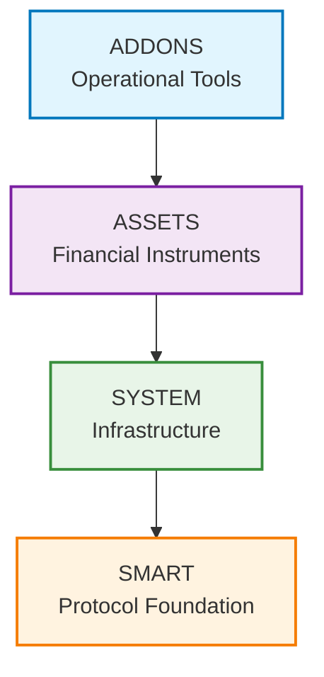

<!-- SOURCE: kit/contracts/contracts/README.md lines 30-45 -->
<!-- SOURCE: kit/contracts/contracts/smart/README.md lines 13-62 -->
<!-- SOURCE: kit/contracts/contracts/system/README.md lines 8-23 -->
<!-- SOURCE: Book of DALP Part I/Chapter 3 — Unified Lifecycle Core lines 13-20 -->
<!-- EXTRACTION: Complete architecture diagrams and detailed layer explanations -->
<!-- STATUS: COPIED | VERIFIED -->

# Three-Layer Architecture Model

**The Asset Tokenization Kit implements a layered architecture where each level builds upon the previous one to create a comprehensive tokenization platform, grounded in open standards such as ERC‑3643 for permissioned digital securities and ERC‑20 for exchange interoperability.**

## Architecture Overview

The ATK follows a layered architecture where each level builds upon the previous one:

## Understanding the Distinction: SMART Protocol vs ATK

**Important Distinction:**
- **SMART Protocol** = The foundational protocol specification (like HTTP or TCP/IP)
- **ATK (Asset Tokenization Kit)** = SettleMint's production implementation of the SMART Protocol with specific assumptions and optimizations

ATK is one possible implementation of the SMART Protocol, designed for enterprise-grade asset tokenization with particular choices around access control, proxy patterns, and infrastructure management.

## Why Financial Institutions Trust the Stack

- **Standards-led design** — ERC‑3643, ERC‑734/735 (identity and claims), and ERC‑20 compatibility ensure the platform aligns with the leading digital asset regulations and market plumbing.
- **Claims with accountable issuers** — Every compliance decision is based on claims from audited issuers that are whitelisted in a trusted issuer registry; policy enforcement only accepts attestations from those authorities.
- **Proven identity controls** — OnchainID brings portable investor identities, revocation flows, and audit trails that integrate with existing KYC/KYB partners.
- **Separation of duties baked in** — The layered design isolates protocol logic, system governance, and user experience, supporting internal control frameworks such as SOX and the ECB’s DORA guidelines.

## Layer 1: SMART Protocol Foundation

The foundational layer implementing the SMART Protocol (SettleMint Adaptable Regulated Token).

**Purpose**: Provides the core tokenization framework based on ERC-3643 standards with modular extensions. This is the protocol specification that can be implemented in different ways.

### Key Capabilities

- **Security Token Issuance**: ERC-3643 derived and ERC-20 compliant tokens for regulated financial instruments
- **Asset Tokenization**: Bonds, equity shares, deposits, funds, and stablecoins
- **Advanced Identity Management**: On-chain KYC/AML compliance with ERC-734/735 identities, reusable claims, and trusted issuer registries for complex verification rules
- **Regulatory Compliance**: Modular compliance rules for different jurisdictions
- **DeFi Integration**: Full ERC-20 compatibility for seamless ecosystem integration

### Key Highlights of SMART

- **ERC20 Compliance**: Fully implements ERC20 and ERC20Upgradeable, ensuring compatibility with financial tooling and ecosystems
- **Externally Modular Architecture**: SMART uses composable extensions (e.g., Burnable, Collateral) in a plug-and-play model
- **Token-Configurable Compliance**: Tokens can be configured to use specific modular rules and parameters without needing custom compliance contracts
- **Token-Agnostic Identity Verification**: Identity registry remains reusable across tokens and use cases—tokens dynamically pass required claim topics into the verification logic, and transfers only clear when the claim issuer is recognised in the trusted issuer registry
- **Authorization Agnostic**: Compatible with any authorization logic via hooks
- **ERC-2771 Meta-Transaction Support**: Compatible with trusted forwarders for gasless transactions and improved user experience
- **Upgradeable & Non-Upgradeable Support**: SMART supports both upgradeable (proxy-based) and fixed (non-upgradeable) token deployments—giving issuers full control over token mutability
- **KYC is optional**: Supports both regulated and unregulated assets. Tokens can opt into identity verification (KYC/AML) or operate permissionlessly—ideal for both security tokens and cryptocurrencies
- **Built-in ERC-165 Interface Detection**: Every SMART token implements ERC-165, allowing external systems to query which capabilities a token supports—improving composability and tooling
- **Two-Step Identity Recovery Flow**: If a user loses access to their wallet, recovery happens in two stages—offering secure and structured recovery

**Why First**: Everything else builds on this foundation. It provides the basic token functionality, compliance framework, and extension system that all other layers depend on.

## Layer 2: ATK System Infrastructure

The infrastructure layer that manages the entire ATK ecosystem. This represents ATK's specific implementation choices for how to manage the SMART Protocol in production.

**Purpose**: Provides centralized management of identities, compliance, factories, and access control across the entire platform. These are ATK's specific architectural decisions.

### ATK vs SMART: The Key Distinction

While **SMART** is the foundational protocol (like HTTP), **ATK** is SettleMint's production implementation (like Apache) that adds:

- **Centralized Management**: Single point of control for all protocol components
- **Role-Based Access Control**: 19 granular permission levels for different operations
- **Factory Pattern**: Standardized token deployment across asset types
- **Upgradeable Infrastructure**: System-managed implementations for all components
- **Registry System**: Centralized discovery and management of modules
- **Production Security**: Battle-tested security patterns and access controls

### Key System Components

1. **Identity Management**: Identity registry, factory, and storage
2. **Compliance System**: Compliance orchestration and module registry
3. **Access Control**: Role-based permissions and access management
4. **Registries**: Discovery and management of factories, modules, and addons

### The 19 Roles Explained

The ATK System implements 19 distinct roles for granular access control:

**Core Management Roles:**
- **GOVERNANCE_ROLE**: Protocol governance and upgrades
- **SUPPLY_MANAGEMENT_ROLE**: Mint and burn token operations
- **CUSTODIAN_ROLE**: Freeze and unfreeze accounts, forced transfers

**Operational Roles:**
- **YIELD_DISTRIBUTOR_ROLE**: Manage dividend and yield distributions
- **CLAIM_ISSUER_ROLE**: Issue verified claims for identities
- **COLLATERAL_MANAGER_ROLE**: Manage collateral backing for assets
- **PAUSER_ROLE**: Emergency pause functionality

**Administrative Roles:**
- **COMPLIANCE_MANAGER_ROLE**: Configure compliance modules
- **IDENTITY_MANAGER_ROLE**: Manage identity registrations
- **TOKEN_MANAGER_ROLE**: Token-specific administration

**Why Second**: The system layer manages the infrastructure that assets need to operate. It provides the identity management, compliance orchestration, and factory systems that assets use.

## Layer 3: Asset Implementations

Production-ready tokenized financial instruments built on the SMART Protocol using ATK's implementation patterns.

**Purpose**: Provides ATK's specific implementations of tokenized assets for different financial use cases, following ATK's design patterns and infrastructure choices.

### Available Asset Types

1. **Bond**: Fixed-term debt instruments with maturity and redemption
   - Fixed maturity date and face value
   - Denomination asset backing (collateral)
   - Yield distribution capabilities
   - Redemption at maturity
   - Historical balance tracking

2. **Equity**: Shares with voting rights and governance
   - Voting rights through ERC20Votes
   - Governance participation
   - Shareholder privileges
   - Dividend distribution capabilities

3. **Fund**: Investment fund shares with management fees
   - NAV-based valuation model
   - Management fee structures
   - Subscription and redemption windows
   - Performance tracking

4. **StableCoin**: Fiat-pegged tokens with collateral backing
   - Collateral management system
   - Minting and burning controls
   - Price stability mechanisms
   - Reserve management

5. **Deposit**: Collateral-backed deposit certificates
   - Interest-bearing deposits
   - Fixed maturity terms
   - Withdrawal restrictions
   - Yield generation

**Why Third**: Assets are built on top of the SMART Protocol foundation and use the system infrastructure. They represent the actual tokenized financial instruments that users interact with.

## Layer 4: Operational Addons

Additional functionality that extends the ATK platform with operational capabilities.

**Purpose**: Provides ATK's specialized tools for token distribution, treasury management, settlements, and yield distribution. These are ATK-specific extensions beyond the core SMART Protocol.

### Key Addon Categories

- **Airdrop Systems**: Token distribution mechanisms with Merkle proof verification
  - Time-bound distributions
  - Vesting schedules
  - Push-based airdrops
  - Claim tracking

- **Vault Management**: Multi-signature treasury control
  - Multi-sig wallets
  - Approval workflows
  - Balance management

- **Cross-Value Settlement (XvP)**: Atomic swaps between different assets
  - Delivery vs Payment (DvP)
  - Payment vs Payment (PvP)
  - Atomic settlement guarantees

- **Yield Strategies**: Automated dividend and interest payment systems
  - Scheduled distributions
  - Proportional payments
  - Reinvestment options

**Why Fourth**: Addons provide operational tools that work with assets and the system layer to enable advanced use cases like airdrops, yield distribution, and cross-chain settlements.

## Data Flow Through the Layers

The layered architecture replaces point integrations with orchestrated services:

- **Experience layer**: Guides users through lifecycle actions with web, mobile, admin, and developer portals
- **API & business logic**: Type-safe procedures enforce policy through asset, compliance, identity, and notification services
- **Blockchain infrastructure**: ERC-3643 contracts with indexers keep on-chain events and off-chain state synchronized
- **Data plane**: PostgreSQL, Redis, MinIO provide authoritative state, document retention, and low-latency access
- **Testing & deployment**: Playwright/Vitest with Helm/Kubernetes keep quality wired into the lifecycle

Each component has explicit performance targets (<2s UI loads, <200ms API calls, 99.9% uptime).

## Integration Architecture

The control plane binds to external systems without diluting control:

- **Identity Networks**: OnchainID and third-party KYC services plug into the identity registry
- **Banking Rails**: Core banking connects through mediation services that translate ISO 20022 and SWIFT
- **Custody Providers**: Custodian APIs surface into business services that govern transfers
- **Monitoring Stacks**: Observability hooks feed internal and client SIEM/SOC tooling

Every external dependency is monitored from the platform's cockpit, maintaining the single control plane principle.

## Why This Architecture Matters

1. **Separation of Concerns**: Each layer has clear responsibilities
2. **Modularity**: Components can be upgraded independently
3. **Scalability**: Layers can be scaled based on demand
4. **Security**: Defense in depth with multiple security boundaries
5. **Compliance**: Rules embedded at the protocol level
6. **Flexibility**: Support for multiple asset types and use cases

The architecture ensures that compliance executes in the asset path, not around it—preventing violations rather than detecting them after the fact.

