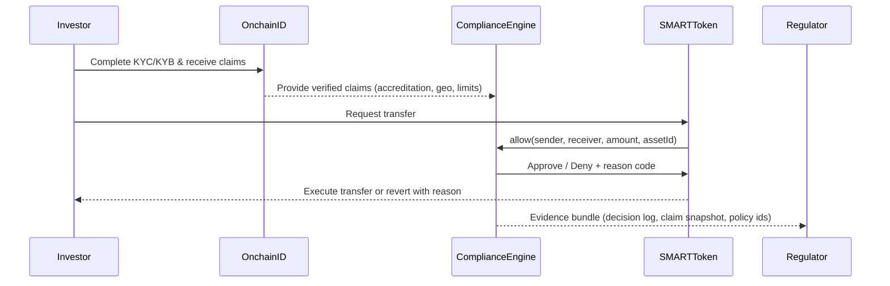

<!-- SOURCE: the-book-of-dalp/Part V - Appendices/Appendix A — ERC‑3643 Deep Dive (Compliance Inside the Token).md -->
<!-- SOURCE: the-book-of-dalp/Part I — The Why/Chapter 4 — Compliance as Code (ERC‑3643 inside the DALP).md -->
<!-- SOURCE: the-book-of-dalp/Part II — The Architecture/Chapter 6 — Enterprise Authentication & Access Control (IAM).md -->
<!-- SOURCE: the-book-of-dalp/Part III — Operating the Platform/Chapter 18 — Data, Evidence, and Operational Truth (Going Deeper).md -->
<!-- SOURCE: kit/docs/content/docs/level-1-generic/02-architecture/enterprise-capabilities.md -->

# Identity & ERC-3643 — OnchainID in the Asset Tokenization Kit

**ERC-3643 combines identity, rule engines, and audit evidence directly inside the token logic. OnchainID gives institutions reusable digital identities while the compliance engine enforces every jurisdictional rule before a transfer executes.**

## Business Outcomes Delivered by ERC-3643

- **Identity bound to assets** — Every wallet links to a verified investor identity with accredited, jurisdictional, and eligibility claims (Appendix A).
- **Compliance before execution** — Transfer managers ask the policy engine for allow/deny decisions prior to state change, eliminating accidental breaches (Chapter 4).
- **Audit-ready evidence** — Every allow/deny emits reason codes, timestamps, and policy references, creating regulator-ready evidence bundles (Chapter 4; Chapter 18).
- **Programmable controls** — Compliance modules cover geo-fencing, supply caps, lock-ups, and venue restrictions without bespoke code (Appendix A; Chapter 4).

## Translating Identity Mechanics into Business Language

| Technical Capability | Business Translation | Value Proposition |
|----------------------|----------------------|-------------------|
| Identity Registry + Claims | Canonical investor records with reusable compliance proofs | Reuse onboarding across offerings and venues |
| Transfer Manager | Policy engine that stops violations before they occur | Zero tolerance for non-compliant transfers |
| Reason Codes & Evidence | Machine and human-readable audit trails | Regulators review evidence, not promises |
| Emergency Hooks (freeze/force) | Governed remediation with full audit trail | Enables due-process investigations without code changes |

## Identity Portability

- **Reusable claims** — Claims issued once (e.g., accreditation, professional investor status) apply across every asset the identity touches (Chapter 4; Chapter 6).
- **Cross-venue operations** — The same identity unlocks distribution on exchanges, P2P boards, or OTC flows because compliance modules read identical claims (Chapter 6).
- **Lifecycle continuity** — Lost-wallet recovery, attestations, and role changes update the OnchainID identity so historical approvals remain traceable (Appendix A; Chapter 6).

## Compliance Automation and Governance

- **Jurisdictional playbooks** — Policy libraries encode MiCA, Reg D/S, MAS, and GCC frameworks so compliance teams configure rather than re-implement rules (Chapter 4).
- **Approval workflows** — Transfer approval modules force designated approvers to sign with their OnchainID before high-value movements (Chapter 6).
- **Module governance** — Registration, activation, and updates flow through managed factories with immutable checkpoints to prevent silent policy drift (Appendix A).

## Privacy and Data Protection Alignment

| Framework | What Regulators Expect | ATK Implementation | Source |
|-----------|-----------------------|--------------------|--------|
| **GDPR** | Keep PII off-chain, honor data subject rights, prove lawful processing | Personal data remains off-chain with hashed anchors; evidence bundles show access logs and retention policies | Chapter 8; Chapter 18 |
| **CCPA** | Enable access/deletion requests, disclose data sharing, minimize retention | Identity services route erasure workflows, audit logs capture consent changes, role-based access enforces least privilege | enterprise-capabilities.md |
| **PDPA (Singapore)** | Local data storage, consent tracking, breach notification | On-prem/BYOC deployment ensures residency; consent captured via claims; alerting triggers breach notifications | Chapter 18 |

## Identity Execution Flow (Infographic)

## Implementation Checklist

1. **Seed the identity registry** — Import issuers, trusted claim issuers, and investor records.
2. **Define claim policies** — Configure which claim topics (accreditation, jurisdiction, Shariah, etc.) each asset requires.
3. **Connect onboarding** — Tie KYC/KYB providers into the claim issuance workflow and set review cadences.
4. **Map approvals** — Assign approvers whose OnchainID must sign before high-impact transfers or redemptions.
5. **Align privacy operations** — Ensure GDPR/CCPA/PDPA requests route through identity services with audit capture.
6. **Monitor metrics** — Track MFA coverage, identity linkage, and compliance block events to prove control (Chapter 6).

By binding identity, compliance, and privacy expectations into one runtime, ATK delivers the trust posture regulators demand while letting business teams launch new assets without repeating onboarding or rewiring policies.

