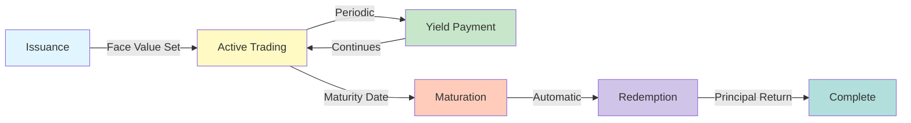

<!-- SOURCE: kit/contracts/contracts/assets/README.md lines 18-68 -->
<!-- SOURCE: Book of DALP Part IV/Chapter 20 — Regional Playbooks.md -->
<!-- SOURCE: Book of DALP Part II/Chapter 9 — Data, Reporting & Audit.md -->
<!-- EXTRACTION: Technical specs from contracts, business cases enhanced -->
<!-- STATUS: ENHANCED | VERIFIED -->

# Bonds - Tokenized Debt Instruments

**Digital bonds transform traditional debt markets by reducing issuance costs by 90% and enabling T+0 settlement while maintaining full regulatory compliance.**

## Overview

Tokenized debt instruments with programmable yield payments and automated maturity handling. Corporate treasuries issue digital bonds for working capital financing with yields distributed automatically on predetermined schedules. Governments tokenize sovereign debt to expand investor access while maintaining regulatory compliance through built-in transfer restrictions. Real estate developers structure project bonds with milestone-based releases tied to construction progress. 

The platform handles the complete bond lifecycle: initial issuance with face value definition, periodic coupon payments calculated on holder balances, and automatic redemption at maturity. Settlement achieves T+0 finality versus T+2 for traditional bonds, reducing counterparty exposure by 99%. Compliance modules enforce qualified investor restrictions aligned with securities regulations, while maintaining immutable records of all income distributions and holder changes. Operational costs decrease by 85% through automated corporate actions that eliminate manual payment processing and reconciliation.

## Bond Lifecycle Diagram

## Business Use Cases

### Corporate Bonds
- **Working Capital Financing**: Issue short-term paper with automatic redemption
- **Project Finance**: Multi-tranche structures with milestone-based releases  
- **Convertible Bonds**: Programmable conversion to equity at predetermined triggers
- **Green Bonds**: ESG-compliant issuance with use-of-proceeds tracking

### Government Securities
- **Treasury Bills**: Short-term sovereign debt with zero-coupon structure
- **Municipal Bonds**: Tax-advantaged securities for infrastructure projects
- **Sovereign Bonds**: Cross-border distribution with multi-currency settlement
- **Development Bonds**: Targeted financing for specific national initiatives

### Real Estate Bonds
- **Construction Finance**: Progress-based fund release tied to completion milestones
- **CMBS Tokenization**: Commercial mortgage-backed securities with payment waterfall
- **Property Development**: Pre-sale financing with automatic buyer allocation
- **REITs Debt**: Tradeable debt instruments backed by real estate portfolios

## ESG and Green Bonds

### Environmental Impact Bonds

**Green Bond Features:**
- **Use of Proceeds Tracking**: Automated tracking of fund allocation to environmental projects
- **Impact Reporting**: Built-in metrics for carbon reduction, renewable energy generation
- **Certification Integration**: Third-party green certification verification on-chain
- **Transparent Allocation**: Real-time visibility into project funding

**Sustainability Metrics:**
- Carbon offset calculations
- Energy efficiency improvements
- Water conservation metrics
- Biodiversity impact scores

### Social Impact Bonds

**Features:**
- **Outcome-Based Payments**: Yields tied to social impact metrics
- **Performance Tracking**: Automated measurement against social KPIs
- **Stakeholder Reporting**: Multi-party visibility into impact achievement
- **Dynamic Pricing**: Interest rates adjust based on impact performance

**Use Cases:**
- Affordable housing development
- Education outcome improvement
- Healthcare access expansion
- Community development projects

## Key Features

### Automated Lifecycle Management
- **Issuance**: One-click deployment with customizable parameters
- **Coupon Payments**: Automatic distribution on predetermined schedules
- **Maturity Handling**: Principal redemption without manual intervention
- **Early Redemption**: Optional callable features with penalty calculations

### Compliance & Eligibility
- **Investor Restrictions**: Qualified/Accredited investor verification
- **Geographic Limits**: Jurisdiction-based transfer controls
- **Holding Periods**: Automatic lock-up enforcement
- **Concentration Caps**: Maximum ownership percentage limits

### Settlement & Operations
- **T+0 Settlement**: Instant finality for all transfers
- **24/7 Trading**: No market hours or settlement windows
- **Fractional Ownership**: Bonds divisible to 18 decimal places
- **Multi-Currency**: Issue in any fiat or digital currency

## Technical Specifications

### Core Extensions (from SMART Protocol)
- **Pausable**: Emergency stop functionality for crisis management
- **Burnable**: Admin-controlled supply reduction capability
- **Custodian**: Account freeze and forced transfer for legal compliance
- **Redeemable**: User-initiated burning at maturity for principal return
- **Yield**: Automated interest distribution system
- **Historical Balances**: Snapshot capabilities for record dates
- **Capped**: Maximum supply limits for controlled issuance

### Maturity Management
- **Maturity Date**: Fixed timestamp when bond reaches maturity
- **Face Value**: Redemption value per token unit
- **Underlying Asset**: Collateral backing for redemption
- **Maturity Process**: Admin-triggered maturation after maturity date

### Yield Distribution
- **Yield Basis**: Face value per token as calculation base
- **Yield Token**: Underlying asset used for payments
- **Schedule Management**: Configurable yield distribution schedule
- **Automatic Calculation**: Pro-rata distribution based on holdings

### Redemption Mechanics
- **Maturity Requirement**: Only redeemable after maturation
- **Proportional Redemption**: Tokens redeemed for proportional denomination assets
- **Automatic Processing**: No manual intervention required
- **Audit Trail**: Complete record of all redemptions

## Implementation Metrics

**Efficiency Gains:**
- **90% reduction** in issuance costs versus traditional bonds
- **85% lower** operational overhead through automation
- **99% faster** settlement (instant versus T+2)
- **95% reduction** in reconciliation effort

**Market Impact:**
- **$50B+** tokenized bonds projected by 2025
- **200+** institutions evaluating bond tokenization
- **15 jurisdictions** with regulatory frameworks
- **$2.3T** addressable bond market

## Regulatory Alignment

### United States
- **Regulation D**: Private placement compliance for accredited investors
- **Rule 144A**: Qualified institutional buyer restrictions
- **Regulation S**: International offerings with US transfer restrictions
- **Municipal Securities**: MSRB rules for tax-exempt bonds

### European Union  
- **MiFID II**: Investor protection and transparency requirements
- **Prospectus Regulation**: Disclosure standards for public offerings
- **Green Bond Standard**: EU taxonomy alignment for sustainable bonds
- **CSDR**: Settlement discipline for European securities

### Asia-Pacific
- **MAS Singapore**: Recognized market operator framework
- **HKMA**: Financial institution bond issuance guidelines
- **Japan FSA**: Security token offering regulations

### Regional Considerations
The platform automatically applies jurisdiction-specific rules based on issuer and investor location, ensuring cross-border compliance without manual configuration. Transfer restrictions, reporting requirements, and investor eligibility criteria adapt dynamically to regulatory requirements.

## Technical Foundation

**Built on SMART Protocol**: The bond implementation leverages the modular SMART architecture with specific extensions for debt instruments:
- **YieldRestriction**: Automated coupon calculation and distribution
- **MaturityRestriction**: Principal redemption at predetermined dates
- **ConditionalRestriction**: Callable/puttable features with embedded options

**Infrastructure Requirements**: Bonds operate on any EVM-compatible network with deployment flexibility across public and private chains while maintaining consistent compliance and operational features.