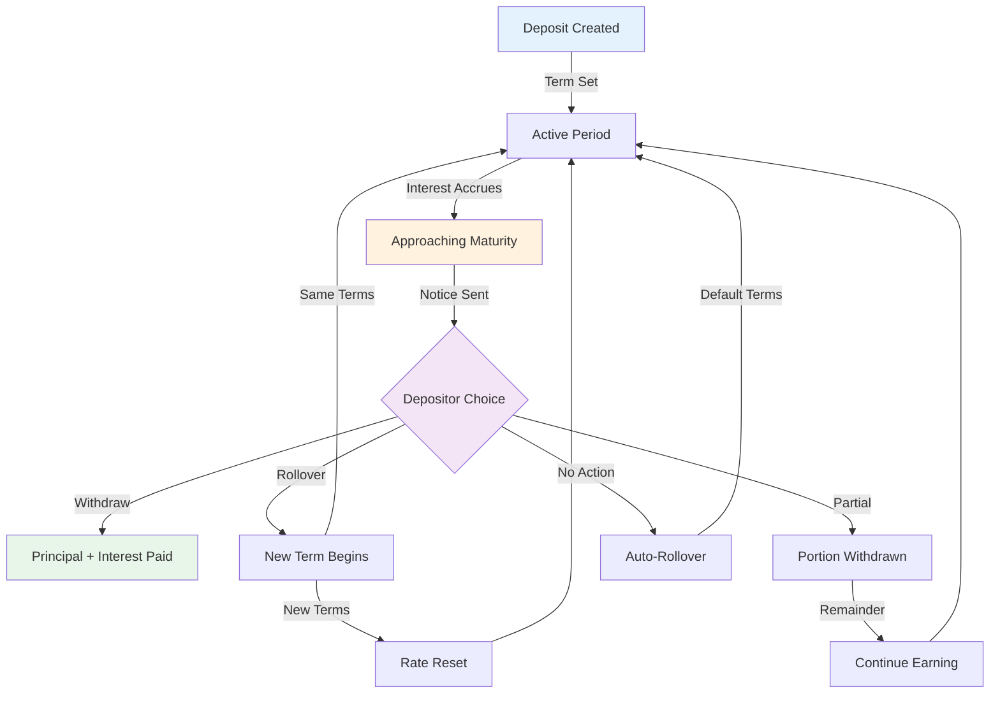

<!-- SOURCE: kit/contracts/contracts/assets/README.md lines 103-135 -->
<!-- SOURCE: Book of DALP Part IV/Chapter 20 — Regional Playbooks.md -->
<!-- SOURCE: Book of DALP Part II/Chapter 9 — Data, Reporting & Audit.md -->
<!-- EXTRACTION: Technical specs from contracts, business cases enhanced -->
<!-- STATUS: ENHANCED | VERIFIED -->

# Deposits - Digital Certificates

**Digital deposit certificates reduce operational costs by 80% while offering depositors real-time interest accrual and flexible redemption options with full principal protection.**

## Overview

Tokenized deposit certificates with programmable interest rates, automated yield distribution, and flexible maturity options. Banks issue digital certificates of deposit (CDs) that maintain FDIC insurance eligibility while eliminating paper processing. The platform handles interest calculations, tax withholding, early withdrawal penalties, and regulatory reporting through smart contract automation.

Credit unions offer members higher yields through reduced operational overhead. Corporate treasurers ladder deposit portfolios with automatic rollovers at maturity. High-net-worth individuals access institutional deposit rates previously requiring million-dollar minimums. International depositors participate in foreign bank deposits without establishing local accounts. Operating costs decrease 80% through paperless processing while depositors gain unprecedented flexibility in managing their fixed-income savings.

## Product Comparison Table

| Feature | Traditional CD | Digital Deposit | Improvement |
|---------|---------------|-----------------|-------------|
| **Minimum Investment** | $1,000-10,000 | $1 | 99.9% lower |
| **Interest Payment** | Monthly/Quarterly | Real-time accrual | Continuous |
| **Early Withdrawal** | Manual penalty | Automatic calculation | Instant |
| **Transfer Time** | 3-5 days | Instant | 100% faster |
| **Documentation** | Paper certificates | Digital records | Paperless |
| **Tax Reporting** | Annual 1099-INT | Real-time tracking | Automated |
| **Laddering** | Manual management | Automatic rollover | Programmatic |
| **Rate Changes** | Fixed at issuance | Dynamic options | Flexible |
| **Custody** | Bank holds | Self or delegated | Choice |
| **Audit Trail** | Quarterly statements | Every transaction | Complete |
| **Global Access** | Branch required | 24/7 online | Borderless |
| **Fractional Sale** | Not possible | Supported | Liquid |

## Yield Generation System

### Interest Rate Structures

**Fixed Rate Deposits:**
- **Traditional Fixed**: Set rate for entire term
- **Step-Up CDs**: Increasing rates over time
- **Bump-Up Option**: One-time rate increase allowed
- **Callable Features**: Higher yield with issuer call option

**Variable Rate Deposits:**
| Index | Spread | Floor | Cap | Reset |
|-------|--------|-------|-----|-------|
| SOFR | +150bp | 1.00% | 6.00% | Monthly |
| Prime | -100bp | 2.00% | 8.00% | Quarterly |
| T-Bill | +75bp | 0.50% | 5.00% | Weekly |
| CPI | +200bp | 2.00% | 7.00% | Annual |

### Compound Interest Calculation

```
Daily Compound Formula:
A = P(1 + r/365)^365t

Where:
A = Final amount
P = Principal
r = Annual rate
t = Time in years

Example: $10,000 at 5% for 1 year
Daily: $10,512.67
Monthly: $10,511.62
Annual: $10,500.00
```

**Yield Enhancement Features:**
- **Auto-Compounding**: Interest automatically reinvested
- **Loyalty Bonuses**: Higher rates for longer relationships
- **Volume Tiers**: Better rates for larger deposits
- **Bundle Discounts**: Rate boost with multiple products

## Maturity Handling

### Maturity Options Flowchart



### Early Withdrawal Penalties

**Penalty Structure:**
| Term Length | Penalty (Interest Days) | Minimum Penalty |
|-------------|------------------------|-----------------|
| < 3 months | 30 days | $25 |
| 3-6 months | 60 days | $50 |
| 6-12 months | 90 days | $100 |
| 1-2 years | 180 days | $250 |
| 2-5 years | 365 days | $500 |
| > 5 years | 540 days | $1000 |

**Penalty Waivers:**
- Death of account holder
- Court-ordered withdrawal
- IRS levy
- Disability determination

## Business Use Cases

### Retail Banking
- **Personal Savings**: Individual fixed-term deposits
- **IRA CDs**: Retirement account deposits
- **Youth Accounts**: Educational savings programs
- **Joint Deposits**: Shared ownership certificates

### Corporate Treasury
- **Cash Management**: Short-term liquidity parking
- **Reserve Requirements**: Regulatory capital compliance
- **Sweep Accounts**: Automatic excess cash investment
- **Collateral Posting**: Secured lending backing

### Institutional Deposits
- **Bank Funding**: Wholesale deposit programs
- **Brokered Deposits**: Third-party distributed CDs
- **Municipal Deposits**: Government entity placements
- **Escrow Accounts**: Transaction security deposits

### International Deposits
- **Eurodollar CDs**: Offshore USD deposits
- **Multi-Currency**: Various denomination options
- **Cross-Border**: Foreign bank access
- **Regulatory Arbitrage**: Jurisdiction optimization

## Key Features

### Deposit Mechanics
- **Flexible Terms**: 7 days to 10 years
- **Minimum Amounts**: From $1 to no maximum
- **Interest Options**: Simple or compound
- **Payment Frequency**: Daily to annual

### Risk Management
- **Principal Protection**: 100% capital guarantee
- **Insurance Coverage**: FDIC/SIPC eligible
- **Collateralization**: Asset backing options
- **Credit Enhancement**: Third-party guarantees

### Operational Efficiency
- **Automated Renewals**: Rollover at maturity
- **Ladder Management**: Staggered maturities
- **Tax Optimization**: Automatic withholding
- **Statement Generation**: Real-time reporting

## Interest Calculation Details

### Accrual Methods

**Day Count Conventions:**
| Convention | Days/Year | Use Case |
|------------|-----------|----------|
| Actual/365 | 365 | Standard deposits |
| Actual/360 | 360 | Money market |
| 30/360 | 360 | Corporate deposits |
| Actual/Actual | Actual | Government securities |

### Rate Determination

**Base Rate Factors:**
- Central bank policy rate
- Bank funding costs
- Competitive positioning
- Term premium
- Credit spread
- Liquidity premium

**Dynamic Pricing Engine:**
```
Deposit Rate = Base Rate + Term Premium + Volume Bonus - Operating Margin

Example Calculation:
Base Rate: 4.50%
3-Year Premium: +0.75%
$100k Bonus: +0.25%
Op Margin: -0.50%
Final Rate: 5.00%
```

## Technical Specifications

### Core Extensions (from SMART Protocol)
- **Pausable**: Emergency stop functionality
- **Burnable**: Certificate cancellation
- **Custodian**: Account management
- **Collateral**: Backing verification

### Deposit-Specific Features
- **Maturity Management**: Term tracking and rollovers
- **Interest Engine**: Yield calculation and distribution
- **Penalty Module**: Early withdrawal handling
- **Insurance Integration**: Coverage verification

## Implementation Metrics

**Efficiency Gains:**
- **80% reduction** in operational costs
- **95% faster** account opening
- **90% reduction** in paper processing
- **85% lower** servicing costs

**Market Impact:**
- **$20T** global deposit market
- **40,000+** banks worldwide
- **2B+** deposit accounts
- **$100B** operational savings potential

## Regulatory Alignment

### United States
- **Regulation D**: Reserve requirements
- **FDIC Insurance**: Coverage rules
- **Truth in Savings**: Disclosure requirements
- **Reg Q**: Interest rate restrictions (historical)

### European Union
- **Deposit Guarantee Schemes**: €100,000 coverage
- **CRD IV**: Capital requirements
- **MiFID II**: Investment product rules
- **BRRD**: Bank recovery framework

### Asia-Pacific
- **Basel III**: Liquidity coverage ratios
- **Deposit Insurance**: Country-specific limits
- **Interest Rate Regulations**: Varies by jurisdiction
- **Foreign Exchange Controls**: Cross-border restrictions

## Collateral Management

### Backing Requirements

**Collateral Types:**
- Government securities (100% weight)
- Investment-grade bonds (95% weight)
- Cash and equivalents (100% weight)
- Real estate (50-70% weight)

**Verification Process:**
- Daily mark-to-market
- Monthly third-party audit
- Real-time on-chain proofs
- Regulatory reporting

## Technical Foundation

**Built on SMART Protocol**: Deposit implementation leverages:
- **MaturityRestriction**: Term and rollover management
- **YieldRestriction**: Interest calculation engine
- **CollateralRestriction**: Backing requirements

**Infrastructure Requirements**: Operates on any EVM-compatible network with consistent yield calculation and maturity handling across all deployments.