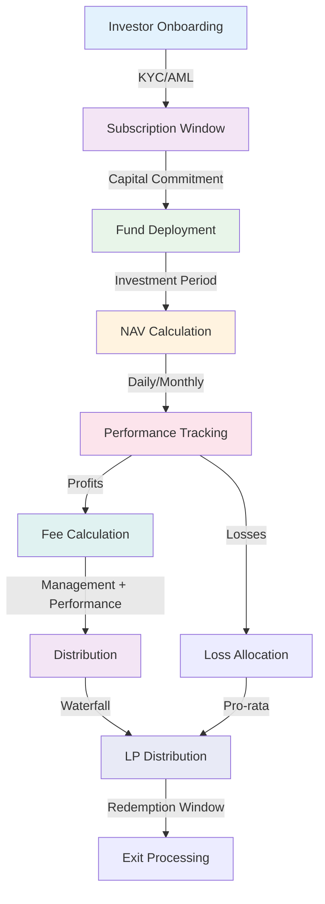

<!-- SOURCE: kit/contracts/contracts/assets/README.md lines 136-167 -->
<!-- SOURCE: Book of DALP Part IV/Chapter 20 — Regional Playbooks.md -->
<!-- SOURCE: Book of DALP Part II/Chapter 9 — Data, Reporting & Audit.md -->
<!-- EXTRACTION: Technical specs from contracts, business cases enhanced -->
<!-- STATUS: ENHANCED | VERIFIED -->

# Funds - Investment Vehicles

**Digital fund shares reduce administration costs by 85% while enabling 24/7 subscriptions/redemptions with real-time NAV calculations.**

## Overview

Tokenized investment fund shares with automated NAV calculation, subscription/redemption windows, and performance fee distribution. Fund managers launch digital vehicles that maintain traditional fund economics while eliminating manual administration. The platform handles investor onboarding, capital calls, distribution waterfalls, and regulatory reporting through smart contract automation.

Hedge funds tokenize alternative strategies with high-water mark calculations and performance allocations executed automatically. Mutual funds offer retail investors 24/7 liquidity with instant settlement instead of T+2 delays. Private equity funds manage capital commitments, drawdowns, and distributions with complete transparency to limited partners. Real estate funds combine property tokenization with fund structures for diversified exposure. Operating expenses drop 85% through automation while investors gain real-time portfolio visibility previously available only to institutional clients.

## Fund Operations Flowchart

## NAV Calculation System

### Automated Valuation

**Daily NAV Updates:**
- **Asset Pricing**: Real-time mark-to-market from oracle feeds
- **Liability Calculation**: Automatic accrual of fees and expenses
- **Share Price**: NAV per share calculated and published on-chain
- **Historical Tracking**: Complete NAV history for performance analysis

**Valuation Methodology:**
| Asset Type | Pricing Source | Update Frequency | Verification |
|------------|---------------|------------------|--------------|
| Listed Securities | Exchange feeds | Real-time | Multi-oracle |
| Private Assets | Quarterly appraisals | Quarterly | Third-party |
| Real Estate | Property valuations | Semi-annual | Certified |
| Derivatives | Model pricing | Daily | Risk system |
| Cash/Equivalents | Par value | Real-time | Bank feeds |

### Performance Metrics

- **Absolute Return**: Total return since inception
- **Relative Performance**: Benchmark comparison
- **Sharpe Ratio**: Risk-adjusted returns
- **Maximum Drawdown**: Peak-to-trough analysis
- **Tracking Error**: Deviation from benchmark

## Fee Management

### Management Fee Structure

**Base Management Fees:**
- **Calculation Basis**: Average AUM or committed capital
- **Accrual Frequency**: Daily accrual, monthly/quarterly collection
- **Tiered Structures**: Volume discounts for larger investments
- **Automatic Deduction**: Fees deducted from fund NAV

**Fee Schedule Example:**
| AUM Tier | Annual Fee | Effective Rate |
|----------|------------|----------------|
| First $10M | 2.00% | 2.00% |
| $10M - $50M | 1.75% | 1.81% |
| $50M - $100M | 1.50% | 1.69% |
| Above $100M | 1.25% | 1.56% |

### Performance Fee (Carried Interest)

**Calculation Parameters:**
- **Hurdle Rate**: Minimum return before performance fees (typically 8%)
- **Carry Percentage**: GP share of profits above hurdle (typically 20%)
- **High-Water Mark**: No fees on recovery from previous losses
- **Clawback Provisions**: Return of excess carry if needed

**Distribution Waterfall:**
1. Return of Capital to LPs
2. Preferred Return to LPs (8% hurdle)
3. GP Catch-up (100% to GP until 20% of profits)
4. 80/20 Split (80% LP, 20% GP above hurdle)

## Business Use Cases

### Hedge Funds
- **Long/Short Equity**: Market-neutral strategies with leverage
- **Global Macro**: Multi-asset class with derivatives
- **Event-Driven**: Merger arbitrage and special situations
- **Quantitative**: Algorithmic strategies with high-frequency trading

### Mutual Funds
- **Index Funds**: Passive tracking with automatic rebalancing
- **Sector Funds**: Focused exposure to specific industries
- **Balanced Funds**: Mixed equity/bond allocations
- **Target-Date Funds**: Automatic glide path adjustments

### Private Equity
- **Buyout Funds**: Leveraged acquisitions with value creation
- **Growth Equity**: Minority stakes in expanding companies
- **Venture Capital**: Early-stage technology investments
- **Distressed Debt**: Turnaround and restructuring plays

### Real Estate Funds
- **Core Properties**: Stable income-producing assets
- **Value-Add**: Renovation and repositioning strategies
- **Opportunistic**: Development and distressed properties
- **REITs**: Publicly traded real estate exposure

## Key Features

### Subscription/Redemption
- **Automated Windows**: Configurable subscription periods
- **Lock-Up Enforcement**: Automatic restriction periods
- **Gate Provisions**: Redemption limits during stress
- **Side Pockets**: Illiquid asset segregation

### Investor Management
- **Capital Calls**: Automated drawdown notices
- **Distribution Processing**: Waterfall calculations
- **Reporting Packages**: Customized LP reports
- **Transfer Restrictions**: Limited partner approval

### Portfolio Management
- **Asset Allocation**: Real-time position tracking
- **Risk Analytics**: VaR and stress testing
- **Rebalancing**: Automated or manual triggers
- **Cash Management**: Sweep and investment policies

## Regulatory Reporting

### Automated Compliance Reports

**Regular Filings:**
- **Form PF**: Private fund systemic risk reporting
- **Form ADV**: Investment adviser registration
- **Form D**: Private placement notifications
- **13F Holdings**: Quarterly position disclosures
- **Blue Sky**: State securities notices

**Investor Reports:**
- **K-1 Tax Forms**: Automated partnership allocations
- **Capital Account Statements**: Real-time balance updates
- **Performance Attribution**: Detailed return analysis
- **Fee Transparency**: Complete expense breakdowns

### Audit Trail

**Complete Documentation:**
- Every subscription and redemption recorded
- All NAV calculations archived
- Fee calculations transparent and verifiable
- Distribution decisions documented
- Voting records maintained

## Technical Specifications

### Core Extensions (from SMART Protocol)
- **Pausable**: Emergency stop for crisis management
- **Burnable**: Share cancellation for redemptions
- **Custodian**: Account freeze for compliance
- **Voting**: Governance rights for fund decisions

### Fund-Specific Features
- **Management Fee Collection**: Time-based automatic calculation
- **Share Class Management**: Multiple fee structures
- **Performance Tracking**: Historical NAV storage
- **Liquidity Management**: Redemption gate implementation

## Implementation Metrics

**Efficiency Gains:**
- **85% reduction** in fund administration costs
- **95% faster** subscription/redemption processing
- **90% reduction** in reporting preparation
- **80% lower** compliance overhead

**Market Impact:**
- **$500B+** fund tokenization opportunity
- **1000+** funds evaluating digital transformation
- **25 jurisdictions** with fund token frameworks
- **$10T** global AUM addressable market

## Regulatory Alignment

### United States
- **Investment Company Act**: Registered fund requirements
- **Investment Advisers Act**: Manager registration
- **Regulation D**: Private fund exemptions
- **Volcker Rule**: Bank fund investment limits

### European Union
- **UCITS**: Retail fund harmonization
- **AIFMD**: Alternative fund manager rules
- **MiFID II**: Distribution requirements
- **ELTIF**: Long-term investment vehicles

### Asia-Pacific
- **Singapore VCC**: Variable capital companies
- **Hong Kong OFC**: Open-ended fund companies
- **Japan ITA**: Investment trust regulations
- **Australia MIS**: Managed investment schemes

## Technical Foundation

**Built on SMART Protocol**: Fund implementation leverages modular architecture:
- **NAVRestriction**: Automated valuation engine
- **FeeRestriction**: Management and performance calculations
- **WindowRestriction**: Subscription/redemption periods

**Infrastructure Requirements**: Operates on any EVM-compatible network with consistent NAV calculation and fee distribution across all deployment options.