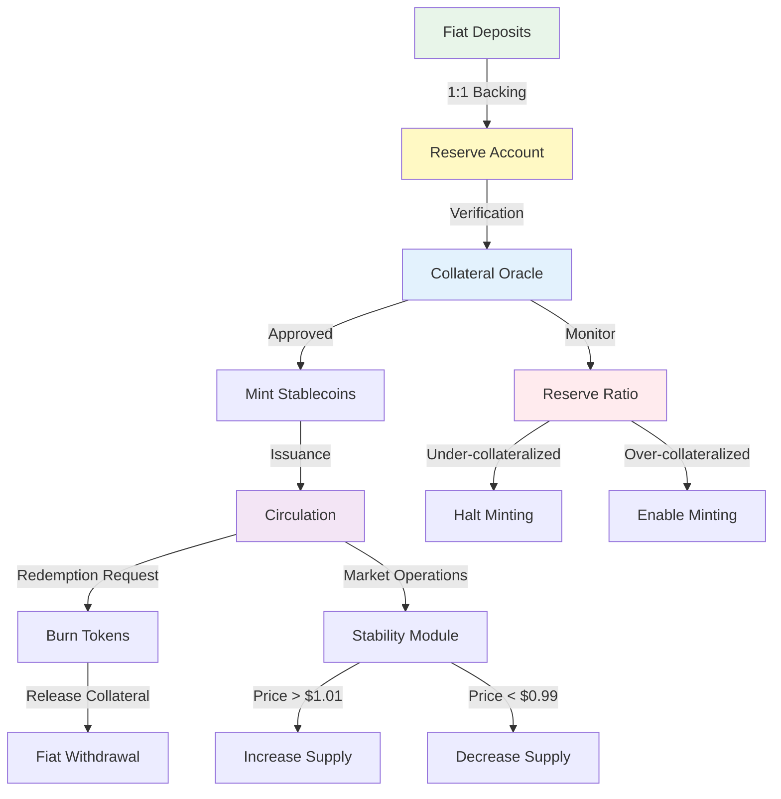

<!-- SOURCE: kit/contracts/contracts/assets/README.md lines 168-207 -->
<!-- SOURCE: Book of DALP Part IV/Chapter 20 — Regional Playbooks.md -->
<!-- SOURCE: Book of DALP Part II/Chapter 9 — Data, Reporting & Audit.md -->
<!-- EXTRACTION: Technical specs from contracts, business cases enhanced -->
<!-- STATUS: ENHANCED | VERIFIED -->

# Stablecoins - Digital Currencies

**Enterprise stablecoins enable instant cross-border payments with 99% lower costs than traditional wire transfers while maintaining regulatory compliance and 1:1 fiat backing.**

## Overview

Fiat-pegged digital currencies with transparent collateral management, automated minting/burning controls, and regulatory compliance built-in. Financial institutions issue stablecoins backed 1:1 by bank deposits or government securities, enabling instant settlement for payments, remittances, and trading. The platform ensures continuous collateral verification, automatic rebalancing, and real-time audit trails that satisfy regulatory requirements.

Banks create wholesale stablecoins for interbank settlement, reducing counterparty risk and enabling 24/7 operations. Corporations use branded stablecoins for supply chain finance, eliminating forex volatility and payment delays. Payment providers tokenize customer deposits for instant cross-border transfers at fraction of traditional costs. Central banks explore retail CBDCs built on the same infrastructure for monetary policy implementation. Transaction costs drop 99% versus wire transfers while settlement time reduces from days to seconds.

## Stability Mechanism Diagram

## Collateral Management

### Reserve Composition

**Approved Collateral Types:**
| Asset Type | Allocation | Risk Weight | Liquidity |
|------------|------------|-------------|-----------|
| Cash Deposits | 40-60% | 0% | Immediate |
| T-Bills (<90 days) | 20-40% | 0% | T+0 |
| Government Bonds | 10-20% | 5% | T+1 |
| Investment Grade Corp | 0-10% | 20% | T+2 |
| Gold/Commodities | 0-5% | 50% | T+1 |

### Collateral Verification

**Real-Time Monitoring:**
- **Bank Attestations**: Daily balance confirmations from custodians
- **On-Chain Proofs**: Merkle tree publication of reserve holdings
- **Third-Party Audits**: Monthly independent verification
- **Regulatory Reporting**: Automated submission to authorities

**Automatic Safeguards:**
- Minting halts if collateral ratio drops below 100%
- Redemptions prioritized to restore backing
- Rebalancing triggers for asset allocation
- Emergency pause for systemic events

## Pegging Mechanisms

### Primary Market Operations

**Mint/Burn Arbitrage:**
- **Authorized Participants**: Approved institutions can mint/redeem
- **Minimum Size**: $100,000 for direct mint/burn access
- **Fee Structure**: 10 basis points for mint, 10 for burn
- **Settlement**: T+0 for digital assets, T+1 for fiat

### Secondary Market Stability

**Algorithmic Stabilization:**
| Price Deviation | System Response | Time to Execute |
|----------------|-----------------|-----------------|
| > 1% above peg | Increase mint incentives | Immediate |
| > 2% above peg | Reduce mint fees | 1 hour |
| > 1% below peg | Increase burn incentives | Immediate |
| > 2% below peg | Reduce redemption fees | 1 hour |
| > 5% any direction | Emergency committee review | 15 minutes |

## Central Bank Digital Currencies (CBDCs)

### Retail CBDC Implementation

**Consumer Features:**
- **Digital Wallets**: Government-issued identity linked wallets
- **Offline Payments**: NFC/QR transactions without connectivity
- **Programmable Money**: Conditional payments and smart contracts
- **Privacy Controls**: Tiered KYC based on transaction amounts

**Monetary Policy Tools:**
- **Direct Distribution**: Stimulus payments to citizens
- **Negative Rates**: Programmable demurrage on holdings
- **Velocity Control**: Time-based spending incentives
- **Sectoral Allocation**: Targeted economic support

### Wholesale CBDC

**Interbank Settlement:**
- **RTGS Replacement**: Real-time gross settlement on-chain
- **Cross-Border Corridors**: Multi-CBDC bridge networks
- **Liquidity Management**: Automated repo markets
- **Reserve Requirements**: Smart contract enforcement

**Benefits Over Traditional Systems:**
- 100% reduction in settlement risk
- 24/7/365 operations capability
- Instant finality without clearing
- Complete transaction transparency

## Reserve Management

### Portfolio Optimization

**Asset Allocation Strategy:**
- **Duration Matching**: Align asset maturity with redemption patterns
- **Yield Enhancement**: Maximize returns within risk parameters
- **Liquidity Buffers**: Maintain instant redemption capability
- **Stress Testing**: Daily scenario analysis

### Risk Controls

**Operational Safeguards:**
- Multi-signature treasury management
- Time-locked withdrawal limits
- Geographic distribution of reserves
- Insurance coverage for deposits

## Business Use Cases

### Cross-Border Payments
- **Remittances**: Instant transfers at 1% of traditional cost
- **B2B Settlements**: Corporate payments without forex risk
- **Trade Finance**: Real-time payment on delivery
- **Correspondent Banking**: Direct institution-to-institution settlement

### Treasury Management
- **Cash Pooling**: Instant liquidity across subsidiaries
- **Working Capital**: 24/7 access to operating funds
- **Yield Optimization**: Automatic sweep to earning assets
- **FX Hedging**: Eliminate currency conversion costs

### Digital Commerce
- **E-Commerce**: Instant merchant settlement
- **Micropayments**: Sub-cent transactions viable
- **Subscriptions**: Automated recurring payments
- **Loyalty Programs**: Tokenized rewards and points

### DeFi Integration
- **Lending Collateral**: Stable value for loans
- **Trading Pairs**: Quote currency for exchanges
- **Yield Farming**: Liquidity provision rewards
- **Synthetic Assets**: Building block for derivatives

## Key Features

### Issuance Controls
- **Permissioned Minting**: Only authorized addresses
- **Supply Caps**: Maximum circulation limits
- **Batch Operations**: Bulk mint/burn for efficiency
- **Audit Logging**: Every supply change recorded

### Transfer Capabilities
- **Instant Settlement**: Sub-second finality
- **Micro-Transactions**: No minimum amount
- **Batch Transfers**: Multiple recipients in one transaction
- **Conditional Payments**: Escrow and time-locks

### Compliance Framework
- **KYC/AML**: Identity verification required
- **Transaction Monitoring**: Real-time screening
- **Regulatory Reporting**: Automated filing
- **Geographic Restrictions**: Jurisdiction controls

## Technical Specifications

### Core Extensions (from SMART Protocol)
- **Pausable**: Emergency stop for crisis management
- **Burnable**: Supply reduction for redemptions
- **Mintable**: Supply increase with authorization
- **Collateral**: Backing requirement verification

### Stablecoin-Specific Features
- **Minting Authorization**: Role-based minting permissions
- **Supply Management**: Caps and circulation tracking
- **Collateral Verification**: OnchainID claim validation
- **Price Feed Integration**: Oracle-based monitoring

## Implementation Metrics

**Efficiency Gains:**
- **99% reduction** in cross-border payment costs
- **99.9% faster** settlement than wire transfers
- **95% reduction** in FX conversion fees
- **90% lower** reconciliation overhead

**Market Impact:**
- **$150B+** stablecoin market cap today
- **$5T** daily FX market opportunity
- **180 countries** with remittance needs
- **10,000+** financial institutions potential users

## Regulatory Alignment

### United States
- **State Money Transmitter**: License requirements
- **Bank Secrecy Act**: AML/KYC compliance
- **FinCEN Guidance**: Convertible virtual currency rules
- **OCC Interpretive Letters**: Bank stablecoin activities

### European Union
- **MiCA Regulation**: E-money token requirements
- **EMD2**: Electronic money directive
- **PSD2**: Payment services framework
- **AMLD5**: Anti-money laundering rules

### Asia-Pacific
- **MAS Payment Services Act**: Digital payment token license
- **HKMA Stablecoin Discussion**: Proposed framework
- **Japan Payment Services Act**: Crypto-asset regulations
- **RBI Digital Rupee**: CBDC pilot program

### Global Standards
- **FATF Recommendations**: Virtual asset guidance
- **BIS Standards**: CBDC principles
- **FSB Recommendations**: Stablecoin regulation
- **IMF Framework**: Cross-border payment infrastructure

## Technical Foundation

**Built on SMART Protocol**: Stablecoin implementation leverages:
- **MintingRestriction**: Authorized supply management
- **CollateralRestriction**: Reserve requirement enforcement
- **PegRestriction**: Price stability mechanisms

**Infrastructure Requirements**: Operates on any EVM-compatible network with consistent collateral management and compliance across all deployments.