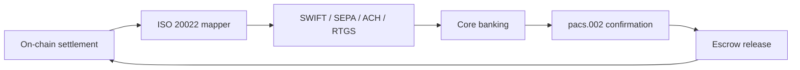

<!-- SOURCE: the-book-of-dalp/Part III — Operating the Platform/Chapter 16 — Integration Patterns (Banking, Custody, Venues).md -->
<!-- SOURCE: the-book-of-dalp/Part II — The Architecture/Chapter 4 — Settlement & Interoperability, T+0 Is the Baseline.md -->
<!-- SOURCE: the-book-of-dalp/Part V - Appendices/Appendix H — Integration Playbooks.md -->
<!-- SOURCE: the-book-of-dalp/Part II — The Architecture/Chapter 9 — Data, Reporting & Audit, Evidence or It Didn’t Happen.md -->

# Banking Integration

**Banks receive ISO 20022-native instructions, not spreadsheets.** The settlement plane mirrors every digital security event into `semt.002`, `pacs.008`, and `pacs.002` messages so treasury and core systems book cash legs automatically. Delivery-versus-payment (DvP) with fiat rails holds securities in escrow until `pacs.002` confirms payment; if confirmation stalls, the protocol reverts and reconciliation artefacts publish to the reporting layer.

- **Rails without rewrites:** SWIFT, ACH, SEPA, RTGS, and tokenised cash share the same workflow (Part II Ch 4). Teams activate the connectors they need; confirmation handling and retries stay consistent across rails.
- **Reconciliation on impact:** ISO 20022 mirroring and event sourcing keep finance teams aligned with the ledger (Part II Ch 9). Manual spreadsheet merges disappear.
- **Deployment options:** On-prem, bring-your-own-cloud, or managed tenancy—the adapter logic stays identical (Part III Ch 16).

