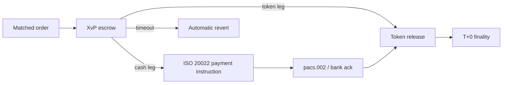

<!-- SOURCE: the-book-of-dalp/Part II — The Architecture/Chapter 4 — Settlement & Interoperability, T+0 Is the Baseline.md -->
<!-- SOURCE: the-book-of-dalp/Part I — The Why/Chapter 5 — Custody and Settlement Clarity (Bank-Grade Control & Atomic DvP).md -->
<!-- SOURCE: the-book-of-dalp/Part IV — Adoption & Execution/Chapter 22 — Metrics & OKRs, Evidence You’re Winning (or Not).md -->

# Settlement & Clearing

**Settlement risk is optional—we remove it.** Cross-asset escrow, ISO 20022 payment builders, and liquidity management turn T+0 into the default while keeping both legs reversible when rails fail.

- **Atomic everywhere:** Digital security–and fiat-linked trades follow the same initiated → reserved → executed → reversed state machine (Part I Ch 5).
- **Netting and collateral:** Liquidity management nets flows and enforces limits before settlement releases, keeping treasury exposure predictable (Part I Ch 5).
- **Roadmap clarity:** Same-network atomicity ships today; cross-network bridges stay on the roadmap with compliance continuity requirements defined (Part II Ch 4).

Institutions receive audit-ready evidence with ≥99 % first-attempt settlement once connectors are live, no manual reconciliation queues, and a compliance plane that stays in control even as integrations multiply (Part IV Ch 22).
